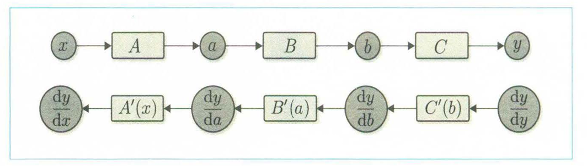
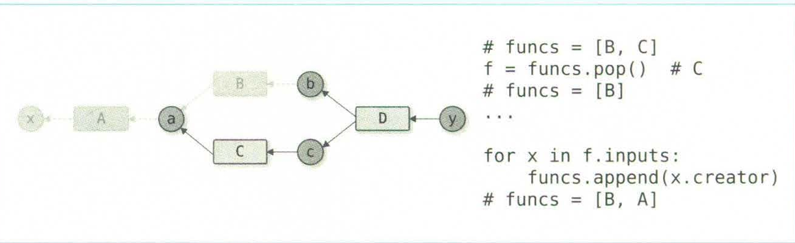

# 结构：

第一步：自动微分、简单问题
第二步：自然化代码表达
第三步：使其能够计算二阶导
第四步：实现神经网络构建
第五步：实现对GPU支持、模型保存和恢复等必备功能

区别于作者的DeZero命名，后续可能会不用CuPy，自己用做算子的方法来改着试试，就FrameZeroJ为命名。

**结合一下sglang和vllm的方法对这个进行改进**

## 重要知识点部分

1. 深度学习在内的机器学习的各个领域，导数起着核心作用。从某种意义上来说，深度学习框架就是计算导数的工具。**如何利用计算机进行求导是一个关键点**。

- 什么是**自动微分**？

    - **在对某个计算(函数)编码后，由计算机自动求出该计算的导数的机制**


# 实现过程

## 第一阶段

### 目标

对于简单的计算函数，应该可以自动求出它的导数。相当于去实现导数的计算图节点。

- 要有底层的数据类

- 要有配套的函数类（使用底层的数据类）

- 函数能够符合使用的前提下（计算图的forward）支持反向传播

### Unittest

写法直接`crtl + f`直接搜，需要写测试类继承`unittest.TestCase`

### 实现

---

**步骤1**： 定义箱子（Variable）类，并在这个简单的实现中，需要一个强大的数据结构作为底层数据结构。

为什么需要定义这个箱子？
- 类比Tensor包装器，**箱子——计算图的基本节点**。要实现的不是手写，而是框架的简便写法。

为什么需要一个底层的强大数据结构？
- Numpy本身效率肯定远高于自己去处理Python运算逻辑的，Pytorch和Tensorflow都是自己搞的，但我们肯定比不过，所以不如直接用Numpy的计算效率

- 体现为variable里的data类型

```python
class Variable:
    def __init__(self, data)
        self.data = data
```

---

**步骤2**： 定义函数（Function）类，这里分为具体函数类和抽象函数类

具体函数类和抽象函数类，抽象函数类需要多一个forward()方法来作为，继承类要改写的，即具体函数部分

首先，输入输出都应当是Variable实例（使用Variable之后，基本数据结构已经没有其他的概念）

其次，**如何通过只要编写f(...)来调用？**？通过编写`__call__`方法，特殊的Python方法

```python
# 具体类定义
class Function:
    def __call_(self, input):
        x = input.data
        y = x**2
        output = Variable(y)
        return output

# 抽象类定义，抽象出forward步骤
class Function:
    def __call__(self, input):
        x = input.data
        y = self.forward(x)
        output = Variable(y)
        return output
    def forward(self, x):
        raise NotImplementedError()   # forward方法会抛出一个异常说明，必须靠继承这个函数类实现
        # 这里大概是不引入ABC和abstractmethod，但要实现不实现父类虚函数就报错的方法

# 使用继承的具体函数
class Square(Function):
    def forward(self, x):
        return x**2
```

**现代代码强烈建议使用`ABC`模块 + `@abstractmethod`方法**，之后改了。可以保证程序尽早的发现错误，而不是等到跑到了再挂。

---

**步骤3**：实现导数

1. 利用数值微分的方式，需要用一个微小值`eps = 1e-4`

$ \frac{dy}{dx} = \frac{f(x+eps) - f(x-eps)}{2 \times eps} $

```python
def numerical_diff(f, x, eps=1e-4):
    x0 = Variable(x.data - eps)
    x1 = Variable(x.data + eps)  # 注意x依旧是Variable量，得取出data才能用
    y0 = f(x0)
    y1 = f(x1)
    return (y1.data - y0.data) / (2*eps)
```

数值微分方法存在的问题：

- 误差，因为是相同数量级数值之间的差，会丢精度有效位减少，比如0.001434...会变成0.001

- 计算成本高

优势：

- 实现简单，不像应该要实现的反向传播十分复杂

- 可以用来校验反向传播的实现是否正确（gradient 

2. 反向传播



这种对应关系+链式法则得到反向传播的实现基础，但是实现是难点

改造方法：

- 改造Variable类：**计算图节点需要保存梯度量**，因为可以发现这里的对应关系正好是计算节点对应梯度量

- 改造Function类（基类）：

    - 添加backward功能

    - 添加调用forward时候，保存被输入的Variable实例功能（之前只中间计算用了数值data）

- 具体类重写backward方法
    
    - **backward返回的不是Variable对象，而是其中的grad变量**

```python
from abc import ABC, abstractmethod

class Variable():
    def __init__(self, data):
        self.data = data
        self.grad = None

class Function(ABC):
    def __call__(self, input):
        x = input.data
        y = self.forward(x)
        output = Variable(y)
        self.input = input
        return output

    @abstractmethod
    def forward(self, x):
        pass

    @abstractmethod
    def backward(self, gy):
        pass

class Square(Function):
    def forward(self, input):
        x = input.data
        y = x ** 2
        return y

    def backward(self, gy):
        x  = self.input.data # 中间input值的保存
        gx = 2 * x * gy # 导数是2x，计算当前input的导数乘gy
        return gx
```

调用方式则如下
```python
A = Square()
B = Exp()
C = Square()

x = Variable(np.array(0.5))
a = A(x)
b = B(a)
y = C(b)

y.grad = np.array(1.0)
b.grad = C.backward(y.grad)
a.grad = B.backward(b.grad)
x.grad = A.backward(a.grad) # 手动编写反向传播
print(x.grad)
```

**步骤4**：自动化反向传播：为什么，因为不可能为每个计算图都编写反向传播的代码，所以期待有一个东西能自动记录我们的forward流程

`Define and Run`概念和`Define by Run`概念

- D&R，指的是先定义流程，然后一次性计算；DbR则是一边做一边记录，做完的时候流程也记录完了

**看作一种有向无环图的建立和遍历**

- 前向，建立有向无环图

- 反向，依赖前向建立的链表遍历

点是Variable，方框是Function

- 从 Variable的角度来看，只有两种可能，初始化的，以及前一个Function创造的。所以添加Creator量和SetCreator方法，前向传播需要给output设置Creator

- function的角度只有input和output，上一个阶段在计算backward时候已经是必须的了，所以这个阶段补的是Variable的角度，不过两边都要保存，这样就不用传参

- 反向传播的时候，就是从实例变量的creator获取函数，然后调用函数的backward方法

    - 由于在更新了Variable的保存内容和function后，计算导数呈现一种规律的特征：

        - `B = b.creator`
        - `a = B.input`
        - `a.grad = B.backward(b.grad)`

    - **这种规律性可以封装到Variable里，作为backward**
        
        - 从自己的creator获取函数
        - 从函数获取函数的input
        - 调取函数input那个variable的backward（**实现递归**）

```python
class Variable:
    def __init__(self, data):
        self.data = data
        self.creator = None
        self.grad = None
    
    def set_creator(self, func):
        self.creator = func

    def backward(self):
        f = self.creator
        if f is not None:
            x = f.input
            x.grad = f.backward(self.grad)
            x.backward()

class Function(ABC):
    def __call__(self, input):
        x = input.data
        y = self.forward(x)
        output = Variable(y)
        output.set_creator(self)
        self.input = input
        self.output = output
        return output

    @abstractmethod
    def forward(self, x):
        pass

    @abstractmethod
    def backward(self, gy):
        pass
```

**步骤5**：改递归为循环

因为递归可以改为用栈的方法实现，变成循环提高效率，最终在一个Variable变量里实现对其之前所有的迭代

也就是在最终使用的实现通常的常用调用方法：

```python
A = Square()
B = Exp()
C = Square()

x = Variable(np.array(0.5))
a = A(x)
b = B(a)
y = C(b)

y.grad = np.array([1.0])
y.backward()

print(x.grad)
```

改进如下：
```python
class Variable:
    def __init__(self, data):
        self.data = data
        self.creator = None
        self.grad = None
    
    def set_creator(self, func):
        self.creator = func

    def backward(self):
        funcs = [self.creator] # 用列表作栈并初始化
        while funcs:
            f = funcs.pop() # pop会把值赋出来再弹出
            x, y = func.input, func.output
            x.grad = f.backward(y.grad)
            if x.creator is not None:
                funcs.append(x.creator)     
```

**步骤6**：仿函数的使用 以及 继续改进反向传播（省略初始化，塞进具体的backward里） 以及 防止 Variable 的data使用了其他的数据类型，强制要求只能使用ndarray

使用`np.ones_like(self.data)`来**创造形状和数据类型一致的**

```python
x = Variable(np.array(0.5))
f = Square()
y = f(x)

class Variable:
    def __init__(self, data):
        if data is not None:
            if isinstance(data, np.ndarray):
                raise TypeError('{} is not supported'.format(type(data)))

        self.data = data
        self.grad = None
        self.creator = None

    def backward(self):
        if self.grad is None:
            self.grad = np.ones_like(self.data)

        funcs = [self.creator] # 用列表作栈并初始化
        while funcs:
            f = funcs.pop() # pop会把值赋出来再弹出
            x, y = func.input, func.output
            x.grad = f.backward(y.grad)
            if x.creator is not None:
                funcs.append(x.creator) 
```

这么写很罗嗦，**希望把这个Function函数类当作Python函数使用**，Function类实际是可以隐藏的(但自己要有意识到存在Function对象)，重点是Variable

添加中间层
```python
def square(x):
    return Square()(x) # 初始化对象后，对象使用__call__方法

x = Variable(np.array(0.5))
a = square(x)
b = exp(a)
y = square(b)

y.grad = np.array(1.0)
y.backward()

print(x.grad)
```

**为什么要用`isinstance()`而不是用`type()`**:

    在 99% 的情况下，请坚决使用 isinstance(a, np.ndarray)。

    if type(a) is np.ndarray 这种写法在编写框架时通常被视为一种“反模式”（Anti-pattern）
    
    因为它破坏了面向对象编程中最重要的特性之一：继承（Inheritance）。

下面详细解释为什么在你的深度学习框架中必须选 isinstance:

- 符合LSP原则

- 可以检查多种

**Numpy里的一些问题**：
```
object (Python 祖宗)
  |
  +--- np.ndarray (数组/容器)   <--- 你以为的“万物之祖”在这里
  |      |
  |      +--- np.matrix (旧式的矩阵类，已不推荐)
  |      +--- np.ma.MaskedArray (带掩码的数组)
  |      +--- ... (其他自定义的数组子类)
  |
  +--- np.generic (标量/元素)   <--- 真正的数值类型基类在这里
         |
         +--- np.number
                |
                +--- np.integer
                |      |
                |      +--- np.int64
                |      +--- np.int32
                |
                +--- np.inexact
                       |
                       +--- np.floating
                              |
                              +--- np.float32
                              |--- np.float64
```

`np.array([1.0])`和`np.array(1.0)`不同，一个是一维的，一个是0维的，对于0维的运算，会被numpy自动变为另一个大类里面即np.generic里，而我们要求必须是ndarray

所以再建立一个转换类，并且对Function里的call进行修改

```python
def as_array(x):
    if np.isscalar(x): # 检查是否变成了标量，然后再转换一次
        return np.array(x)
    return x

class Function:
    def __call__(self, input):
        x = input.data
        y = self.forward(x)
        output = Variable(as_array(y)) # 在这里保证必须是ndarray
        output.set_creator(self)
        self.input = input
        self.output = output
        return output
```

**步骤7**：写测试，**unittest学习**

unittest：

- 风格： 它是面向对象的。你必须写一个类（Class），继承它提供的基类，然后在类里面写方法。至于写在哪个文件无所谓，顶多是导入的问题。一般来说统一放在tests目录下

`python -m unittest discover tests` 会在指定目录下查找并一起运行所有的测试文件

- 地位： 它是 Python 测试的“老大哥”和基石。

- 步骤
    - 导入unittest
    - 创建 类测试 类（继承`unittest.TestCase`）
    - 创建 `test-`开头测试函数
    - 写测试逻辑
    - 不用写主函数，直接`python -m unittest 1.py`

```

...
----------------------------------------------------------------------
Ran 3 tests in 0.044s

OK
```

失败会写`FAIL:test_fun1()`

```python
import unittest

class SquareTest(unittest.TestCase):
    def test_forward(self):
        x = Variable(np.array(2.0))
        y = square(x)
        expected = np.array(4.0)
        self.assertEqual(y.data, expected)

    def test_backward(self):
        x = Variable(np.array(3.0))
        y = square(x)
        y.backward()
        expected = np.array(6.0)
        self.assertEqual(x.grad, expected)

    def test_gradient_check(self):
        x = Variable(np.random.rand(1))
        y = square(x)
        y.backward()
        num_grad = numerical_diff(square, x)
        flg = np.allclose(x.grad, num_grad)
        self.assertTrue(flg)
```

`self.assertEqual` `assertGreater` `assertTrue`等继承到的方法

`np.allclose(a, b)`用来判断ndarray实例a和b有多接近，多近可以指定。

### 总结

要实现的图节点：变量类、函数类

实现的功能：反向传播、正向传播(**单链的**)

1. 图节点使用链式法则需要有向无环图，进行设计，函数类需要input和output指向，变量类需要creator指向产生它的函数类

2. 类节点还需要存自己的值data，自己的梯度grad

3. 函数类实现(抽象类+具体类)：

    1. 设置自己output的creator

    2. 前向和反向的链式：前向为了计算output里的data，设置creator，返回data不是variable对象；反向为了保持任务在自己节点完成，需要利用自己存储的input和output里的data，返回是grad而不是variable对象

    3. 实现调用的`__call__`，利用forward实现抽象上的统一，在这里返回实际要返回的variable对象

4. forward写法
    
    - 单纯按照函数来写

5. backward写法

    - 也是按照具体的函数写法，但是整个图的backward和函数的backward应当区分开，Function类中只提供当前Function对象节点的backward逻辑

    - 具体的整个图的backward逻辑在Variable对象的backward逻辑里实现，取creator，验证是否为None，从creator对应的函数里取出函数的input作为下一个节点对象，用`function.backward(y.grad)`更新他的grad，递归

    - 函数的backward注意，如果output.grad没有值，一定要`np.ones_like(output.data)`

6. 其他小点：

    1. 数据一致性问题
    
        - 由于ndarray的底层原因，导致0维ndarray对象运算后会被转换成numpy的另一个具体scalar相关的类

        - 防止Variable里的对象不是ndarray而是float这些

        - 做法：Variable初始化时候限制；function的call中对output.data进行as_array方法的检查和转换

    2. Variable中backward递归导致的效率问题

        - 使用循环和栈来修改
    
    3. 接口更加函数化，防止出现`Square()(x)`的情况

        - 再多设置一个抽象层`square()`，在内部使用`Square()(x)`，对外就是普通函数

        - 且Function节点只是在内部是需要的，而外部显式并不是由很大要求

7. 测试写法，unittest库，继承TestCase基类

    - 要提供对应的输入和输出，用`assertEqual`等库中的函数

    - `np.allclose()`验证有多接近

```python
import unittest
import numpy as np
from abc import ABC, abstractmethod


class Variable:
    def __init__(self, data):
        if data is not None:
            if not isinstance(data, np.ndarray):
                raise TypeError('{} is not supported'.format(type(data)))

        self.data = data
        self.grad = None
        self.creator = None

    def set_creator(self, func):
        self.creator = func

    def backward(self):
        if self.grad is None:
            self.grad = np.ones_like(self.data)

        funcs = [self.creator]
        while funcs:
            f = funcs.pop()
            x, y = f.input, f.output
            x.grad = f.backward(y.grad)

            if x.creator is not None:
                funcs.append(x.creator)


def as_array(x):
    if np.isscalar(x):
        return np.array(x)
    return x


class Function(ABC):
    def __call__(self, input):
        x = input.data
        y = self.forward(x)
        output = Variable(as_array(y))
        output.set_creator(self)
        self.input = input
        self.output = output
        return output

    @abstractmethod
    def forward(self, x):
        pass

    @abstractmethod
    def backward(self, gy):
        pass


class Square(Function):
    def forward(self, x):
        y = x ** 2
        return y

    def backward(self, gy):
        x = self.input.data
        gx = 2 * x * gy
        return gx


def square(x):
    return Square()(x)


def numerical_diff(f, x, eps=1e-4):
    x0 = Variable(x.data - eps)
    x1 = Variable(x.data + eps)
    y0 = f(x0)
    y1 = f(x1)
    return (y1.data - y0.data) / (2 * eps)

class SquareTest(unittest.TestCase):
    def test_forward(self):
        x = Variable(np.array(2.0))
        y = square(x)
        expected = np.array(4.0)
        self.assertEqual(y.data, expected)

    def test_backward(self):
        x = Variable(np.array(3.0))
        y = square(x)
        y.backward()
        expected = np.array(6.0)
        self.assertEqual(x.grad, expected)

    def test_gradient_check(self):
        x = Variable(np.random.rand(1))
        y = square(x)
        y.backward()
        num_grad = numerical_diff(square, x)
        flg = np.allclose(x.grad, num_grad)
        self.assertTrue(flg)

    def test_gradient_check2(self):
        x = Variable(np.random.rand(1))
        y = square(square(square(x)))
        y.backward()

        f = lambda t : square(square(square(t)))

        num_grad = numerical_diff(f, x)
        flg = np.allclose(x.grad, num_grad)
        self.assertTrue(flg)
```

## 第二阶段

### 目标

之前的只能作为单链使用（自己补了测试代码，单链反向传播没问题）

- 扩展当前的，使其能处理多个输入的函数和返回多个输出的函数

- 实现其可以使用`+` `*` 等运算符

- 打包使其能够被第三方使用

### 理论篇

#### 计算图

首先，心中保留一个图的印象：圆形是我们的Variable对象节点，矩形是我们的Function对象节点，要实现的是一个复杂的有向无环图。

我们的目标是对于复杂拓扑的支持。

所以对于图的迭代格外重要：

```python
def backward(self):
        if self.grad is None:
            self.grad = np.ones_like(self.data)

        funcs = [self.creator]
        while funcs:
            f = funcs.pop()
            gys = [output.grad for output in f.outputs]
            gxs = f.backward(*gys)
            if not isinstance(gxs, tuple):
                gxs = (gxs,)

            for x, gx in zip(f.inputs, gxs):
                if x.grad is None:
                    x.grad = gx
                else:
                    x.grad = x.grad + gx

                if x.creator is not None:
                    funcs.append(x.creator)
```

观察这里的缺陷，应当注意到，列表的pop和列表的append都是同一个方向的，因此这里的遍历是从尾一条支线走到头，然后再走另一条支线，如果最后头的部分是公用的，会导致在公用的点上，因为缺少另一条而走不下去。



**正确遍历**在反向传播中的重要性：**拓扑排序的解决**
- Variable和Function增设generation变量
- 正向forward设置generation
    - output.generation = func.generation + 1
    - func.generation = input.generation
- 反向backward根据generation正确遍历

以下是设置部分：

```python
class Variable:
    def __init__(self, data):
        if data is not None:
            if not isinstance(data, np.ndarray):
                raise TypeError('{} is not supported'.format(type(data)))

        self.data = data
        self.grad = None
        self.creator = None
        self.generation = 0

    def set_creator(self, func):
        self.creator = func
        self.generation = func.generation + 1

    def cleargrad(self):
        self.grad = None

    def backward(self):
        ...
    

class Function(ABC):
    def __call__(self, *inputs):
        xs = [x.data for x in inputs]
        ys = self.forward(*xs)
        if not isinstance(ys, tuple):
            ys = (ys,)
        outputs = [Variable(as_array(y)) for y in ys]

        self.generation = max([x.generation for x in inputs]) # function取最大的
        for output in outputs:
            output.set_creator(self)
        self.inputs = inputs
        self.outputs = outputs
        return outputs if len(outputs) > 1 else outputs[0]
```

取出部分：

可以使用列表的sort函数实现从小到大的排序：把实现逻辑单独抽象出来，放在`add_function()`的函数里面
`funcs.sort(key = lambda x : x.generation)`

```python
    def backward(self):
        if self.grad is None:
            self.grad = np.ones_like(self.data)

        funcs = []
        # 这里是迭代的具体使用
        seen_set = set() 
        # 维护走过的节点

        def add_func(f): # 塞入后再重排
            if f not in seen_set:
                funcs.append(f)
                seen_set.add(f)
                funcs.sort(key=lambda x: x.generation)

        add_func(self.creator)

        while funcs:
            f = funcs.pop()
            gys = [output.grad for output in f.outputs]
            gxs = f.backward(*gys)
            if not isinstance(gxs, tuple):
                gxs = (gxs,)

            for x, gx in zip(f.inputs, gxs):
                if x.grad is None:
                    x.grad = gx
                else:
                    x.grad = x.grad + gx

                if x.creator is not None:
                    add_func(x.creator)
```

#### Python内存管理

Python默认解释器是Cpython，基于C语言实现的，按照CPython的做法学习python的内存管理

- 引用计数

- 垃圾回收 garbage collection

Python中一切皆为对象（变量、函数、类，类的实体），相当于在底层多加了一层保证了统一的内存管理

1. 引用计数

由于python的对象基本都是引用管理的，以下情况会导致引用计数增加

- 赋值运算符
- 函数传参数
- 容器添加对象

```python
a = obj() # 计数 1
f(a) # 进入函数后是2， 离开函数后是1
a = None # a的这个计数也没了，计数为0
```

2. 导致的循环引用问题

如果不是循环引用，则从第一个引用数为0的位置多米诺骨牌式的回收

GC机制，垃圾回收，可以显示也可以隐式，可以正确处理循环引用，但是耗内存，如果是在对内存大量需求的场景，本身实现就应当注意避免循环引用情况

#### 运算符优先级问题

```python
import numpy as np

# 假设这是没有设置优先级的 Variable
class Variable:
    def __init__(self, data):
        self.data = data
    
    def __radd__(self, other):
        print("Variable 的 __radd__ 被调用了！")
        return Variable(other + self.data)

x = np.array([2.0])
y = Variable(np.array([3.0]))

# 运算：ndarray + Variable
result = x + y
```

预期的剧本（必须要发生的）： 我们希望 Variable 接管运算，生成一个新的 Variable 对象，从而维持计算图（Computation Graph）的连接。

实际发生的悲剧（如果没有优先级）::

- Python 看到 x + y，首先调用左边操作数 x 的 __add__ 方法。

- x 是 ndarray。NumPy 内部会看右边的 y。它发现 y 不是 array，但是 y 里面有数据。

- NumPy 可能会尝试把 y 里的数据拆出来，直接和 x 进行数值加法，然后返回一个 numpy.ndarray。

后果：返回的不是 Variable，计算图断了，Variable 的 __radd__ 根本没有机会被调用。

**NumPy “谦让规则”**：

当 ndarray 遇到另一个对象进行二元运算时，它会偷偷看一眼对方有没有一个叫 `__array_priority__` 的属性

如果对方`.__array_priority__ `> 自己`.__array_priority__`，会立即放弃控制权

然后默认的numpy.ndarray优先级是0，比他大就行了，但因为不知道其他有无干扰，所以尽可能大，假设我设计了200，但如果可能会和pandas对接，他们的优先级更高，那又会寄


### 实现

**步骤1**：Function正向传播修改成支持多个输入和输出

1. 采用列表

```python
class Function(ABC):
    def __call__(self, inputs): # inputs应该是变量列表
        xs = [x.data for x in inputs]
        ys = self.forward(xs) # forward也要支持多个输入输出
        outputs = [Variable(as_array(y)) for y in ys]

        for output in outputs:
            output.set_creator = self
        self.outputs = outputs
        self.inputs = inputs
        return outputs
    
    @abstractmethod
    def forward(self, x):
        pass
    
    @abstractmethod
    def backward(self,gy):
        pass
```

2. 多对一的经典ADD操纵

加法设计到的元素运算个数是两个，返回时候可以返回为一个元组

```python
class Add(Function):
    def forward(self, xs):
        x0, x1 = xs
        y = x0 + x1
        return (y,)

# 具体的使用
xs = [Variable(np.array(2)), Variable(np.array(3))]
f = Add()
ys = f(xs)
y = ys[0] # 返回的是元组
print(y.data)

```

3. 改进Add使其更容易被使用

- 给定义函数时候的参数加上星号，可以在调用函数的时候所有参数一次性拿到，这样就不用给xs定义成列表

```python
def f(*x)
    print(x)

class Function(ABC):
    def __call__(self, *inputs): # 添加星号，这样参数一起传递
        xs = [x.data for x in inputs] # 重建列表
        ys = self.forward(xs)
        outputs = [variable(as_array(y)) for y in ys]
        for output in outputs:
            output.set_creator(self)
        self.inputs = inputs
        self.outputs = outputs
        return outputs if len(outputs) > 1 else outputs[0] # 返回对象，所以一个元素的时候要单独论
```

希望最终的使用方式是
```python
x0 = Variable(np.array(2.0))
x1 = Variable(np.array(3.0))
f = Add()
y = f(x0, x1)
```

- 之前的Add重写的forward函数很不自然，因为**返回的是元组**还得主动处理，还得把接收到的xs列表再赋值，希望接受是变量，返回也是变量

```python
# 理想上的
class Add(Function):
    def forward(self, x0, x1):
        y = x0 + x1
        return y
```

继续改进
```python
class Function(ABC):
    def __call__(self, *inputs): # 添加星号，这样参数一起传递
        xs = [x.data for x in inputs] # 重建列表
        ys = self.forward(*xs) # 添加星号，解包传递
        if not isinstance(ys, tuple)：
            ys = (ys,)   # 如果不是元组，重新恢复成元组

        outputs = [variable(as_array(y)) for y in ys]
        for output in outputs:
            output.sert_creator(self)
        self.inputs = inputs
        self.outpuuts = outputs

        return outputs if len(outputs) > 1 else outputs[0] # 返回对象，所以一个元素的时候要单独论

# 添加add函数接口
def add(x0, x1):
    return Add()(x0, x1)

x0 = Variable(np.array(2.0))
x1 = Variable(np.array(3.0))
y = add(x0, x1)
print(y.data)
```

**步骤2**：支持反向传播的可变长参数

多元函数需要偏导数

```python
# 希望的最终Add写法
class Add(Function):
    def forward(self, x0, x1):
        y = x0 + x1
        return y
    def backward(self, gy):
        return gy, gy 
        # 因为加法的偏导就是上游导数直接传走
```

因为我们对反向传播大部分是在Variable的backward完成的，函数的backward只是为了根据inputs和outputs来算值，所以修改Variable部分

```python
# 当前
class Variable:
    ...
    
    def backward(self):
        if self.grad is None:
            self.grad = np.ones_like(self.data)
        
        funcs = [self.creator]
        while funcs:
            f = funcs.pop()
            x, y = f.input, f.output
            x.grad = f.backward(self.grad)

            if x.creator is not None:
                funcs.append(x.creator)
```

多元部分，得修改while内部相关代码，当前的`x, y`写法只支持单个变量和单个输出

- 涉及到多个元素一开始想法还是用列表
    - output的列表（f.outputs），取出所有的grad作为参数，所以星号解包
    - **注意此时由于还没实现乘法，所以只是实现了列表的每个元素对应到每个元素的函数**

```python
class Variable:
    ...
    
    def backward(self):
        if self.grad is None:
            self.grad = np.ones_like(self.data)
        
        funcs = [self.creator]
        while funcs:
            f = funcs.pop()
            gys = [output.grad for output in f.outputs]
            gxs = f.backward(*gys) # 解包当参数传

            if not isinstance(gxs, tuple);
                gxs = (gxs,)
            
            for x, gx in zip(f.inputs, gxs):
                x.grad = gx

                if x.creator is not None:
                    funcs.append(x.creator)

def Square(Function):
    def forward(self, x):
        y = x ** 2
        return y
    def backward(self, gy):
        x = self.inputs[0].data 
        # 因为inputs已经被改造成列表了，所以必须用列表的写法，哪怕只有一个元素
        gx = 2 * x * gy
        return gx         
```

注意的是，在variable实现里，为了能够实现多元的反向传播，原本是单input，单output，此时改成多个input和多个output

- 先取出多个output里的grad组成列表，命名为gys
- gxs 是 gys 多个output 送入f.backward 返回的，所以继承后f.backward写法十分重要，以及返回的是什么
    - 函数会把多个返回打包
    - 所以从这个角度只要一一对应赋值即可

**纠正观念**：

到目前为止，实现的功能来源如下：

- 列表能参与运算，但单元函数的列表和单元函数的数据表现一致，这是由于ndarray的底层原理实现的，也即是x可以是数值也可以是向量也可以是矩阵

- 多个input和多个output
    - 多个output指的是比如一个x，不再是f(x)这一种函数的输出，可以融合成多个kernel fuse到一块去了，产生不同的output
    - 多个input就是指简单的多元函数

**步骤3**：重复使用同一个变量、能够重置导数

1. 比如`Add(x,x)`，涉及到了一个变量的重复使用，在call的时候也就是这个时候给inputs里面放入了两个相同的，所以最后在Variable的backward中，因为是`zip(f.inputs, gxs)`，所以必须做一个判断改成：对于`Add(Add(x,x),x)`也是这种重复

```python
for x, gx in zip(f.inputs, gxs):
    if x.grad is None:
        x.grad = gx
    else:
        x.grad = x.grad + gx
```

2. 对于先搞了一次`Add(x,x)`，然后又搞了一次`Add(x,x)`的重复使用，急需要导数重置的操作，让结束一个运算后，Variable自己调用自己的清零导数，否则要么重新创建一个

```python
class Variable:
    def cleargrad(self):
        self.grad = None

x = Variable(np.array(3.0))
y = add(x, x)
y.backward()
print(x.grad)

x.cleargrad()
y = add(add(x, x), x)
y.backward()
print(x.grad)
```

3. 最终完整的计算图原理的实现

注意事项：

- 从我们继承到的函数角度
    - `forward`直接对 **变量** 进行处理，返回也是变量，是否元组列表什么的都在基类的`__call__`中实现
    - `backward`，返回的是对各个inputs的导数，和forward返回是差不多的，只是数据类型区别
    - `__call__`中实现元组转换和generation的赋值
- 变量角度
    - 保证底层变量的ndarray一致性
    - 需要能够清理grad，保证独立的两次能够使用
    - `backward`
        - 维持一个seen_set，一个funcs，实现拓扑排序，seen_set记录已经遍历过的，防止重复遍历，funcs为计算完当前优先级最高的后又看到的，实际遍历需要使用的，始终用排序维护
    - `set_creator` 提供函数一个同时设置generation和creator的方法
    - 在一个计算图中重复使用的问题：如果为None直接赋值，不是None就叠加

```python
class Variable:
    def __init__(self, data):
        if data is not None:
            if not isinstance(data, np.ndarray):
                raise TypeError('{} is not supported'.format(type(data)))

        self.data = data
        self.grad = None
        self.creator = None
        self.generation = 0

    def set_creator(self, func):
        self.creator = func
        self.generation = func.generation + 1

    def cleargrad(self):
        self.grad = None

    def backward(self):
        if self.grad is None:
            self.grad = np.ones_like(self.data)

        funcs = []
        seen_set = set()

        def add_func(f):
            if f not in seen_set:
                funcs.append(f)
                seen_set.add(f)
                funcs.sort(key=lambda x: x.generation)

        add_func(self.creator)

        while funcs:
            f = funcs.pop()
            gys = [output.grad for output in f.outputs]
            gxs = f.backward(*gys)
            if not isinstance(gxs, tuple):
                gxs = (gxs,)

            for x, gx in zip(f.inputs, gxs):
                if x.grad is None:
                    x.grad = gx
                else:
                    x.grad = x.grad + gx

                if x.creator is not None:
                    add_func(x.creator)


def as_array(x):
    if np.isscalar(x):
        return np.array(x)
    return x


class Function:
    def __call__(self, *inputs):
        xs = [x.data for x in inputs]
        ys = self.forward(*xs)
        if not isinstance(ys, tuple):
            ys = (ys,)
        outputs = [Variable(as_array(y)) for y in ys]

        self.generation = max([x.generation for x in inputs])
        for output in outputs:
            output.set_creator(self)
        self.inputs = inputs
        self.outputs = outputs
        return outputs if len(outputs) > 1 else outputs[0]

    def forward(self, xs):
        raise NotImplementedError()

    def backward(self, gys):
        raise NotImplementedError()


class Square(Function):
    def forward(self, x):
        y = x ** 2
        return y

    def backward(self, gy):
        x = self.inputs[0].data
        gx = 2 * x * gy
        return gx


def square(x):
    return Square()(x)


class Add(Function):
    def forward(self, x0, x1):
        y = x0 + x1
        return y

    def backward(self, gy):
        return gy, gy


def add(x0, x1):
    return Add()(x0, x1)
```

**步骤4**：解决循环引用问题


可见：Function和Output之间形成了循环引用

**解决方式**：弱引用`weakref`模块，在不增添引用计数的情况下引用另一个对象，需要import

**Python 的内置不可变类型（如 int, str, tuple）默认不支持弱引用（Weak Reference）**

`b = weakref.ref(a)` 创建弱引用
`b()` 实际访问引用中的数据

如果此时`a = None`，b中会出现dead信息

**这里对于在哪里设置弱引用十分有必要解释：**

- 强引用的生命依赖关系不能改变

- 方便访问的地方可以换为弱引用

所以为了维持Function不会用着用着半路没了，弱引用的位置只能由output部分代替

```python
class Function:
    def __call__(self, *inputs):
        xs = [x.data for x in inputs]
        ys = self.forward(*xs)
        if not isinstance(ys, tuple):
            ys = (ys,)
        outputs = [Variable(as_array(y)) for y in ys]

        self.generation = max([x.generation for x in inputs])
        for output in outputs:
            output.set_creator(self)
        self.inputs = inputs
        self.outputs = [weakref.ref(output) for output in outputs]
        # 只在最后的关键部分改成弱引用，避免中途出现额外麻烦
        return outputs if len(outputs) > 1 else outputs[0]
```

然后把Variable中对`output.grad`使用的位置换成`output().grad`

**宏观监测方法**：
使用memory profiler，安装`pip install memory-profiler`，导入`from memory_profiler import profile`，如果编辑文本的报错了没关系，似乎是识别不到这个玩意。

使用，在需要检测的函数上`@profile`装饰器装饰一下：然后运行得到这个结果：
```
Line #    Mem usage    Increment  Occurrences   Line Contents
=============================================================
    98     59.4 MiB     59.4 MiB           1   @profile
    99                                         def main():
   100     62.6 MiB      0.0 MiB          11       for i in range(10):
   101     62.6 MiB      2.8 MiB          10           x = Variable(np.random.randn(10000))  # big data
   102     62.6 MiB      0.4 MiB          10           y = square(square(square(x)))
```

通过观察Mem usage是否稳定还是在变大来确定是否有效。

**步骤5**：减少不必要的内存使用
- 减少反向传播消耗的内存
    - 立即清除无用导数
- 提供不需要反向传播的模式，省去不必要的计算

1. 为什么存在不必要的内存

- 当前所有变量都会保留导数，但大多数情况下只有终端变量的导数才需要，中间变量的导数基本用不到

修改Variable的backward部分，添加参数`retain_grad=false`，默认情况下不保留中间变量的，即while里加上以往outputs的grad部分

```python
class Variable:
    ...
    def backward(self, retain_grad=False)；
        if self.grad is None:
            self.grad = np.ones_like(self.data)

        funcs = []
        seen_set = set()

        def add_func(f):
            if f not in seen_set:
                funcs.append(f)
                seen_set.add(f)
                funcs.sort(key=lambda x : x.generation)
        
        add_func(self.creator)

        while funcs:
            f = funcs.pop()
            gys = [output().grad for output in f.outputs]
            gxs = f.backward(*gys)
            if not isinstance(gxs, tuple):
                gxs = (gxs, )
        
            for x, gx in zip(f.inputs, gxs):
                if x is None:
                    x.grad = gx
                else:
                    x.grad = x.grad + gx
                
                if x.creator is not None:
                    add_func(x.creator)
        
            # 重点，用来遗忘中间量的grad，此时output已经没有价值了，把output的
            if not retain_grad:
                for y in f.outputs:
                    y().grad = None # 因为outputs是弱引用
```

2. 实现不需要保留中间结果的`__call__`，因为self.inputs保存了中间变量的引用，所以会让直接常驻内存，但是在单纯推理（不需要backward）阶段，我们不需要常驻内存，只要最终结果

定义Config类实现切换：理解为C++的静态类，因为python的底层机制保证这种实现十分简单，因为类本身就是对象

```python
class Config:
    enable_backprop = True

# 然后把 __call__ 中用于反向传播的部分给用if覆盖掉：
# 包括设置generation，设置creator，设置inputs和outputs
# 为什么不需要设置self.inputs和self.outputs?
# 因为都属于是只要结果就能解决的前向
```

**模式的切换**：
- 第一种，直接赋值切换
- 第二种，使用`with`语法，用于自动进行后处理，最经典的是文件的打开和关闭
- `setattr`和`getattr`都是python内部提供的函数，修改和获取类内属性

```python
# 不使用with语法：
f = open('sample.txt','w')
f.write('hello world')
f.close()

# 使用后
with open('sample.txt', 'w') as f:
    f.write('hello world')
```

基本用法是使用with进行后处理，哪怕出错了也会自动关闭，防止漏写`f.close()`这种情况

进阶用法：定义一个中间class，这个class要实现`__enter__`方法和`__exit__`方法，分别在进入with语句块之前执行和离开with语句块执行，with就是要求，后面那个执行语句一定得是返回一个上下文管理器对象，怎么嵌套没关系，但是一般会套一层

重点是 `with A() as b` A怎么来的不用管，但一定要有两个魔术方法，A里面enter的返回对象是b

with的执行顺序，取决于写法：
- 传统类写法，很明显
- 生成器流派：
    - `@contextmanager`，用`yield`把函数切两半，之前的a3部分执行了，到yield停止，然后执行a1部分，最后不管咋样都执行a2部分，保证a1部分在try的范围内，然后finally保证不管会不会因为出错临时停止，都执行a2

```python
import contextlib
@contextlib.contextmanager
def f():
    ... # a3部分
    try:
        yield #也能加上返回值
    finally:
        ... # a2部分

with f() as b:
    ...  # a1部分

@f()
def A():
    ...
# 相当于
def A():
    with f()
        ... # 集体打包缩进了原函数的所有内容
```

被contextlib.contextmanager装饰的函数，本身也可以当装饰器，只不过没法接受yield的值，两者差别只是粒度的差别，把函数主体整体缩进写有点过于逆天了

**最终效果**：
```python
class Config:
    enable_backprop = True

@contextlib.contextmanager
def using_config(name, value):
    old_value = getattr(Config, name)
    setattr(Config, name, value)
    try:
        yield
    finally:
        setattr(Config, name, old_value)  # 保证能够恢复原状

def no_grad():
    return using_config('enable_backprop', False)
```

然后在Function里修改`__call__`过程，加上`enable_backprop`的判断

**步骤6**：提高易用程度

- 为变量设计名字，`Variable.name`，提供实现一些可视化的属性

- 把ndarray的一些功能实现到我们的Variable变量上，使得我们的Variable实例看着就像底层的ndarray实例，透明化
    - `x.shape` 形状
        - 在shape函数加一个`@property`装饰器，保证其能像变量一样被调用
    - `x.ndim` 维度数
    - `x.size` 元素数
    - `x.dtype` 数据类型
    - **其他实例自行添加**

- 使用Python的`len()`和`print()`函数
    - 定义`def __len__(self)` 返回第一个维度的元素数量
    - 定义`def __repr__(self)`，注意可以自己改进对齐，因为前面是`Variable(`一共是9个字符

- 运算符重载，支持`+` `-` `*`等

    - 实现 `*` ，首先要实现`Mul`类，再重载
        - 重载的实现，在Variable中定义`__mul__(self, other)`，然后在这个方法中调用mul，在mul中调用Mul

```python
class Mul(Function):
    def forward(self, x0, x1)
        y = x0 * x1
        return y
    def backward(self, gy)
        x0, x1 = self.inputs[0].data, self.inputs[1].data
        return gy * x1, gy * x0

def __mul__(self, other):
    return mul(self, other)

# 或者 Variable.__mul__ = mul  因为都是对象所以可以这么搞  
```

**注意，如果a * b**，如果左参重载了，那么调用左参的方法，否则，会调用右参的重载`__rmul__`

- 与其他类型结合使用
    - 和ndarray对象一块运算，
        - 右项是ndarray：定义`as_variable(obj)`函数，封进__call__里调用 `x.data for x in inputs` 改成 `as_variable(x) for x in inputs`，之前的代码都默认inputs是Variable变量了

        - 左项是ndarray：希望调用的是`__radd__`，**需要指定运算符优先级**

    - 如果加号**右边**是数据类型比如int该如何？在add里调整多一条转换，借用上面的as_variable函数

    - **左项**是数据类型int：
        - 对左项调用__mul__
        - 对右项调用__rmul__(基本用这个方法，实现四个函数:`__add__` ` __radd__` `__mul__` `__rmul__`)
    
左项右项传参这里，注意，函数参数定义永远是self在前，左项作为self的话，顺序就很自然，如果是右项作为了self，那么左项成了other，就需要在函数内部再交换一下

补充除法：
```python
class Div(Function):
    def forward(self, x0, x1):
        y = x0 / x1
        return y
    def backward(self, gy):
        x0, x1 = self.inputs[0].data, self.inputs[1].data
        gx0 = gy / x1
        gx1 = gy * (-x0 /x1 ** 2)
        return gx0, gx1

def div(x0, x1):
    return Div()(x0, x1)
def rdiv(x0, x1):
    return Div()(as_variable(x1)/x0)

Variable.__truediv__ = div
Variable.__rtruediv__ = rdiv
```

作者没给全所有的，其余等用到的时候得自己加

**步骤7**：打包，所有代码分门别类

**Module**：Python文件

**Package**：多个模块的集合，创建包前得先创建目录

**Library**：多个包的集合，由一个或多个目录组成

核心文件core.py内容：
**总的来说，当前core_simple.py里的内容是基本类型和四则运算**

- Config
- Variable
- Function
- Add(Function)
- Mul
- Div
- Sub
- Neg
- Pow

其余配套实现的(易用和数据转换)：
- using_config
- no_grad
- as_array
- as_variable
- add
- mul 
- neg
- sub
- rsub
- div
- rdiv
- pow

注意，radd和rmul，在实现上具有对称性可以直接用，但都需要有具体的函数对象

添加重载赋值函数

```python
def setup_variable():
    Variable.__add__ = add
    Variable.__radd__ = add
    Variable.__mul__ = mul
    Variable.__rmul__ = mul
    Variable.__neg__ = neg
    Variable.__sub__ = sub
    Variable.__rsub__ = rsub
    Variable.__truediv__ = div
    Variable.__rtruediv__ = rdiv
    Variable.__pow__ = pow   
```

### 打包检验

1. 目录问题：
一定要在执行文件开头加上导入包的目录，Python 解释器在运行时，默认只会在“当前脚本所在的目录”里找模块，而不会自动去“上一级目录”找。

```python
if '__file__' in globals(): # 安全防御机制
    import os, sys
    sys.path.append(os.path.join(os.path.dirname(__file__), '..'))
```

`'__file__'`是 Python 的一个内置“魔法变量”（Magic Variable）,它是当前正在运行的这个 Python 脚本文件本身的默认变量

安全防御机制：因为` __file__` 并不是在所有情况下都存在的

- `os.path.dirname（）`获取文件所在目录
- `os.path.join(,)` 连接当前文件所在目录和它的父目录
- `sys.path.append()` 路径加入到python的搜索列表中

2. 需要一个能调用上面重载赋值函数的文件，让函数去设置Variable的操作符

`__init__.py`文件：可以把它比作一个文件夹的 “身份证” 或者 “前台接待”，**如果这个文件夹里放了一个 `__init__.py` 文件，Python 就会认为这个文件夹是一个可以被导入（Import）的包**

其次还能解决导入方式，在Init里写导入，从而对外隐藏文件名：

```python
# 写法很啰嗦，暴露了内部文件名 core_simple
from FrameZeroJ.core_simple import Variable

# __init__.py
from FrameZeroJ.core_simple import Variable

# 外部
from FrameZero import Variable
```

原理： 当用户执行 import FrameZeroJ 时，`__init__.py` 里的代码会自动运行。可以在这里做一些“开机自检”工作。

```python
__version__  = '0.0.13' # 版本身份铭牌，可供打印查询，默认的做法
```

#### 解决编辑器看懂的方法

代码能跑和编辑器看懂是两码事

当前部分相对路径的目录结构：
```
/learn_framework/
    FrameZeroJ/
    day2/
        2.py
```

解决办法1，把vscode的打开目录设置为learn_framework

解决办法2，在自己打开的根目录的`/.vscode/settings.json`里添加下面这个变量（不用的话记得删）

```json
{
    "python.analysis.extraPaths": [
        "../" 
    ]
}
```