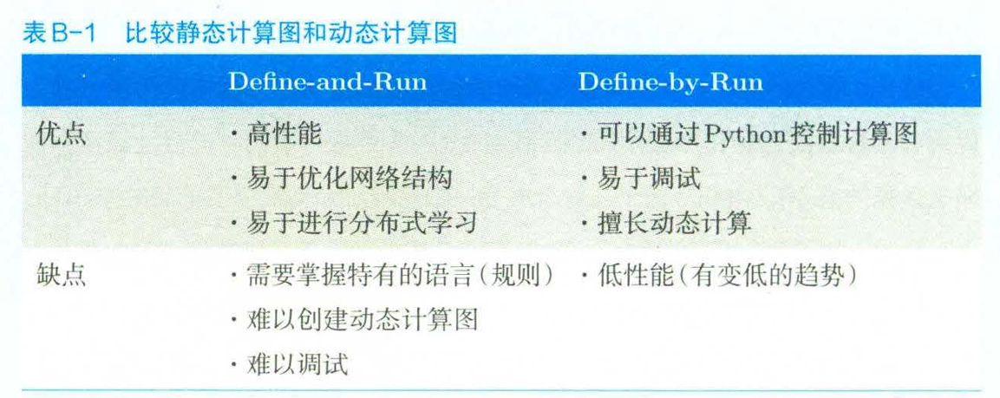
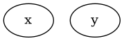
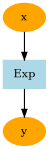
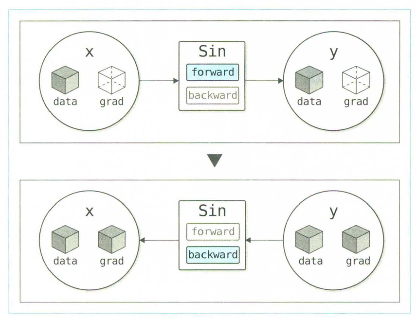
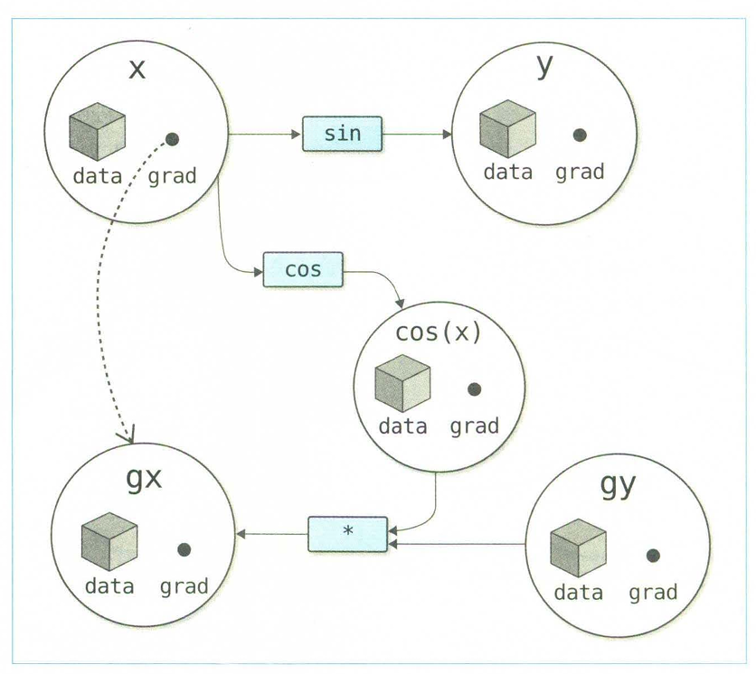
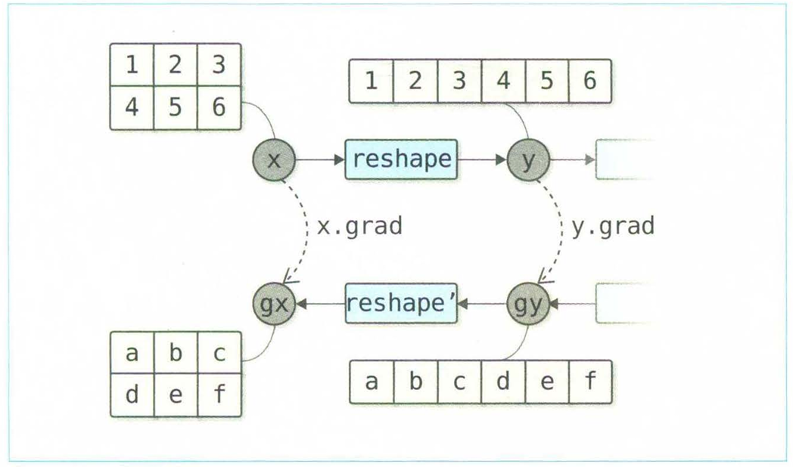
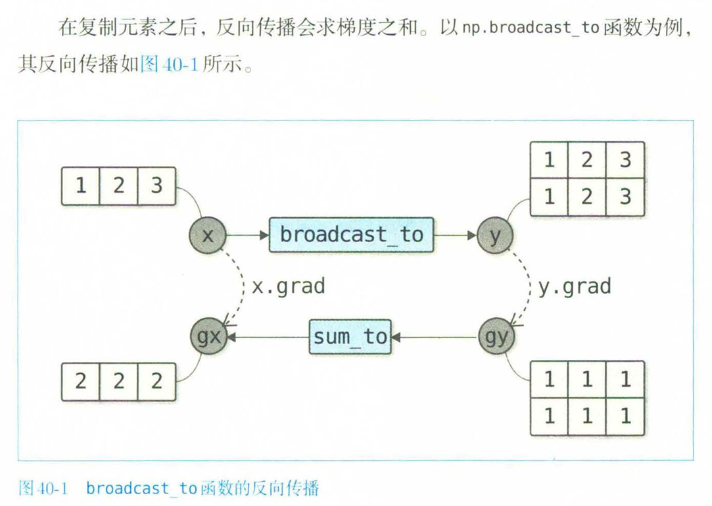
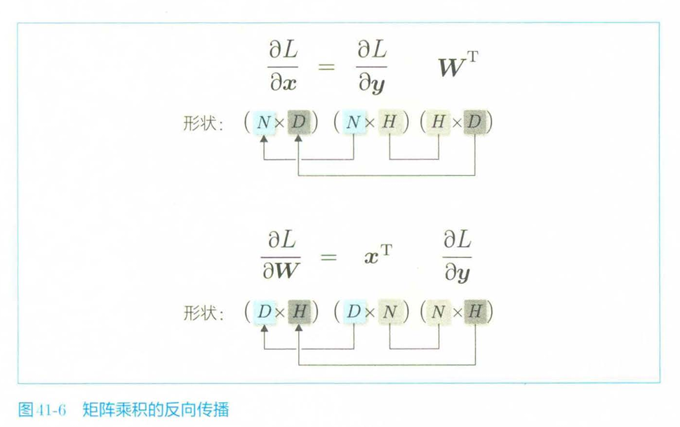

# 起

## 前阶段总结



上图是静态计算图和动态计算图的对比，有些框架兼容这两种模式

- 学习了Unittest测试写法

- 学习了Memory-profiler方式，宏观检测python程序的内存消耗

- 学习了Define-by-Run的计算图写法（forward & backward & 运算符重载）
    - 前置数据结构条件和后置数据结构条件的处理（保证从外界来说和数值上的处理一致）

    - backward的拓扑计算图搭建和遍历

    - 运算符重载中涉及到的左项和右项，以及其是否为ndarray还是int等还是variable的区别

    - 对运算符对象接口的隐藏

- 学习了contextlib的contextmanager用法和与with的结合，实现对no_grad函数在不影响全局的情况下局部不使用backward的写法

- 学习了Config类作为类似C++静态类成员变量从而提供全局特征的写法

## 现阶段目标

- 实现计算图可视化，使用Graphviz，未来可能试试加入Netron（主流），是目前 AI 行业查看模型结构的标准工具。支持 ONNX, PyTorch, TensorFlow, Keras 等几乎所有格式。

- 实现高阶导

# 实现

## 第三阶段

### DOT语法

1. 显示两个节点


```
digraph{
x
y
}
```

2. 具有信息的节点，最开始的是标签，代表节点
```
digraph{
1 [label="x", color=orange, style=filled]
2 [label="Exp", color=red, style=filled, shape=box]
}
```

3. 连接节点


```
digraph{
1 [label="x", color=orange, style=filled]
2 [label="y", color=orange, style=filled]
3 [label="Exp", color=lightblue, style=filled, shape=box]

1 -> 3
3 -> 2
}
```

### 计算图实现

**步骤1**：安装Graphviz，`sudo apt install graphviz`

- `dot -V` 查看是否成功

- `dot sample.dot -T png -o sanple.png`  把DOT的描述语言转换为输出的文件，`-T`是扩展文件后缀，`-o`指明输出的文件名

**步骤2**：计算图转换为DOT语言

- Variable节点
- Function节点
- 连接关系

想要实现的目标场景
```python
x0 = Variable(np.array(1.0))
x1 = Variable(np.array(1.0))
y = x0 + x1
x0.name = 'x0'
x1.name = 'x1'
y.name = 'y'

txt = get_dot_graph(y, verbose=False) # verbose 通常指冗余的详尽的
print(txt)

with open('sample.dot', 'w') as o:
    o.write(txt)
```

对节点进行设置的函数：
```python
def _dot_var(v, verbose = False): # 根据接受的节点来整，所以参数是variable对象
    dot_var = '{} [label="{}", color=orange, style=filled]\n'

    name = '' if v.name is None else v.name
    if verbose and v.data is not None:
        if v.name is not None:
            name += ': '
        name += str(v.shape) + ' ' + str(v.dtype)

    return dot_var.format(id(v), name)
```

用了`.format`的写法，先用`{}`提前占位，然后对占位的地方做处理，`id()`是返回对象在内存中的唯一地址

同理，对函数的转换，并且完成了点的连接
```python
def _dot_func(f):
    dot_func = '{} [label="{}", color=lightblue, style=filled, shape=box]\n'
    txt = dot_func.format(id(f), f.__class__.__name__)

    dot_edge = '{} -> {}\n'
    for x in f.inputs:
        txt += dot_edge.format(id(x), id(f))
    for y in f.outputs:
        txt += dot_edge.format(id(f), id(y())) # 因为是weakref
    return txt
```

最后需要一个调用这些函数的功能，拿到最后的计算图，**注意，这里和计算图的遍历（backward步骤）不同的是，反向传播因为涉及到严格的前置后置条件问题，必须服从拓扑排序，而这里只需要把每个点之间的连接信息写入DOT文件就行，所以不用管排序，只管遍历所有的记录关系就行**

```python
def get_dot_graph(output, verbose=True):
    txt = ''
    funcs = []
    seen_set = set()

    def add_func(f):
        if f not in seen_set:
            funcs.append(f)
            seen_set.add(f)
    
    add_func(output.creator)
    txt += _dot_var(output, verbose)

    while funcs:
        func = funcs.pop()
        txt += _dot_func(f)
        for x in func.inputs:
            txt += _dot_var(x, verbose)

            if x.creator is not None:
                add_func(x.creator)
    return 'digraph g {\n' + txt + '}'
```

以及给函数加上能主动执行dot命令的功能

```python
import os
import subprocess

def plot_dot_graph(output, verbose=True, to_file='graph.png'):
    dot_graph = get_dot_graph(output, verbose)

    tmp_dir = os.path.join(os.path.expanduser('~'), '.FrameZeroJ')
    if not os.path.exists(tmp_dir):
        os.mkdir(tmp_dir)
    graph_path = os.path.join(tmp_dir, 'tmp_graph.dot')

    with open(graph_path, 'w') as f:
        f.write(dot_graph)

    extension = os.path.splitext(to_file)[1][1:]  # Extension(e.g. png, pdf)
    cmd = 'dot {} -T {} -o {}'.format(graph_path, extension, to_file)
    subprocess.run(cmd, shell=True)

    # Return the image as a Jupyter Image object, to be displayed in-line.
    try:
        from IPython import display
        return display.Image(filename=to_file)
    except:
        pass


import os
import subprocess

def plot_dot_graph(output, verbose=True, to_file='graph.png'):
    # 生成 dot 文本内容 (假设 get_dot_graph 你已经定义好了)
    dot_graph = get_dot_graph(output, verbose)

    # 1. 目录处理优化
    # 使用 os.makedirs(..., exist_ok=True) 替代手动 if exists 判断，避免并发竞争条件
    tmp_dir = os.path.join(os.path.expanduser('~'), '.FrameZeroJ')
    os.makedirs(tmp_dir, exist_ok=True) 
    
    graph_path = os.path.join(tmp_dir, 'tmp_graph.dot')

    with open(graph_path, 'w') as f:
        f.write(dot_graph)

    # 2. 后缀名提取优化
    # 增加逻辑：如果文件名没有后缀（例如用户只传了 'my_graph'），给一个默认值
    extension = os.path.splitext(to_file)[1][1:] 
    if not extension:
        extension = 'png'  # 默认兜底

    # 3. 命令构建优化 (最核心的改动！)
    # 这里的 cmd 改成了列表 (List)，而不是字符串
    # 这样就可以安全地使用 shell=False
    cmd = ['dot', graph_path, '-T', extension, '-o', to_file]

    # 4. 执行过程优化 (增加错误处理)
    try:
        # shell=False: 防止注入攻击，且能正确处理带空格的文件名
        # check=True: 如果 dot 命令执行失败（比如语法错误），会自动抛出 CalledProcessError
        subprocess.run(cmd, shell=False, check=True)
        
    except FileNotFoundError:
        # 这是最常见的问题：用户没装 Graphviz
        print("错误：未找到 'dot' 命令。请确保系统中已安装 Graphviz (例如: apt install graphviz)。")
        return None
    except subprocess.CalledProcessError:
        # dot 命令装了，但是运行出错了（比如 dot 文件内容有语法错误）
        print("错误：Graphviz 图片生成失败。请检查 ~/.dezero/tmp_graph.dot 内容是否合法。")
        return None

    # 5. Notebook 显示优化
    try:
        from IPython import display
        return display.Image(filename=to_file)
    except ImportError:
        # 仅捕获导入错误，不掩盖其他潜在 bug
        pass
```


- subprocess，理解为当前进程创建子进程然后去执行
    - `.run` 阻塞式
    - `.Popen` 非阻塞式
    - `shell = True` 先调用Shell，然后字符串丢给Shell执行，如果出现危险注入，容易完蛋
    - 否则是由python直接找到对应命令程序，如果出现其他指令，会当作该对应命令的异常参数

- `os.path.expanduser` 跨系统的拿到主文件夹目录
    - 创建一个隐藏文件夹，用来专门存这些玩意

- 存图片的地方是当前工作目录

### 泰勒展开求导数

1. sin和cos

首先forward部分和backward部分都是三角函数，而由于底层是numpy的，所以直接借用

```python
class Sin(Function):
    def forward(self, x):
        y = np.sin(x)
        return y
    
    def backward(self, gy):
        x = self.inputs[0].data
        gx = np.cos(x) * gy
        return gx


class Cos(Function):
    def forward(self, x):
        y = np.cos(x)
        return y
    
    def backward(self, gy):
        x = self.inputs[0].data
        gx = np.sin(x) * (-1) * gy
        return gx
```

2. 泰勒展开，直接套了现有的公式

```python
def my_sin(x, threshold=0.0001):
    y = 0
    for i in range(100000):
        c = (-1) ** i / math.factorial(2 * i + 1)
        t = c * x ** (2 * i + 1)
        y = y + t
        if abs(t.data) < threshold:
            break
    return y
```

#### 函数优化

一般函数优化问题的基准函数是Rosenbrock函数，他的最小值是在(1,1)处，一般`a = 1,b = 100`

$ f(x_0,x_1) = b(x_1-x_0^2)^2 + (a-x_0)^2 $

目标：写出Rosenbrock函数，然后利用**梯度下降法**更新:

- 即当梯度是`(-2, 400)`，更新的方向是`(2, -400)`
- 更新的百分比为lr，learning_rate，直接加上learning_rate * 更新方向即可
    - 要注意每一轮都要给clear_grad

```python
def rosenbrock(x0, x1):
    y = 100 * (x1 - x0 ** 2) ** 2 + (x0 - 1) ** 2
    return y

x0 = Variable(np.array(0.0))
x1 = Variable(np.array(2.0))

lr = 0.001
for i in range(10000):
    y = rosenbrock(x0, x1)
    x0.cleargrad()
    x1.cleargrad()

    y.backward()

    x0.data -= lr* x0.grad
    x1.data -= lr* x1.grad

print(x0.data, x1.data)
```

**牛顿法**

- 先使用了泰勒展开的在某点的二阶近似（这个函数如果不带入点的话是一个二次函数）

- 如果是求零点

$ x - \frac{f(x)}{f'(x)} $

- 导数的零点，是原函数极值点

$ x - \frac{f'(x)}{f''(x)} $

### 高阶导数


原：
- 执行forward时候计算图连接、data依次被创建（`__call__`中）
- 执行backward时候grad被创建
- 正向传播和反向传播的具体计算分别在子类的forward和backward中进行的

**结论**：如果对反向传播进行的计算创建连接，高阶导数可以被自行计算出来

那也就是说，把当前的反向传播改造成下一次的正向传播，就相当于在构造下一次的计算图，然后再计算就成了高阶导

以sin为例：
在backward里面有一句：`gx = gy * np.cos(x)` 因为此时都是把gx和gy当作数值的，如果假设这里都是Virable，可以继续调用`gx.backward()`实现继续求导

**具体实现方法**：


- 梯度/导数 需要保存为Variable实例，上图就是当grad作为Virable实例后创建的计算图
    - 之前grad引用了ndarray实例，现在改为variable
    - 修改backward方法（不修改Function类）


```python
class Variable:
    ...
    def backward(self, retain_grad = False):
        if self.grad is None:
            self.grad = Variable(np.ones_like(self.data))
        ...
```

注意一个逻辑顺序

```python
# 原
class Mul(Function):
    ...
    def backward(self, gy):
        x0 = self.inputs[0].data
        x1 = self.inputs[1].data
        return gy * x1, gy * x0

# 新
class Mul(Function):
    ...
    def backward(self, gy):
        x0, x1 = self.inputs
        return gy * x1, gy * x0

```

因为已经是Variable实例，所以gy * x1这种操作，又会调用Variable类上实现的*运算符的重载。

gemini回答：

这是一个非常敏锐且有深度的思考！你察觉到了一种“自我指涉”（Self-reference）的结构。直接回答你的问题：这种写法是被语法所容许的吗？ 是的，在 Python 中完全合法且常见。C++ 允许这种操作吗？ 是的，C++ 也完全允许这种逻辑（虽然写起来需要注意头文件包含关系）。这不是一个死循环（Logical Loop），而是一个**递归生成（Recursive Generation）**的过程。我们可以把它形象地比喻为“细胞分裂”或者“俄罗斯套娃”。我来为你详细拆解为什么这在逻辑上和语法上都是行得通的。1. 为什么这不算“逻辑圈”（Logical Loop）？你的担忧在于：Mul 的 backward 用到了 *，而 * 又生成了 Mul。看起来像：A $\to$ A $\to$ A ...但在实际运行中，这并不是在一个封闭的环里打转，而是在时间轴上不断生成新的实例。场景模拟假设我们执行 $y = x \cdot x$ （为了简单，假设是自乘）。前向传播 (Forward)：代码：y = x * x发生：调用 Mul.forward。结果：内存里创建了一个对象 Mul_1 (节点1)。反向传播 (Backward)：代码：y.backward()发生：系统调用 Mul_1 的 backward 方法。逻辑：gx = gy * x。关键点：这里的 * 号再次被触发。结果：系统创建了一个全新的对象 Mul_2 (节点2)，并把它加入到了计算图中。

结论：这不叫循环（Circle），这叫**“繁衍”**。Mul_1 只是负责产生 Mul_2。Mul_1 并没有调用它自己，而是创建了一个同类的新实例。这就好比人类生孩子，孩子也是人类，孩子长大后再生孙子。这是链式延续，而不是逻辑死循环。

更有效的反向传播模式：
必须限制这种链式延续在不需要的时候不会继续往后走，所以需要增加一个默认参数`create_graph`，并默认为false.
- Function的call里会根据全局的enable_prop来限定要不要给output加上creator(这是生成链的第一步)
- 这个create_graph就是去设置全局的enable_prop，还有一个参数是retain_grad，这个是保证前向不后向的时候省内存用的
- 然后函数的改写，只要取数据那块修改了即可

算高阶段导时候记得`x.cleargrad()`，不然在内部是单纯的一直往上加

**double backprop**方法：个人理解就是，某个式子用到了另一个关于x函数的一阶导，然后再对这个式子求导。

```python
x = Variable(np.array(2.0))
y = x ** 2
y.backward(create_graph=True)
gx = x.grad
x.cleargrad()  # 先得给引用，才能清x里的
z = gx ** 3 + y
z.backward()
print(x.grad)
```

## 第四阶段 神经网络

此时已具备了自动微分的能力，现在要基于这个能力增强机器学习所需的功能

### 张量处理

已有的基础是，可以进行逐元素的运算，而目前要专注于不是逐元素计算的函数，比如sum和reshape

#### 使用张量时的反向传播

$ \boldsymbol{y} = F(\boldsymbol{x}) $

目前先当作n维向量x

- 如果是向量y对向量x的导数，称为雅各比矩阵

$ \mathbf{J} = \frac{\partial \mathbf{y}}{\partial \mathbf{x}} = 
\begin{bmatrix}
    \frac{\partial y_1}{\partial x_1} & \frac{\partial y_1}{\partial x_2} & \cdots & \frac{\partial y_1}{\partial x_n} \\
    \frac{\partial y_2}{\partial x_1} & \frac{\partial y_2}{\partial x_2} & \cdots & \frac{\partial y_2}{\partial x_n} \\
    \vdots & \vdots & \ddots & \vdots \\
    \frac{\partial y_m}{\partial x_1} & \frac{\partial y_m}{\partial x_2} & \cdots & \frac{\partial y_m}{\partial x_n}
\end{bmatrix} $

- 如果极端一点，是标量对x向量的导数

$ \frac{\partial L}{\partial \mathbf{x}} = 
\big[ \frac{\partial L}{\partial x_1}, \dots, \frac{\partial L}{\partial x_n} \big] $ 

- 链式法则仍然适用，只不过中间元素都是雅各比

- 自动微分的前向模式和反向模式：添加括号进行计算的方式，通常情况下，反向模式高效点

#### 实践

**步骤1**：reshape函数和transpose函数的实现（均会改变张量的形状）

Numpy的reshape用法：`np.reshape(x, shape)`

1. 问题是如何实现他的反向传播，注意最终，**x.grad.shape 和 x.data.shape必须要一致**，雅各比矩阵只是一个中间矩阵，并不是最终结果



- 需要添加初始化，来保存参数
- x因为底层是ndarray，所以x.reshape就已经调用了Numpy的reshape函数
- 如果一开始调用时候shape一致，输入的是ndarray返回的应该是一个新的Variable对象，输入的是Variable，返回自身

2. 根据参数的不同，numpy中的reshape有以下几种，以及应当注意到，不光是一个外在的函数，更是作为Variable本身的成员函数使用，所以还要做一个修改

```python
# 传递元组
y = x.reshape((2,3))
# 传递列表
y = x.reshape([2,3])
# 直接展开后传递参数
y = x.reshape(2, 3)

class Variable:
    def reshape(self, *shape):
        if len(shape == 1) and isinstance(shape[0],(tuple, list)):
            shape = shape[0]
        return FrameZeroJ.functions.reshape(self, shape)
        # 如果是（2，3）的方式，*shape形式进来就正好是元组直接使用
```

`isinstance()`实现判断多个可能时候的写法如上

有一个地方需要注意：
`x = x.reshape()`，必须有一个新的引用来接受，因为是返回Valiable，没有接受的会寄，因为并不是修改原变量，而是创造出了新的

3. Transpose的实现

```python
y = np.transpose(x) # 一种调用手段

class Valiable:
    def transpose(self):
        return FrameZeroJ.functions.transpose(self)
    
    @property
    def T(self): # 目的是为了x.T就能使用
        return FrameZeroJ.functions.transpose(self)

class Reshape(Function):
    def __init__(self, shape):
        self.shape = shape # 存输出的形状

    def forward(self, x):
        self.x_shape = x.shape # 保留原来输入的形状
        y = x.reshape(self.shape)
        return y
    
    def backward(self, gy):
        return reshape(gy, self.x_shape)
    
def reshape(x, shape):
    if x.shape == shape:
        return as_variable(x)
    return Reshape(shape)(x)

class Transpose(Function):
    def forward(self, x):
        y = np.transpose(x)
        return y
    
    def backward(self, gys):
        gxs = transpose(gys)
        return gxs
    
def transpose(x):
    return Transpose()(x)
```

**步骤2**：实现对轴数据顺序的改变

```python
A,B,C,D = 1, 2, 3, 4
x = np.random.rand(A,B,C,D)
y = x.transpose(1, 0 ,3, 2) 
# 这里是对ABCD序列的重排组成新的轴顺序，如果是None，默认反序
```

关键的一句`inv_axes = tuple(np.argsort([ax % axes_len for ax in self.axes]))`

- 处理负数索引，用取模的方法
- `np.argsort`，本质就是一个还原轴向的函数
    - 会把现在提供的axes里的值排成0到n的顺序（还原）
    - 然后观察他们在提供的原axes里的位置，记录，就是返回的那个list，然后这里改成了tuple


**步骤3**：求和的函数

求和的反向传播主要是形状问题，需要按照元素的数量复制梯度（不管梯度是值还是向量），总之是按照元素数量再复制一层

1. 选择添加一个`broadcast_to(x, shape)`的功能，作为和Numpy保持一致的广播功能

```python
class Sum(Function):
    def __init__(self, axis, keepdims):
        self.axis = axis
        self.keepdims = keepdims

    def forward(self, x):
        self.x_shape = x.shape
        y = x.sum(axis=self.axis, keepdims=self.keepdims)
        return y

    def backward(self, gy):
        gy = utils.reshape_sum_backward(gy, self.x_shape, self.axis,
                                        self.keepdims)
        # 这个函数会对gy形状调整，Numpy相关的问题
        gx = broadcast_to(gy, self.x_shape)
        return gx
```

2.更加强大的仿np.sum功能，能指定求和的轴

```python
x = np.array([[1,2,3],[4,5,6]])
y = np.sum(x,axis=0)
print(y)
```
这个结果形状是(3,)，如果不给轴向，计算所有元素的总和，keepdims参数，可以要求保持轴的数量，比如`[[21]]`和21的区别

- 初始化接受axis和keepdims，作为属性
- 使用属性计算
- 反向传播，使用`broadcast_to`函数复制元素梯度使其形状与输入变量的形状相同

3. broadcast_to函数和sum_to函数

```python
x = np.array([1,2,3])
y = np.broadcast_to(x,(2,3))
print(y) # [[1,2,3] [1,2,3]]
```



这几个函数关键，在于如何组织起来的，Sum、SumTo、reshape_sum_backward、BroadcastTo

- sum_to 存在的唯一目的为了解决 BroadcastTo 的反向传播问题
    - 比如从(3, )被广播成(10, 3)
    - 反向传播(10, 3)压缩到(3,)
    - 目的是为了能够主动判断形状，因为用户是主动告诉计算机应该求和哪个轴，但是缺少一个根据shape自动判断的

**补：Numpy的广播规则**：所有形状必须从右边（最后一个维度）开始对齐
- 1是通配符，要保证广播前与广播后的尾部维度对应

https://sharpsight.ai/blog/numpy-axes-explained/

这个网址说的是关于Numpy轴的问题，轴不是一个空间上的概念，而是一个数学编号上的概念：
- 以axis方向就是把那个axis编号上变化的，其余标签都相同的加起来
- 以axis方向扩展的，就是其他编号不变，axis编号上进行扩展

这块赶紧不搞了不然搞不完了，反正总的来说这个张量的1：
```
我好像突然理解为什么选1做占位符了，如果愿意的话，其实可以把一个数据看作(1,1,1,...)无限下去，但明显没有意义，只是为了运算时候或者其他时候达到一种指示或者对齐盲从这个角度理解似乎就能十分通顺需要干什么了。总的来说不能从图像上理解，而是一种纯坐标，如果是sum，我就得找出对哪些shape后消去的轴，如果是broadcast，就得先补1恢复到原来对应的再不知道啥的怎么复制应该就是只对那些为1的轴数值改变，其余不是轴的数值不动的复制，我猜大意是这样
```

问gemini的这段可供参考，就当理解了，反正纯作为坐标

#### 矩阵乘法



写法：
```python
class MatMul(Function):
    def forward(self, x, W):
        y = x.dot(W)
        return y

    def backward(self, gy):
        x, W = self.inputs
        gx = matmul(gy, W.T)
        gW = matmul(x.T, gy)
        return gx, gW


def matmul(x, W):
    return MatMul()(x, W)

```

#### 均方误差实现

```python
class MeanSquaredError(Function):
    def forward(self, x0, x1):
        diff = x0 - x1
        y = (diff ** 2).sum() / len(diff)
        return y

    def backward(self, gy):
        x0, x1 = self.inputs
        diff = x0 - x1
        gx0 = gy * diff * (2. / len(diff))
        gx1 = -gx0
        return gx0, gx1
```

### 神经网络阶段

- 实现线性层linear函数
- 激活函数的实现

#### 实现

**步骤1**：线性层，已经有matmul和dot了，和这俩实现差不多，唯一的注意事项是对b的梯度计算：
- 如果b是None，梯度不传
- 如果不是，要把gy压成b的形状


**步骤2**：激活函数

1. sigmoid
```python
def sigmoid_simple(x):
    x = as_variable(x)
    y = 1 / (1 + exp(-x))
    return y

class Sigmoid(Function):
    def forward(self, x):
        xp = cuda.get_array_module(x)
        # y = 1 / (1 + xp.exp(-x))
        y = xp.tanh(x * 0.5) * 0.5 + 0.5  # Better implementation
        return y

    def backward(self, gy):
        y = self.outputs[0]()
        gx = gy * y * (1 - y)
        return gx

def sigmoid(x):
    return Sigmoid()(x)
```

**步骤3**：简单神经网络

```python
# 权重初始化
I, H, O = 1, 10, 1
W1 = Variable(0.01 * np.random.randn(I, H))
b1 = Variable(np.zeros(H))
W2 = Variable(0.01 * np.random.randn(H, O))
b2 = Variable(np.zeros(O))

# 神经网络推理
def predict(x):
    y = F.linear(x, W1, b1)
    y = F.sigmoid(y)
    y = F.linear(y, W2, b2)
    return y

# 神经网络的训练
lr = 0.2
iters = 10000

for i in range(iters):
    y_pred = predict(x)
    loss = F.mean_squared_error(y, y_pred)  # 使用均方误差

    W1.cleargrad()
    b1.cleargrad()
    W2.cleargrad()
    b2.cleargrad()
    loss.backward() # 之前的梯度清完才能backward

    W1.data -= lr * W1.grad.data
    b1.data -= lr * b1.grad.data
    W2.data -= lr * W2.grad.data
    b2.data -= lr * b2.grad.data
    if i % 1000 == 0:
        print(loss)
```

#### 参数类的实现

参数的处理比较复杂，因此创建汇总参数的机制：`Parameter`类，`Layer`类

1. 因为参数类本身参与底层的数据运算，所以直接继承Variable类即可，同时还能在代码中区分开。

```python
x = Variable(...)
p = Parameter(...)
y = x * p
```

2. Layer类和Function都是变换变量的类，但是在持有参数这一点不同，Layer是持有参数并使用这些参数进行变换的类，所以单开一个文件写

关于`__setattr__`魔术方法，每当你试图给对象的属性赋值（obj.name = value）时，Python 就会自动调用这个方法。如果没有 __setattr__，用户就得手动写 model.add_param('w1', p)，体验就很差。
```python
class Student:
    def __setattr__(self, name, value):
        print(f"正在尝试把 {name} 设置为 {value}...")
        # 注意：这里还没有真正赋值成功，只是拦截到了这个动作

    def __setattr__(self, name, value):
        if isinstance(value, (Parameter, Layer)):
            self._params.add(name)
        super().__setattr__(name, value)

s = Student()
s.age = 18  # 触发！输出: 正在尝试把 age 设置为 18...
s.name = "Zhang" # 触发！输出: 正在尝试把 name 设置为 Zhang...
```
对成员对象的添加跟自己无关，本质上还是调用python最原本对象的那个函数也就是super.__setattr__，然后这样也能实际上隐藏接口和内部实现相关，对于个人来说能做的只有是记录这个attr名字方便查找或做一些表面工作

这种对名字的处理使得：
```python
layer = Layer()
layer.p1 = Parameter(...)
layer.p2 = Parameter(...)
layer.p3 = Parameter(...)
print(layer.__params)

for name in layer._params:
    print(name, layer.__dict__[name]) # 实际上放不放进__dict__还比较难说，好像还有另一个，不过可以先姑且这么看
```

3. 添加其他方法

```python
class Layer(ABC):
    ...

    def __call__(self, *inputs):
        outputs = self.forward(*inputs)
        if not isinstance(outputs, tuple):
            outputs = (outputs,)
        self.inputs = [weakref.ref(x) for x in inputs]
        self.outputs = [weakref.ref(y) for y in outputs]
        return outputs if len(outputs) > 1 else outputs[0]
    
    @abstractmethod
    def forward(self, inputs):
        pass

    def params(self):
        for name in self._params:
            obj = self.__dict__[name]

            if isinstance(obj, Layer):
                yield from obj.params() # 组合使用yield 和 for 可以按照顺序取出参数，因为yield只是暂停，下次还从这个暂停的位置
            else:
                yield obj

    def cleargrads(self):
        for param in self.params():
            param.cleargrad()
```

为什么这里对inputs和outputs都是弱引用？gemini:

这是一个非常敏锐且触及框架核心架构设计的问题！你的观察完全正确：

- Function：inputs 是 强引用，outputs 是 弱引用。

- Layer：inputs 和 outputs 都是 弱引用。

造成这种差异的根本原因在于：它们在“计算图（Computational Graph）”中的角色和生命周期完全不同。

简单来说：Function 是计算图的“骨架”，必须抓紧数据；而 Layer 只是计算图的“生成器”，不应该持有数据。

- Function：必须强引用 Inputs（为了生存）
Function 是动态计算图中的 节点（Node）。

反向传播的链条： 计算图的连接关系是：输出 Variable -> Creator (Function) -> 输入 Variable。

生命周期： 在反向传播（Backward）发生之前，中间的计算结果不能被回收。 如果 Function 对 inputs 使用弱引用，那么当代码运行完前向传播那一行后，如果没有其他变量引用输入数据，输入数据可能会被 Python 的垃圾回收机制（GC）瞬间回收。 后果：等你调用 loss.backward() 时，Function 回头一看：“咦？我的输入节点去哪了？”——链条断了，无法求导。

结论：Function 持有 inputs 的强引用，是为了维持计算图的连通性和生命周期。

- Layer：必须弱引用 Inputs（为了防止内存泄漏）
Layer（如 Linear, Conv2d）是 参数的容器 和 Function 的调度者。它本身通常不是计算图中的节点。

想象一下这个场景： 你有一个模型 model = MyLayer()，这个对象是全局存在且持久的（贯穿整个训练过程）。

假设 Layer 对 Inputs 使用了“强引用”：
第一轮迭代 (Iter 1)：

y = model(x1)

model.inputs 强引用了 x1。

计算图建立，x1 及其关联的整个图都活着。

backward() 结束，我们本期望释放 x1 相关的显存。

但是！ model 对象还活着，而且它手里的 self.inputs 依然死死抓着 x1。

结果：第一轮的计算图和显存无法释放。

第二轮迭代 (Iter 2)：

y = model(x2)

model.inputs 指向了新的 x2。

此时，x1 的引用计数才归零，第一轮的显存才被释放。

后果：如果 Layer 使用强引用，你的显存里永远会额外滞留一份“上一轮迭代”的完整计算图数据。这对于显存捉襟见肘的深度学习训练是巨大的浪费。

Layer 为什么要存 inputs/outputs？
既然怕内存泄漏，干脆不存不行吗？ Layer 存这些主要是为了 方便调试 或 实现 Hooks（钩子）机制（比如提取中间层的特征图）。 使用 weakref 的好处是：

如果外部（计算图）还需要这些数据，Layer 就能访问到（用于调试）。

如果外部计算图已经销毁了（backward 完成了），Layer 就自动放手，让数据被回收，绝不阻碍垃圾回收。

**Function 说：“我是计算图的一部分，我必须抓住我的上游（Input），否则路就断了。”**

**Layer 说：“我是一个长期存在的管理对象，我不能强占着某一次路过的数据不放，否则会造成显存堆积（Memory Leak-like behavior）。”**

然后使用的时候

```python
l1 = L.Linear(10)  # 这里显示设置的都是out_size
l2 = L.Linear(1)

def predict(x):
    y = l1(x)
    y = F.sigmoid(y)
    y = l2(y)
    return y
```

在使用`__call__`的时候会调用forward，然后在forward里实现对in_size的初始话和记录

在全连接层（Linear Layer）的语境下，输入数据 x 通常是一个二维矩阵，其形状默认为 `(Batch_Size, Input_Features)`。因此，`x.shape[1]` 代表的就是“输入特征的数量” (in_size)。

**扩展Layer类**：让类还能继续持有其他Layer

这样可以实现这样的代码：
```python
model = Layer()
model.l1 = L.linear(5)

```

**创建Model类**，在layer类的基础上增加异格可视化操作的方法
```python
class Model(Layer):
    def plot(self, *inputs, to_file='model.png'):
        y = self.forward(*inputs)
        return utils.plot_dot_graph(y, verbose=True,to_file=to_file)


class MLP(Model):
    """
    fc 是 fully-connect, sizes是元组或列表, 指定各层的输出大小
    [10, 1] 第一层输出大小是10, 第二层是1
    """
    def __init__(self, fc_output_sizes, activation=F.sigmoid):
        super().__init__()
        self.activation = activation # 初始化，激活函数
        self.layers = [] # 初始化层数

        for i, out_size in enumerate(fc_output_sizes):
            layer = L.Linear(out_size)
            setattr(self, 'l' + str(i), layer)
            self.layers.append(layer)

    def forward(self, x):
        for l in self.layers[:-1]:
            x = self.activation(l(x))
        return self.layers[-1](x)
```

**创建Optimizer类**：两个实例变量，hooks和target

什么是hook：
Hook（钩子） 的核心作用是：在参数真正更新之前，对“梯度”或“参数”进行最后一次拦截和预处理。

如果没有 Hook，如果你想实现“权重衰减（Weight Decay）”或者“梯度裁剪（Gradient Clipping）”，你就必须把这些逻辑硬编码到每一个优化器（SGD, Adam, RMSprop）的内部代码里。

MomentumSGD方法，引入了一个v，然后每次v保留一部分，再减去SGD的部分，然后用这个新的v更新

#### 其他组件

**步骤1**：添加工具函数 `get_item`函数，从x中提取一部分，也可以被反向传播


**步骤2**：Dataset和DataLoader


Dataset，数据集专用类，并提供数据预处理机制

数据集分为小数据集和大数据集：
- 小数据集可以当作一个ndarray实例，但是大数据集会出现问题

初始化方法接受：train参数，区分训练还是测试标志位

DataLoader看作是对DataSet的迭代器，来取出数据

# 期间段型总结阶

上面部分做的太乱了，这里试着重新梳理一下相关部分