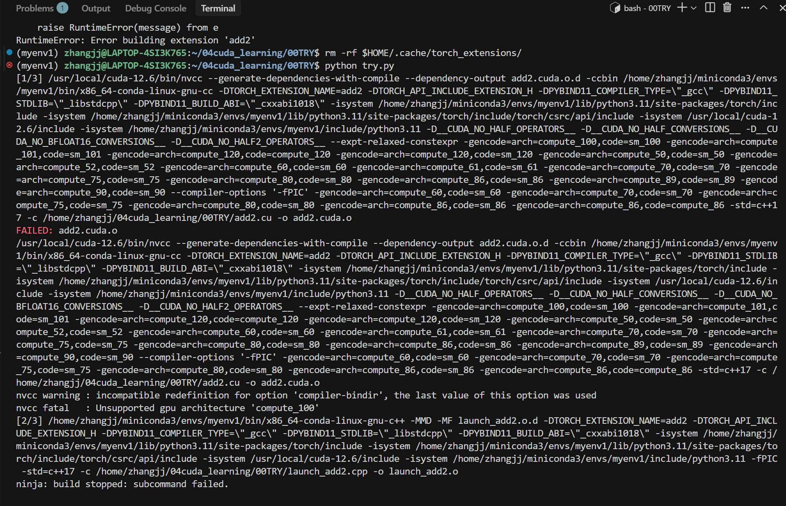
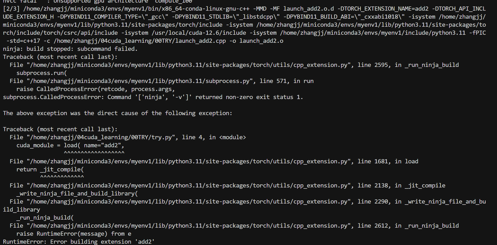
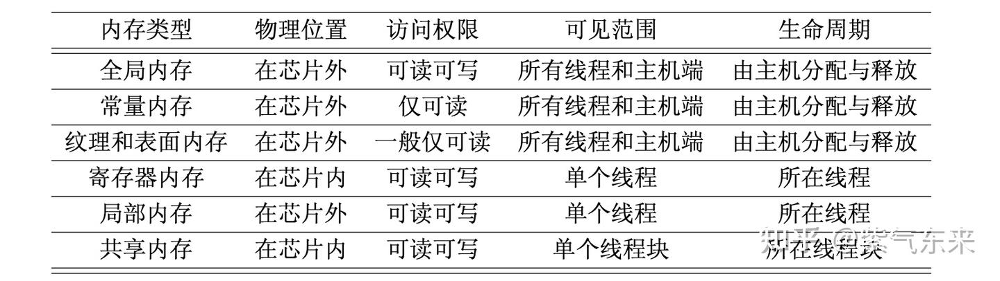
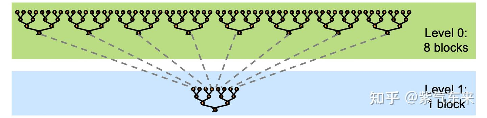
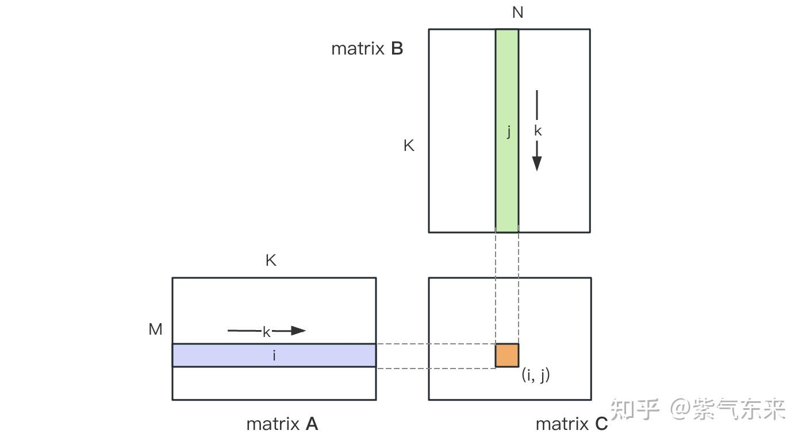
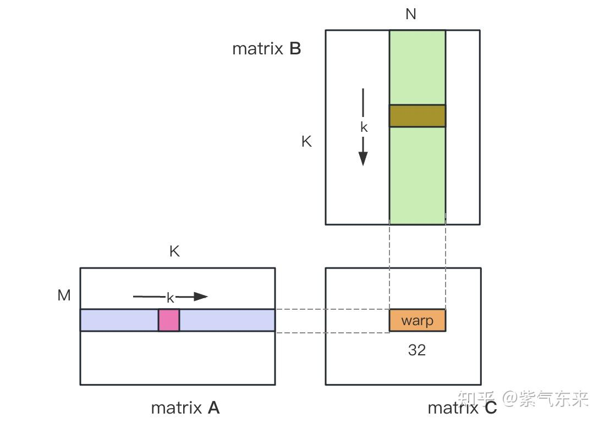
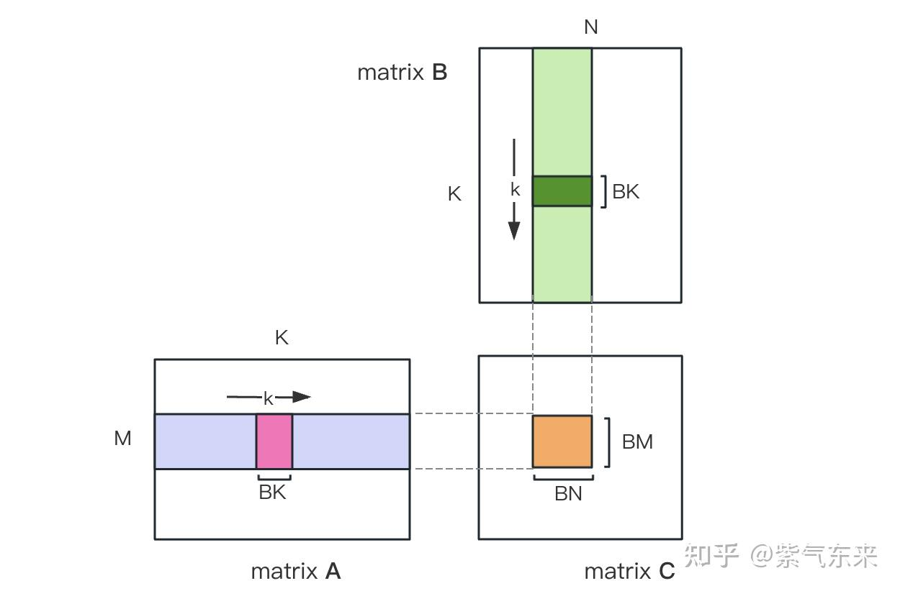

# 算子入门

对这一系列的学习[https://github.com/ifromeast/cuda_learning#]，后面分别按照别人的标题分章节

## cuda编程基础

该部分重点在于对于算子的组织性方法和结构。

我的初步想法是，不同的文件还是什么东西就是不同的模块结构，如何把这些模块结构连接起来是第一步要知道的，然后才是对每个模块的学习调整。

对于学算子来说，算子本身是一大模块，需要调用算子的是另一个模块，中间还需要一个胶水模块进行连接。

### Pytorch自定义CUDA算子

首先因为不是C++调用CUDA算子，做不到像C++那种写完编译可以直接能用。因此这里调用算子的模块就是Pytorch，胶水模块就是根据不同方式存在沟通这两个模块的方法。

根据CUDA算子编译的时间可以分为即时编译（用的时候再编译）和提前编译（运行时候直接调用动态链接库）的方法。

原作者的文件结构如下：
```
01_cuda_op/
├── include/
│   └── add2.h              # C++ 函数声明
├── kernel/
│   ├── add2_kernel.cu      # CUDA kernel 实现
│   └── add2_ops.cpp        # PyTorch 接口封装（包含 pybind11）
├── run_time.py             # 主程序（包含 JIT 编译调用）
└── setup.py                # setup.py 编译方式（对比用）
```

**核心架构**：5层结构：

1. CUDA Kernel 层 (`add2_kernel.cu: MatAdd`)
    - GPU 上执行的并行计算函数
    - 使用二维线程块处理矩阵加法
2. C++ 执行层 (`add2_kernel.cu: launch_add2`)
    - 配置 CUDA kernel 启动参数（线程块、网格大小）
    - 从 CPU 调用 GPU kernel

3. PyTorch 接口层 (`add2_ops.cpp: torch_launch_add2`)
    - 将 **torch::Tensor 转换为原始指针**
    - 连接 PyTorch 和 CUDA 代码
4. Python 绑定层 (`add2_ops.cpp: PYBIND11_MODULE`)
    - 使用 PyBind11 将 **C++ 函数暴露给 Python**
    - 使 Python 可直接调用 C++ 函数

5. Python 调用层 (`run_time.py`)
    - 使用 torch.utils.cpp_extension.load 进行 JIT 编译
    - 运行时动态编译并加载模块

> 基础:算子模块

和直接用C++的代码不同的是，C++能直接启动核函数，而Pytorch不行。
**还有一个重要的一点是，Pytorch中使用的结构存在与cpp不互通的问题，比如Pytorch使用的torch如果不经过一层处理，cpp肯定没法直接对这个数据使用，自然也无可奈何**。

---
以下是`add2_kernel.cu`文件的内容，这个文件当作**算子核函数模块**，只负责：
- 具体的算子实现 kernel层
- 暴露一个可以启动算子的cpp接口
- 记录一个`add2.h`头文件，声明一下执行层启动算子的cpp接口

```cpp
__global__ void MatAdd(float* c,const float* a,const float* b,int n)
{
    int i = blockIdx.x * blockDim.x + threadIdx.x;
    int j = blockIdx.y * blockDim.y + threadIdx.y;
    int idx = j*n + i;
    if (i < n && j < n)
        c[idx] = a[idx] + b[idx];
}

void launch_add2(float* c,
                 const float* a,
                 const float* b,
                 int n) {
    dim3 block(16, 16);
    dim3 grid(n/block.x, n/block.y);

    MatAdd<<<grid, block>>>(c, a, b, n);
}
```

---
> JIT编译

---
胶水模块：第三层和第四层，JIT编译的核心部分，处理不同语言下的数据，Pytorch下转换为C++下的原始指针，并用PyBind11让Python可以直接调用C++函数

`add2_ops.cpp`文件：

- 引用`add2.h`头文件拿到算子模块中执行层`launch_add2()`的接口
- 进行数据处理，torch类型
    - 使用 `torch/extension.h` 头文件
- Pybind处理

---
`torch/extension.h` 头文件，通过包含和封装以下关键组件来实现其功能：
- 访问 ATen 库 (张量操作)
    - 使用`touch::Tensor`允许在C++代码中接受、创建、返回Pytorch的张量对象
    - 提供访问张量属性的方法
    - `data_ptr<T>()` 提取张量底层数据的原始C++指针，是将数据传递给CUDA kernel的关键
- C++ 接口和绑定 (Pybind11)，包含了 PyTorch 用于将 C++ 函数暴露给 Python 的工具链
    - 模块定义，`PYBIND11_MODULE`来定义C++扩展模块，使得Python可以import
    - 函数绑定，方便Python调用
    - **所有的 Pybind11 模块定义都围绕着 PYBIND11_MODULE 这个宏展开。**
    - `m` 代表正在创建的Python模块的变量module
    - `_C` import中使用的模块名称
    - `.def()` 用于将一个C++函数名映射到一个Python函数名

- 提供一系列宏，检查输入张量的有效性

---

```cpp
void torch_launch_add2(torch::Tensor &c,
                       const torch::Tensor &a,
                       const torch::Tensor &b,
                       int64_t n) {
    launch_add2((float *)c.data_ptr(),
                (const float *)a.data_ptr(),
                (const float *)b.data_ptr(),
                n);

    // 提取原始指针然后传给原来的cpp函数
}  // 第三层，接口层

PYBIND11_MODULE(TORCH_EXTENSION_NAME, m) {  // 用于jit和setup.py
    m.def("torch_launch_add2",  // python里的名字
          &torch_launch_add2,   // C++函数的地址
          "add2 kernel warpper");// 说明文档
}

TORCH_LIBRARY(add2, m) {  // 这里是add2名字，作为ops调用的module名字
    // 用于cmake，将 C++ 函数注册为 PyTorch 命名空间（Namespace）下的一个算子
    m.def("torch_launch_add2", torch_launch_add2);
}

//依赖 PyTorch Dispatcher 系统。它将算子注册到 ATen 库中，而不是作为独立的 Python 函数
// 然后通过torch.ops接口来调用  torch.ops.add2.torch_launch_add2()

```

`TORCH_EXTENSION_NAME` 是Pytorch自己定义的宏，在JIT编译的时候会被替换为模块名，这里通常和setup.py的写法是绑定在一块的，使用PYbind11_Module是一个标准的Python模块导入，然后再基于setup.py或者JIT编译（不需要setup.py，而是在Python运行时使用`torch.utils.cpp_extension`中的`load`或者`load_inline`），但是这几步都是必要的

`PYBIND11_MODULE` 需要取址符号 `&`，而 `TORCH_LIBRARY` 不需要，是因为它们底层的注册机制和对 C++ 函数的要求不同。
- Pybind11需要的时一个可调用对象，因此在m.def里面要传入地址
- TORCH_LIBRARY 宏是 PyTorch Dispatcher (算子调度器) 系统的一部分，它使用的不是通用的 Pybind11 注册模板，而是 PyTorch 自己的 Operator Registration API。**PyTorch 的注册宏（如 m.def() 在 TORCH_LIBRARY 内部的实现）被设计得更符合 C++ 的自动类型推导和函数到指针的隐式转换习惯。**，**它接收一个函数名，C++ 编译器自动将其转换为一个函数指针，然后 PyTorch 的注册代码再使用这个函数指针来注册算子**。

### 使用JIT编译

重点是`torch.urils.cpp_extension`模块

```python
from torch.utils.cpp_extension import load  # 加载即时编译的文件
cuda_module = load(name="add2",   # torch_extension_name宏对应地方
                   extra_include_paths=["include"],
                   sources=["kernel/add2_ops.cpp", "kernel/add2_kernel.cu"],
                   verbose=True)
```
JIT方法特点：
- 不需要写setup.py，所有的逻辑都封装在load函数中
- 运行时编译
- 会使用编译后的产物缓存，如果下次运行时候源文件没有变化会直接加载缓存

这里是JIT的使用，这个时候默认PYBIND11_MODULE已经写好了
```python
my_extension = load(
    # 核心编译信息
    name="my_extension_jit",          # [必需] JIT 模块的名称 (对应 TORCH_EXTENSION_NAME)
    sources=[                         # [必需] 源文件列表
        os.path.join("kernel", "my_op.cpp"),
        os.path.join("kernel", "my_op_kernel.cu")
    ],
    extra_include_paths=["include"]

    # 编译选项
    extra_cflags=['-O3'],             # [可选] C++ 额外的编译标志
    extra_cuda_cflags=['-O3', '-U__CUDA_NO_HALF_OPERATORS__'], # [可选] CUDA 额外的编译标志
    
    # 额外的配置
    # is_cuda=True,                   # load 会自动推断，通常不需要
    build_directory='./temp_build',   # [可选] 缓存文件存放目录
    verbose=True                      # [可选] 打印编译过程
)

my_extension.add2()
```

> 出现的一个离谱的问题





这里涉及到Pytorch依赖的环境变量问题，`TORCH_CUDA_ARCH_LIST`是Pytorch官方支持的一个环境变量，用于覆盖默认的CUDA架构编译目标列表，并控制Pytorch编译C++/CUDA扩展时候传递给nvcc的gencode标志列表，优先级极高，通常也覆盖在setup.py/load()中设置的extra_cuda_cflags中与架构相关的部分。

如果不设置，可能Pytorch会依据默认的从低到高全部编译一遍，然后当碰到较为低级的不支持的计算架构之后编译器就会报错退出，导致推进不下去。

Pytorch为什么要这么干？
- 设计初衷是为了在尽可能多的环境中运行，所以要生成通用的动态链接库让所有目标架构都能使用
- 认情况下，PyTorch 尝试为所有历史计算能力 (Compute Capability) 编译代码。这样做是为了确保一个自定义扩展包在理论上能够被安装到使用各种 GPU（从古老的 K40/K80 到现代的 A100/H100）的系统上
- 为了实现跨代兼容性，nvcc 需要为所有目标架构生成两种代码：SASS (Specific Architecture Assembly, 针对特定 GPU 的汇编代码) 和 PTX (Parallel Thread Execution, 一种虚拟 ISA/中间表示)

问题究竟出在谁身上？
- 准确的来说应该是CUDA Toolkits放弃了对旧版本架构的支持


```bash
export TORCH_CUDA_ARCH_LIST="8.9"  
python your_script.py

如果要在多种架构上运行：
export TORCH_CUDA_ARCH_LIST="7.0; 8.0"
```

查询当前的计算架构
```bash
nvidia-smi --query-gpu=compute_cap --format=csv,noheader
```

- `--query-gpu`不再使用默认的交互式界面输出（大表格形式），进入查询（Query）模式，只输出指定信息
- 查询项`compute_cap` 返回Compute Capability
- `--format=csv,noheader`输出格式，csv是指定输出结果的字段之间用逗号分隔，noheader是指不包含标题行比如compute_cap这个标题

`get_gpu_compute_capability()`作为函数
`os.environ["TORCH_CUDA_ARCH_LIST"]`为要设置的变量

```python
def get_gpu_compute_capability():
    """通过 nvidia-smi 获取 GPU 计算能力"""
    try:
        result = subprocess.run(
            ['nvidia-smi', '--query-gpu=compute_cap', '--format=csv,noheader'],
            capture_output=True, text=True, timeout=5 # 捕获输出，输出视为文本，设置超时限制
        )
        # 执行命令返回结果
        if result.returncode == 0 and result.stdout.strip():
            cap = result.stdout.strip().split('\n')[0].strip()
            if '.' in cap:
                return cap

        # 检测返回码，为0则成功运行
    except:
        pass
    return None

# 获取 GPU 计算能力并设置环境变量
compute_cap = get_gpu_compute_capability()
if compute_cap:
    os.environ['TORCH_CUDA_ARCH_LIST'] = compute_cap
    print(f"检测到 GPU 计算能力: {compute_cap}，将只编译该架构")
else:
    # 如果无法检测，使用 RTX 4060 的默认值 (8.9)
    os.environ['TORCH_CUDA_ARCH_LIST'] = "8.9"
    print("无法自动检测 GPU，使用默认架构: 8.9")
```


```python
extra_cuda_cflags=[
        "-gencode", "arch=compute_75,code=sm_75",  # RTX 20系列
        "-gencode", "arch=compute_80,code=sm_80",  # A100
        "-gencode", "arch=compute_86,code=sm_86",  # RTX 30系列
        "-gencode", "arch=compute_89,code=sm_89",  # RTX 40系列（你的GPU）
        "-gencode", "arch=compute_90,code=sm_90"   # H100
    ],
```

- 结构：extra_cuda_cflags 是一个字符串列表，每个元素是传递给 nvcc 的编译标志。
- 指定架构：使用 -gencode，格式为 "-gencode" 和 "arch=compute_XX,code=sm_XX"（两个元素）。
- 其他标志：如 -O2、--expt-relaxed-constexpr 等，每个标志一个元素。


### 使用setup.py

使用了两个模块，一个是`setuptools`里的`setup`，一个是之前的`torch.utils.extension`里的`buildextension`和`cudaextension`

**注意上面的环境变量问题在setup这里依旧存在，也必须提前注册**

setup.py
```python
from setuptools import setup
from torch.utils.cpp_extension import BuildExtension, CUDAExtension

setup(
    name="add2",
    include_dirs=["include"],
    ext_modules=[
        CUDAExtension(
            "add2",
            ["kernel/add2_ops.cpp", "kernel/add2_kernel.cu"],
        )
    ],
    cmdclass={
        "build_ext": BuildExtension
    }
)
```

对比setup函数和load函数
```python
setup(
    # 核心包信息
    name="my_extension_pkg",         # [必需] 最终包的名称  pip install的那个
    version="1.0",
    
    # 源代码和编译配置
    ext_modules=[                     # [必需] 定义要编译的扩展模块列表
        CUDAExtension(
            "my_op_module",           # [必需] 模块的二进制名称 (对应 TORCH_EXTENSION_NAME)   import add2的那里名称
            ["kernel/my_op.cpp",      # [必需] 源文件列表
             "kernel/my_op_kernel.cu"],
            extra_compile_args={'cxx': ['-O3'], 
                                'nvcc': ['-O3']} # [可选] 额外的编译标志
        ),
    ],
    
    # 构建系统配置
    cmdclass={
        "build_ext": BuildExtension  # [必需] 指定使用 PyTorch 的构建类
    },
    
    # 额外的配置
    include_dirs=["include"],        # [可选] 额外的头文件目录
    install_requires=['torch']       # [可选] Python 依赖
)
```

构建类是什么？
- 一个Python类，用于定义和控制将外部语言（如 C, C++, Rust, 或 CUDA）编写的源代码编译成 Python 可以导入的二进制模块（动态链接库，如 .so 或 .pyd 文件）的整个过程
- 当你运行 `python setup.py install` 或 `python setup.py build 时，setuptools` 会查找一个名为 `build_ext` 的命令。默认的 `build_ext` 只能处理标准的 C/C++ 文件。
- 因此这个行为需要一个额外的定制，告诉其如何查找，如何处理，如何调用

cmdclass是什么？
- 当使用`python setup.py install`时，实际上是告诉setuptools运行一个特定的命令，每个命令都对应一个内部的 Python 类来执行任务
    - install 将文件复制到 site-packages 目录
    - build  编译源代码，准备构建
    - build_ext 编译外部 C/C++ 扩展
- 比如如果不做这个build_ext映射，默认的setuptools.command.build_ext不知道如何处理这个.cu文件，不知道如何调用nvcc等，然后用一个BuildExtension来接管任务，增加了默认功能

然后执行
```bash
python setup.py install
这条语句注意已经被淘汰了
这个操作本质是在执行一个标准的python包安装过程，所以想卸载必须用 pip uninstall add2

# 编译器会自动执行以下操作
nvcc -c add2_kernel.cu -o add2_kernel.o
c++ -c add2.cpp -o add2.p
x86_64-linux-gnu-g++ -shared add2.o add2_kernel.o -o add2.cpython-37m-x86_64-linux-gnu.so
```

```bash
pip install .
```

安装完后会出现一些构建产物：
- .egg-info  python包元数据
- build 编译临时文件
- dist 打包产物

均可以删除

为什么可以使用`pip install .`?
- 在 Python 的 PEP 517/518 标准引入之后，构建和安装流程变得更加标准化和隔离
- 当运行pip install .时候，会首先查找项目下的pyproject.toml文件，然后确定构建后端，比如setuptools等，然后控制权转移，交给setuptools，然后读取配置，利用读取到的信息调用底层的编译工具比如ninja和nvcc
- 类似cmake/make系统
    pip调用setuptools，读取setup.py生成build.ninja，调用底层ninja等构建，也因此，在遇到错误后，需要**清除包含错误指令的build.ninja文件，强制setuptools重新生成一个正确的**

从而生成动态链接库，同时将add2添加为python的模块了，可以直接import add2来调用。

### Cmake方法，等后续跟Cmake的其他用法一块学

需要在原来PYBIND11所在的`launch_add2.cpp`文件下补上一个封装

```cpp
TORCH_LIBRARY(add2, m) {
    m.def("torch_launch_add2", torch_launch_add2);
}
```

通过cmakelist:
```bash
cmake_minimum_required(VERSION 3.1 FATAL_ERROR)  # cmake最小声明
# modify to your own nvcc path, or delete it if ok
set(CMAKE_CUDA_COMPILER "/usr/local/cuda/bin/nvcc")  # 指定nvcc路径
project(add2 LANGUAGES CXX CUDA) # 项目声明

# 查找外部依赖，确保编译所需的头文件和库文件都能找到

find_package(Python REQUIRED)
find_package(CUDA REQUIRED)

execute_process(
    COMMAND
        ${Python_EXECUTABLE} -c
            "import torch.utils; print(torch.utils.cmake_prefix_path)"
    OUTPUT_STRIP_TRAILING_WHITESPACE  # 去除拖尾空白字符（空格制表换行等等）
    OUTPUT_VARIABLE DCMAKE_PREFIX_PATH)

set(CMAKE_PREFIX_PATH "${DCMAKE_PREFIX_PATH}")

find_package(Torch REQUIRED)
find_library(TORCH_PYTHON_LIBRARY torch_python PATHS "${TORCH_INSTALL_PREFIX}/lib")

# modify to your own python path, or delete it if ok
include_directories(/usr/include/python3.7)
include_directories(../include)

set(SRCS ../kernel/add2_ops.cpp ../kernel/add2_kernel.cu)
add_library(add2 SHARED ${SRCS})

target_link_libraries(add2 "${TORCH_LIBRARIES}" "${TORCH_PYTHON_LIBRARY}")
```

最后会在build目录下生成一个libadd2.so，通过如下方式在python端调用：
```python
import torch
torch.ops.load_library("build/libadd2.so")
torch.ops.add2.torch_launch_add2(c, a, b, n)
```

### 个人实验部分

观察一下他的测试代码是怎么写的：

1. 提供数据

2. 调用

3. 计时

总结为以上步骤，其余的都是在做一些逻辑选择

---
提供数据部分，python里面传统的让数据到GPU上只有两种方式，一个是从CPU移动到GPU，一种是直接在GPU上创建

```python
# 直接在GPU上创建
device = torch.device("cuda:0" if torch.cuda.is_available() else "cpu")

a = torch.rand((n, n), device = device)
b = torch.rand((n, n), device = device)

# 在CPU上移动到GPU上
a_cpu = torch.rand((n, n))

a_cuda = a_cpu.to("cuda:0")
b_cuda = torch.rand((n, n)).cuda() # 等同于to("cuda:")

```

> JIT

---
调用部分

JIT的调用：
**注意区分一点：JIT编译中的模块命名和变量命名之间的重要区别**
- Load函数中的`name = "add2"`决定模块的内部身份和`torch_extension_name`宏的值，跟暴露出来的无关
- `cuda_module`是python中接受该模块的变量名，用于接受load函数的返回值，即通过Pybind11_module定义的那些函数集合，是`cuda_module = load()`
- 调用的一定是之前Pybind里`m.def`绑定的

```python
cuda_module.torch_launch_add2(...)
```

对于JIT的这种多个模块多个函数的管理问题：

1. 单一模块集中式管理
    全部列在一个load()中，并在C++中用同一个PYBIND_MODULE注册所有的函数
```python
module = load(
    name = 'fused_ops'
    sources=[
        'kernel/add_op.cpp'
        'kernel/mul_op/cpp'
        'cuda/add_kernel.cu'
        'cuda/mul_kernel.cu'
    ]
)
```

```c++
PYBIND_MODULE(TORCH_EXTENSION_NAME, m) {
    m.def("add_op_func", &add_op_fun);
    m.def("nul_OP_func",&mul_op_func);
}
```
编译产物，一个动态链接库，管理最简单，编译时间最长，一旦有一个源文件修改整个模块都需要重新编译。

2. 多个独立模块管理

```python
# Python JIT 脚本
add_module = load(name='add_ops', sources=['add_op.cpp', 'add_kernel.cu'])
mul_module = load(name='mul_ops', sources=['mul_op.cpp', 'mul_kernel.cu'])

# 调用方式：
add_module.add_func(...)
mul_module.mul_func(...)
```
编译产物，多个动态链接库，需要多个python变量来管理，编译速度属于增量编译，只要重新编译存在修改的模块即可。

> setup.py

使用setup.py的调用：


---
3. 计时部分，通过import time

`torch.cuda.synchronize(device=)`用来同步
`time.time()`用来取时间戳
`end-start`用来算时间elapse，以秒为单位，如果要切换到微秒必须乘1e6

```python
def show_time(func):
    times = list()  # 记录多次测量时间
    res = None      # 记录func运行结果
    # GPU warm up
    for _ in range(10):  # GPU预热
        res = func()
    for _ in range(ntest):
        # sync the threads to get accurate cuda running time
        torch.cuda.synchronize(device="cuda:0")
        start_time = time.time()
        func()
        torch.cuda.synchronize(device="cuda:0")
        end_time = time.time()
        times.append((end_time-start_time)*1e6)
    return times, res
```

---

## GPU的内存体系及其优化指南

[https://zhuanlan.zhihu.com/p/654027980]

 

上面这副图是逻辑上的属于关系，不是物理上的片上片外关系，精简描述就是说，每个线程都有寄存器内存和局部内存，每个线程块共一个共享内存，所有GPU共享一个全局内存、常量内存、纹理内存。



物理位置上：**除了寄存器内存和共享内存在片上，其余都是片外内存**。

1. 内存和缓存不是一个东西，讲内存的时候不要想缓存
2. 除了寄存器内存和共享内存是片上内存，其余都不是
3. **每个SM都有一个L1缓存，所有SM共享一个L2缓存**，用来存储局部内存和全局内存中的数据，局部内存看作全局内存的延申，也很慢
4. 从物理结构上来说，在最新的GPU架构中，**L1 缓存、纹理缓存及共享内存三者是统一的**。但从编程的角度来看，共享 内存是可编程的缓存(共享内存的使用完全由用户操控)，而 L1 和 L2 缓存是不可编程的缓存(用户最多能引导编译器做一些选择)。

### SM的资源统计

- 寄存器
- 共享内存
- 常量内存的缓存
- 纹理和表面内存的缓存
- L1缓存
- 线程束调度器 warp scheduler
- 执行核心 core
    - 整数运算
    - 浮点数单精度
    - 浮点数双精度
    - SFUs，特殊计算单元
    - Tensor core，张量核心

对照表：
| 特性 | V100 | A100 | H100 | L40S |
| :--- | :--- | :--- | :--- | :--- |
| **GPU 架构** | Volta | Ampere | Hopper | Ada Lovelace |
| **SMs (流多处理器)** | 80 | 108 | 132 | 142 |
| **L2 缓存大小** | 6144 KB | 40 MB | 50 MB | 96 MB |
| **共享内存 / SM** | Up to 96 KB | Up to 164 KB | Up to 228 KB | Up to 128 KB |
| **寄存器文件 / SM** | 256 KB | 256 KB | 256 KB | 256 KB |
| **纹理单元** | 320 | 432 | 528 | 576 |
| **--- 显存参数 ---** | | | | |
| **显存类型** | HBM2 | HBM2 | HBM3 | GDDR6 |
| **显存位宽** | 4096-bit | 5120-bit | 5120-bit | 4096-bit |
| **显存容量** | 32 GB / 16 GB | 40 GB | 80 GB | 48 GB |
| **显存带宽** | 900 GB/sec | 1555 GB/sec | 3000 GB/sec | 864 GB/s |
| **--- 性能参数 ---** | | | | |
| **Peak FP16 TFLOPS** | 31.4 | 78 | 120 | 90.5 |

### 近存计算与存算一体

为了降低访存成本获得更高性能

近存计算：Graphcore IPU为例：

- MIMD的计算架构
- 存储放在片上没有高速片外存储
- 组成单元：Tile
- 整个片是分布式存储，即存储单元分到Tile上，Tile完全有自己的存储和计算资源，独立执行不同指令，独立访存，不能互相共享访存

存算一体：后摩智能H30为例：

- 通过对**存储器单元本身进行算法嵌入**，使得**计算可以在存储器单元内完成**

### Reduction（归约）操作理解GPU内存

归约的核心要素：

$ x = x_0 \otimes x_1 \otimes x_2 \times x3...\otimes x_{n-1} \otimes x_n $

这里 $ \otimes $ 代表一种操作，最后输出的维度相比输入来说一定是递减的

#### GPU的reduce阶段



- reduce采用了一种树形的计算方式
- 由于GPU没有针对global数据的同步操作，只能针对block的数据进行同步
    - 第一阶段，跨block
    - 第二阶段，一个block内再次reduce，或者多个块后CPU来合并

> 基本归约，利用全局内存

就是一半干活一半不干活，以编号为限制，浪费写法如下：

这里原作者全部开的一维：
- 只做了线程块里的归约
- 需要线程块“规整”，因为似乎没做处理
- 需要CPU在外面对每个block存的值再加一轮

```cpp
void __global__ reduce_global(int *x_d, int *y_d)
{
    const int tid = threadIdx.x;
    real *x = d_x + blockDim.x * blockIdx.x;

    for (int offset = blockDim.x >> 1; offset > 0; offset >>= 1)
    {
        if (tid < offset)
        {
            x[tid] += x[tid + offset];
        }
        __syncthreads();
    }

    if (tid == 0)
    {
        d_y[blockIdx.x] = x[0];
    }
}
```

逻辑和写法上简单，唯一要注意的点是 `_synthreads`

> 利用共享内存

共享内存是块内共享的资源，所以还是块内的归约

- 这里是静态共享内存的写法，必须编译器确认，所以他们是#define写法
- 有0处理，防止不规整，要开线程同步
- 基本归约写法都是一样，用左移

```cpp
void __global__ reduce_shared(real *d_x, real *d_y)
{
    const int tid = threadIdx.x;
    const int idx = blockIdx.x * blockDim.x + threadIdx.x;
    __shared__ real s_y[128];
    s_y[tid] = (idx < N) ? d_x[idx] : 0.0;  // 处理防止不规整
    __syncthreads();

    for (int offset = blockDim.x >> 1; offset > 0; offset >>= 1)
    {

        if (tid < offset)
        {
            s_y[tid] += s_y[tid + offset];
        }
        __syncthreads();
    }

    if (tid == 0)
    {
        d_y[blockIdx.x] = s_y[0];
    }
}
```

> 使用动态共享内存实现归约

- 动态共享内存必须声明成一维的，和使用extern关键字
- 不管是静态还是动态的共享内存，都存在`bank conflict`的问题，见前面的GPU博客

```cpp
void __global__ reduce_dynamic(real *d_x, real *d_y)
{
    const int tid = threadIdx.x;
    const int bid = blockIdx.x;
    const int n = bid * blockDim.x + tid;
    extern __shared__ real s_y[];
    s_y[tid] = (n < N) ? d_x[n] : 0.0;
    __syncthreads();

    for (int offset = blockDim.x >> 1; offset > 0; offset >>= 1)
    {

        if (tid < offset)
        {
            s_y[tid] += s_y[tid + offset];
        }
        __syncthreads();
    }

    if (tid == 0)
    {
        d_y[bid] = s_y[0];
    }
}

```

> 使用线程束函数与协作组

让不同线程束的线程同步开销相当于增大了，所以对一个线程束以内的可以单独写出来

- 部分`__synthread`换成一个更廉价的线程束同步函数`__synwarp`

```cpp
    for (int offset = blockDim.x >> 1; offset >= 32; offset >>= 1)
    {
        if (tid < offset)
        {
            s_y[tid] += s_y[tid + offset];
        }
        __syncthreads();
    }

    for (int offset = 16; offset > 0; offset >>= 1)
    {
        if (tid < offset)
        {
            s_y[tid] += s_y[tid + offset];
        }
        __syncwarp();
    }
```

**还可以使用线程束洗牌函数**，更快且本身自带同步

```cpp
for (int offset = 16; offset > 0; offset >>= 1)
{
    y += __shfl_down_sync(FULL_MASK, y, offset);
}
```

他这里把FULL_MASK设置为FFFF，相当于全留了，然后offset来一个一个拿

**协作组的概念**：用函数 tiled_partition 将一个线程块划分为若干片(tile)，每一片构成一个 新的线程组。目前仅仅可以将片的大小设置为 2 的正整数次方且不大于 32，也就是 2、 4、8、16 和 32 。例如，如下语句通过函 数 tiled_partition 将一个线程块分割为我们熟知的线程束:

同时线程块片类型中也有洗牌函数

```cpp
#include <cooperative_groups.h>
using namespace cooperative_groups;

thread_group g32 = tiled_partition(this_thread_block(), 32); 
```

> 多个块提前加一起

```cpp
    real y = 0.0;
    const int stride = blockDim.x * gridDim.x;
    for (int n = bid * blockDim.x + tid; n < N; n += stride)
    {
        y += d_x[n];
    }
    s_y[tid] = y;
    __syncthreads();
```

> 可以使用静态全局内存替代动态全局内存

## GEMM: 从入门到熟练
[https://zhuanlan.zhihu.com/p/657632577]

### GEMM的计算过程和复杂度

定义：
$ C = \alpha AB + \beta C$

$ A:M \times K $

$ B:K \times N $

复杂度：在不考虑其他算法的情况下，单纯用最基本的GEMM计算，需要的每个元素计算都需要K次乘法加法，所以总的复杂度是 $ 2KMN $ FLOPS.

下面要实现的是让前面的系数为1，后面的系数为0，精度为单精度FP32，的SGEMM.

```cpp
#define OFFSET(row, col, ld) ((row) * (ld) + (col))

void cpuSgemm(
    float *a, float *b, float *c, const int M, const int N, const int K) {

    for (int m = 0; m < M; m++) {
        for (int n = 0; n < N; n++) {
            float psum = 0.0;
            for (int k = 0; k < K; k++) {
                psum += a[OFFSET(m, k, K)] * b[OFFSET(k, n, N)];
            }
            c[OFFSET(m, n, N)] = psum;
        }
    }
}

__global__ void naiveSgemm(
    float * __restrict__ a, float * __restrict__ b, float * __restrict__ c,
    const int M, const int N, const int K) {

    // restrict说明这个指针是访问它所指向内存的唯一方式，利好编译器，消除潜在的别名问题

    int n = blockIdx.x * blockDim.x + threadIdx.x;
    int m = blockIdx.y * blockDim.y + threadIdx.y;
    if (m < M && n < N) {
        float psum = 0.0;
        #pragma unroll   // 循环展开
        for (int k = 0; k < K; k++) {
            psum += a[OFFSET(m, k, K)] * b[OFFSET(k, n, N)];
        }
        c[OFFSET(m, n, N)] = psum;
    }
}

const int BM = 32, BN = 32;
const int M = 512, N = 512, K = 512;
dim3 blockDim(BN, BM);
dim3 gridDim((N + BN - 1) / BN, (M + BM - 1) / BM);
```



**再次强调：由于 GPU 的指令执行的最小的单元是 warp（32个 thread），同一 warp内的 thread 读写操作可以部分合并。**



具体是：对于 1 个 warp 中的 32 个 thread, 在每 1 次循环中, 需要读取矩阵 A 同一个元素 (1 次 transaction)，以及矩阵 B 连续的 32 个元素 (假设是理想的可合并访问的, 至少需要 4 次 transaction)，共发生 5 次 transaction。

---
GPU 的指令发射是以 warp 为最小单元的. 当 warp 中的一条指令发射一次, 称为 1 次 “transaction”, 重复发射一次, 称为 1 次 “reply”. 对于 Global Memory 的访问, warp 内的指令需要几次 transaction, 或者说是否会发生 reply, 取决于地址对齐及可合并访问的情况.

Global Memory 的读/写访问均是以 32 Byte 为单元的, 称为 1 个 segment, 即 1 transaction 可访问 32 Byte 数据 (我们假设 L1 cache 为 non-caching). 假设 1 个 warp 中的每个 thread 需要访问 1 个 32bit (=4 Byte)数据, 且访问地址是 32 Byte 对齐的, 则总共需要访问 4 个 segments, 即产生 4 次 transaction (即 3 次 reply)指令发射.

---

为什么？因为warp作为距离最近的变化，首先一定是沿着距离最近的取，因此所用的A的元素少，而取多了的部分相当于浪费，所以一次访问事务，尽管一次性取了8个4B，而取B因为设计到了多个相邻列元素，反而是能够合并，分解成四次访存事务。

K 次循环总共需要 $ K \times 5$ 次 transactions. 对于 $ M \times N $ 个 thread, 共有 $ \frac{M \times N}{32} $ 个 warp，总共的 Global Memory Load Transaction 数目为：$ \frac{M \times N \times K \times 5}{32} $  (注意, 并不是前文的 $ 2 KMN $ 次)。


### 矩阵分块利用Shared Memory

在我们理想的二维构思下，M N形状的C矩阵，可以按照BM BN的大小分块，而每一个BM BN的线程块内部可以按照TM TN的大小分块处理，而不是一个元素一个线程，来保证每个线程足够的计算量以至于并行。

对于计算量和访存量的占比理解：
相当于在总的访存量不变的情况下，强化了一个块的计算量，访存比越高，因为毕竟计算量次数涨的快，但实际上会被提前存入SMem的大小卡住。

因此每个二维线程在二维块里需要负责$ TM \times TN $个元素

思维顺序：
- 想利用SMem，必须意识到SMem是Block共享，且是有限的，因此我们需要计算能利用多少SMem
- 线程数的限制，以及线程内寄存器的使用不能超过256，决定了线程内能临时保存的数据多少，一旦超过就会影响性能

可以预测的：
- 访存比的计算
- 利用访存比和已提供的理论算力，通过算力除访存比的方式计算理论带宽，检查实际带宽来查看是否会因为带宽限制到计算性能



- 这是一个块所对应的
- 注意，一次性取k个做计算是由于寄存器数和Smem的大小做的限制是因为
- 线程束的1024决定了整个块内每个线程最少需要处理多少内容
- 线程处理内容的临时结果是放在寄存器里的，包括地址存储，以及数值的数列，这时候要考虑寄存器的极限256
- 对于如何存入SMem，基本原则是，大小大家平均分配，具体如何搬运，**使用一维线性进行考虑**，然后牢记需要同步

```cpp
__global__ void sgemm_V1(
    float * __restrict__ a, float * __restrict__ b, float * __restrict__ c,
    const int M, const int N, const int K) {

    const int BM = 128;  // 一个块对应的元素数量
    const int BN = 128;
    const int BK = 8;   // 每次取BK个的值
    const int TM = 8;   // 一个thread对应的元素数量
    const int TN = 8;

    const int bx = blockIdx.x;
    const int by = blockIdx.y;
    const int tx = threadIdx.x;
    const int ty = threadIdx.y;
    const int tid = ty * blockDim.x + tx;  // 线程在block里的局部id

    __shared__ float s_a[BM][BK];
    __shared__ float s_b[BK][BN];

    float r_c[TM][TN] = {0.0};  // 寄存器保存 8 * 8 的值

    int load_a_smem_m = tid >> 1;  // tid/2, row of s_a
    int load_a_smem_k = (tid & 1) << 2;  // (tid % 2 == 0) ? 0 : 4, col of s_a
    int load_b_smem_k = tid >> 5;   // tid/32, row of s_b
    int load_b_smem_n = (tid & 31) << 2;  // (tid % 32) * 4, col of s_b

    // 这里考虑的是如何解决搬运问题，使用一维，因为计算出来是对于A矩阵每个线程需要搬4个元素，Float4，对于B矩阵也是每个线程4个元素
    // 问题来了，因为都必须按行搬，不可能竖着四个，而A矩阵和B矩阵要取的形状不同，每行的元素也因此不同，A矩阵每行取了8个，B每行取了128个，所以需要除2或者除5，模2或者模5，使用二进制算法估计是快的问题

    int load_a_gmem_m = by * BM + load_a_smem_m;  // global row of a
    int load_b_gmem_n = bx * BN + load_b_smem_n;  // global col of b  BN是距离最近的方向和bx对应

    // 还要解决在全局里对应的问题，只要解决m和n即可

    for (int bk = 0; bk < (K + BK - 1) / BK; bk++) {
        int load_a_gmem_k = bk * BK + load_a_smem_k;   // global col of a  A里的全局k
        int load_a_gmem_addr = OFFSET(load_a_gmem_m, load_a_gmem_k, K);  // 需要转换为一维来取，因为地址线性
        FLOAT4(s_a[load_a_smem_m][load_a_smem_k]) = FLOAT4(a[load_a_gmem_addr]);
        int load_b_gmem_k = bk * BK + load_b_smem_k;   // global row of b
        int load_b_gmem_addr = OFFSET(load_b_gmem_k, load_b_gmem_n, N);
        FLOAT4(s_b[load_b_smem_k][load_b_smem_n]) = FLOAT4(b[load_b_gmem_addr]);
        __syncthreads();

        #pragma unroll
        for (int k = 0; k < BK; k++) {
            #pragma unroll
            for (int m = 0; m < TM; m++) {
                #pragma unroll
                for (int n = 0; n < TN; n++) {
                    int comp_a_smem_m = ty * TM + m;
                    int comp_b_smem_n = tx * TN + n;
                    r_c[m][n] += s_a[comp_a_smem_m][k] * s_b[k][comp_b_smem_n]; // 算共享内存里对应的位置
                }
            }
        }

        __syncthreads();
    }

    #pragma unroll
    for (int i = 0; i < TM; i++) {
        int store_c_gmem_m = by * BM + ty * TM + i;
        #pragma unroll
        for (int j = 0; j < TN; j += 4) {
            int store_c_gmem_n = bx * BN + tx * TN + j;
            int store_c_gmem_addr = OFFSET(store_c_gmem_m, store_c_gmem_n, N);
            FLOAT4(c[store_c_gmem_addr]) = FLOAT4(r_c[i][j]);
        }
    }
}
```

---
自我实验部分：


### 解决Bank Conflict问题

Shared Memory一共划分为32个Bank，每个Bank的宽度为4 Bytes（一个float32），如果需要访问同一个Bank的多个数据，就会发生Bank Conflict。

例如一个Warp的32个线程，如果访问的地址分别为0、4、8、...、124，就不会发生Bank Conflict，只占用Shared Memory一拍的时间；如果访问的地址为0、8、16、...、248，这样一来地址0和地址128对应的数据位于同一Bank、地址4和地址132对应的数据位于同一Bank，以此类推，那么就需要占用Shared Memory两拍的时间才能读出

分析第一个版本的计算情况，即对SM的使用情况：
每次从Shared memory中取矩阵 A 的长度为TM的向量和矩阵 B 的长度为TN的向量，这两个向量做外积并累加到部分和中，一次外积共TM * TN次乘累加，一共需要循环BK次取数和外积。

以矩阵A为例的Bank conflict
- 矩阵A，每个线程是按行取8个连续的，作者用的是LDS.128的指令，也就是一次load取四个，也需要写两次load，会触发对SMem的两次内存事务
- 


### 流水并行化

### cuBLABS