预计学习时间：
- 11.9号前学完(刚好完成)

全文参考：

- 详细的GPU编程[[https://face2ai.com/program-blog/#GPU%E7%BC%96%E7%A8%8B%EF%BC%88CUDA%EF%BC%89]]

- 更偏向算子[[https://zhuanlan.zhihu.com/p/645330027]]

# Cuda编程模型简述

**keywords**: CUDA编程模型，CUDA编程结构，内存管理，线程管理，CUDA核函数，CUDA错误处理

编程模型：写程序时可以自己控制的部分，引申到异构计算设备相关的工作模式。

GPU：
- 线程管理
- 内存管理
- 流
- 核函数

分析时三个层次：
- 领域层：
    分析问题条件，数据和函数是否能做到在并行环境中运行正确
- 逻辑层：
    如何组织并发进程
- 硬件层：
    线程如何映射到硬件上，能更充分提高性能

## Cuda编程结构

粗浅总理解：

异构环境：
- CPU和GPU，通过IO总线隔断，Host（CPU及其内存），device（GPU及其内存），CUDA现在支持统一寻址但先不研究。
- 同步异步问题
- 内存
    - 相关指令，一定要区分开host和device
        内存分配`cudaMalloc`
        内存复制`cudaMemcpy`，走IO总线，4个模式,`cudaMemcpyHostToHost` `cudaMemcpyHostToDevice` `cudaMemcpyDeviceToHost` `cudaMemcpyDeviceToDevice`
        内存设置`cudaMemset`
        释放内存`cudaFree`
    - 内存层次：
        共享内存、全局内存
- 线程
    - 核心：每一个核函数只能有一个grid，一个grid里很多块，每个块里多个线程，dim3标号，`blockIdx`,`threadIdx`,`blockDim`,`gridDim`
    - 同步
    - 共享内存：
- 核函数
    - 启动：`kernel_name<<<grid,block>>>(argument list);`
    - CPU和GPU的同步：`cudaError_t cudaDeviceSynchronize(void);`，这是显式的方法，隐式同步，比如`cudaMemcpyDeviceToHost`
    - 编写：
        `__global__`设备端执行，主机调用或设备调用，必须有一个void的返回类型
        `__device__`设备端调用，global调用
        `__host__`，省略，主机执行主机调用
        - 核函数要求：不支持可变数量参数、不支持静态变量、必须返回void、只能访问设备内存
    - 验证：
        就是在CPU上写着跑一下，对比一下GPU结果
- 错误处理
    - 编码错误：编辑器会搞定
    - 内存错误：能观察
    - 严重错误：异步执行不好触发和观察，极端错误难以出现，必须对所有的东西做**防御性处理**
    `cudaError_t` 是错误类型，执行成功是`cudaSuccess`

```Cpp
#define CHECK(call)\
{\
    const cudaError_t error=call;\
    if(error != cudaSuccess)\
     {\
        printf("ERROR: %s:%d,",__FILE__,__LINE__);\
        printf("code:%d,reason:%s\n",error,cudaGetErrorString(error));\
        exit(1);\
    }
}
```
这里是宏的写法，必须使用行继续符串成一个单行，否则只会被视为C++里的一个作用域。

## 计时问题

总览：

---
CPU计时：

```cpp
clock_t start, finish;
start = clock();
// 要测试的部分
finish = clock();
duration = (double)(finish - start) / CLOCKS_PER_SEC;
```
**警告**：不要用`clock`函数，并行程序中这种计时方式有严重问题

使用`gettimeofday()`函数，需要头文件`sys/time.h`。`timeval`结构体，使用`gettimeofday(&tp, NULL);`
- `tp.tv_sec` 秒的整数部分
- `tp.tv_usec` 秒的微秒部分
- 需要`double`强制转为能高精度运算的浮点数
- **注意**：尽管使用了同步，但这里由于是cpu的计时，仍然**不是实际核函数的运行时间**，会稍微长一点

```cpp
#include <sys/time.h>
double cpuSecond() {
    struct timeval tp;
    gettimeofday(&tp, NULL);
    return((double)tp.tv_sec+(double)tp.tv_usec*1e-6);
}
```

使用了这个函数来封装，然后用下面的方法使用：

```cpp
int main() {
    double iStart,iElapse;
    istart = cpuSecond();
    fun1<<<grid,block>>>(a,b,c);
    cudaDeviceSynchronize();
    iElapse = cpuSecond() - istart;
}
```

---
**推荐**：GPU工具

- nvprof，是一个命令行分析工具，命令结构如下，但是**需要权限**。因为Linux在调试程序的时候，程序会防止被其他程序干扰，而不允许线程间的任意通信。**超过8的cuda版本已经被废弃，低于5的cuda版本没有**。

`nvprof [args] <application>[application_args]`

- 推荐：**使用Nvidia提供的Nsight工具,Nsight systems和Nsight Compute**，是一个可视化工具。

官方文档[[https://docs.nvidia.com/nsight-compute/NsightCompute/index.html]]
推荐视频[[https://www.bilibili.com/video/BV13w411o7cu/?share_source=copy_web&vd_source=18990df74635eba0f0b917776db804d9]]


***后续再补一点实际玩法***，先试着玩一下

## 使用Profile进行优化（Profile-Driven Optimization）

虽然中文是配置文件驱动优化，实际上是根据Profile这个文件内的信息对程序进行优化

（待）

---

## 并行编程组织问题

现在的案例太少等后面再延申

```cpp
int ix=threadIdx.x+blockIdx.x*blockDim.x;
int iy=threadIdx.y+blockIdx.y*blockDim.y;
unsigned int idx=iy*nx+ix;
```

- 不同的线程配置可能得到不同的性能

## 查看设备信息

- 通用程序查询（就是写代码调用api）,**主动去查api**。
    `cudaGetDeviceCount(&deviceCount)` 
    `cudaSetDevice(dev)`
    `cudaDeviceProp` 结构体，查询设备信息主要靠这个，通过`cudaGetDeviceProperties(&deviceProp,dev);`，剩下都是从这个结构体里查询打印。
        比如驱动版本、计算能力编号、全局内存、主频、带宽、L2缓存、纹理维度最大值、层叠纹理维度最大值、常量内存大小、块内共享内存大小、块内寄存器大小、线程束大小、处理器硬件处理的最大线程数、块处理的最大线程数、块最大尺寸、网格最大尺寸、最大连续线性内存
- nvidia驱动提供的指令查询
    `nvidia-smi`
    通过各种参数来查,`nvidia-smi -q -i 0 -d MEMORY`来看具体信息，

## CUDA执行模型概述

**核心**：顺应硬件设计，百战百胜；逆着硬件设计，往往得不到好结果

---
GPU架构：

GPU围绕一个流式多处理器（SM）的扩展阵列搭建的。通过复制这种结构来实现GPU的硬件并行。如下图：

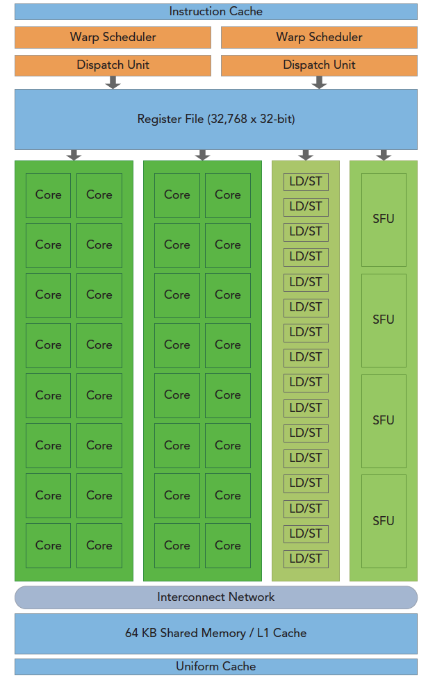

**关键组件**：
    - cuda core
    - shared memory/L1 cache
    - register files
    - 加载/存储单元（load/store unit）
    - 特殊功能单元
    - warp调度器

> SM

GPU中每个SM都能支持数百个线程并发执行，每个GPU通常有多个SM，当一个核函数的网格被启动的时候，多个block会被同时分配给可用的SM上执行。

**注意**：一个block分配给一个SM后即绑定，多个block可被分配到同一个SM上

> 线程束

CUDA 采用单指令多线程SIMT架构管理执行线程，不同设备有不同的线程束大小，但是到目前为止基本所有设备都是维持在32。

对于SM来说，每个时刻都只执行一个线程束warp，warp里的32个线程在同步执行。大部分是同一指令也有分支部分。

同一个block里面的warp切换没有时间消耗。

> SIMD和SIMT区别

- SIMD侧重多数据，指令单一，控制单一（必须都执行相同的），死板。
- SIMT，更加灵活，尽管是相同指令，但有if或者其他的存在可以让其选择不执行，因此是线程级别的并行。
- SIMT中，有的线程就算不执行，也得等其余执行的执行完之后才可以被集体分配任务。
- **SIMT额外要求**：
    - 独立的指令地址计数器pc（因为不是指令集的并行，肯定有branch到指令不一样的地方）
    - 独立的寄存器状态
    - 独立的执行路径

**cuda编程的组件和逻辑**
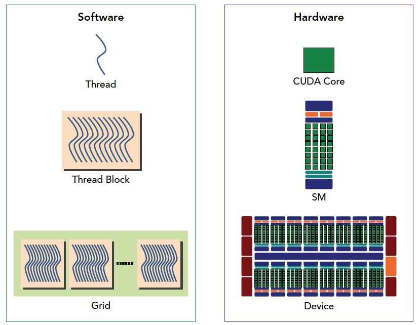

---

### 具体架构

角度：
- 执行单元：加速核心cuda core的构造
- 内存结构
- SM组织和结构
- 设备连接

提升角度：
- 技术突破
- 技术参数的单纯提升

#### Fermi架构

Fermi架构是第一个完整的GPU架构。
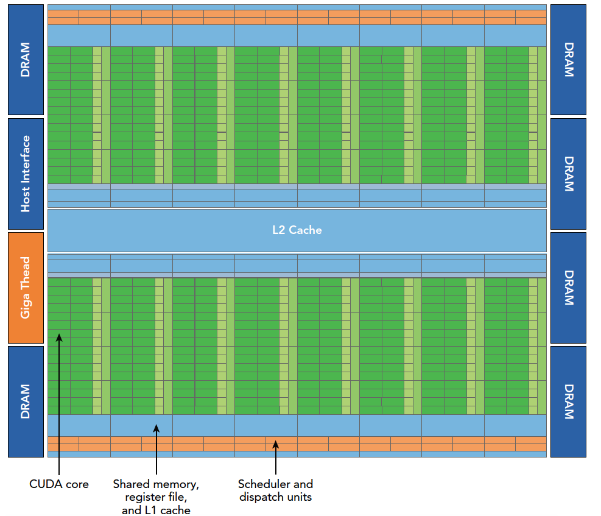

- 执行单元：
    一个全流水线的ALU + 一个FPU（浮点运算单元）+ SFU（特殊功能单元，执行固有指令，比如取平方根）（1个SM里4个）
- 内存结构：
    - 6G的全局内存
    - 768KB的二级缓存
    - register file
- 设备连接：
    - 6个384bits的GDDR5的内存接口
- SM结构
    - 一共16个SM
    - cuda core
    - 调度器相关
        每个SM有两个线程调度器，有两个指令调度单元。
        1. 线程块被指定给1个SM
        2. 划分线程束
        3. 调度器选择两个线程束，并存储两个线程束要执行的指令
        4. 线程束在SM上交替执行
    - 共享内存、寄存器文件、一级缓存
    - 每个SM含16个load/store单元，所以每个时钟周期，最多有半个线程数计算源地址和目的地址
- 特殊：
    支持一些小的内核程序并发执行，充分利用GPU，而不是单纯串行

#### Kepler架构

- 强化SM
    - core的数量
    - SFU的数量
    - LD/ST的数量
- 动态并行
    - 可以内核启动内核，因此可以完成一些简单的递归操作
    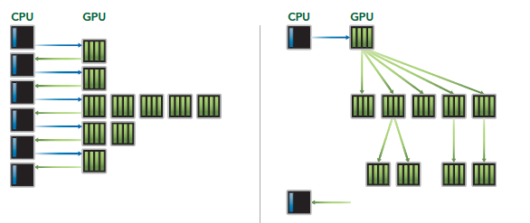
- Hyper-Q技术
    - 强化 CPU 对 GPU 的控制，从而提高 GPU 的利用率和整体系统吞吐量。
    - 硬件的提升，允许多个 CPU 进程或线程同时向单个 GPU 提交工作
    
> Hyper-Q技术（by gemini）

在 Hyper-Q 出现之前，**GPU 只有一个硬件工作队列（例如 Fermi 架构）**。这意味着：

- 瓶颈： 无论有多少CPU核心尝试给GPU派发任务，它们都必须经过这个单一的“入口”，**任务会被串行化**。

- 依赖： 即使不同的任务之间**没有数据依赖关系，它们也必须排队等待，造成了所谓的“假依赖（false dependencies）”。**

- 低利用率： 当单个应用程序或CPU线程提交的任务不足以完全占满GPU资源时，GPU的许多处理单元就会处于空闲状态，导致利用率低下。

Hyper-Q 的核心改进：
- 在GPU硬件中提供多个工作队列（通常是 32 个）来解决了这个问题：

- 多路连接：它允许多达32个不同的CUDA、CPU线程或MPI进程同时与GPU建立连接。

- 并行提交： 每个连接都可以独立地将任务（如CUDA内核启动、内存传输）发送到GPU的独立硬件队列中。

- 消除假依赖： 由于任务被放入不同的队列，GPU调度器可以并行处理它们，消除了任务串行执行的限制。

### 线程束执行的本质以及避免分化

**是CUDA执行模型最核心的部分**

对于硬件来说，**CUDA执行的实质是线程束的执行**，因为硬件根本不知道每个块谁是谁，也不知道先后顺序，硬件(SM)只知道按照机器码跑，而给他什么，先后顺序，这个就是硬件功能设计的直接体现了。

从外表来看，CUDA执行所有的线程，并行的，没有先后次序的，但实际上硬件资源是有限的，不可能同时执行百万个线程，所以从硬件角度来看，物理层面上执行的也只是线程的一部分，而每次执行的这一部分，就是我们前面提到的线程束。

一个Grid被启动的时候，等价于一个内核被启动（因为一个内核对应于自己的网络），grid中包含线程块，线程块被分到某一个SM上之后分为多个线程束，多个线程束再SM上调度执行。

---
重点一：逻辑上的二三维与计算机内存里的一维的转换

如果有(threadidx.x, threadidx.y, threadidx.z)，那么对应得线性地址为：

$$\text{Index}(x, y, z) = x + BlockDim_x \cdot y + Blockdim_x \cdot BlockDim_y \cdot z $$

注意一下，这里需要分为列主序还是行主序，如果是行主序按上面，列主序即z的变化造成的地址变动最小需要倒着写。

---
重点二：一个线程块里包含的线程束计算

需要向上取整：

$$ WarpsPerBlock = ceil(\frac{ThreadsPerBlock}{warpSize}) $$

反应在代码上是：`WarpsPerBlock = (ThreadsPerBlock + warpSize - 1)/warpSize`

---
重点三：线程束的分化

尽管会被分配给相同的指令，处理私有数据，但会不可避免的存在if等branch语句。**每次都会被分配相同的水果，只能选择吃或不吃**。

线程束的分化指：，同一个线程束中的线程，执行不同的指令，比如当一个线程束的32个线程执行这段代码的时候，如果其中16个执行if中的代码段，而另外16个执行else中的代码块。

但是怎么体现在吃还是不吃，因为线程束里都是相同的指令。答案是if的时候，搞了else的线程就是不吃，没法执行，因为con不成立，而到了else的时候，搞if的没法吃，最后if else全部吃完，一起换下一轮。

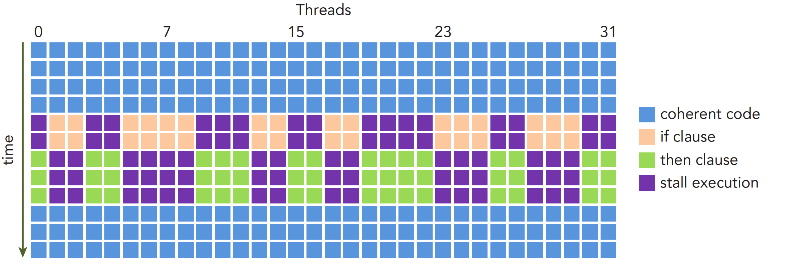

**很显然空了很多，性能下降，所以为了提高性能，必须想尽办法让同一个warp里面不要出现太多的分支，避免分化**。

```
if(tid % 2 == 0)

if((tid / warpsize) % 2 == 0)

bool ipred = (tid % 2 == 0)
if(ipred)
```

（第三个为什么这么写没搞懂， profile搞清楚来对比下这章的代码性能分析）
https://face2ai.com/CUDA-F-3-2-%E7%90%86%E8%A7%A3%E7%BA%BF%E7%A8%8B%E6%9D%9F%E6%89%A7%E8%A1%8C%E7%9A%84%E6%9C%AC%E8%B4%A8-P1/


### 并行性表现

进一步理解线程束在硬件上执行的本质过程，结合上几篇关于执行模型的学习，本文相对简单，通过修改核函数的配置，来观察核函数的执行速度，以及分析硬件利用数据，分析性能，调整核函数配置是CUDA开发人员必须掌握的技能，本篇只研究对核函数的配置是如何影响效率的（也就是通过网格，块的配置来获得不同的执行效率。）

由于原版blog以nvprof作为性能测量，而本文blog还没有学会nsight sys/com的profile方法，所以暂且观察别人分析。

---
案例：简单的矩阵加法（2^12 * 2^12）

- 先做cpu
- block: dim3(2^5, 2^5), grid(二维对二维的划分)
    - 这里需要注意GPU内存计算，矩阵不能放太大

对比性能的话，通过调整block块的大小来查看不同效果

| gridDim | blockDim | time(s) |
|---------|----------|---------|
| 256,256 | 32,32    | 0.008304 |
| 256,512 | 32,16    | 0.008332 |
| 512,256 | 16,32    | 0.008341 |
| 512,512 | 16,16    | 0.008347 |
| 512,1024| 16,8     | 0.008351 |
| 1024,512| 8,16     | 0.008401 |

1. 作者通过查看活跃线程束
    `Achieved Occupancy`：表示活跃的warp数量和GPU同时支持最大的warp数量比例。
    所以理论上可能是这玩意越高越快，但实际上不是
2. 查看内核的内存读取率/吞吐量
    `global load/GLD throughput`：
3. 查看全局加载效率
    `global load effciency`：被请求的全局加载吞吐量占所需的全局加载吞吐量的比值/应用程序的加载利用了设备内存带宽的程度
    这个可能会被CUDA优化。

得出结论：

指标与性能

- 大部分情况，单一指标不能优化出最优性能
- 总体性能直接相关的是内核的代码本质（内核才是关键）
- 指标与性能之间选择平衡点
- 从不同的角度寻求指标平衡，最大化效率
- 网格和块的尺寸为调节性能提供了一个不错的起点

### 归约问题

**即多个数字通过操作变成了一个数字，当有如此特点时候，可以用并行归约方法来处理**，也可以说迭代减少

- 结合性
- 交换性

---
归约问题的具体步骤：

- 数据分块，输入向量划分到更小的数据块里
    可以用一个线程块来处理一个数据块，多个块完成整个数据集的处理
- 用一个线程计算数据和
- 每个数据块的部分和求和（所有线程块得到结果的和，通常在cpu上做）

---
最简单问题：归约法求和

配对方式：有相邻配对，即按照x/2的值；有交错配对，即按照一个小组偏移配对

**因为涉及到判断条件，则一定会产生线程束里的分化问题，以及要注意到线程块之间的同步**

```cpp
__global__ void reduceNeighbored(int * g_idata,int * g_odata,unsigned int n) 
{
	//set thread ID
	unsigned int tid = threadIdx.x;
	//boundary check
	if (tid >= n) return;   // 防止 超总数n
	//convert global data pointer to the 
	int *idata = g_idata + blockIdx.x*blockDim.x;
	//in-place reduction in global memory
	for (int stride = 1; stride < blockDim.x; stride *= 2)
	{
		if ((tid % (2 * stride)) == 0)
		{
			idata[tid] += idata[tid + stride];
		}
		//synchronize within block
		__syncthreads();
	}
	//write result for this block to global mem
	if (tid == 0)
		g_odata[blockIdx.x] = idata[0];

}
```

注意：
- 这里的grid和block都是线性的，所以是一维结构处理一维问题
- 总思路：
    - 分块，然后每个块内的线程是归约，最后用cpu算每个块对应的那个位置的一个数据，所有求和。
    - 这里有个越界问题他没解决，tid + stride那里，因为是数据特殊，block全被填满了，所以才不会发生越界，如果数据特殊又得处理。
    - 换位思考，我作为线程应该干什么：
        - 判断在当前这轮里我是否应该执行加法
        - 我应该加谁？  这里两两相加
        - 每轮同步
    - 第一轮：0，2，4，8，……
    - 第二轮：0，4，
    - 第三轮：0，


---
归约问题的改进：

找出上面程序的问题：

- 空的线程太多了：所有轮加起来里，线程的利用率只有不到1/2，因为warp分支的原因：
    - 第一轮： 1/2没用
    - 第二轮： 3/4没用
    - 第三轮： 7/8没用

```cpp
__global__ void reduceNeighboredLess(int * g_idata,int *g_odata,unsigned int n)
{
	unsigned int tid = threadIdx.x;
	unsigned idx = blockIdx.x*blockDim.x + threadIdx.x;
	// convert global data pointer to the local point of this block
	int *idata = g_idata + blockIdx.x*blockDim.x;
	if (idx > n)
		return;
	//in-place reduction in global memory
	for (int stride = 1; stride < blockDim.x; stride *= 2)
	{
		//convert tid into local array index
		int index = 2 * stride *tid;
		if (index < blockDim.x)
		{
			idata[index] += idata[index + stride];
		}
		__syncthreads();
	}
	//write result for this block to global men
	if (tid == 0)
		g_odata[blockIdx.x] = idata[0];
}
```
**推荐画图的办法，且是线程标号-时间图**，来判断具体线程做了什么：
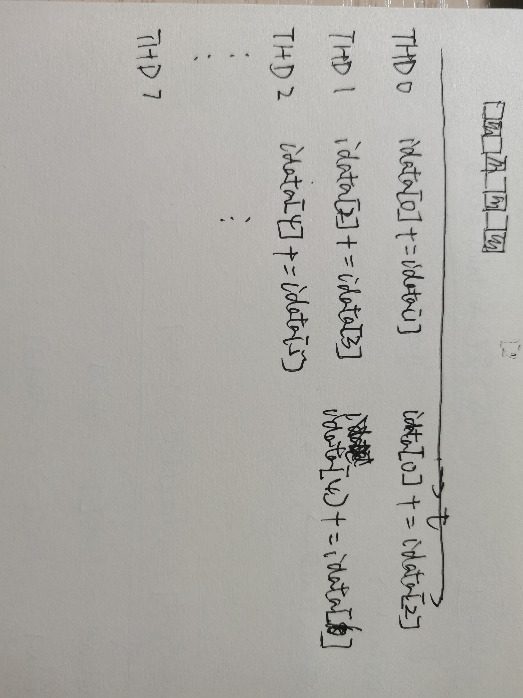

- 改变的只有一句，`index = 2 * stride * tid`
    - 对比`idata[tid] += idata[tid + stride]`，这里是`idata[index] += idata[index +  stride]`
    - block足够大，这里block直接拉满了1024，而warp大小是32，所以有足够多得warp
    - 由上图可知：**实现了线程操作和其所对应tid的解耦**，让前面的每个线程都有事情可以干
    - 但是需要硬件能主动停止基本不用执行的线程束，所以需要让前面的几个线程束尽可能跑满，后半部分线程束基本不需要执行

**可以观察到**，分化程度越高的时候，`inst-per-warp`这个指标会越高

---
如果试试看不用相邻的内存对，而是间隔一定距离，比如长度是8，开始每个4个相加，然后每隔2个相加，递减

自己写尝试：

```cpp
__global__ void reduceNeighMy_Try(int * g_idata,int *g_odata,unsigned int n)
{
	unsigned int tid = threadIdx.x;
	unsigned idx = blockIdx.x*blockDim.x + threadIdx.x;
	// convert global data pointer to the local point of this block
	int *idata = g_idata + blockIdx.x*blockDim.x;
	if (idx > n)
		return;
	//in-place reduction in global memory
	for (int stride = ((n-1)/2+1); stride > 1; stride = ((stride-1)/2 + 1))
	{
		//convert tid into local array index
		
		if (tid < stride)
		{
			idata[tid] += idata[tid + stride]
		}
		__syncthreads();
	}
	//write result for this block to global men
	if (tid == 0)
		g_odata[blockIdx.x] = idata[0];
}
```

对比原版部分：
```cpp
for(int stride = blockDim.x/2; stride > 0; stride >>= 1) {
    if(tid < stride) {
        idata[tid] += idata[tid + stride];
    }
}
```

- 这个写法包括第一部分的写法，能成立的前提都是因为block的大小是2的整数幂，不然直接寄
- 但是我自己的写法似乎能避免这个问题，不过都加速了，还是保持warp的2的幂倍为好，那这自然就是2的整数幂


问题：
博主测试的时候，发现这个写法内存效率是最低的，线程束分化也是最低的，而我们预设的是为了方便内存读取而不是线程束分化，所以是什么影响了？

**按照那篇博主的思路是得看机器码，估计是编译器问题**
[[https://face2ai.com/CUDA-F-3-4-%E9%81%BF%E5%85%8D%E5%88%86%E6%94%AF%E5%88%86%E5%8C%96/]]

### 循环展开

> 什么是分支: 包括if,for等等都是分支,因为都会产生不同的线程不同的执行判断,完成的计算量不同就有人要等

> 循环展开是一个尝试通过减少分支出现的频率和循环维护指令来优化循环的技术,不止并行算法可以展开，传统串行代码展开后效率也能一定程度的提高，因为省去了判断和分支预测失败所带来的迟滞。

传统c++入门循环
```cpp
for(int i = 0;i < 100;i++) {
    a[i] = b[i] + c[i];
}
```

循环展开后:
```cpp
for (int i=0;i<100;i+=4)
{
    a[i+0]=b[i+0]+c[i+0];
    a[i+1]=b[i+1]+c[i+1];
    a[i+2]=b[i+2]+c[i+2];
    a[i+3]=b[i+3]+c[i+3];
}
```

从串行角度来看是减少了条件判断的次数,但是实际上在编译器上跑没啥效果变化,因为编译器自己会主动做

展开循环的目的:
- 减少指令消耗
- 增加更多独立调度的指令

---
以之前的求和归约案例为例:

- 我们希望每个线程块自己求和前,能提前把多个块的数据给收集一下(求个和)

```cpp
__global__ void reduceUnroll2(int * g_idata,int * g_odata,unsigned int n)
{
	//set thread ID
	unsigned int tid = threadIdx.x;
	unsigned int idx = blockDim.x*blockIdx.x*2+threadIdx.x;
	//boundary check
	if (tid >= n) return;
	//convert global data pointer to the
	int *idata = g_idata + blockIdx.x*blockDim.x*2;
	if(idx+blockDim.x<n)
	{
		g_idata[idx]+=g_idata[idx+blockDim.x];

	}
	__syncthreads();
	//in-place reduction in global memory
	for (int stride = blockDim.x/2; stride>0 ; stride >>=1)
	{
		if (tid <stride)
		{
			idata[tid] += idata[tid + stride];
		}
		//synchronize within block
		__syncthreads();
	}
	//write result for this block to global mem
	if (tid == 0)
		g_odata[blockIdx.x] = idata[0];

}
```


- `g_idata[idx] += g_idata[idx + blockDim.x]` 来实现**block外的循环展开**
    - 使用index,实现线程与硬绑定的块解耦,实现多个块的对应操作
    - 如上图所示,既然已经实现了解耦,则block0处理了block0和block1,block1处理了block2和block3,block2处理了block4和block5,以此类推
    - `2 * blockDim.x * blockIdx.x`就是为了做一个偏移
- 实现**block内的归约**,因为还是2的整数幂大小,所以和上集保持不变

---
个人思考,为什么这种归约对加速有效?

**原始版本**,每个block需要,以block0为例:
- 读取block0
- 归约
- 写入结果

内存访问情况: 1024 * n_bock(读取) + n_block次写入的访存 
归约: n_block次归约

**新版**:
- 读取block0
- 读取block1
- 只有一半需要执行归约
- 写入

内存访问情况: 1024 * n_block(读取) + n_block/2次写入访存
归约: n_block/2次归约

内存访问次数明显减少,且减少了工作block导致的减少了更多的调度策略(隐藏延迟)

---
完全展开的归约:

```cpp
__global__ void reduceUnrollWarp8(int * g_idata,int * g_odata,unsigned int n)
{
	//set thread ID
	unsigned int tid = threadIdx.x;
	unsigned int idx = blockDim.x*blockIdx.x*8+threadIdx.x;
	//boundary check
	if (tid >= n) return;
	//convert global data pointer to the
	int *idata = g_idata + blockIdx.x*blockDim.x*8;
	//unrolling 8;
	if(idx+7 * blockDim.x<n)
	{
		int a1=g_idata[idx];
		int a2=g_idata[idx+blockDim.x];
		int a3=g_idata[idx+2*blockDim.x];
		int a4=g_idata[idx+3*blockDim.x];
		int a5=g_idata[idx+4*blockDim.x];
		int a6=g_idata[idx+5*blockDim.x];
		int a7=g_idata[idx+6*blockDim.x];
		int a8=g_idata[idx+7*blockDim.x];
		g_idata[idx]=a1+a2+a3+a4+a5+a6+a7+a8;

	}
	__syncthreads();
	//in-place reduction in global memory
	for (int stride = blockDim.x/2; stride>32; stride >>=1)
	{
		if (tid <stride)
		{
			idata[tid] += idata[tid + stride];
		}
		//synchronize within block
		__syncthreads();
	}
	//write result for this block to global mem
	if(tid<32)
	{
		volatile int *vmem = idata;
		vmem[tid]+=vmem[tid+32];
		vmem[tid]+=vmem[tid+16];
		vmem[tid]+=vmem[tid+8];
		vmem[tid]+=vmem[tid+4];
		vmem[tid]+=vmem[tid+2];
		vmem[tid]+=vmem[tid+1];

	}

	if (tid == 0)
		g_odata[blockIdx.x] = idata[0];

}
```

改动思路:
- 把收集block的范围扩大到8个block
- 归约的最后一步,把剩下的64个用循环展开
    - 即把每个线程应该干的最后5步不拿循环写了

**这里存在一个潜在的同步相关的问题**:即会不会我线程17已经加上线程33写入了内存,然后1号才来加17号结果,就是说17号线程走到了第二步并且提前完成了,1号线程才完成第一步开始做第二部?

- 这个博客上说是因为**同一个warp**,cuda内核做加法是同步执行的,所以这两步这个32以内的线程是同步做的,且每进行一步,后面一半的线程都没有用.
- `volatile int`问题,必须添加`volatile`，防止编译器优化数据传输而打乱执行顺序。
    - 要澄清的是,这里的idata是**全局内存**而不是**共享内存**,因此即使是同一个warp里的不同线程,也会存在可见性的问题,因为可能会暂存到自己线程的独立的缓存中比如寄存器里.
    - 包括编译器的优化也会涉及到缓存和重排读写问题
    - volatile强制让这段步骤变成:
        - 每一步必须严格同步成指令级同步,不存在优化重排
        - 必须强制先访存,再写回内存,而不是暂存在寄存器里,保证强制更新,线程之间能看到更改情况
    - 同时减少了阻塞的使用,因为原来那段归约还多了五次阻塞,但至于效果如果没提升或者差了直接甩锅编译器

---
模板函数的归约

把对64个的展开扩展到1024个,重点均在注释里

```cpp
__global__ void reduceCompleteUnrollWarp8(int * g_idata,int * g_odata,unsigned int n)
{
	//set thread ID
	unsigned int tid = threadIdx.x;
	unsigned int idx = blockDim.x*blockIdx.x*8+threadIdx.x;
	//boundary check
	if (tid >= n) return;
	//convert global data pointer to the
	int *idata = g_idata + blockIdx.x*blockDim.x*8;
	if(idx+7 * blockDim.x<n)
	{
		int a1=g_idata[idx];
		int a2=g_idata[idx+blockDim.x];
		int a3=g_idata[idx+2*blockDim.x];
		int a4=g_idata[idx+3*blockDim.x];
		int a5=g_idata[idx+4*blockDim.x];
		int a6=g_idata[idx+5*blockDim.x];
		int a7=g_idata[idx+6*blockDim.x];
		int a8=g_idata[idx+7*blockDim.x];
		g_idata[idx]=a1+a2+a3+a4+a5+a6+a7+a8;

	}
	__syncthreads();

    //同前部分,直接不考虑
	//in-place reduction in global memory
	if(blockDim.x>=1024 && tid <512)
		idata[tid]+=idata[tid+512];
	__syncthreads();
	if(blockDim.x>=512 && tid <256)
		idata[tid]+=idata[tid+256];
	__syncthreads();
	if(blockDim.x>=256 && tid <128)
		idata[tid]+=idata[tid+128];
	__syncthreads();
	if(blockDim.x>=128 && tid <64)
		idata[tid]+=idata[tid+64];
	__syncthreads();
	//write result for this block to global mem

    //没到warp级别的硬件同步,必须要加同步原语
	if(tid<32)
	{
        //防止编译器优化实现硬件同步
		volatile int *vmem = idata;
		vmem[tid]+=vmem[tid+32];
		vmem[tid]+=vmem[tid+16];
		vmem[tid]+=vmem[tid+8];
		vmem[tid]+=vmem[tid+4];
		vmem[tid]+=vmem[tid+2];
		vmem[tid]+=vmem[tid+1];

	}

	if (tid == 0)
		g_odata[blockIdx.x] = idata[0];

}
```

> 小结优化

| 算法 | 时间 | 加载效率 | 存储效率 |
|------|------|----------|----------|
| 相邻无分化（上一篇） | 0.010491 | 25.01% | 25.00% |
| 相邻分化（上一篇） | 0.005968 | 25.01% | 25.00% |
| 交错（上一篇） | 0.004956 | 98.04% | 97.71% |
| 展开8 | 0.001294 | 99.60% | 99.71% |
| 展开8+最后的展开 | 0.001009 | 99.71% | 99.68% |
| 展开8+完全展开+最后的展开 | 0.001001 | 99.71% | 99.68% |

回忆:
- 第一步，普通的归约，但是大量线程浪费
- 第二步，节约线程版的归约，尽量让前一半的线程一直用，两种，一种是相邻的归约，一种是交错版本的，交错版本的对于内存有着极高的利用率。
    **为什么?**
    - stride大小角度: 
        如果是相邻的归约，会导致stride越来越大，然后内存块访问分布不是很均匀，因为地址是从小到大的
        如果是交错的，就会那种一大一小的均匀访问，放内存块里就比较均匀
- 第三步，开始循环展开
    - 先只是让一个块包含多个块内容提前算了
    - 再把warp里的线程，循环展开，并强制不能编译器优化
    - 再扩展到block里的多个线程，超过warp硬件限制范围外的需要加上强制同步原语，因为是有限的最大大小，所以可以写尽

### 动态并行的概念

直接相关的一个东西:

我们需要能在内核中调用内核，这样实现有层次的复杂内核，问题在于程序太复杂了，不好发挥GPU全部性能。

在这个情景下，只能先澄清一些概念：

子线程由父线程启动的理念,延伸出来：父子网格，子网格被父网格启动，并且必须在父网格结束之前结束。

内存问题：
- 父子网格共享了相同的全局和常量内存
- 父子网格有不同的局部内存
- 有了子网格和父网格间的弱一致性作为保证，父网格和子网格可以对全局内存并发存取。
- 有两个时刻父网格和子网格所见内存一致：子网格启动的时候，子网格结束的时候
- 共享内存和局部内存分别对于线程块和线程来说是私有的
局部内存对线程私有，对外不可见。

（待，还没研究）

## CUDA内存模型

> 想象一个工厂，尽管你把工厂技术、流水线、工人都优化到了很好的地步，结果不小心把工厂开到了珠默朗玛峰只能靠一车一车拉原材料，结果也是一样没效率。

内存的带宽、速度也是影响吞吐量的重要因素。

---
内存层次结构的特点：

- 时间局部性
- 空间局部性

**局部性**：局部性的产生不是因为设备的原因，而是程序与生俱来的特征，然后再根据这个特征去设计满足此特征的硬件结构，即内存模型。

最后，为了追求高效率，程序越来越局部化，设备越来越局部化。

---
CUDA内存模型

分类内存的方法：
- 可编程内存
	- 可以使用代码来控制这组内存的行为
- 不可编程内存
	- 利用规则进行加速，比如一二级缓存

GPU上的内存设备：
- 寄存器
- 共享内存
- 本地内存（读写，局部可见）
- 常量内存（只读，全局可见）
- 纹理内存（只读，全局可见）
- 全局内存（读写，全局可见）

每个都有自己的作用域，生命周期和缓存行为。

- 每个线程都有自己的私有的本地内存
- 线程块有自己的共享内存，并对块内的所有线程可见
- 所有线程都能访问读取常量内存和纹理内存，但是不能写，因为他们是只读的
- 全局内存，常量内存和纹理内存空间有不同的用途
- 全局内存，常量内存和纹理内存有相同的生命周期

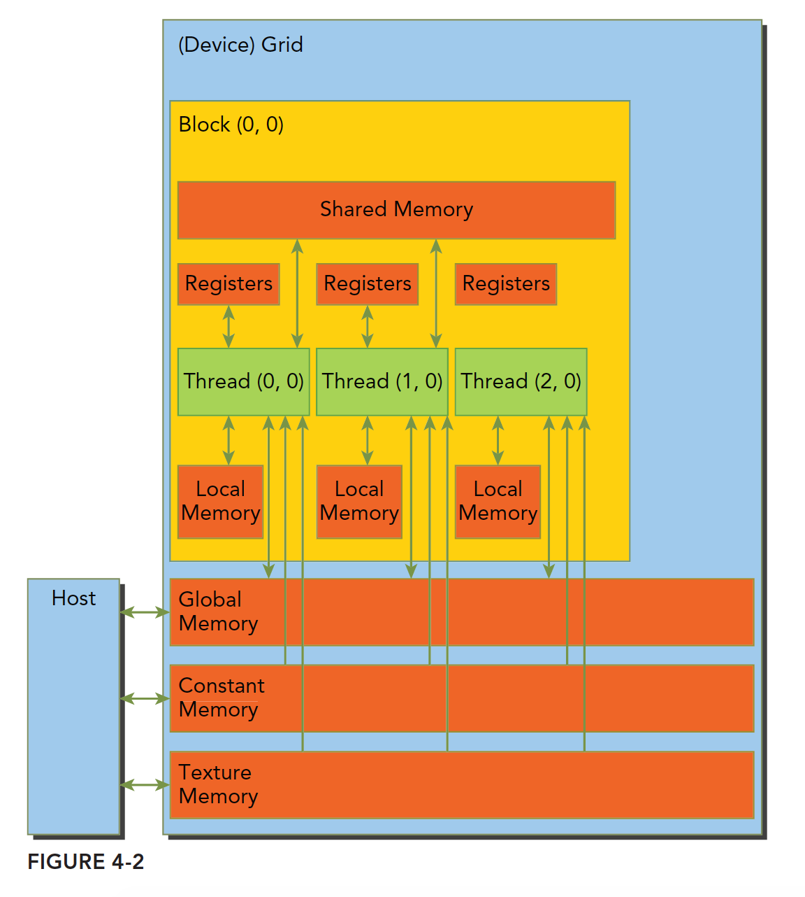

### 具体结构介绍

> 寄存器

1. 线程私有
2. 保存频繁使用的私有变量
3. 核函数内不加修饰的声明的一个变量，存储在寄存器中
4. 数量有限且极少，如果寄存器不够发生溢出，本地内存会帮忙存多余的变量，极大影响效率
5. 生命周期和核函数一致

```cpp
__global__ void __launch_bounds__(maxThreadsPerBlock, minBlocksPerMultiprocessor，maxrregcount=32) kernel(...) {

}
```

`__launch_bounds__(maxThreadsPerBlock, minBlocksPerMultiprocessor，maxrregcount=32)` 核函数额外的配置信息，辅助编译器优化：
- 限制线程块，线程块内包含的最大线程数，线程块由核函数来启动
- 每个SM中预期的最小的常驻内存块参数。注意，对于一定的核函数，优化的启动边界会因为不同的结构而不同
- 核函数里寄存数使用的最大数量
- 还有其他一些限制参数

> 本地内存

核函数中符合存储在寄存器中但不能进入被核函数分配的寄存器空间中的变量将存储在本地内存中，编译器可能存放在本地内存中的变量有以下几种：

- 使用未知索引引用的本地数组
- 可能会占用大量寄存器空间的较大本地数组或者结构体
- 任何不满足核函数寄存器限定条件的变量

**本地内存实质上是和全局内存一样在同一块存储区域当中的，其访问特点——高延迟，低带宽**。

**对于2.0以上的设备，本地内存存储在每个SM的一级缓存，或者设备的二级缓存上**。相当于减少了延迟。

> 共享内存

`__share__`声明

- 每个线程块都有一定数量的共享内存
- 片上内存，速度快很，类似一级缓存
- 在核函数内声明，生命周期和线程块一致，运行开始被分配，线程块运行结束被释放
- 由于所有线程可见，**存在竞争问题**，也可**通过共享内存通信**，为了避免竞争需要同步原语`void __synthreads()`，但频繁使用会影响效率

**注意**：
- 不要过度使用共享内存导致活跃的线程束大幅减少
- 由于共享内存和SM的L1缓存是共享一个片上，所以可以设置内核的共享内存和一级缓存之间的比例

> 常量内存

`__constant__`声明

常量内存有自己的常量缓存，且所有设备都只能声明固定量的常量缓存，并对同一单元的所有核函数可见

Host端可以初始化常量内存
`cudaError_t cudaMemcpyToSymbol(const void* symbol,const void *src,size_t count);`

当线程束中所有线程都从相同的地址取数据时，常量内存表现较好，比如执行某一个多项式计算，系数都存在常量内存里效率会非常高，但是如果不同的线程取不同地址的数据，常量内存就不那么好了，因为常量内存的读取机制是：
**一次读取会广播给所有线程束内的线程。**所以使用这个尽可能要提供多个线程从相同地址取数据的场景。

> 纹理内存

纹理内存驻留在设备内存中，在每个SM的只读缓存中缓存，纹理内存是通过指定的缓存访问的全局内存，只读缓存包括硬件滤波的支持，它可以将浮点插入作为读取过程中的一部分来执行，**纹理内存是对二维空间局部性的优化**。
总的来说纹理内存设计目的应该是**为了GPU本职工作显示设计的**，但是对于**某些特定的程序可能效果更好**，比如需要滤波的程序，可以直接通过硬件完成。

> 全局内存

GPU上最大的内存空间，延迟最高，最常见的内存，可以在主机端（最常见）也可以在设备端代码里定义（加修饰符），只要不销毁，和应用程序同周期。

`__device__`，设备端代码里定义。

上面代码声明的所有GPU上面的内存都是全局内存，即到目前为止还未对内存进行任何优化。

**注意**：
- 有多个核函数同时执行的时候，如果使用到了同一全局变量，应注意内存竞争
- 全局内存访问是对齐，所以当线程束执行内存加载/存储时，需要满足的传输数量通常取决与以下两个因素：
	- 跨线程的内存地址分布
	- 内存事务的对齐方式
	- 即对齐的模式使得在数据传输的时候，大量不需要的数据也会被传输，导致利用率低吞吐率下降

> GPU缓存

GPU缓存不可编程，四种缓存：
- 一级缓存 （SM私有）
- 二级缓存 （SM公用）
- 只读常量缓存
- 只读纹理缓存

- 每个SM都有一个一级缓存，所有SM公用一个二级缓存。
- 一级二级缓存的作用都是被用来存储**本地内存和全局内存**中的数据，也包括寄存器溢出的部分。
- 每个SM有一个只读常量缓存，只读纹理缓存，它们用于设备内存中提高来自于各自内存空间内的读取性能。

Fermi，Kepler以及以后的设备，CUDA允许我们配置读操作的数据是使用一级缓存和二级缓存，还是只使用二级缓存。

**CPU不同的是，CPU读写过程都有可能被缓存，但是GPU写的过程不被缓存，只有加载会被缓存！**

---
> CUDA 修饰符和变量属性

| 修饰符     | 变量名称      | 存储器 | 作用域 | 生命周期   |
|------------|---------------|--------|--------|------------|
|            | float var     | 寄存器 | 线程   | 线程       |
|            | float var[100]| 本地   | 线程   | 线程       |
| __share__  | float var*    | 共享   | 块     | 块         |
| __device__ | float var*    | 全局   | 全局   | 应用程序   |
| __constant__ | float var*  | 常量   | 全局   | 应用程序   |

> CUDA 存储器特性

| 存储器 | 片上/片外 | 缓存          | 存取 | 范围             | 生命周期   |
|--------|-----------|---------------|------|------------------|------------|
| 寄存器 | 片上      | n/a           | R/W  | 一个线程         | 线程       |
| 本地   | 片外      | 1.0以上有     | R/W  | 一个线程         | 线程       |
| 共享   | 片上      | n/a           | R/W  | 块内所有线程     | 块         |
| 全局   | 片外      | 1.0以上有     | R/W  | 所有线程+主机    | 主机配置   |
| 常量   | 片外      | Yes           | R    | 所有线程+主机    | 主机配置   |
| 纹理   | 片外      | Yes           | R    | 所有线程+主机    | 主机配置   |

### 静态全局内存问题

CPU内存有动态分配和静态分配两种类型，位置上动态在堆上分配，静态在栈上分配。

CUDA的动态静态之分，cudaMalloc就是动态分配，现在展示静态分配，与动态分配相同的是也需要显示的将内存copy到设备端

```cpp
#include <cuda_runtime.h>
#include <stdio.h>
__device__ float devData;  //声明一个设备端静态全局变量
// 但是这个只是一个标识符，在核函数中，这个就是一个全局变量，在函数里也是对这个符号进行操作
__global__ void checkGlobalVariable()
{
    printf("Device: The value of the global variable is %f\n",devData);
    devData+=2.0;
}
int main()
{
    float value=3.14f;

    cudaMemcpyToSymbol(devData,&value,sizeof(float));
    printf("Host: copy %f to the global variable\n",value);
    checkGlobalVariable<<<1,1>>>();
    cudaMemcpyFromSymbol(&value,devData,sizeof(float));

	//不能用动态的方式cudaMemcpy给静态

    printf("Host: the value changed by the kernel to %f \n",value);
    cudaDeviceReset();  //清理设备状态
    return EXIT_SUCCESS;
}
```

分析：
- 总思路，演示如何在CUDA中使用设备端全局变量
- 也可以
	- 使用`cudaGetSymbolAddress(&d_ptr, devData)`，获取符号地址
	- 使用`cudaMemcpy(d_ptr,&value,sizeof(float),cudaMemcpyHostToDevice);`

对比动态的声明方式：
```cpp
int main() {
	float *a_dev, *b_dev, *c_dev;
	CHECK(cudaMalloc((float**)&a_dev), nByte);
	CHECK(cudaMalloc((float**)&b_dev), nByte);
	CHECK(cudaMalloc((float**)&c_dev), nByte);

	cudaFree(a_dev);
	cudaFree(b_dev);
	cudaFree(c_dev);
}
```

### 内存管理

要了解的是：

- 分配释放设备内存
- 在主机和设备间传输内存

为达到最优性能，CUDA提供了在主机端准备设备内存的函数，并且显式地向设备传递数据，显式的从设备取回数据。

```cpp
float *devMem = NULL;
cudaError_t cudaMalloc((float**)&devMem, (sizeof(float) * N))
cudaError_t cudaFree(void * devPtr)
```

1. 初始化为Null，避免出现野指针
2. 不能把devMem当作参数传递，必须传递devMem的地址才能给devMem修改成分配的地址
3. 执行失败则返回`cudaErrorMemoryAllocation`
4. **设备的分配和释放非常影响性能，尽量重复利用**

---
> 内存传输

因为是异构计算，所以CPU不能直接读写，主机线程不能访问设备内存，设备线程也不能访问主机内存。

```cpp
cudaError_t cudaMemcpy(void *dst,const void * src,size_t count,enum cudaMemcpyKind kind)
```

四种传输类型：
- `cudaMemcpyHostToHost`
- `cudaMemcpyHostToDevice`
- `cudaMemcpyDeviceToHost`
- `cudaMemcpyDeviceToDevice`

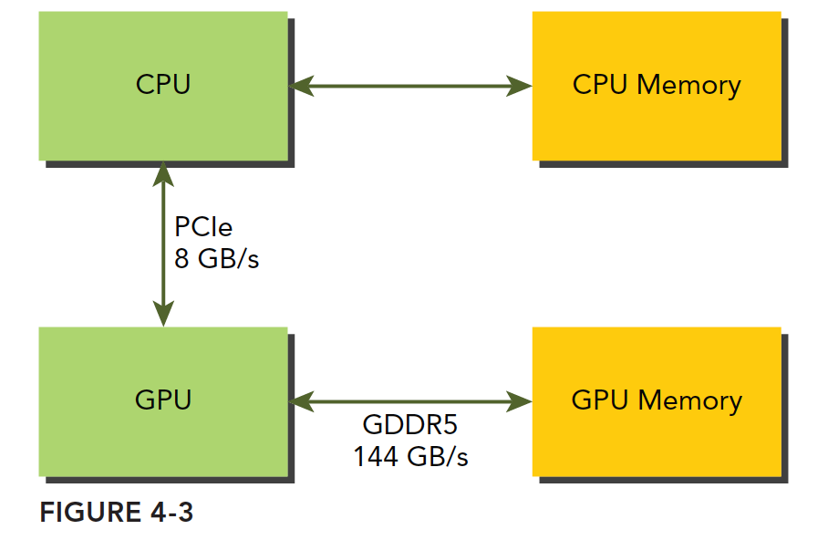

这张图有点旧（是原博主所在的版本），后续更新（待）

这里的意思大致就是**GPU和GPU memory之间的理论峰值带宽非常高，而GPU和CPU的理论峰值带宽就低很多**（当然现在肯定有技术更新），如果管理不当，一直来回内存传输，效率直接全卡在那了。

> 固定内存（pinned memory）

主机内存采用分页式管理，但是电脑又是采用虚页管理的，时常会产生物理页的移动，如果在往GPU上传数据的时候物理页移动了，那会直接完蛋（通常估计是因为牵扯到太多的物理页）

所以，**数据传输前，CUDA驱动会锁定页面，或者直接分配固定的主机内存，将主机源数据复制到固定内存上，然后从固定内存传输数据到设备上**
	- 从可动页转移到不可动页（主机，不管是怎么搞，最终肯定是到了pinned page上）
	- 从不可动页转移到设备

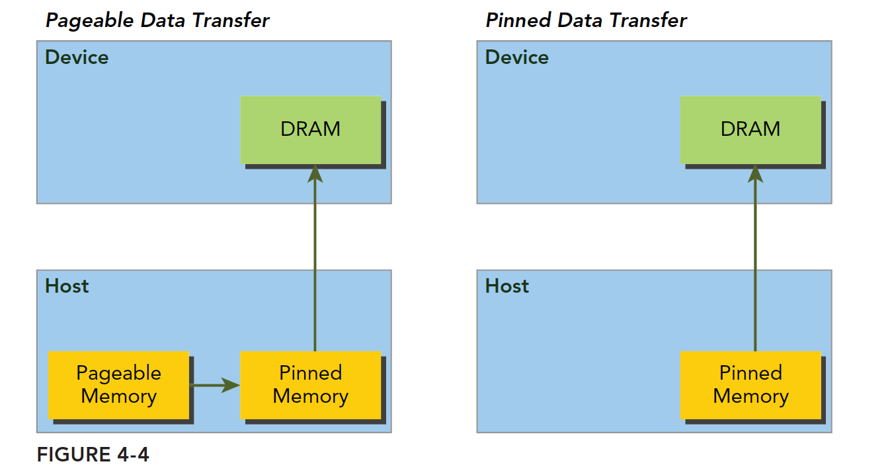

```cpp
cudaError_t cudaMallocHost(void ** devPtr,size_t count)
```

- `cudaMallocHost` 用来分配固定内存，页面锁定，可以直接传输到设备上，带宽更高
- `cudaFreeHost` 释放固定内存
- 其余传输使用的函数和之前一致
- 释放和分配成本肯定更高，好处是大规模数据更快

**固定内存的释放和分配成本比可分页内存要高很多，但是传输速度更快，所以对于大规模数据，固定内存效率更高**。
**尽量使用流来使内存传输和计算之间同时进行，第六章详细介绍这部分**。

> 零拷贝内存

通常情况下，device不能访问host上的内存，但是**GPU线程可以直接访问零拷贝内存**，这部分内存在主机内存里面，CUDA核函数使用零拷贝内存有以下几种情况：

- 当设备内存不足的时候可以利用主机内存
- 避免主机和设备之间的显式内存传输
- 提高PCIe传输率

前面我们讲，注意线程之间的**内存竞争**，因为他们可以同时访问同一个内存地址，**现在设备和主机可以同时访问同一个设备地址**了，所以，我们要注意主机和设备的内存竞争——当使用零拷贝内存的时候。

**零拷贝内存是固定内存，不可分页**。可以通过以下函数创建零拷贝内存：

```cpp
cudaError_t cudaHostAlloc(void ** pHost,size_t count,unsigned int flags)
```

flags标志可选有：
- `cudaHostAllocDefalt`
- `cudaHostAllocPortable`
	返回能被所有cuda上下文使用的固定内存
- `cudaHostAllocWriteCombined`
	返回写结合内存，某些设备上这种内存速度更快
- `cudaHostAllocMapped`
	产生零拷贝内存

此时，因为这是在Host上的内存，而设备还不知道怎么访问，所以需要先获得一个地址帮助其访问：
```cpp
cudaError_t cudaHostGetDevicePointer(void ** pDevice,void * pHost,unsigned flags);
```

pDevice就是设备上访问主机零拷贝内存的指针，flag必须设置为0，具体内容后面有介绍。

**零拷贝内存可以当做比设备主存储器更慢的一个设备**。

频繁的读写，零拷贝内存效率极低，这个非常容易理解，因为每次都要经过PCIe，千军万马堵在独木桥上，速度肯定慢，要是再有人来来回回走，那就更要命了。

> 统一虚拟寻址UVA

设备内存和主机内存被映射到统一的虚拟内存地址中：

- 通过UVA，cudaHostAlloc函数分配的固定主机内存具有相同的主机和设备地址，可以直接将返回的地址传递给核函数。
- 不用使用获得设备上访问零拷贝内存的函数
- 本质是为了零拷贝参数制作之后直接能用

```cpp
{
	float *a_host,*b_host,*res_d;
	CHECK(cudaHostAlloc((float**)&a_host,nByte,cudaHostAllocMapped));
	CHECK(cudaHostAlloc((float**)&b_host,nByte,cudaHostAllocMapped));
	CHECK(cudaMalloc((float**)&res_d,nByte));
	res_from_gpu_h=(float*)malloc(nByte);  // 这个是放回来接受结果的缓冲

	initialData(a_host,nElem);
	initialData(b_host,nElem); //这里就是直接把零拷贝内存的地址直接给他用了

	dim3 block(1024);
	dim3 grid(nElem/block.x);
	sumArraysGPU<<<grid,block>>>(a_host,b_host,res_d);
}
```

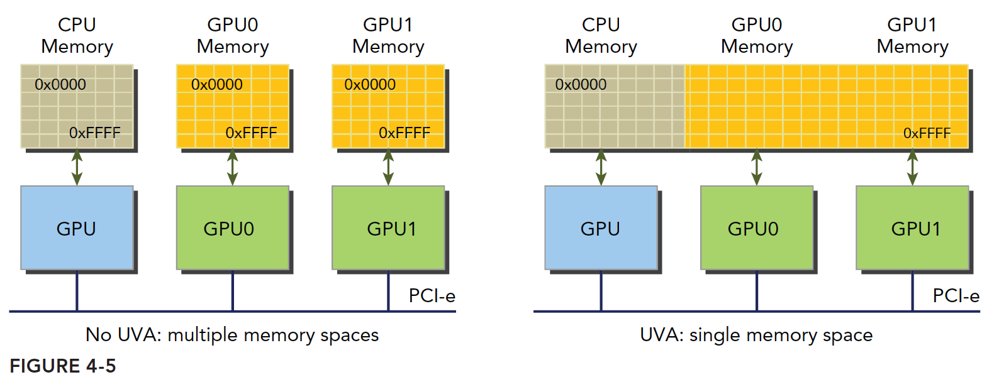

> 统一内存寻址

CUDA6.0，来了一个统一内存寻址，统一内存中创建一个**托管内存池（CPU上有，GPU上也有）**，**内存池中已分配的空间可以通过相同的指针直接被CPU和GPU访问**。

就是搞个内存池，这部分内存用一个指针同时表示主机和设备内存地址

层系统在统一的内存空间中自动的进行设备和主机间的传输。**数据传输对应用是透明的**，大大简化了代码。

托管内存是指底层系统自动分配的统一内存，未托管内存就是我们自己分配的内存，这时候对于核函数，可以传递给他两种类型的内存，已托管和未托管内存，可以同时传递。

**所有托管内存必须在主机代码上动态声明或者全局静态声明**

`__managed__`关键字声明

`cudaError_t cudaMallocManaged(void ** devPtr,size_t size,unsigned int flags=0)` 托管内存分配方式

这里没搞懂（待第二轮补）

**统一内存的基本思路是减少指向同一地址的指针，比如在本地分配内存，要传给设备再从设备传回来，使用之后驱动自动完成**

```cpp
CHECK(cudaMallocManaged((float**)&a_d,nByte));
CHECK(cudaMallocManaged((float**)&b_d,nByte));
CHECK(cudaMallocManaged((float**)&res_d,nByte));
```

使用cudaMallocManaged来分配，表面上看在设备和主机端都能访问，实际上只能当设备访问，如果主机访问会出现页面故障，但这种页面故障会触发设备到CPU的数据传输。


### 内存访问模式

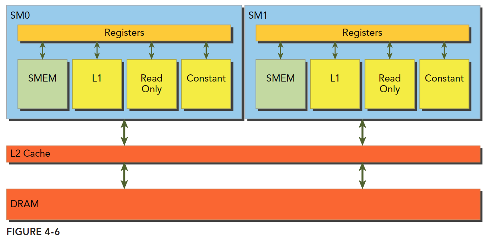

核函数运行时需要从全局内存（DRAM）中读取数据，只有两种**粒度**，这个是关键的：

- 128字节
- 32字节

---
粒度：核函数运行时每次读内存的大小，无论要读多少，都得取这么多字节的整数倍

---

对于CPU来说，一级缓存或者二级缓存是不能被编程的，但是**CUDA是支持通过编译指令停用一级缓存的**。

- 启用一级缓存，那么每次**从DRAM上**加载数据的粒度是128字节(提前把其他局部的取了)
- 不适用一级缓存，只是用二级缓存，那么粒度是32字节（省着点用）

当一个内存事务的**首个访问地址**是缓存粒度（32或128字节）的偶数倍的时候：比如二级缓存32字节的偶数倍64，128字节的偶数倍256的时候，这个时候被称为对齐内存访问，非对齐访问就是除上述的其他情况，非对齐的内存访问会造成带宽浪费。

内存模型的读写：
目前讨论的都是单个SM上的情况，多个SM只是下面我们描述的情形的复制：
- **SM执行的基础是线程束**
- 当一个SM中**正在被执行的某个线程需要访问内存**，那么，**和它同线程束的其他31个线程也要访问内存**
- 表示，即使每个线程只访问一个字节，那么在执行的时候，**只要有内存请求，至少是32个字节**，所以不使用一级缓存的内存加载，一次粒度是32字节而不是更小。

优化内存的时候关注两方面特性：

- 对齐内存访问
	首个访问地址是缓存粒度的**偶数倍时候**，比如64、128，其余都是非对齐访问，会造成带宽浪费
- 合并内存访问
	一个线程束内的线程访问的内存都在一个内存块里，出现合并访问

---
内存事务：核函数发起请求，到硬件响应返回数据作为一个内存事务

最理想化的访问：线程束内所有线程访问的数据都在一个内存块，且数据从内存块的首地址开始被需要，则出现了对其合并访存，效率最高。

**内存事务从内存读取和内存写入角度**

> 全局内存读取/加载

SM加载数据，根据不同设备和类型分成三种路径

- 一级和二级缓存 （编译选项控制） 
	`-Xptxas -dlcm=cg` 禁用 
	`-Xptxas -dlcm=ca` 启用
	- 一级缓存被禁用，对全局加载请求直接进入二级缓存；如果二级缓存缺失，用DRAM完成请求；**同时是否使用一级缓存还决定了粒度**
	- 通常这个内存事务由一两个或者四个部分执行，每个部分都按照粒度来读。
	- 有些设备上的一级缓存也未必用来缓存全局内存访问，也可能只是缓存寄存器溢出的本地数据
- 常量缓存 （代码显示声明）
- 只读缓存 （代码显示声明）

内存加载按照缓存是否使用，可以分为2类：
- 有缓存
- 无缓存

内存加载也有如下特点：
- 缓存（如上）
- 对齐和非对齐，知道有这么个东西，但具体怎么划分的得仔细查，通常是看第一个地址
- 合并与非合并

> 缓存加载过程

有下列各种情况，如果把每个块里能利用多少也考虑进去的话：

1. 完全对齐且合并，利用位置线性，利用率百分百
2. 完全对齐，但利用位置交叉，利用率百分百
3. 连续但非对其，假设跨了两个块，就得需要两个事务
4. 在一个块内，但只用了某个cache行类大小的数据，虽然内存事务只有一次，但因为利用的太低了，导致整体利用率很低
5. 最严重的，各个线程需要访问的都离散在各个块上，那就要极多个内存事务

> 没有缓存的加载

只是不通过一级缓存，二级缓存是必须要通过的

当不通过的时候，内存事务的粒度下降，能提高利用率，所以对于非对齐且不太连续的时候，启用没有缓存的加载是是十分必要的

案例使用的是最简单加法案例，但是重点是编译指令：

`nvcc -O3 -arch=sm_35 -Xptxas -dlcm=cg -I ../include/ sum_array_offset.cu -o sum_array_offset`

- `-03` 是指优化级别设置，侵略性的优化：比如循环展开、死代码消除、内联
- `-arch=sm_35` 指定目标GPU架构，sm_35对应Kepler架构
- `-Xptxas` PTX汇编器/优化器选项，用于将后续参数直接传给PTX优化器和汇编器
- `dlcm=cg` 控制局部内存的缓存策略，cg禁用ca启用

然后原作者通过观察 GLobal Memory Load Efficiency来看全局内存加载效率

$ 全局加载效率 = \frac{请求的全局内存加载吞吐量}{所需的全局内存加载吞吐量} $

也就是不考虑实现和考虑了实现的内存加载吞吐量的比

> 只读缓存

以前只是留给纹理内存加载用的，现在可以通过只读缓存从全局内存中读数据

- 使用函数`_ldg`
	`out[idx] = _ldg(&in[idx])`
- 在间接引用的指针上使用修饰符

> 全局内存写入

GPU上内存写入和读取完全不同，且写入更加简单，因为始终不经过一级缓存，至于粒度问题、对齐问题上都和读取一致

> 结构体数组和数组结构体（SoA和AoS）

结构体数组，结构体中的成员是数组；数组结构体，由结构体组成的数组

因为CUDA对细粒度非常友好，对于粗粒度和结构体就十分不友好，因为内存访问利用率太低了（比如一个线程要访问结构体的某个成员的时候，但是也看案例）

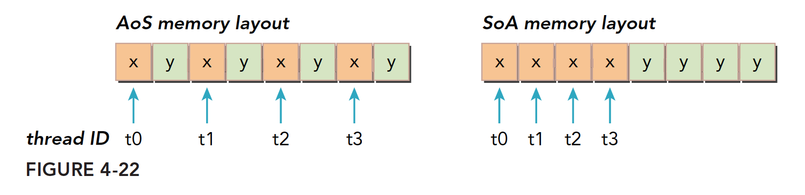

**我们倾向于认为，在并行编程范式里，单指令多数据对SoA友好，这种内存可以有效合并**

具体问题具体分析

> 性能

- **对齐合并内存访问，以减少带宽的浪费**
- **足够的并发内存操作，以隐藏内存延迟（latency hiding）**
	这里说的是要有足够多的活跃线程束
	因为在内存请求阶段，线程束一定是被stalled，所以想要进行内存延迟的隐藏，SM上的活跃线程束的数量一定要大于内存访问延迟的周期/切换线程束需要的周期
	或许也可以理解为一次内存操作让更多的线程做更多的事

$ N_{active-warps} >= \frac{T_{latency}}{T_{execution-time-per-warp}} $

从这个让一次内存操作让更多的线程做更多的事的角度
- 线程做更多的事
	循环展开，合并多个块
- 增大并行性
	调整块大小

**附：GPU更新换代快，掌握基本思想然后要学会不停更新的技术**

### 核函数可达到的带宽

> 原博主的经典形象例子粗糙描述GPU的工作过程

一条大路（**内存读取总线**）连接了工厂生产车间（**GPU**）和材料仓库（**全局内存**），生产车间又有很多的工作小组（**SM**），材料仓库有很多小库房（**内存分块**），工作小组同时生产相同的产品互不干扰（**并行**）.
我们有车从材料仓库开往工厂车间，什么时候发车，运输什么由工作小组远程电话指挥（**内存请求**），发车前，从材料仓库装货的时候，还要听从仓库管理员的分配，因为可能同一间库房可能只允许一个车来拿材料（**内存块访问阻塞**），然后这些车单向的开往工厂，这时候就是交通问题了，如果我们的路是单向（**从仓库到工厂**）8车道，每秒钟能通过16辆车，那么我们把这个指标称为带宽。当然我们还有一条路是将成品运输到成品仓库，这也是一条路，与原料库互不干扰，和材料仓库到工厂的路一样，也有宽度，也是单向的，如果这条路堵住，和仓库到工厂的路堵住一样，此时工厂要停工等待。
最理想的状态是，路上全是车，并且全都高速行驶，工厂里的所有工人都在满负荷工作，没有等待，这就是优化的最终目标，如果这个目标达到了，还想进一步提高效率，那么你就只能优化你的工艺了（**算法**）

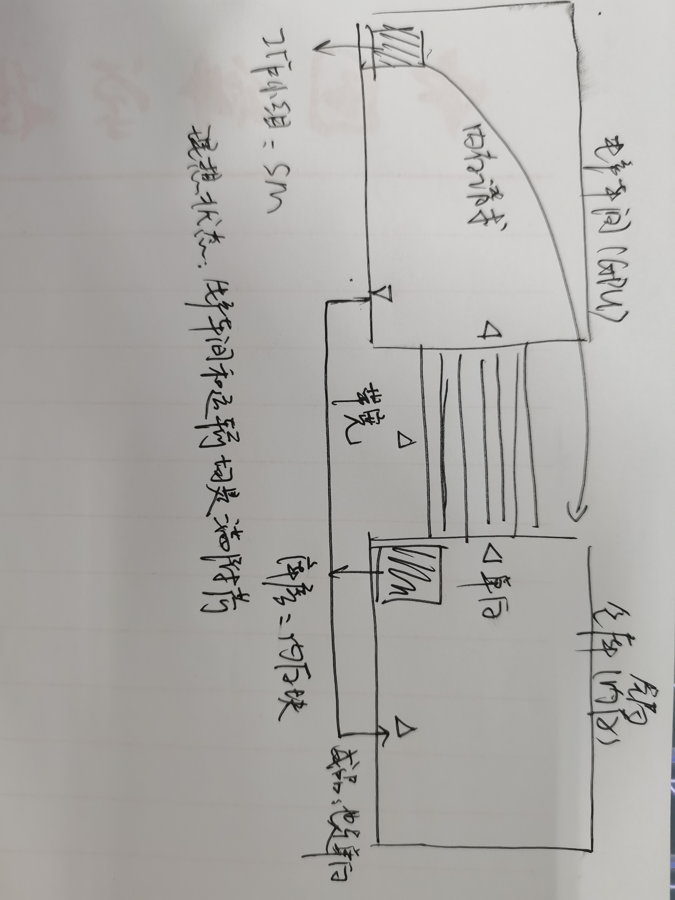

> 相关词汇

**内存延迟**：发起内存请求到数据进入SM寄存器的整个时间
**内存带宽**：SM的访存速度，单位时间内传输的字节数

通过最大化工作线程束的数量，维持更多正在执行的内存访问和对对齐合并访问提高带宽效率的方法，在算法本身过烂的情况下，带来的改善基本没啥用。

理论带宽和有效带宽：
	一个是硬件峰值，一个核函数实际测量达到的。

带宽和吞吐率：
	吞吐量通常拿来衡量核心计算效率，有效吞吐量不止和有效带宽有关，还和带宽利用率等因素相关，最主要的是运算核心的能力
	也有内存吞吐量，指单位时间内存访问的总量，但是读到的不一定是有用的

---
矩阵转置问题

**首先是串行思路:**
这里我逻辑始终不是很清楚，正在写测试程序跑一下：
	问题出在我对偏移太想当然了，顺带着纠正一下因为被大学带偏了多少年的矩阵问题

- 首先是行列问题，不过也可以说是顺序问题，以及可以说是自己手写时候的习惯问题，一般来说先行后列，也就是先x后y，但不知道为什么我每次会把列当行，把上面的当x轴，反正别学我
- 行优先还是列优先（一维下），一般默认是行优先：
	- 行优先：（正着）
		`i * ny + j`，因为要乘上剩余维度的总和，反应在二维下就是ny，列优先就是nx
		n维就是：`i0 * (d1*d2*...d(n-1)) + i1 *(d2*...d(n-1)) + ... i(n-1)`
	- 列优先：（倒着）,跟上面n维的倒着写
		`j * nx + i`
- 循环怎么写其实不是很重要，但是在打印的时候脑子要清楚，越里面的循环越是第一层


---
**补丁**：
线程的组织模型：

	唯一的要点就是，threadIdx中x的变化导致的距离变化是最小的，因此也是最快的，对于blockIdx也是同理。

	也因此不管你自己坐标怎么用，唯一要记住的就是，x是最快的，切最近的，相比之下我的写法应该算是倒着写就行了，然后观察别人写法牢记这一点就行了，默认的行主序就是坐标往x最快的先变，列主序就是最慢的先变。

	什么是快？快就是费劲心思搞出相邻线程也就是线程束里的访存地址也在附近，而这种相邻是用距离衡量的，也就是threadIdx里的变化，如果是三维的，就会默认x先变化的是距离最近的，也最有可能在线程束里然后访存一个warp里的合并

	其二要注意，线程第i个thread拿第i个数据，然后gpu会自动把一个warp内的合并

---

```cpp
void transormMatrix2D_CPU(float *MatA, float *MatB,int nx,int ny) {
	for(int j = 0; j < ny; j++) {
		for(int i = 0; i < nx; i++) {
			MatB[i*ny + j] = MatA[j*nx + i];
		}
	}
}
```


在修改成并行程序前，必须要注意所有的数据，结构体也好，数组也好，多维数组也好，所有的数据，在内存硬件层面都是一维排布的，所以这里也是使用一维的数组作为输入输出，那么从真实的角度看内存中的数据就是下面这样的：

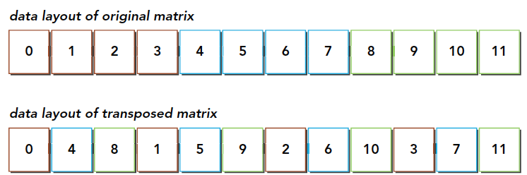

提取内存特征：
- 读：原矩阵行进行读取，请求的内存是连续的，可以进行合并访问
- 写：写到转置矩阵的列中，访问是交叉的

提出以下问题：

- 交叉是否能够避免？
	至少在矩阵转置的场景下，基本没法避免交叉
- 是交叉读有效率还是交叉写有效率？
	如果是交叉写：
	说明读的时候是按合并读取，按道理说或许应该有效率，但其实不是，因为忽略了L1缓存的缓存作用。
	交叉读：
	越往后数据越来越在缓存中，加上是合并写，所以更快
- 问题是缓存大小的问题

```cpp
__global__ void copyRow(float * MatA,float * MatB,int nx,int ny)
{
    int ix=threadIdx.x+blockDim.x*blockIdx.x;
    int iy=threadIdx.y+blockDim.y*blockIdx.y;
    int idx=ix+iy*nx;
    if (ix<nx && iy<ny)
    {
      MatB[idx]=MatA[idx];
    }
}

__global__ void copyCol(float * MatA,float * MatB,int nx,int ny)
{
    int ix=threadIdx.x+blockDim.x*blockIdx.x;
    int iy=threadIdx.y+blockDim.y*blockIdx.y;
    int idx=ix*ny+iy;
    if (ix<nx && iy<ny)
    {
      MatB[idx]=MatA[idx];
    }
}

```

这里之前有疑虑是因为补丁2的漏了，Idx的x是最接近的，也就是行主序的行里看作，所以CopyRow的idx里ix变化最小，也就是copy行；而在CopyCol里x部分是变化最大的，也就是按列取。


---
代码部分

```cpp
void transformMatrix2D_CPU(float * MatA,float * MatB,int nx,int ny)
{
  for(int j=0;j<ny;j++)
  {
    for(int i=0;i<nx;i++)
    {
      MatB[i*ny+j]=MatA[j*nx+i];
    }
  }
}
__global__ void copyRow(float * MatA,float * MatB,int nx,int ny)
{
    int ix=threadIdx.x+blockDim.x*blockIdx.x;
    int iy=threadIdx.y+blockDim.y*blockIdx.y;
    int idx=ix+iy*nx;
    if (ix<nx && iy<ny)
    {
      MatB[idx]=MatA[idx];
    }
}
__global__ void copyCol(float * MatA,float * MatB,int nx,int ny)
{
    int ix=threadIdx.x+blockDim.x*blockIdx.x;
    int iy=threadIdx.y+blockDim.y*blockIdx.y;
    int idx=ix*ny+iy;
    if (ix<nx && iy<ny)
    {
      MatB[idx]=MatA[idx];
    }
}
```

上面的代码前面已经解释。


```cpp
__global__ void transformNaiveRow(float * MatA,float * MatB,int nx,int ny)
{
    int ix=threadIdx.x+blockDim.x*blockIdx.x;
    int iy=threadIdx.y+blockDim.y*blockIdx.y;
    int idx_row=ix+iy*nx;
    int idx_col=ix*ny+iy;
    if (ix<nx && iy<ny)
    {
      MatB[idx_col]=MatA[idx_row];
    }
}

__global__ void transformNaiveCol(float * MatA,float * MatB,int nx,int ny)
{
    int ix=threadIdx.x+blockDim.x*blockIdx.x;
    int iy=threadIdx.y+blockDim.y*blockIdx.y;
    int idx_row=ix+iy*nx;
    int idx_col=ix*ny+iy;
    if (ix<nx && iy<ny)
    {
      MatB[idx_row]=MatA[idx_col];
    }
}

// 如何读是访存方式，也就是MatA的编号选取是讲究，而MatB的编号只是根据A计算的结果

__global__ void transformNaiveRowUnroll(float * MatA,float * MatB,int nx,int ny)
{
    int ix=threadIdx.x+blockDim.x*blockIdx.x*4;
    int iy=threadIdx.y+blockDim.y*blockIdx.y;
    int idx_row=ix+iy*nx;
    int idx_col=ix*ny+iy;
    if (ix<nx && iy<ny)
    {
      MatB[idx_col]=MatA[idx_row];
      MatB[idx_col+ny*1*blockDim.x]=MatA[idx_row+1*blockDim.x];
      MatB[idx_col+ny*2*blockDim.x]=MatA[idx_row+2*blockDim.x];
      MatB[idx_col+ny*3*blockDim.x]=MatA[idx_row+3*blockDim.x];
    }
}
__global__ void transformNaiveColUnroll(float * MatA,float * MatB,int nx,int ny)
{
    int ix=threadIdx.x+blockDim.x*blockIdx.x*4;
    int iy=threadIdx.y+blockDim.y*blockIdx.y;
    int idx_row=ix+iy*nx;
    int idx_col=ix*ny+iy;
    if (ix<nx && iy<ny)
    {
        MatB[idx_row]=MatA[idx_col];
        MatB[idx_row+1*blockDim.x]=MatA[idx_col+ny*1*blockDim.x];
        MatB[idx_row+2*blockDim.x]=MatA[idx_col+ny*2*blockDim.x];
        MatB[idx_row+3*blockDim.x]=MatA[idx_col+ny*3*blockDim.x];
    }
}

//循环展开的写法，但是重点还是这种循环展开都是针对blockx方向变得最快得写法

__global__ void transformNaiveRowDiagonal(float * MatA,float * MatB,int nx,int ny)
{
    int block_y=blockIdx.x;
    int block_x=(blockIdx.x+blockIdx.y)%gridDim.x;
    int ix=threadIdx.x+blockDim.x*block_x;
    int iy=threadIdx.y+blockDim.y*block_y;
    int idx_row=ix+iy*nx;
    int idx_col=ix*ny+iy;
    if (ix<nx && iy<ny)
    {
      MatB[idx_col]=MatA[idx_row];
    }
}
__global__ void transformNaiveColDiagonal(float * MatA,float * MatB,int nx,int ny)
{
    int block_y=blockIdx.x;
    int block_x=(blockIdx.x+blockIdx.y)%gridDim.x;
    int ix=threadIdx.x+blockDim.x*block_x;
    int iy=threadIdx.y+blockDim.y*block_y;
    int idx_row=ix+iy*nx;
    int idx_col=ix*ny+iy;
    if (ix<nx && iy<ny)
    {
      MatB[idx_row]=MatA[idx_col];
    }
}
```

> 一个奇怪新技巧

DRAM特性，内存是分区规划的，如果过度的访问某一个区，会造成排队现象，然后等待，所以最好错开同一个分区的访问，所以用了一个打乱坐标系的f(x,y)对block的id来修改对应，为什么是block？因为block被分配到了SM上，SM里要始终保持ix和iy的这种行还是列的访问，但block不需要，block只需要让访问相邻存储的不要过于接近就行。

## 共享内存和常量内存部分

了解部分：

- 数据在共享内存中的存储结构
- 二维共享内存到线性全局内存的索引转换
- 解决不同访问模式中的存储体中的冲突
- 在共享内存中缓存数据以减少对全局内存的访问
- 使用共享内存避免非合并全局内存的访问
- 常量缓存和只读缓存之间的差异
- 线程束洗牌指令编程

之前的都是对全局内存的使用，非合并内存访问在实际应用中无法避免，这时候使用共享缓存是提高效率的关键。

### 共享内存概述

GPU内存物理上的划分：板载内存和片上内存

共享内存是片上的内存，延迟低带宽高，且**可被代码控制**

- 用作块内线程通信
- 全局内存数据的可编程管理的缓存
- 告诉暂存存储器，用于转换数据来优化全局内存访问模式

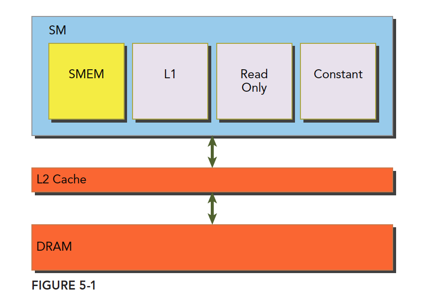

继续上老图

其中片上有SMEM共享缓存、L1缓存、只读缓存、常量缓存，且从Dram全局内存中过来的数据都要经过L2缓存

---
**性质**：

生命周期(**等同于线程块**)：
	- 所属线程块被执行时建立，执行完毕后释放，等同于线程块的生命周期

读取性质：
	- 当前线程束内的每个线程都访问一个不冲突的共享访存，互不干扰，一个事务完成对整个线程束的访问
	- 有冲突，可能或许需要32个事务，应为一个线程束32个线程
	- 同时访问同一个地址，则一个线程访问完后以广播的形式告诉其余的

**重点：如何避免访问冲突，高效使用共享内存**

> 使用

---
具体使用：

分配和定义共享内存的方法有多种，动态的声明，静态的声明都是可以的。可以在核函数内，也可以在核函数外（也就是本地的和全局的，这里是说变量的作用域，在一个文件中）

CUDA支持1，2，3维的共享内存声明，当然多了不知道支不支持，可能新版本支持，但是要去查查手册，一般情况下我们就假装最多只有三维。

**声明**：

1. `__shared__ float a[size_x][size_y];`

注意，这里size都必须在编译时就该确定的数字，不能是变量，高维的都这么干

2. 想动态声明时候，需要使用extern关键字，并在核函数启动时添加第三个参数，其中isize就是共享内存要存储的数组大小，但**动态声明只支持一维数组**

```cpp
extern __shared__ int tile[];
kernel<<<grid, block, isize*sizeof(int)>>>(...)
```

> 共享内存存储体和访问模式

---

全局内存里，带宽和延迟对核函数造成性能影响，共享内存是用来隐藏全局内存延迟以及提高带宽性能的主要武器之一。

掌握武器的办法就是了解武器的工作原理和各个部件的特性。

> 内存存储体特征

1. 是一个一维的地址空间，而二维或者更多维都得转换成一维才能对应物理上的内存地址

2. 分为32个同样大小的内存模型，可以同时访问，叫做存储体，对应线程束里的32个线程
	这样如果访问不同存储体（无冲突），一个事务就能完成，有冲突就要多个内存事务

> 存储体冲突

什么时候发生冲突？

多个线程访问同一个存储体，**注意是同一个存储体而不是同一个地址**，访问同一个地址只是广播，如果发生冲突就会严重影响效率

所以产生了以下3种经典模式：

- 并行访问，多地址访问多存储体
- 串行访问，多地址访问同一个存储体不同地址（最糟糕的模式）
- 广播访问，单一地址读取（带宽利用率差，而且相比第一个，还多了广播的步骤）

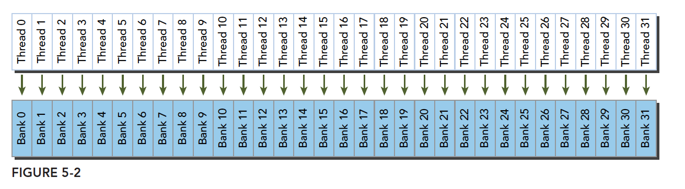

最优访问模式

![]](./GPU学习/image18.png)

不规则的访问模式，只是并行，但不冲突

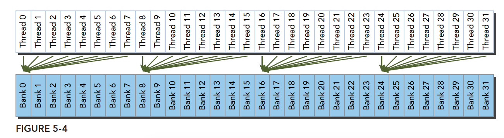

因为这上面都是存储体，所以看是否是对同一地址的访问

> 访问模式

**共享内存的存储体和地址有什么关系？以及如何决定访问模式？**

**内存存储体的宽度随设备计算能力不同而变化**

旧版的：2.x计算能力的设备，为4B；3.x计算能力的设备，为8B

现在版本的只能去查手册

---
宽度：
把字节看作西瓜，存储体看作水桶，每个水桶能一次性拿出多少个瓜就是宽度。

然后给西瓜编号（字节地址），摆成一排开始装，一次只能装四个西瓜（取决于宽度）

方法是按照低址来放：
	也就是从0开始，一直到n然后我们有三十二个编了号的桶（0~31号，因为是假设32个存储体），摆成一排，然后往桶里同时装西瓜，因为一次只能装四个西瓜，那么我们把0~3号西瓜装到0号桶，4~7号习惯装入1号桶，以此类推，当装到第31号桶的时候，我们装 124~127号西瓜；然后我们每个桶里都有四个西瓜了，接着我们将128~131号西瓜装入0号桶，开始下一轮装西瓜。

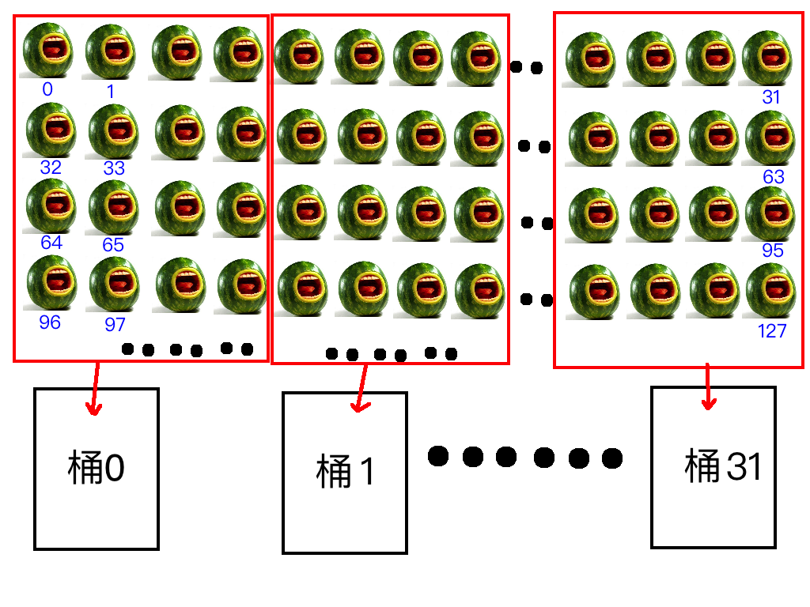

如何根据西瓜的编号（地址）知道在哪个桶（存储体）里？

$ 存储体索引 = (字节地址 \div 4 ) \% 存储体数 $

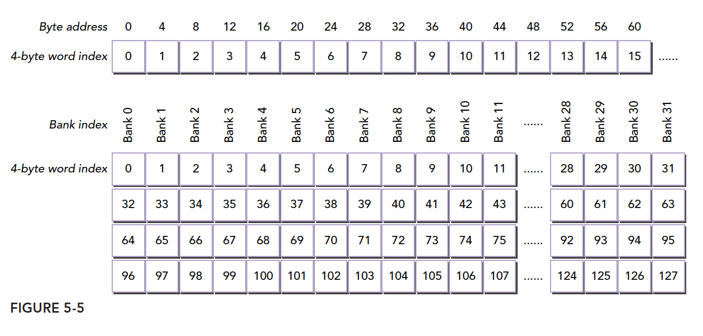

存储体是4B宽度的情况如上，以及实际上，每一个bank存储体里面都是一维放的，而不是二维

当存储体是8B宽度时候如下：

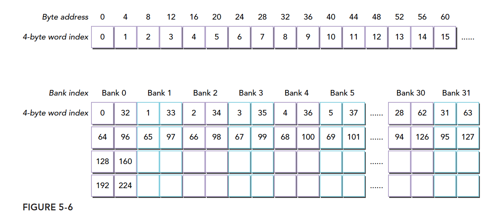

这里注意一下，并不是0和1都在Bank0里面，反而4B是一个单元，0和32在Bank0里，这样如果都访存到这里，左边的西瓜和右边的西瓜的不同线程访问并不会造成冲突，如果都和左边的一桶西瓜有关才要等待。如果是同一个西瓜只是广播而已。

**注意，这个情境下，8B的宽度但单位还是4B的一条，这一条里的如果不同线程的同时访问就是冲突**

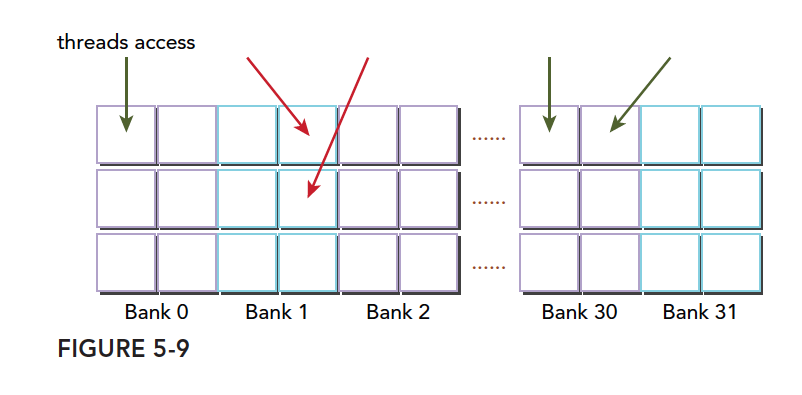

---
> 内存填充

存储体冲突会严重影响共享内存的效率，遇到严重冲突的情况下，可以使用填充的办法**让数据错位，来降低冲突**。


**首先假设当前情景下一共四个存储体（实际32）**：

当我们的线程束访问bank0中的不同数据的时候就会发生一个5线程的冲突，这时候我们假如我们分配内存时候的声明是：

`__shared__ int a[5][4];`

如果我们多开成：

`__shared__ int a[5][5];`

就会凭空多出一列需要填进存储体内的，但因为只有四个存储体，所以会演变成一种错位：

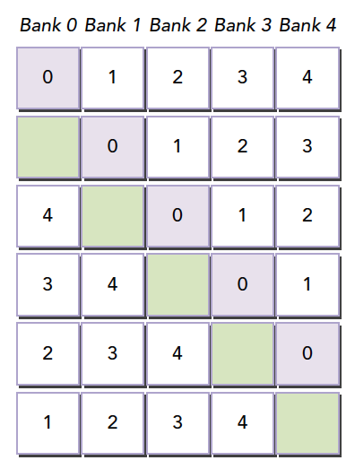

这样如果出现上面的访问情况就会正好错开存储体。

共享内存在确定大小的时候，比如编译的时候，就已经被确定好每个地址在哪个存储体中了，想要改变分布，就在声明共享内存的时候调整就行，跟将要存储到共享内存中的数据没有关系。

**注意：共享内存声明时，就决定了每个地址所在的存储体，想要调整每个地址对应的存储体，就要扩大声明的共享内存的大小，至于扩大多少，就要根据我们前面的公式好好计算了。**

> 访问模式配置

`cudaError_t cudaDeviceGetSharedMemConfig(cudaSharedMemConfig * pConfig);`

- `cudaSharedMemBankSizeFourByte`
- `cudaSharedMemBankEightByte`

`cudaError_t cudaDeviceSetShareMemConfig(cudaSharedMemConfig config);`

config可以是：

- `cudaSharedMemBankSizeDefault`
- `cudaSharedMemBankSizeFourByte`
- `cudaSharedMemBankSizeEightByte`

> 配置共享内存

**每个SM上有64KB的片上内存，共享内存和L1共享这64KB，并且可以配置**：

- 按设备配置
- 按核函数配置

```cpp
cudaError_t cudaDeviceSetCacheConfig(cudaFuncCache cacheConfig);
//配置函数

cudaFuncCachePreferNone: no preference(default)
cudaFuncCachePreferShared: prefer 48KB shared memory and 16 KB L1 cache
cudaFuncCachePreferL1: prefer 48KB L1 cache and 16 KB shared memory
cudaFuncCachePreferEqual: prefer 32KB L1 cache and 32 KB shared memory
//配置参数

cudaError_t cudaFuncSetCacheConfig(const void* func,enum cudaFuncCacheca cheConfig);

```

**如果共享内存使用较多，那么更多的共享内存更好；如果更多的寄存器使用，L1更多更好。**

**一级缓存和共享内存都在同一个片上，但是行为大不相同，共享内存靠的的是存储体来管理数据，而L1则是通过缓存行进行访问。我们对共享内存有绝对的控制权，但是L1的删除工作是硬件完成的。**

**GPU缓存比CPU的更难理解，GPU使用启发式算法删除数据，由于GPU使用缓存的线程更多，所以数据删除更频繁而且不可预知。共享内存则可以很好的被控制，减少不必要的误删造成的低效，保证SM的局部性。**

### 同步

并行的重要机制，防止冲突，因为共享内存对并行和冲突的要求比较高，单拉出一节。

基本方法：

- 障碍
	所有调用线程等待其余调用线程达到障碍点
	只有核函数能调用，且只对同一线程块内线程有效
```cpp
void __synthreads();

if (threadID % 2 == 0) {
    __syncthreads();
} else {
    __syncthreads();
}
//会导致死锁的写法，因为总有障碍点没到，if else里总有一个永远没法抵达
```
1. __syncthreads()作为一个障碍点，他保证在**同一线程块内所有线程没到达此障碍点时，不能继续向下执行**。
2. 同一线程块内此障碍点之前的所有全局内存，共享内存操作，对后面的线程都是可见的。
3. 解决同一线程块内，内存竞争的问题，同步，保证先后顺序，不会混乱。
4. 避免死锁情况，即存在障碍点永远不能抵达，通常在分支里藏着。
5. 只能解决一个块内的线程同步，想做块之间的，只能通过核函数的执行和结束来进行块之间的同步（把要同步的地方作为核函数的结束，来隐式的同步线程块）。

- 内存栅栏
	内存栅栏，所有调用线程必须等到全部内存修改对其余线程可见时才继续进行。

	保证栅栏前的内核内存写操作对栅栏后的其他线程都是可见的，也就是保证对内存的修改一定完成。

	三种栅栏：块，网格，系统

```cpp
//线程块内
void  __threadfence_block();

//网格级
void __threadfence();

//跨系统，包括主机和设备
void __threadfence_system();

```

- `Volatile`修饰符

	声明一个变量，防止编译器优化，防止这个变量放入缓存，因此始终在全局内存里面，永远不会造成内存缓存不一致。

> 弱排序内存模型

CUDA采用宽松的内存模型，也就是内存访问不一定按照他们在程序中出现的位置进行的。宽松的内存模型，导致了更激进的编译器。

GPU线程在不同的内存，比如SMEM，全局内存，锁页内存或对等设备内存中，写入数据的顺序是不一定和这些数据在源代码中访问的顺序相同，当一个线程的写入顺序对其他线程可见的时候，他可能和写操作被执行的实际顺序不一致。

指令之间相互独立，线程从不同内存中读取数据的顺序和读指令在程序中的顺序不一定相同。

换句话说，**核函数内连续两个内存访问指令，如果独立，其不一定哪个先被执行**。在这种混乱的情况下，为了可控，必须使用同步技术。

### 共享内存的数据布局

**主要研究上一篇中的放西瓜，取西瓜，以及放冬瓜等的一些列操作对性能的影响，以及如何才能使效率最大化。**

---
主题：

- 方阵与矩阵数组
- 行主序与列主序
- 静态与动态共享内存的声明
- 文件范围与内核范围的共享内存
- 内存填充与无内存填充

两个概念：
- 跨存储体映射数据元素
- 线程索引到共享内存偏移的映射

#### 正方形的案例

---
> 方形共享内存

假设：使用二维的线程块，那么对于一个二维的共享内存

```cpp
#define N 32
__shared__ int x[N][N];

int a = x[threadIdx.y][threadIdx.x];
//索引x的数据

```

当然这个索引就是 (y,x) 对应的，我们也可以用 (x,y) 来索引。倾向于用前者，因为x一般默认距离最近的。

在CPU中，如果用循环遍历二维数组，尤其是双层循环的方式，我们倾向于内层循环对应x，因为这样的访问方式在内存中是连续的，因为CPU的内存是线性存储的

但是GPU的共享内存并不是线性的，而是二维的，分成不同存储体的，并且，并行也不是循环，那么这时候，问题完全不同，没有任何可比性。

注意点如下：

- **warp是按照threadIdx.x的方向切的，如前文，x的改动距离变化最小**

- **画出共享内存在存储体里的对应**

- **让一个线程束的线程尽量不要访问一列，而是访问一行**，只要顺着线程束的threadIdx来看取方阵A的编号即可

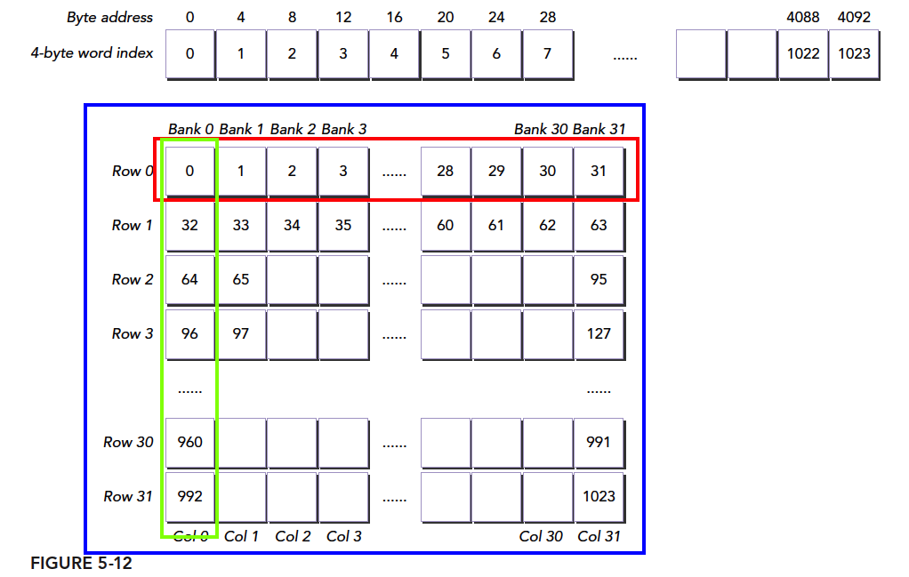

绿色的：
`A[threadIdx.x][threadIdx.y]`

红色的：
`A[threadIdx.y][threadIdx.x]`

红色的效率最高。

---

> 行主序访问和列主序访问

```cpp
#define BDIMX 32
#define BDIMY 32

__global__ void setRowReadRow(int * out)
{
    __shared__ int tile[BDIMY][BDIMX];
    unsigned int idx=threadIdx.y*blockDim.x+threadIdx.x;

    tile[threadIdx.y][threadIdx.x]=idx; // 共享内存写入
    __syncthreads();
    out[idx]=tile[threadIdx.y][threadIdx.x]; // 共享内存读取和全局内存写入
}


__global__ void setRowReadRow(int * out)
{
    __shared__ int tile[BDIMY][BDIMX];
    unsigned int idx=threadIdx.y*blockDim.x+threadIdx.x;

    tile[threadIdx.y][threadIdx.x]=idx;
    __syncthreads();
    out[idx]=tile[threadIdx.y][threadIdx.x];
}
```

相关指标：

- shared_load_transactions_per_request
- shared_store_transactions_per_request

> 动态共享内存

“共享内存没有malloc但是也可以到运行时才分配，具体机制我没去了解，是不是共享内存也分堆和栈，但是我们有必要了解这个方法，因为写过C++程序的都知道，基本上我们的大部分变量是要靠动态分配手动管理的，CUDA好的一点就是动态的共享内存，不需要手动回收”

```cpp
__global__ void setRowReadColDyn(int * out)
{
    extern __shared__ int tile[];  //extern表示动态共享内存，运行时才知道
    unsigned int row_idx=threadIdx.y*blockDim.x+threadIdx.x;
    unsigned int col_idx=threadIdx.x*blockDim.y+threadIdx.y;
    tile[row_idx]=row_idx;
    __syncthreads();
    out[row_idx]=tile[col_idx];
}

setRowReadColDyn<<<grid,block,(BDIMX)*BDIMY*sizeof(int)>>>(out);
```

> 填充共享内存

**声明了这个尺寸的共享内存，其会自动对应到CUDA模型上的二维共享内存存储体，换句话说，所谓填充是在声明的时候产生的， 声明一个二维共享内存，或者一维共享内存，编译器会自动将其重新整理到一个二维的空间中，这个空间包含32个存储体，每个存储体宽度一定，换句话说，你声明一个二维存储体，编译器会把声明的二维转换成一维线性的，然后再重新整理成二维按照32个存储体，4-Byte/8-Byte宽的内存分布，然后再进行运算的。**

所以直接补常量即可

也因此只要前期编译器处理这个共享内存就行（人考虑也只用到这个阶段），剩下的按照原来的代码逻辑用索引等等，会自动把共享内存的索引调整。

对于动态声明的，共享内存会直接丧失二维结构，所以要转换成对应的一维坐标

```cpp

//填充静态声明的共享内存
__global__ void setRowReadColIpad(int * out)
{
    __shared__ int tile[BDIMY][BDIMX+IPAD];  // 这里体现的填充
    unsigned int idx=threadIdx.y*blockDim.x+threadIdx.x;

    tile[threadIdx.y][threadIdx.x]=idx;
    __syncthreads();
    out[idx]=tile[threadIdx.x][threadIdx.y];
}
//静态声明只要保持原逻辑即可，编译器会自动处理


//填充动态声明的共享内存
__global__ void setRowReadColDynIpad(int * out)
{
    extern __shared__ int tile[];
    unsigned int row_idx=threadIdx.y*(blockDim.x+1)+threadIdx.x;
    unsigned int col_idx=threadIdx.x*(blockDim.x+1)+threadIdx.y;

	//动态声明的索引要变，因为编译器没法自动处理，直接就当逻辑上多出了一列来看就行

    tile[row_idx]=row_idx;
    __syncthreads();
    out[row_idx]=tile[col_idx];
}

setRowReadColDynIpad<<<grid,block,(BDIMX+IPAD)*BDIMY*sizeof(int)>>>(out);

```

#### 矩形案例

```cpp
#define BDIMX_RECT 32
#define BDIMY_RECT 16

__global__ void setRowReadColRect(int * out)
{
    __shared__ int tile[BDIMY_RECT][BDIMX_RECT];
    unsigned int idx=threadIdx.y*blockDim.x+threadIdx.x;

    unsigned int icol=idx%blockDim.y;
    unsigned int irow=idx/blockDim.y;

    tile[threadIdx.y][threadIdx.x]=idx;
    __syncthreads();
    out[idx]=tile[icol][irow];
}

```

代码分析：（**从线程束的角度去思考**）

- 主要目的是实现，对矩形矩阵的反转，其中元素是各线程id：
    - 先把id整体存到SMem里，但是形状是一致的
    - 一个线程束里从共享内存里是竖着取，然后填到对应位置（因为已经转成一维的了）
- 细节部分：
    - 这个作者极度喜欢把地址最近的变叫做row，最远的变叫col，不知道是哪来的习惯，不过为了适应只能这么默认，就当zyx的顺序一样
    - 因为是竖着取共享内存，所以一次Request肯定触发了16次冲突产生16次事务

```cpp
__global__ void setRowReadColRectPad(int * out)
{
    __shared__ int tile[BDIMY_RECT][BDIMX_RECT+IPAD];
    unsigned int idx=threadIdx.y*blockDim.x+threadIdx.x;
    unsigned int icol=idx%blockDim.y;
    unsigned int irow=idx/blockDim.y;
    tile[threadIdx.y][threadIdx.x]=idx;
    __syncthreads();
    out[idx]=tile[icol][irow];
}

__global__ void setRowReadColRectPad(int * out)
{
    __shared__ int tile[BDIMY_RECT][BDIMX_RECT+IPAD*2];
    unsigned int idx=threadIdx.y*blockDim.x+threadIdx.x;
    unsigned int icol=idx%blockDim.y;
    unsigned int irow=idx/blockDim.y;
    tile[threadIdx.y][threadIdx.x]=idx;
    __syncthreads();
    out[idx]=tile[icol][irow];
}

__global__ void setRowReadColRectDynPad(int * out)
{
    extern __shared__ int tile[];
    unsigned int idx=threadIdx.y*blockDim.x+threadIdx.x;
    unsigned int icol=idx%blockDim.y;
    unsigned int irow=idx/blockDim.y;
    unsigned int row_idx=threadIdx.y*(IPAD+blockDim.x)+threadIdx.x;
    unsigned int col_idx=icol*(IPAD+blockDim.x)+irow;
    tile[row_idx]=idx;
    __syncthreads();
    out[idx]=tile[col_idx];
}
```

填充内存写法：
    - 由上面可知，我们原来索引在原来结构里是竖着存取
    - 因此我们只要保证能够都错开即可，所以在原代码逻辑不变的情况下，取更改pad大小
    - 当pad为1时候为什么会一次Request肯定触发了2次冲突？
        - 因为warp是32的大小，但你的16一次只偏移了一个，而有两个16必然会造成冲突
        - 所以让ipad=2，来进一步穿插

### 使用共享内存进行归约

**重点是如何减少全局内存访问的逻辑**

集中解决下面两个问题：

- 如何重新安排数据访问模式以**避免线程束分化**
- 如何展开循环以保证**有足够的操作使指令和内存带宽饱和**

全局内存下的完全展开的归约计算：
```cpp
__global__ void reduceGmem(int * g_idata,int * g_odata,unsigned int n)
{
	//set thread ID
	unsigned int tid = threadIdx.x;
	unsigned int idx = blockDim.x*blockIdx.x+threadIdx.x;
    //当前线程的索引位置
	//boundary check
	if (tid >= n) return;
	//convert global data pointer to the
	int *idata = g_idata + blockIdx.x*blockDim.x;
    //当前线程块对应的数据块首地址

	//in-place reduction in global memory
	if(blockDim.x>=1024 && tid <512)
		idata[tid]+=idata[tid+512];
	__syncthreads();
	if(blockDim.x>=512 && tid <256)
		idata[tid]+=idata[tid+256];
	__syncthreads();
	if(blockDim.x>=256 && tid <128)
		idata[tid]+=idata[tid+128];
	__syncthreads();
	if(blockDim.x>=128 && tid <64)
		idata[tid]+=idata[tid+64];
	__syncthreads();
	//write result for this block to global mem
	if(tid<32)
	{
		volatile int *vmem = idata; // 避免编译器优化，无法进缓存，保证顺序执行
		vmem[tid]+=vmem[tid+32];
		vmem[tid]+=vmem[tid+16];
		vmem[tid]+=vmem[tid+8];
		vmem[tid]+=vmem[tid+4];
		vmem[tid]+=vmem[tid+2];
		vmem[tid]+=vmem[tid+1];

	}

	if (tid == 0)
		g_odata[blockIdx.x] = idata[0];

}
```

共享内存版本：
```cpp
__global__ void reduceSmem(int * g_idata,int * g_odata,unsigned int n)
{
	//set thread ID
    __shared__ int smem[DIM];
	unsigned int tid = threadIdx.x;
	//unsigned int idx = blockDim.x*blockIdx.x+threadIdx.x;
	//boundary check
	if (tid >= n) return;
	//convert global data pointer to the
	int *idata = g_idata + blockIdx.x*blockDim.x;

    smem[tid]=idata[tid];
	__syncthreads();
	//in-place reduction in global memory
	if(blockDim.x>=1024 && tid <512)
		smem[tid]+=smem[tid+512];
	__syncthreads();
	if(blockDim.x>=512 && tid <256)
		smem[tid]+=smem[tid+256];
	__syncthreads();
	if(blockDim.x>=256 && tid <128)
		smem[tid]+=smem[tid+128];
	__syncthreads();
	if(blockDim.x>=128 && tid <64)
		smem[tid]+=smem[tid+64];
	__syncthreads();
	//write result for this block to global mem
	if(tid<32)
	{
		volatile int *vsmem = smem;
		vsmem[tid]+=vsmem[tid+32];
		vsmem[tid]+=vsmem[tid+16];
		vsmem[tid]+=vsmem[tid+8];
		vsmem[tid]+=vsmem[tid+4];
		vsmem[tid]+=vsmem[tid+2];
		vsmem[tid]+=vsmem[tid+1];

	}

	if (tid == 0)
		g_odata[blockIdx.x] = smem[0];

}
```

目前唯一的区别就是先拿共享内存存了一下这个块里的数据，然后全部从共享内存读，所以对共享内存的idx会稍微有点区别。

**使用展开的并行归约**：

并行4个线程块，但重点还是在写入共享内存之前进行归约，以下是修改部分：

```cpp

__shared__ int smem[DIM];
unsigned int tid = threadIdx.x;
unsigned int idx = blockDim.x*blockIdx.x*4+threadIdx.x;
//boundary check
if (tid >= n) return;
//convert global data pointer to the
int tempSum=0;
if(idx+3 * blockDim.x<=n)
{
    int a1=g_idata[idx];
    int a2=g_idata[idx+blockDim.x];
    int a3=g_idata[idx+2*blockDim.x];
    int a4=g_idata[idx+3*blockDim.x];
    tempSum=a1+a2+a3+a4;
}

smem[tid]=tempSum;
__syncthreads();
```

不用同步的方法是因为，先直接读到寄存器里再直接加

之前idata涉及到的所有全局内存相关的，全部简化为共享内存的smem，性能肯定是大幅提升

$ 有效带宽 = \frac{(读字节数 + 写字节数) \times 10^{-9}}{运行时间} $

### 使用共享内存进行矩阵转置以减少内存的交叉访问

> 基准转置内核

可以先用最简单的类似的做法来确定这个内核的上限和下限在哪。

转置矩阵问题的初步上下限

```cpp

//上限，行取行放，不经过操作变换，只有写入写出肯定最快
__global__ void copyRow(float * in,float * out,int nx,int ny)
{
    int ix=threadIdx.x+blockDim.x*blockIdx.x;
    int iy=threadIdx.y+blockDim.y*blockIdx.y;
    int idx=ix+iy*nx;
    if (ix<nx && iy<ny)
    {
      out[idx]=in[idx];
    }
}

//下限，全局内存下使用行取和写入对应位置，最朴素的写法
__global__ void transformNaiveRow(float * in,float * out,int nx,int ny)
{
    int ix=threadIdx.x+blockDim.x*blockIdx.x;
    int iy=threadIdx.y+blockDim.y*blockIdx.y;
    int idx_row=ix+iy*nx;
    int idx_col=ix*ny+iy;
    if (ix<nx && iy<ny)
    {
      out[idx_col]=in[idx_row];
    }
}
```

> 使用共享内存怒的矩阵转置

---
一：

初步想法，我们单纯把全局内存干的步骤换成共享内存，即使有冲突但肯定比全局内存快：

- 从全局内存读取数据（按行）写入共享内存（按行）
- 从**共享内存读取一列**写入**全局内存的一行**

唯一的问题就是涉及到了多个块的转置，所以计算转置之后的in_index会麻烦一点，但是画图找对应

```cpp
__global void transformSmem(float *in, float* out, int nx, int ny) {
	__shared__ float tile[BDIMY][BDIMX];
	unsigned int ix, iy, transform_in_idx, transform_out_idx;

	ix = threadIdx.x + blockDim.x * blockIdx.x;
	iy = threadIdx.y + blockDim.y * blockIdx.y;
	transform_in_idx = iy * nx + ix;
// 计算从哪取的idx

	unsigned int bidx,irow,icol;
	bidx=threadIdx.y*blockDim.x+threadIdx.x;
	// 块内线程转换为一维编号
	irow=bidx/blockDim.y;
	icol=bidx%blockDim.y;

	//一维编号，然后改形状成二维编号[icol, irow]，避免块的长宽不一致，保证线程束的连续性

	ix=blockIdx.y*blockDim.y+icol;
	iy=blockIdx.x*blockDim.x+irow;
	transform_out_idx=iy*ny+ix;   
	//这里实现的转置，可以看出来ix已经用来原来y的，iy用了原来x的，icol和irow就是现在的y和x，所以转置在这里一次实现计算

	if(ix<nx&& iy<ny)
	{
		tile[threadIdx.y][threadIdx.x]=in[transform_in_idx];
		// 先放入共享内存里，这里还是保持原来的正的状态
		__syncthreads();
		out[transform_out_idx]=tile[icol][irow];
		//只要把对应坐标的搞了就行了其余无所谓
	}
}
```

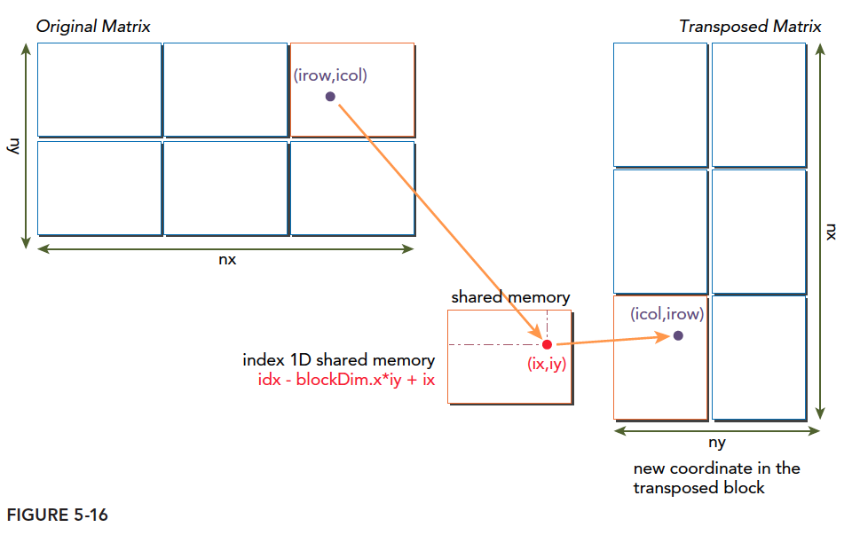

注意这里**他代码解释写的一团浆糊**：

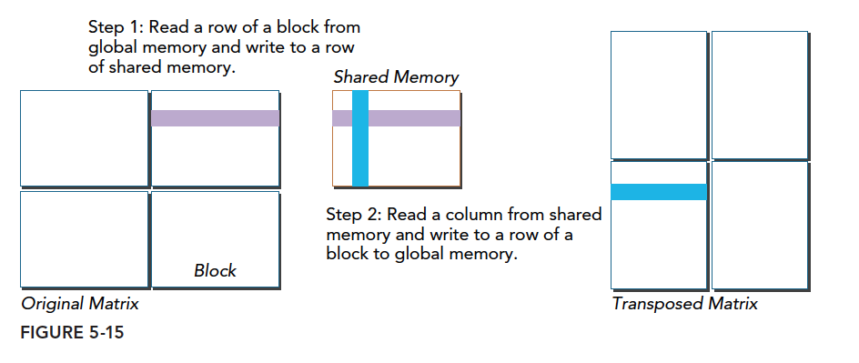

主要思路：

- 我们只管线程块里的逻辑
	- 为什么？
	因为线程束首先是线程块里面的结构，我们的难题在于，如果线程束还保持着原来的二维逻辑，那么我们实在不太好搞怎么按列读按行写，反正我自己做不到，数学底子太差。
	线程块自己的编号，只要后续交叉一下使用，就能实现在外部的修改，而跟内部关系不大，因为我们需要解决的就是内部线程束的具体问题。
	- 怎么解决？
	首先我们的共享内存以线程块为单位分配
	其次我们要把线程编号全部转换为一维模型，再利用一维模型转成逻辑上的二维，**注意这里还没有转置，只是重新编排
	然后计算每个线程位置里对应的转置后的实际坐标位置，而Block的xy只需要替换使用就行
	最后，检查我们应该怎么取值怎么用？
	选择的是取列写行，且因为我们这一套下来，用的不是原来线程对应的那玩意，所以**必须用同步等所有线程干完**
	**加法逻辑已经写在代码里了，重点是逻辑上和物理上的解耦**

**如何分析按行还是按列读？**
	直接找到icol和irow相关的，查看threadIdx.x变化对这俩的影响

**分析这里的共享内存冲突情况**
	由上面知道，这个是按列读，肯定在共享内存里有冲突的地方，所以再使用**填充**，分配的时候直接加IPAD就行了

---
二：

消除冲突后，通过展开循环来解放大量线程块提高带宽利用率

直接把当前块的做法扩展一下到多个块就行，就是单纯加一个块偏移

```cpp
__global__ void transformSmemUnrollPad(float * in,float* out,int nx,int ny)
{
	__shared__ float tile[BDIMY*(BDIMX*2+IPAD)];
//1.
	unsigned int ix,iy,transform_in_idx,transform_out_idx;
	ix=threadIdx.x+blockDim.x*blockIdx.x*2;
    iy=threadIdx.y+blockDim.y*blockIdx.y;
	transform_in_idx=iy*nx+ix;
//2.
	unsigned int bidx,irow,icol;
	bidx=threadIdx.y*blockDim.x+threadIdx.x;
	irow=bidx/blockDim.y;
	icol=bidx%blockDim.y;
//3.
	unsigned int ix2=blockIdx.y*blockDim.y+icol;
	unsigned int iy2=blockIdx.x*blockDim.x*2+irow;
//4.
	transform_out_idx=iy2*ny+ix2;
	if(ix+blockDim.x<nx&& iy<ny)
	{
		unsigned int row_idx=threadIdx.y*(blockDim.x*2+IPAD)+threadIdx.x;
		tile[row_idx]=in[transform_in_idx];
		tile[row_idx+BDIMX]=in[transform_in_idx+BDIMX];
//5
		__syncthreads();
		unsigned int col_idx=icol*(blockDim.x*2+IPAD)+irow;
        out[transform_out_idx]=tile[col_idx];
		out[transform_out_idx+ny*BDIMX]=tile[col_idx+BDIMX];

	}
}
```

**这里的问题是，如果是开的一维共享内存，编译器就没法知道长宽，就得由个人来维护坐标**

正是因为共享内存的逻辑结构仍然是“二维 tile”，只是尺寸从 BDIMX 扩成 BDIMX* 2+IPAD，所以编译器仍能自动把 tile[row][col] 翻译成正确的一维地址（row * (BDIMX*2+IPAD) + col）。

纯数字上的转换计算，跟逻辑无关。逻辑是我们提供的数字在我们脑子里表示的。

### 常量内存

常量内存是专用内存，他用于只读数据和线程束统一访问某一个数据，常量内存对内核代码而言是只读的，但是主机是可以修改（写）只读内存的，当然也可以读。
注意，**常量内存并不是在片上的，而是在DRAM上**，而其**有在片上对应的缓存**，其片上缓存就和一级缓存和共享内存一样， 有较低的延迟，但是容量比较小，合理使用可以提高内和效率，每个SM常量缓存大小限制为64KB。

所有的片上内存，我们是不能通过主机赋值的，我们只能对DRAM上内存进行赋值,每种内存访问都有最优与最坏的访问方式，主要原因是内存的硬件结构和底层设计原因。

要原因是内存的硬件结构和底层设计原因，比如全局内存按照连续对去访问最优，交叉访问最差，共享内存无冲突最优，都冲突就会最差，其根本原因在于硬件设计。

而我们的常量内存的最优访问模式是线程束所有线程访问一个位置，那么这个访问是最优的。如果要访问不同的位置，就要编程串行了，作为对比，这种情况相当于全局内存完全不连续，共享内存的全部冲突。

---
声明方式：
`__constant__`

常量内存变量的生存周期与应用程序生存周期相同，所有网格对声明的常量内存都是可以访问的，运行时对主机可见，当CUDA独立编译被使用的，常量内存跨文件可见。

`cudaError_t cudaMemcpyToSymbol(const void *symbol, const void * src,  size_t count, size_t offset, cudaMemcpyKind kind)`

---
只读缓存

只读缓存拥有从全局内存读取数据的专用带宽,所以，如果内核函数是带宽限制型的，那么这个帮助是非常大的，不同的设备有不同的只读缓存大小，Kepler SM有48KB的只读缓存，只读缓存对于分散访问的更好，当所有线程读取同一地址的时候常量缓存最好，只读缓存这时候效果并不好，只读换粗粒度为32.
实现只读缓存可以使用两种方法

### 线程束洗牌指令

**特殊的机制**：

洗牌指令，shuffle instruction作用在线程束内，允许两个线程见相互访问对方的寄存器。这就给线程束内的线程相互交换信息提供了了一种新的渠道，我们知道，核函数内部的变量都在寄存器中，一个线程束可以看做是32个内核并行执行，换句话说这32个核函数中寄存器变量在硬件上其实都是邻居，这样就为相互访问提供了物理基础，线程束内线程相互访问数据不通过共享内存或者全局内存，使得通信效率高很多，线程束洗牌指令传递数据，延迟极低，切不消耗内存

线程束洗牌指令是线程束内线程通讯的极佳方式。

**束内线程的概念**，**lane**，就是一个线程束内的索引，所以束内线程的ID在 【0,31】 内，且唯一，唯一是指线程束内唯一，一个线程块可能有很多个束内线程的索引，就像一个网格中有很多相同的threadIdx.x 一样，同时还有一个线程束的ID，可以通过以下方式计算线程在当前线程块内的束内索引，和线程束ID：

```cpp
unsigned int LaneID = threadIdx.x % 32;
unsigned int warpID = threadIdx.x / 32;
```

两组线程束洗牌指令：一组整形，一组浮点型。一共四种形式的洗牌指令。

#### 具体指令

**注意，指令是针对线程的，当多个线程干了就自动变成针对线程束的了**

在线程束内交换整形变量：

```cpp
int __shfl(int var, int srcLane, int width=warpSize);
```

解释一下：

- var：其传递的给函数的并不是这个变量存储的值，而是这个变量名，因为不同线程，这个var值肯定不一样，所以这个__shfl返回的就是var值，哪个线程var值呢？srcLane这个线程的，srcLane并不是当前线程的束内线程，而是结合width计算出来的**相对线程位置**，比如srcLane是3，width是16，就相当于0-15号接受3号线程的值，16-31号接受19号线程的值。

width默认参数是32，srcLane简单的归为束内线程，但只有width为32的时候才是真正的束内线程。

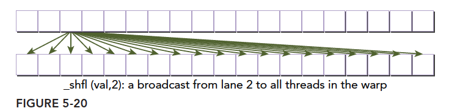

```cpp
int __shfl_up(int var,unsigned int delta,int width=warpSize);
```

这个函数的作用是调用线程得到当前束内线程编号减去delta的编号的线程内的var值，with和__shfl中都一样，默认是32，作用效果如下：

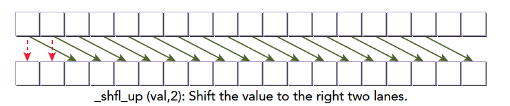

```cpp
int __shfl_down(int var,unsigned int delta,int width=warpSize);
```

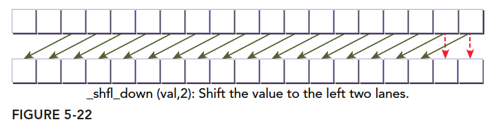

```cpp
int __shfl_xor(int var,int laneMask,int width=warpSize);
```

如果我们输入的laneMask是1，其对应的二进制是 000⋯001,当前线程的索引是0~31之间的一个数，那么我们用laneMask与当前线程索引进行抑或操作得到的就是目标线程的编号了，这里laneMask是1，那么我们把1与0~31分别抑或就会得到：

```
000001^000000=000001;
000001^000001=000000;
000001^000010=000011;
000001^000011=000010;
000001^000100=000101;
000001^000101=000100;
.
.
.
000001^011110=011111;
000001^011111=011110;
```

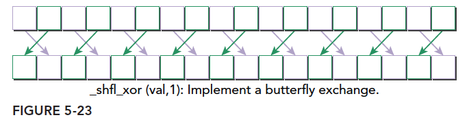

这就是4个线程束洗牌指令对整形的操作了。对应的浮点型不需要该函数名，而是只要把var改成float就行了，函数就会自动重载

#### 线程束内的共享内存数据

**洗牌指令可以用于下面三种整数变量类型中：**

- 标量变量
- 数组
- 向量型变量

吸引人的地方就是不需要通过内存进行线程间数据交换，具有非常高的性能。

1. 跨线程束广播，很明显用的指令1

```cpp
__global__ void test_shfl_broadcast(int *in,int*out,int const srcLans)
{
    int value=in[threadIdx.x];
    value=__shfl(value,srcLans,BDIM); 
	// 这里，srcLans是目标线程的value取给所有束内线程
    out[threadIdx.x]=value;
}
```

2. 线程束内上移和下移

```cpp
__global__ void test_shfl_up(int *in,int*out,int const delta)
{
    int value=in[threadIdx.x];
    value=__shfl_up(value,delta,BDIM);
    out[threadIdx.x]=value;

}

__global__ void test_shfl_down(int *in,int*out,int const delta)
{
    int value=in[threadIdx.x];
    value=__shfl_down(value,delta,BDIM);
    out[threadIdx.x]=value;

}
```

3. 线程束内环绕移动

```cpp
__global__ void test_shfl_wrap(int *in,int*out,int const offset)
{
    int value=in[threadIdx.x];
    value=__shfl(value,threadIdx.x+offset,BDIM);
    out[threadIdx.x]=value;

}
```

4. 跨线程的蝴蝶交换（当前线程索引和目标线程索引的异或作为目标线程）

```cpp
__global__ void test_shfl_xor(int *in,int*out,int const mask)
{
    int value=in[threadIdx.x];
    value=__shfl_xor(value,mask,BDIM);
    out[threadIdx.x]=value;
}
```

5. 跨线程束交换数组值

```cpp
__global__ void test_shfl_xor_array(int *in,int*out,int const mask)
{
    //1.
    int idx=threadIdx.x*SEGM;
    //2.
    int value[SEGM];
    for(int i=0;i<SEGM;i++)
        value[i]=in[idx+i];
    //3.
    value[0]=__shfl_xor(value[0],mask,BDIM);
    value[1]=__shfl_xor(value[1],mask,BDIM);
    value[2]=__shfl_xor(value[2],mask,BDIM);
    value[3]=__shfl_xor(value[3],mask,BDIM);
    //4.
    for(int i=0;i<SEGM;i++)
        out[idx+i]=value[i];

}
```

背景：定义了一个宏SEGM为4，然后每个线程束包含一个SEGM大小的数组，当然，这些数据数存在寄存器中的，如果数组过大可能会溢出到本地内存中，不用担心，也在片上，这个数组比较小，寄存器足够了。

6. 使用线程束洗牌指令完成归约

---
归约的三个层级：

- 线程束级归约
- 线程块级归约
- 网格级归约

---

一个线程块有多个线程束，每个执行自己的归约，每个线程束不使用共享内存，而是使用线程束洗牌指令，代码如下：

```cpp
__inline__ __device__ int warpReduce(int localSum)
{
    localSum += __shfl_xor(localSum, 16);
    localSum += __shfl_xor(localSum, 8);
    localSum += __shfl_xor(localSum, 4);
    localSum += __shfl_xor(localSum, 2);
    localSum += __shfl_xor(localSum, 1);
    return localSum;
}
__global__ void reduceShfl(int * g_idata,int * g_odata,unsigned int n)
{
	//set thread ID
    __shared__ int smem[DIM];
	unsigned int idx = blockDim.x*blockIdx.x+threadIdx.x;
	//convert global data pointer to the
    //1.
	int mySum=g_idata[idx];   //每个线程加载自己的元素到寄存器
	int laneIdx=threadIdx.x%warpSize;
	int warpIdx=threadIdx.x/warpSize;
    //2.
	mySum=warpReduce(mySum);  //warp内折半归约
    //3.
	if(laneIdx==0)   //0号写回共享内存，同步保证写完，后面要对warp间归约
		smem[warpIdx]=mySum;
	__syncthreads();
    //4.
	mySum=(threadIdx.x<DIM)?smem[laneIdx]:0;
	//块大小正好等于 DIM，所以所有线程都会取到 smem[laneIdx]。如果你把块规模调小，超过块内实际 warp 数的线程就会直接拿到 0，这样不会去读未初始化的 smem。随后又用 if (warpIdx == 0) 限制只有第一个 warp 会继续用这些值做最终规约，其他 warp 的值即便被设置也不会参与后面的计算。

	if(warpIdx==0)
		mySum=warpReduce(mySum);
    //5.
    if(threadIdx.x==0)
		g_odata[blockIdx.x]=mySum;

}
```

代码解释：

reduceShfl 按 warp 粒度做两级规约，思路是“warp 内用 shuffle，warp 间用共享内存，再由第一个 warp 收尾”：


关键点：
warpReduce 用 __shfl_xor 在一个 warp 内反复折半相加，无需共享内存和 __syncthreads()。
每个 warp 把部分和放到 smem\[warpIdx\]，相当于把 block 里的 warp 数量转换成一个小数组。
再由第一个 warp（warpIdx == 0）读取这些部分和并继续用 shuffle 完成最终规约。
threadIdx.x == 0 写出结果，形成一层 block 规约，下一步可在 CPU 或后续 kernel 上继续规约整个网格的输出。

流程是：
先让所有线程各自取到 smem\[laneIdx\]（或 0），这样 warp 内的寄存器里都有数据，后面才能用 warpReduce 的 shuffle 跨线程交换。

再用 if (warpIdx == 0) 限制只有第一个 warp 继续规约，其余 warp 直接退出。

要让 warp0 能把所有 warp 的部分和都取出来，必须满足：warpCount <= warpSize，即块内 warp 数量不超过 32。这样 warp0 的 32 个 lane 才能一一对应到 smem\[0..warpCount-1\]。这个实现的 DIM=1024，对应 32 个 warp，刚好满足条件。如果块更大（warp 数 > 32），就得用循环或多次规约才行。

warpReduce 里用的是 __shfl_xor，这个指令在同一个 warp 内直接在寄存器之间交换数据，不需要显式同步。它本质上是个“跨 lane 折半”的流程，即每一轮都做一次“把对面 lane 的值搬过来加在自己身上”：
__shfl_xor(val, offset) 会把“laneId 与 offset 做 XOR”后的那个线程的寄存器值取过来。因为 warp 各线程同步执行同一条指令，硬件保证这一动作天然同步，不需要 __syncthreads()。
每一轮都有 32 个线程参与，确实有一半线程的最终“贡献”会在后续被覆盖（比如 0 和 16 同时加，结果都一样），但队列里没有“闲置”线程；冗余的计算是为了不再写共享内存，换取延迟低、同步简单。
不需要 volatile，因为值全都保存在自己的寄存器里，编译器不会把寄存器优化掉；__shfl_xor 本身是有副作用的内联汇编，编译器不会错乱顺序。
所以 warpReduce 靠的是 warp 内锁步执行 + shuffle 能力，避免了显式同步和共享内存。

## 流和事件

---
**主要内容**：
- 理解流和事件的本质
- 理解网格级并发
- 重叠内核执行和数据传输
- 重叠CPU执行和GPU执行
- 理解同步机制
- 调整流的优先级
- 注册设备回调函数
- 通过NVIDIA可视化性能分析器显示应用程序执行时间轴

一般来说CUDA程序有两种并发：

- 内核级并行
	优化方法（基础方法）：
	- 编程模型
	- 执行模型
	- 内存模型
- 网格级并行

这部分内容考虑只在一个设备上并行内核，使用CUDA流实现网格级并发，还会使用NVVP显示内核并行执行可视化。

---
CUDA流：一系列异步CUDA操作，比如我们常见的套路，在主机端分配设备主存（cudaMalloc），主机向设备传输数据（cudaMemcpy），核函数启动，复制数据回主机（Memcpy）这些操作中有些是异步的，执行顺序也是按照主机代码中的顺序执行的（但是异步操作的结束不一定是按照代码中的顺序的）。

**流封装这些异步操作，并保持操作顺序，允许操作在流中排队。**保证其在前面所有操作启动之后启动，有了流，就能查询排队状态了。

一般分为三种操作：

- 主机和设备之间的数据传输
- 核函数启动
- 其他由主机发出设备执行的命令

而CUDA编程的一般套路也是：

- 输入数据从主机复制到设备上
- 设备上执行一个内核
- 将结果从设备移回主机

**流中的都是和主机异步的操作**，同一流中不同操作有严格顺序，不同流中没有任何限制，多个流同时启动多个内核实现网格级并行。

CUDA的API也分为同步和异步两种：

- 同步行为会阻塞主机端线程
	比如数据传输，打电话行为，`cudaMemcpy`，当然数据传输也有异步版本
- 异步行为的函数在调用后控制权返还给主机
	比如内核启动，打钱行为

CUDA运行时决定何时可以在设备上执行操作。要做的就是控制这些操作在其结果出来之前，不启动需要调用这个结果的操作（即防止不同步）。

**一般的生产情况下，内核执行的时间要长于数据传输**，所以我们前面的例子大多是数据传输更耗时，这是不实际的。**当重叠核函数执行和数据传输操作，可以屏蔽数据移动造成的时间消耗，当然正在执行的内核的数据需要提前复制到设备上**，在此基础上，可以实现流水线和双缓冲这些技术。

虽然从软件模型上提出了流，网格级并行的概念，但是能用的就那么一个设备，如果设备空闲当然可以同时执行多个核，但是如果设备已经跑满了，那么我们认为并行的指令也必须排队等待——**PCIe总线和SM数量是有限的**，当他们被完全占用，流是没办法做什么的，除了等待。

网格级并行受限于硬件。

### CUDA流

所有CUDA操作都是在流中进行的，哪怕没有显式设置，也是存在隐式的流操作：

- 隐式声明的流，叫做空流
- 显示声明的流，叫做非空流

如果没有特别声明一个流，那么我们的所有操作是在默认的空流中完成的，前面的所有例子都是在默认的空流中进行的。

空流没有办法管理，想要管理必须用非空流。

**基于流的异步内核启动和数据传输支持以下类型的粗粒度并发**：

- 重叠主机和设备计算
- 重叠主机计算和主机设备数据传输
- 重叠主机设备数据传输和设备计算
- 并发设备计算（多个设备）

---

异步的数据传输：

```cpp
cudaError_t cudaMemcpyAsync(void* dst, const void* src, size_t count,cudaMemcpyKind kind, cudaStream_t stream = 0);
```

`cudaStream_t` 就是表示流，所以要提前声明一个非空流。

1. **流创建**：
```cpp
cudaError_t cudaStreamCreate(cudaStream_t* pstream);

cudaStream_t a；//先命名
CHECK(cudaStreamCreate(&a));//再分配必要资源
```

**如果想用异步的数据传输，主机端的内存必须是固定且非分页的！**否则使用主机虚拟内存分配的数据是可移动的，导致出现未定义的错误。

2. **非空流执行内核需要在核函数启动的时候加入一个附加的启动配置**
```cpp
kernel_name<<<grid, block, sharedMemSize, stream>>>(argument List);
```

pStream参数就是附加的参数，使用目标流的名字作为参数，比如想把核函数加入到a流中，那么这个stream就变成a。

3. **回收资源**
```cpp
cudaError_t cudaStreamDestroy(cudaStream_t stream);
```

你在使用上面指令回收流的资源的时候，很有可能流还在执行，这时候，这条指令会正常执行，但是不会立刻停止流，而是等待流执行完成后，立刻回收该流中的资源。这样做是合理的也是安全的。

4. **查询流的位置**
```cpp
cudaError_t cudaStreamSynchronize(cudaStream_t stream);
cudaError_t cudaStreamQuery(cudaStream_t stream);
```
- cudaStreamSynchronize会**阻塞主机**，直到流完成。
- cudaStreamQuery则是立即返回，如果查询的流执行完了，那么返回cudaSuccess否则返回cudaErrorNotReady。

5. **流调度案例**

```cpp
for (int i = 0; i < nStreams; i++) {
    int offset = i * bytesPerStream;
    cudaMemcpyAsync(&d_a[offset], &a[offset], bytePerStream, streams[i]);
    kernel<<grid, block, 0, streams[i]>>(&d_a[offset]);
    cudaMemcpyAsync(&a[offset], &d_a[offset], bytesPerStream, streams[i]);
}
for (int i = 0; i < nStreams; i++) {
    cudaStreamSynchronize(streams[i]);
}
```
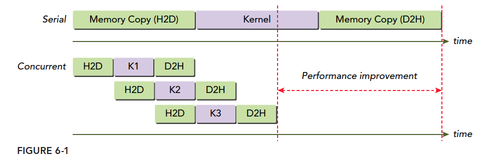

内核并发最大数量也是有极限的，不同计算能力的设备不同，Fermi设备支持16路并发，Kepler支持32路并发。设备上的所有资源都是限制并发数量的原因，比如共享内存，寄存器，本地内存，这些资源都会限制最大并发数

---

> 流调度

Fermi：

- 16路流并发执行，但是只有一个硬件工作队列，虽然是并行的编程模式，但是执行是像串行一样。
- 执行某个网格的时候CUDA会检测任务依赖关系，如果依赖于其他结果，则要等结果出来后才能继续执行。
- 单一流水线可能会导致虚假的依赖关系（不依赖但也会因为前面的堵了导致没法动）

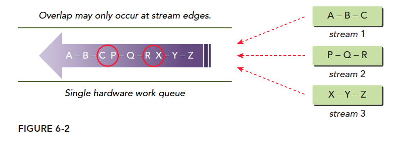

> Hyper-Q技术

解决虚假依赖的最好办法就是多个工作队列：

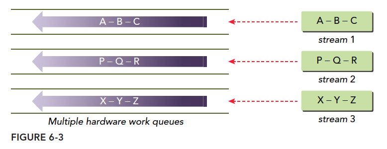

> 流优先级

3.5以上的设备可以给流优先级，也就是优先级高的（数字上更小的，类似于C++运算符优先级）

**优先级只影响核函数，不影响数据传输，高优先级的流可以占用低优先级的工作**.

```cpp
cudaError_t cudaStreamCreateWithPriority(cudaStream_t* pStream, unsigned int flags,int priority);

cudaError_t cudaDeviceGetStreamPriorityRange(int *leastPriority, int *greatestPriority);
```

leastPriority表示最低优先级（整数，远离0）
greatestPriority表示最高优先级（整数，数字较接近0）
如果设备不支持优先级返回0

### CUDA事件

事件是软件层面的概念，**事件的本质就是一个标记，它与其所在的流内的特定点相关联**。可以使用事件来执行以下两个基本任务：

- 同步流执行
- 监控设备的进展

想象为固定点打printf，只有流中事件前面的操作都完成时候事件才触发

---
1. **创建和销毁**

```cpp
cudaEvent_t event; // 声明

cudaError_t cudaEventCreate(cudaEvent_t *event); // 声明完后分配资源
cudaError_t cudaEventDestroy(cudaEvent_t *event); // 回收事件的资源
```

收指令执行的时候事件还没有完成，那么回收指令立即完成，当**事件完成后，资源马上被回收。**

2. **记录事件和计算运行时间**

```cpp
cudaError_t cudaEventRecord(cudaEvent_t event, cudaStream_t stream = 0);
//事件添加到CUDA流，函数是异步的

cudaError_t cudaEventSynchronize(cudaEvent_t event);
//同步版本的事件测试指令，会阻塞主机线程直到事件被完成

cudaError_t cudaEventQuery(cudaEvent_t event);
//异步版本的事件测试指令

cudaError_t cudaEventElapsedTime(float* ms, cudaEvent_t start, cudaEvent_t stop);
//记录两个事件之间的时间间隔，单位毫秒，且不能保证两个事件间记录的间隔刚好是两个事件之间的

```

注意：记录事件之间的间隔不一定是在同一个流中

演示：
```cpp
cudaEvent_t start, stop;
cudaEventCreate(&start);
cudaEventCreate(&stop);

cudaEventRecord(start);

kernel<<<grid, block>>>(arguments);

cudaEventRecord(stop);

cudaEventSynchronize(stop);

float time;
cudaEventElapsedTime(&time, start, stop);

cudaEventDestroy(start);
cudaEventDestroy(stop);
```

### 流同步

流分成阻塞流和非阻塞流，在非空流中所有操作都是非阻塞的，所以流启动以后，主机还要完成自己的任务，有时候就可能需要同步主机和流之间的进度，或者同步流和流之间的进度。

从主机的角度，CUDA操作可以分为两类：

- 内存相关操作
- 内核启动

从主机的角度，CUDA操作可以分为两类：

- 内存相关操作
- 内核启动

**没有显式声明的流式默认同步流，程序员声明的流都是异步流**，异步流通常不会阻塞主机，同步流中部分操作会造成阻塞，主机等待，什么都不做，直到某操作完成。

非空流并不都是非阻塞的，其也可以分为两种类型：

- 阻塞流
- 非阻塞流

虽然正常来讲，非空流都是异步操作，不存在阻塞主机的情况，但是有时候可能被空流中的操作阻塞。如果一个**非空流**被声明为非阻塞的，那么没人能阻塞他，**如果声明为阻塞流，则会被空流阻塞。**

就是非空流有时候可能需要在运行到一半和主机通信，这时候我们更希望他能被阻塞，而不是不受控制，这样我们就可以自己设定这个流到底受不受控制，也就是是否能被阻塞，下面我们研究如何使用这两种流。

> 阻塞流和非阻塞流

cudaStreamCreate创建的是阻塞流，意味着里面有些操作会被阻塞，直到空流中默写操作完成。
空流不需要显式声明，而是隐式的，他是阻塞的，跟所有阻塞流同步。

当操作A发布到空流中，A执行之前，CUDA会等待A之前的全部操作都发布到阻塞流中，所有发布到阻塞流中的操作都会挂起，等待，直到在此操作指令之前的操作都完成，才开始执行。

```cpp
kernel_1<<<1, 1, 0, stream_1>>>();
kernel_2<<<1, 1>>>()
kernel_3<<<1, 1, 0, stream_2>>>();
```

分析，有三个流，一个没名字空流，两个有名字，三个都是阻塞流：

具体过程为：kernel1启动，控制权返回主机启动kernel2，但kernel2不会马上执行，然后又控制权回到主机，启动kernel3，然后这三个一个接一个等上面的完成后再执行，当然主机和设备是异步的，一旦启动完控制权马上还给主机。

```cpp
cudaError_t cudaStreamCreateWithFlags(cudaStream_t* pStream, unsigned int flags);
//当flags = cudaStreamNonBlocking，创建的是非阻塞流，对空流的阻塞行为失效
```

如果前面的stream1和stream2都是非阻塞的，那么结果是三个核函数同时执行

---

> 隐式同步
常出现在内存操作上：

- 锁页主机内存分布
- 设备内存分配
- 设备内存初始化
- 同一设备两地址之间的内存复制
- 一级缓存，共享内存配置修改

其带来的阻塞往往不容易察觉

> 显示同步

一条指令一个作用，没啥副作用：

- 同步设备
- 同步流
- 同步流中事件
- 使用事件跨流同步

```cpp
cudaError_t cudaDeviceSynchronize(void);
```
阻塞主机，知道设备完成所有操作

```cpp
cudaError_t cudaStreamSynchronize(cudaStream_t stream);
cudaError_t cudaStreamQuery(cudaStream_t stream);
```

可以同步流，第一个是阻塞主机直到完成，第二个是测试一下是否完成

```cpp
cudaError_t cudaEventSynchronize(cudaEvent_t event);
cudaError_t cudaEventQuery(cudaEvent_t event);

cudaError_t cudaStreamWaitEvent(cudaStream_t stream, cudaEvent_t event);
```
事件的作用就是在流中设定一些标记用来同步，和检查是否执行到关键点位（事件位置），也是用类似的函数，性质和上面一样

最后一个指令：指定的流要等待指定的事件，事件完成后流才能继续，这个事件可以在这个流中，也可以不在，当在不同的流的时候，这个就是实现了跨流同步。

> 可配置事件

```cpp
cudaError_t cudaEventCreateWithFlags(cudaEvent_t* event, unsigned int flags);

flags 参数
cudaEventDefault
cudaEventBlockingSync
cudaEventDisableTiming
cudaEventInterprocess
```

CDUA提供了一种控制事件行为和性能的函数

- cudaEventBlockingSync指定使用cudaEventSynchronize同步会造成阻塞调用线程。
	cudaEventSynchronize默认是使用cpu周期不断重复查询事件状态，而当指定了事件是cudaEventBlockingSync的时候，会将查询放在另一个线程中，而原始线程继续执行，直到事件满足条件，才会通知原始线程，这样可以减少CPU的浪费，但是由于通讯的时间，会造成一定的延迟。
- cudaEventDisableTiming表示事件不用于计时，可以减少系统不必要的开支也能提升cudaStreamWaitEvent和cudaEventQuery的效率
- cudaEventInterprocess表明可能被用于进程之间的事件

### 并发内核执行

---
背景：
假设有四个比较耗时的核函数：kernel1，kernel2，kernel3，kernel4，假设有10个流，10个流中每个流都要按照上面的顺序执行这四个核函数。

```cpp
// 创建流
cudaStream_t *stream = (cudaStream_t*)malloc(n_stream*sizeof(cudaStream_t));
for(int i = 0; i < n_stream; i++) {
	cudaStreamCreate(&stream[i]);
}

dim3 block(1);
dim3 grid(1);
cudaEvent_t start,stop;
cudaEventCreate(&start);
cudaEventCreate(&stop);
cudaEventRecord(start);
for(int i=0;i<n_stream;i++)
{
    kernel_1<<<grid,block,0,stream[i]>>>();
    kernel_2<<<grid,block,0,stream[i]>>>();
    kernel_3<<<grid,block,0,stream[i]>>>();
    kernel_4<<<grid,block,0,stream[i]>>>();
}
cudaEventRecord(stop);
CHECK(cudaEventSynchronize(stop));
float elapsed_time;
cudaEventElapsedTime(&elapsed_time,start,stop);
printf("elapsed time:%f ms\n",elapsed_time);

for(int i=0;i<n_stream;i++)
{
    kernel_1<<<grid,block,0,stream[i]>>>();
    kernel_2<<<grid,block,0,stream[i]>>>();
    kernel_3<<<grid,block>>>();
    kernel_4<<<grid,block,0,stream[i]>>>();
}


```

**默认流也就是空流对于非空流中的阻塞流是有阻塞作用的。**这句话有点难懂：

- 首先我们没有声明流的那些GPU操作指令，核函数是在空流上执行的
- 空流是阻塞流
- 同时我们声明定义的流如果没有特别指出，声明的也是阻塞流
- 换句话说，这些流的共同特点，无论空流与非空流，都是阻塞的。

那么这时候空流（默认流）对非空流的阻塞操作就要注意一下了。


图上显示：kernel_3是在空流（默认流）上的，从NVVP的结果中可以看出，所有kernel_3 启动以后，所有其他的流中的操作全部被阻塞。

---

**如何创建流间依赖关系以实现同步**：

为了让，某个特定流等待任意流中的某个特定事件，只有该事件完成才能进一步执行这个流

```cpp
cudaEvent_t *event = (cudaEvent_t*)malloc(n_stream * sizeof(cudaEvent_t));
for(int i = 0;i < n_stream;i++) {
	cudaEventCreateWithFlag(&event[i], cudaEventDisableTiming);

	// 说明事件仅用于同步不记录时间戳
}

for(int i=0;i<n_stream;i++)
{
    kernel_1<<<grid,block,0,stream[i]>>>();
    kernel_2<<<grid,block,0,stream[i]>>>();
    kernel_3<<<grid,block,0,stream[i]>>>();
    kernel_4<<<grid,block,0,stream[i]>>>();
    cudaEventRecord(event[i],stream[i]);
    cudaStreamWaitEvent(stream[n_stream-1],event[i],0);
	//最后一个流等待所有事件
}

```
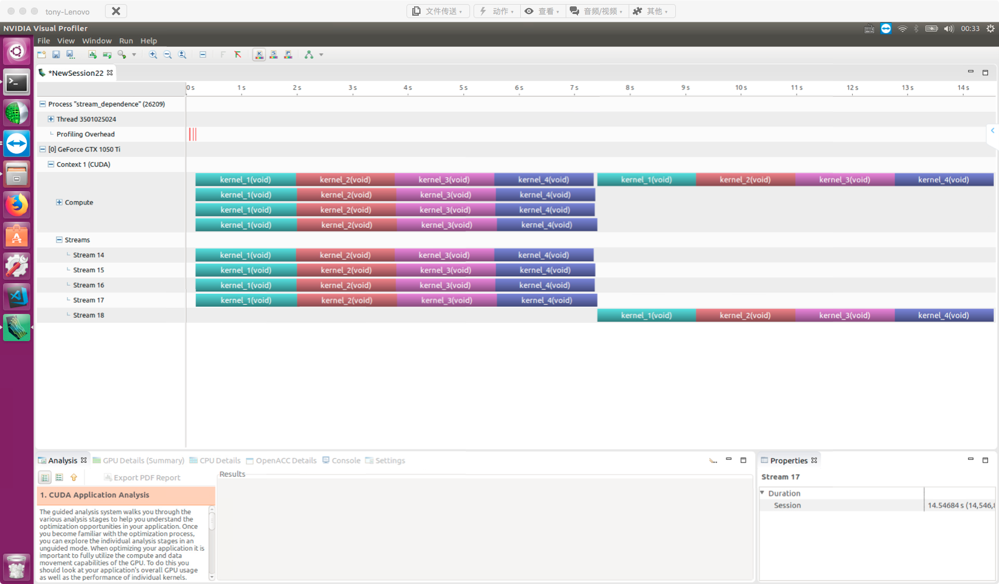

图片里第五个流是最后一个流

### 重叠内核执行和数据传输

以对Fermi架构和Kepler架构的分析为例：

1. 分析数据通道
	这俩架构下都有两个复制引擎队列（数据传输队列），一个设备到主机，一个主机到设备。读取和写入不经过同一队列，因此两个操作可以重叠完成。

	**只有方向不同时候才能这么干，同向没办法**

2. 检查数据传输和内核执行之间的关系：

- 内核使用数据A
	必须在同一个流中，必须数据传输在内核执行之前
	**可以通过分割实现一定的重叠**
- 内核完全不适用数据A
	可以在不同流中重叠执行
	是重叠内核执行和数据传输的基本做法，**数据传输和内核执行被分配到不同的流中时，CUDA执行的时候默认这是安全的**，也就是程序编写者要保证他们之间的依赖关系

---

**案例：向量加法**

```cpp
//内核
__global__ void sumArraysGPU(float*a,float*b,float*res,int N)
{
    int idx=blockIdx.x*blockDim.x+threadIdx.x;
    if(idx < N)
    //for delay
    {
        for(int j=0;j<N_REPEAT;j++)
            res[idx]=a[idx]+b[idx];
    }
}
```

向量加法的过程：

- 两个输入向量从主机传入内核
- 内核运算
- 结果传回主机

分析：

- 没法让内核和数据传输重叠，因为需要全部数据
- 但是因为每一位可以并发执行，所以可以分块，成N_SEGMENT份，就是 N_SEGMENT 个流分别执行

```cpp
cudaStream_t stream[N_SEGMENT];
for(int i=0;i<N_SEGMENT;i++)
{
    CHECK(cudaStreamCreate(&stream[i]));
}
cudaEvent_t start,stop;
cudaEventCreate(&start);
cudaEventCreate(&stop);
cudaEventRecord(start,0);
for(int i=0;i<N_SEGMENT;i++)
{
    int ioffset=i*iElem;

//  这里用了异步传输，但一定要保证声明成固定内存
    CHECK(cudaMemcpyAsync(&a_d[ioffset],&a_h[ioffset],nByte/N_SEGMENT,cudaMemcpyHostToDevice,stream[i]));

    CHECK(cudaMemcpyAsync(&b_d[ioffset],&b_h[ioffset],nByte/N_SEGMENT,cudaMemcpyHostToDevice,stream[i]));

    sumArraysGPU<<<grid,block,0,stream[i]>>>(&a_d[ioffset],&b_d[ioffset],&res_d[ioffset],iElem);

    CHECK(cudaMemcpyAsync(&res_from_gpu_h[ioffset],&res_d[ioffset],nByte/N_SEGMENT,cudaMemcpyDeviceToHost,stream[i]));
}
//timer
CHECK(cudaEventRecord(stop, 0));
CHECK(cudaEventSynchronize(stop));

```

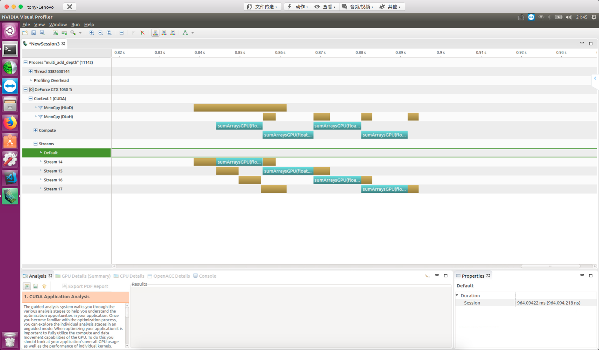

在Fermi以后架构的设备，不太需要关注工作调度顺序，因为多个工作队列足以优化执行过程，而Fermi架构则需要关注一下。

### GPU和CPU的重叠执行

```cpp
cudaEvent_t start,stop;
cudaEventCreate(&start);
cudaEventCreate(&stop);
cudaEventRecord(start,0);


for(int i=0;i<N_SEGMENT;i++)
{
    int ioffset=i*iElem;
    CHECK(cudaMemcpyAsync(&a_d[ioffset],&a_h[ioffset],nByte/N_SEGMENT,cudaMemcpyHostToDevice,stream[i]));

    CHECK(cudaMemcpyAsync(&b_d[ioffset],&b_h[ioffset],nByte/N_SEGMENT,cudaMemcpyHostToDevice,stream[i]));

    sumArraysGPU<<<grid,block,0,stream[i]>>>(&a_d[ioffset],&b_d[ioffset],&res_d[ioffset],iElem);

    CHECK(cudaMemcpyAsync(&res_from_gpu_h[ioffset],&res_d[ioffset],nByte/N_SEGMENT,cudaMemcpyDeviceToHost,stream[i]));
}
//timer
CHECK(cudaEventRecord(stop, 0));

// 这里的while这段显示了CPU和GPU的重叠
int counter=0;
while (cudaEventQuery(stop)==cudaErrorNotReady)
{
    counter++;
}

printf("cpu counter:%d\n",counter);
```

### 流回调

```cpp
void CUDART_CB my_callback(cudaStream_t stream,cudaError_t status,void * data)
{
    printf("call back from stream:%d\n",*((int *)data));
}
int main(int argc,char **argv)
{

    //asynchronous calculation
    int iElem=nElem/N_SEGMENT;
    cudaStream_t stream[N_SEGMENT];
    for(int i=0;i<N_SEGMENT;i++)
    {
        CHECK(cudaStreamCreate(&stream[i]));
    }
    cudaEvent_t start,stop;
    cudaEventCreate(&start);
    cudaEventCreate(&stop);
    cudaEventRecord(start,0);
    for(int i=0;i<N_SEGMENT;i++)
    {
        int ioffset=i*iElem;
        CHECK(cudaMemcpyAsync(&a_d[ioffset],&a_h[ioffset],nByte/N_SEGMENT,cudaMemcpyHostToDevice,stream[i]));
        CHECK(cudaMemcpyAsync(&b_d[ioffset],&b_h[ioffset],nByte/N_SEGMENT,cudaMemcpyHostToDevice,stream[i]));
        sumArraysGPU<<<grid,block,0,stream[i]>>>(&a_d[ioffset],&b_d[ioffset],&res_d[ioffset],iElem);
        CHECK(cudaMemcpyAsync(&res_from_gpu_h[ioffset],&res_d[ioffset],nByte/N_SEGMENT,cudaMemcpyDeviceToHost,stream[i]));
        CHECK(cudaStreamAddCallback(stream[i],my_callback,(void *)(stream+i),0));
    }
    //timer
    CHECK(cudaEventRecord(stop, 0));
    int counter=0;
    while (cudaEventQuery(stop)==cudaErrorNotReady)
    {
        counter++;
    }

}
```

这个回调函数被放入流中，当其前面的任务都完成了，就会调用这个函数，但是比较特殊的是，在回调函数中，需要遵守下面的规则:

- 回调函数中不可以调用CUDA的API
- 不可以执行同步

```cpp

//必须写成这个格式
void CUDART_CB my_callback(cudaStream_t stream, cudaError_t status, void *data) {
    printf("callback from stream %d\n", *((int *)data));
}


//必须这么调用
cudaError_t cudaStreamAddCallback(cudaStream_t stream,cudaStreamCallback_t callback, void *userData, unsigned int flags);
```

## 总体评价

大概2周不到的时间，能够从基本架构到语法上对GPU和CUDA做一个基本大方向上的掌握，原博主穿插在其中的优化理念也适合新人学习。