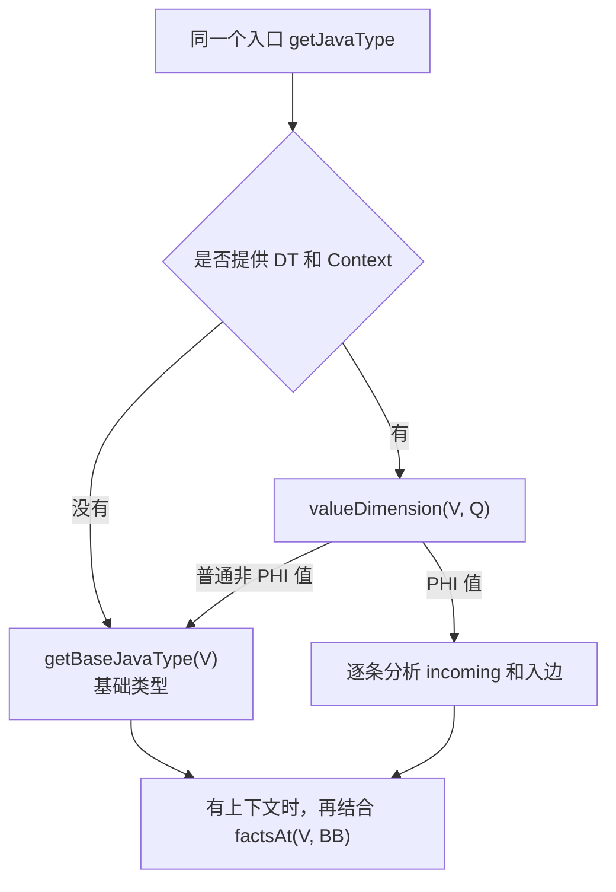
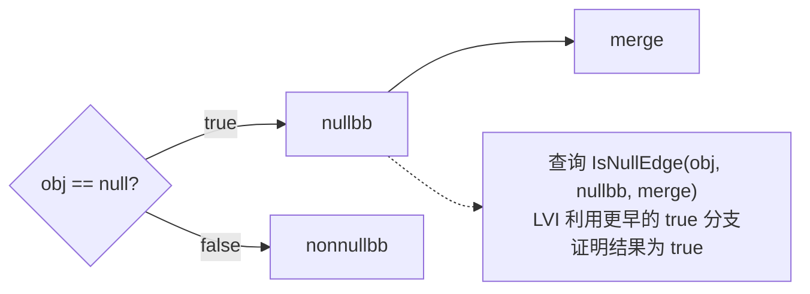
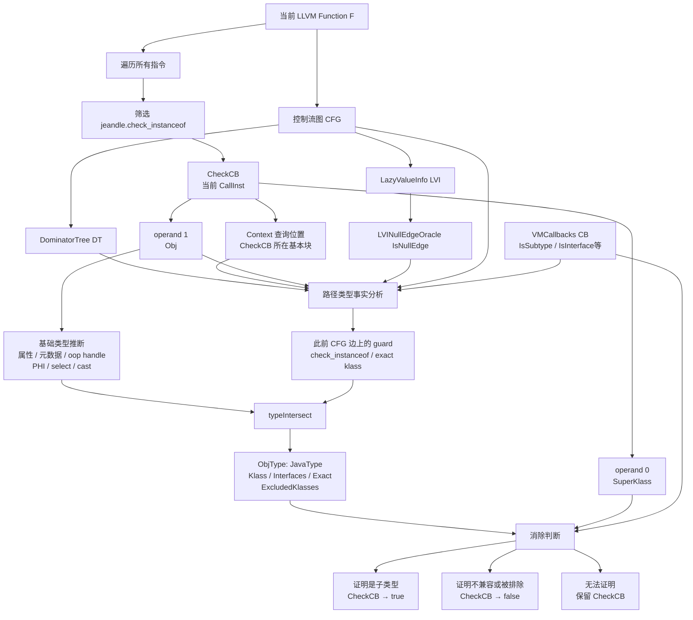
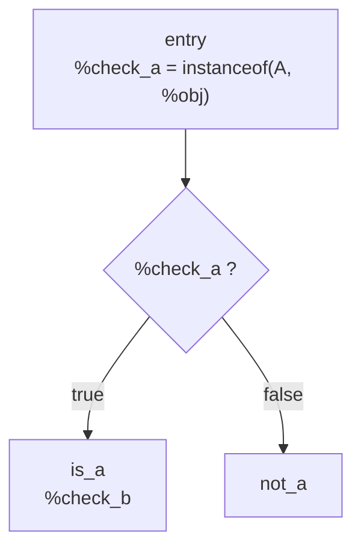
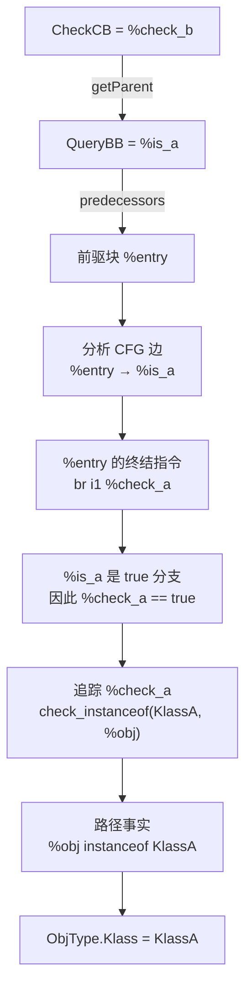
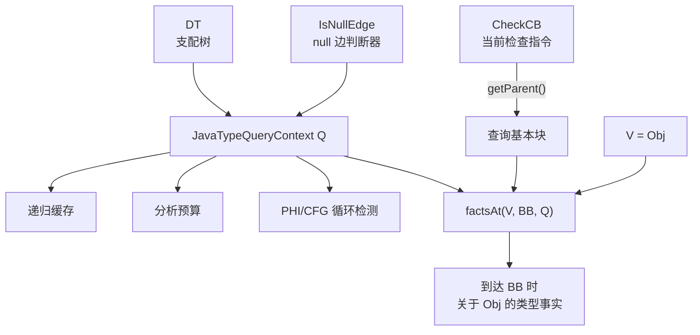
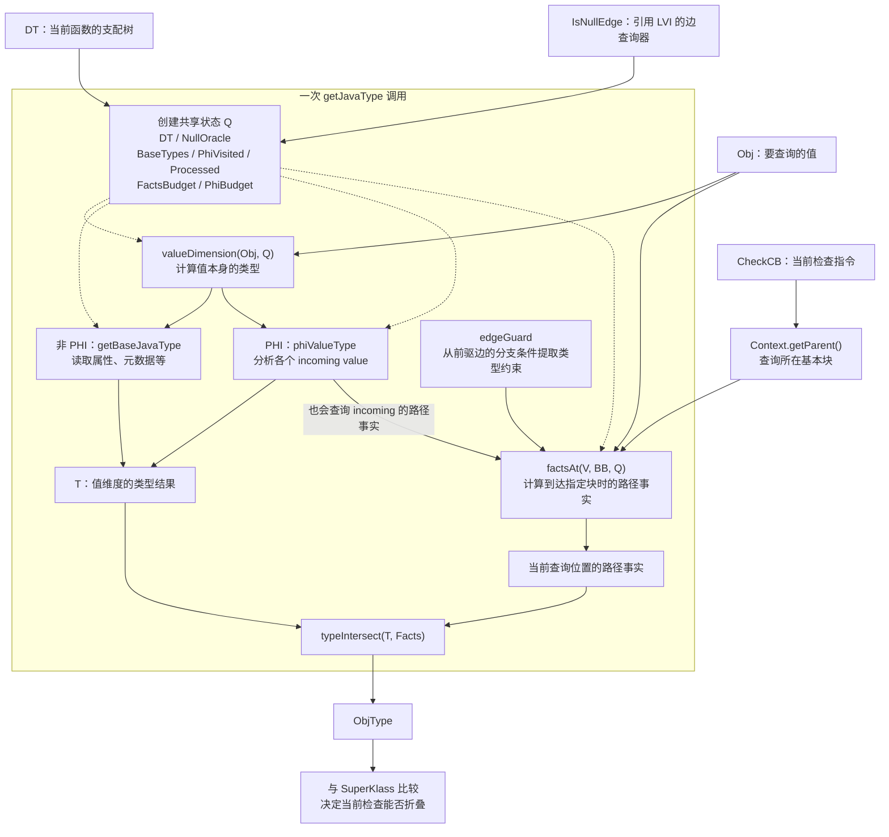

# 一个大的宏观问题

Jeandle 里通过 `getJavaType()` 函数实现 java 类型检查。所以想研究这一块的逻辑具体是什么样的，这个涉及到后续的缓存设计实现。但尚不清楚会造成什么影响。

# getJavaType

`getJavaType` 函数基本逻辑：因为我们的前提条件就是，一个变量类型是由两个因素综合判断的，其中一个是变量名 `V`，另一个是所处的位置 `Context`。因此，最主要的参数是这两个，其余的都可以归类为对算法做了一些加速设计，所进行的改造。

函数使用方式如下：
```
jeandle::JavaType ObjType =
        jeandle::getJavaType(Obj, &DT, CheckCB, IsNullEdge);
```
函数参数意义如下：
| 实参         | 形参类型               | 含义                                    | 主要依赖                                                     |
| ------------ | ---------------------- | --------------------------------------- | ------------------------------------------------------------ |
| `Obj`        | `Value *V`             | 要推断 Java 类型的 LLVM SSA 值          | 参数属性、load 元数据、常量 oop、PHI/select/cast、此前的类型检查 |
| `&DT`        | `DominatorTree *DT`    | 当前函数的支配树                        | 当前函数的 CFG                                               |
| `CheckCB`    | `Instruction *Context` | 类型查询发生的位置                      | 当前 `check_instanceof` 指令所在的基本块                     |
| `IsNullEdge` | `IsNullEdgeOracle`     | 判断某条 CFG 边上 `Obj` 是否必定为 null | `LazyValueInfo`、CFG 和分支条件                              |

1. 为什么是取第二个实参？根据 `check_instanceof` 的函数声明，第一个是要检查的类型，第二个是被检查的对象。

```
declare i1 @jeandle.check_instanceof(
    ptr %super_klass,
    ptr addrspace(1) nonnull %oop)
```

2. `CheckCB`，当前正在处理的 `jeandle.check_instanceof` 调用指令类型 `CallInst`，来自这个循环，实际就是指令。然后这个指令传进去的作用，是为了拿到当前指令所在的基本块的。

```
if (CheckFn && Check->getCalledFunction() == CheckFn)
  Checks.push_back(Check);
  
for (CallInst *CheckCB : Checks) {
    ...
}
```

3. `isNullEdge`是什么东西？

```
LazyValueInfo &LVI = FAM.getResult<LazyValueAnalysis>(F);
LVINullEdgeOracle IsNullEdge{LVI};

// 查询的函数
LVI.getPredicateOnEdge();
```

这玩意调用了一个AM，拿到分析结果，是一个 `LazyValue` 的分析，然后这个给 `IsNullEdge`，作为 `LVINullEdgeOracle `类型的初始化。

其中，这个数据结构类型是：在 `FromBB -> ToBB` 这条边上，`V` 是否可以被严格证明为 null。只有明确证明为 null 才返回 `true`；无法判断时返回 `false`，保留这条路径。这是保守策略。

而这个 `IsNullEdge()` 本身只是一个查询器功能，存的查询器引用，同时进行了运算符的重载。而 `factsAt()` 会轮流调用这个函数，这样实现了逐边的判断。所以说这只是他的功能，而不是它的实现，他的实现是 `LazyValueInfo()` 实现的。
```
struct LVINullEdgeOracle {
  LazyValueInfo &LVI;

  bool operator()(Value *V,
                  BasicBlock *FromBB,
                  BasicBlock *ToBB) const;
};

for (BasicBlock *P : predecessors(BB)) {
  if (isNullEdge(V, P, BB, Q))
    continue;

  ...
}
```
最终效果是拿到：
```
P1 → BB：V 一定为 null     → 跳过
P2 → BB：V 不一定为 null   → 保留
P3 → BB：无法证明为 null   → 保留
```
4. 但为什么要用的是 `LazyValueInfo`，因为这个可以利用更早的控制流信息，根据之前就已经是Null的直接推导出现在为Null，实现下图的效果：



```
IsNullEdge 本身：
    不保存路径集合
    只保存对 LVI 的引用（通过利用更早的控制流信息加速证明）

每次调用：
    判断一个 Value 在一条具体 CFG 边上是否必定为 null

判断依据：
    可以包含更早的控制流和分支信息

返回 true 的条件：
    经过这条边的所有可能执行中，Value 都为 null

无法确定：
    返回 false，保守地保留这条边
```

## 总关系
下图是其中**相关变量的联系图**：


**总思路**：
```
ObjType =
    Obj 自身携带的基础类型
    ∩
    从函数入口到 CheckCB 所在基本块的所有有效路径共同证明的类型事实

ObjType其中的四类信息：
    ObjType.Klass             // 已知的 Java Klass，0 表示未知
    ObjType.Interfaces        // 已知实现的接口
    ObjType.Exact             // 是否确定就是该类，而非其子类
    ObjType.ExcludedKlasses   // 已知绝对不是哪些类及其子类

四个参数作用：
    CheckCB 决定查询终点
    DT 决定控制流/回边/支配关系
    IsNullEdge 排除 Obj 必定为 null 的路径
    Obj 决定具体分析哪个 SSA 值
```

## 模拟

下面是一段 LLVM IR：

```
entry:
  %check_a = call i1 @jeandle.check_instanceof(
      ptr %KlassA,
      ptr addrspace(1) %obj)

  br i1 %check_a, label %is_a, label %not_a

is_a:
  %check_b = call i1 @jeandle.check_instanceof(
      ptr %KlassB,
      ptr addrspace(1) %obj)

  ret i1 %check_b

not_a:
  ret i1 false
```

对应控制流：



1. `checkcb = %check_b; Obj = %obj; getJavaType(Obj, &DT, CheckCB, IsNullEdge); `这个是 处理 `%check_b` 时候发生的。
2. 定位查询位置：具体的基本块，`Context->getParent()`，得到 %is_a，然后根据基本块，通过`factsAt()`，这个相当于拿到到达这个基本块时候必须满足的信息，方便找前驱啥的。

3. 倒追前驱，分析前驱边上的分支条件，查看终结指令（就是那个根据条件跳转的指令，因为跳转结果已经知道，所以可以根据结果推导条件）

```
for (BasicBlock *P : predecessors(BB)) {
    ...
}
```

4. 拿到了推导出的条件答案，继续追踪该条件是怎么的出来的，然后拿到那个事实。
5. 合并事实



伪代码总结 `getJavaType()` 功能如下：

```
JavaType getJavaType(Obj, DT, CheckCB, IsNullEdge) {
    // Obj 自身携带的类型：属性、metadata、PHI 等
    JavaType BaseType = getBaseType(Obj);

    // CheckCB 只在这里用于确定查询位置
    BasicBlock *QueryBB = CheckCB->getParent();

    // 从 QueryBB 沿前驱边向前追踪
    JavaType PathFacts = factsAt(Obj, QueryBB);

    // 合并“值自身类型”和“到达当前位置必然成立的事实”
    return typeIntersect(BaseType, PathFacts);
}
```

# 一个相关数据结构

## 是什么

**一次 Java类型查询使用的分析上下文和临时状态**：比如 factsAt 函数里，需要这个数据结构作为参数，利用 `Q` 中的支配树、null 边判断器和缓存，计算 `%obj` 在进入 `%is_a` 时成立的路径类型事实。

可以把 JavaTypeQueryContext Q 理解为：一次类型查询的工作记录，附带查询需要的分析工具。 它在递归过程中不断被读取、更新。

在代码中的位置如下：注意两个函数接收的是同一个 Q，而且形参是引用 JavaTypeQueryContext &Q。递归调用也继续传这个引用，因此它们共用缓存、循环检测状态和预算。

`valueDimension` 遇到 `PHI` 时，也会调用 `factsAt 分析各个 incoming value 的路径事实。所以“值自身的类型推断”和“路径分析”之间也会交互，共享 Q 正好支持这件事。

```
JavaTypeQueryContext Q{*DT, IsNullEdge};

JavaType T = valueDimension(V, Q);

return typeIntersect(
    T,
    factsAt(V, Context->getParent(), Q));
```

```
struct JavaTypeQueryContext {
  DominatorTree &DT;
  IsNullEdgeOracle NullOracle;

  SmallPtrSet<const PHINode *, 8> PhiVisited;
  BaseMemo BaseTypes;

  DenseMap<
      std::pair<Value *, BasicBlock *>,
      std::optional<JavaType>>
      Processed;

  unsigned FactsBudget = MaxFactsJoinBlocks;
  unsigned PhiBudget = MaxFactsJoinBlocks;
};
```

| 字段          | 作用                                               |
| ------------- | -------------------------------------------------- |
| `DT`          | 支配树，用于分析 CFG、**可达性分析**和**回边检测** |
| `NullOracle`  | 判断某条 CFG 边上对象是否必定为 null               |
| `PhiVisited`  | 防止分析 PHI 时无限递归                            |
| `BaseTypes`   | 缓存已经计算过的基础类型                           |
| `Processed`   | 缓存 `(值, 基本块)` 对应的路径事实                 |
| `FactsBudget` | 限制 CFG 递归分析规模                              |
| `PhiBudget`   | 限制 PHI 递归分析规模                              |



原图中和Q有关的部分展开：实线表示数据或结果的传递，虚线表示使用共享状态。


在当前调用方式下，他的生命周期是：
```
处理 CheckCB₁
  → getJavaType 创建 Q₁
  → 所有内部递归共用 Q₁
  → 返回 ObjType₁，Q₁ 销毁

处理 CheckCB₂
  → getJavaType 创建新的 Q₂
  → 从空缓存和初始预算开始
  → 返回 ObjType₂，Q₂ 销毁
```

## 为什么

**沿着前驱块递归追查时，不同路径可能追到同一个块，于是会重复计算同一个问题。保存结果是为了避免重复分析那一段 CFG**。

以下面这个例子为例：
```
       A
       │
       B
      / \
     C   D
      \ /
       E  ← 当前查询位置
```

为了计算 `factsAt(obj, E, Q)`，分析器需要向前递归：
```
factsAt(obj, E)
  ├─ factsAt(obj, C)
  │    └─ factsAt(obj, B)
  │         └─ factsAt(obj, A)
  │
  └─ factsAt(obj, D)
       └─ factsAt(obj, B)  ← 又遇到了同一个问题
            └─ factsAt(obj, A)
```

没有缓存，第二次遇到 B 时，就要重新分析 B 的前驱、前驱的前驱，重新提取分支条件中的类型约束，再重新合并结果。连续出现这种分叉、汇合时，重复工作会迅速增加。

有 Q.Processed 后：

```
第一次计算 factsAt(obj, B)
    → 分析 A 等前驱
    → 得到类型事实 TB
    → 保存 Q.Processed[{obj, B}] = TB

第二次计算 factsAt(obj, B)
    → 查到 TB
    → 直接返回，不再追查 B 的前驱
```

同理：
| 缓存 | 什么情况下复用 | 省掉什么 |
|---|---|---|
| `Q.Processed[{V, BB}]` | 再次查询同一个值在同一个块入口处的路径事实 | 重复追查前驱 CFG、分析边约束 |
| `Q.BaseTypes[V]` | 再次查询同一个值的基础类型，且满足实现中的缓存条件 | 重复解析属性、元数据、值来源等 |


递归调用的 factsAt，以及 PHI 分析中调用的 factsAt，都共享同一个 Q，因此都能命中这些缓存。是谁调用的不重要，查询的值和位置相同才是复用的依据。

这些结果可以复用，还依赖一个前提：这次查询期间，IR、CFG、类型相关信息和分析依据保持不变。这也是 Q 只在一次 getJavaType 内保存状态、下一次调用重新建立的原因。