**结论：** LLVM 静态编译和运行时编译两条编译路径：一条是 HIP 代码经过 HIPSX 工具链离线编译，另一条是 runtime 通过 COMGR 编译自己的 blit kernel。它们的入口看起来完全不同，底下却大量复用了同一套 Clang 和 LLVM 能力。

把三个问题拆开：**谁安排编译任务，谁执行一次编译，以及编译执行到哪里结束。**

这次 COMGR 改动的核心，就是让 Clang 完成需要的 IR 处理后输出文本 LLVM IR，再交给已有的 GPU编译器后端 `llc` 和 `llvm-mc`。

## 1. 要解决什么问题

当时需要解决的是：**HIP 程序已经能够通过 HIPSX 路线离线构建，但程序运行后，ROCclr 还会为内部 blit kernel 发起编译；这条 COMGR 编译链路也必须接到 SXGPU 后端，才能继续生成设备可加载的代码。**

这里的“运行时编译”发生在 CPU 侧的 runtime 进程中。已有记录所对应的是 runtime 自己的辅助 kernel，并不是用户显式调用 HIPRTC 编译一段 HIP 字符串，也不是 GPU 在执行过程中编译代码。

### 1.1 为什么程序已经编译了，运行时还要编译

离线构建解决的是应用程序及其设备代码的构建。程序启动以后，HIP runtime 还需要创建队列、管理内存、安排拷贝和填充操作，并提交设备任务。ROCclr 是这份实现中 HIP 与 OpenCL 共用的一层运行时基础设施；它通过 COMGR 调用编译、链接等能力。

其中，**blit kernel 是 runtime 自带的一组设备辅助函数**，包括 buffer 拷贝、填充、image 相关操作，以及这份实现中的其他辅助操作。它们和应用自己写的业务 kernel 是两组不同的代码。

当前代码中，`VirtualGPU::create()` 创建 `KernelBlitManager`；后者发现设备还没有 `blitProgram()` 时，调用 `Device::createBlitProgram()`。blit program 由内嵌 OpenCL C 源码构建并加载，后续再创建各个 kernel 对象。这个“设备已有 program 则复用”的判断，也说明不是每次调用内存 API 都重新编译一次。

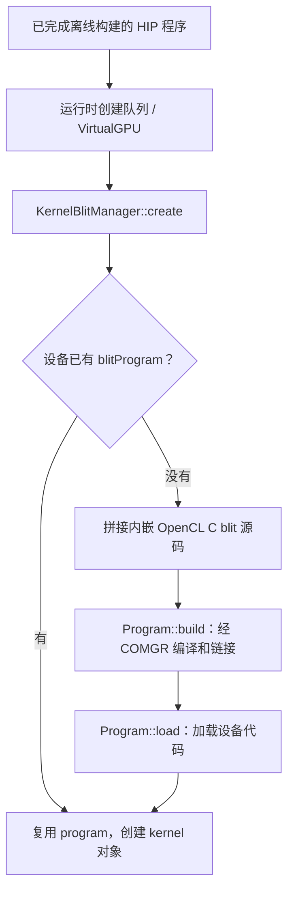

因此，即使应用本身编译成功，一个看起来只是在做内存分配、拷贝或 stream 操作的测试，仍可能在 runtime 初始化依赖的 blit 编译处失败。

### 1.2 缺的是运行时链路上的 SXGPU codegen 接入 和 重定向

HIPSX 离线路线已经安排了“Clang 产出 IR，再调用外部 SXGPU llc”的步骤。但 runtime 不会因为应用曾经由 HIPSX 编译，就自动沿用那次 Driver 的工具选择。它重新通过 COMGR API 发起自己的编译请求，COMGR 再在进程内构建、执行 Clang jobs。

从改动前的 `codeGenBitcodeToRelocatable()` 可以看到，它要求 `-c`，让原有 Clang 路径直接完成目标文件输出，尚没有这次追加的 HIPSX llc、llvm-mc jobs。与此同时，runtime 使用的 `sxgpu021` ISA 身份也需要与 COMGR 复用的 AMD 编译路径衔接。**离线工具链接通，并不等于运行时 COMGR 链路也已经接通。**

这次工作的精确目标是：保持 ROCclr 请求 BC 到 relocatable 的接口与结果类型，在 COMGR 内部让 cc1 停在文本 IR 输出，再接入 SXGPU llc 和 llvm-mc，最后仍向 runtime 返回目标文件；runtime 随后用另一个 COMGR action 链接 executable。

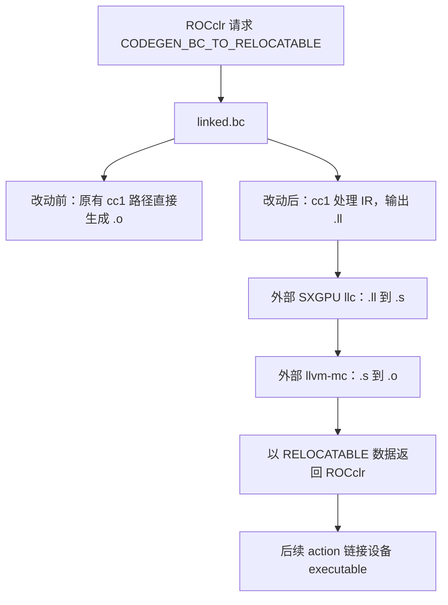

这里需要把“要解决的接入问题”与“接通后暴露的后端问题”分开。既有 fence 测试记录显示，新路径已生成 `.ll`，随后 SXGPU llc 编译 `__amd_rocclr_fillImage` 时报告 `Potential legalization loop!`；9 月 14 日的审计又用最小 IR 确认了具体 image intrinsic 的缺口。这说明运行时编译已经走到了新的后端入口，但完整运行仍未通过。这是说明有尚未支持的 intrinsic 未实现。

### 1.3 两条路径在哪里汇合

先略去 host 编译、fat binary 封装和加载细节，只看本文关心的设备端路径：

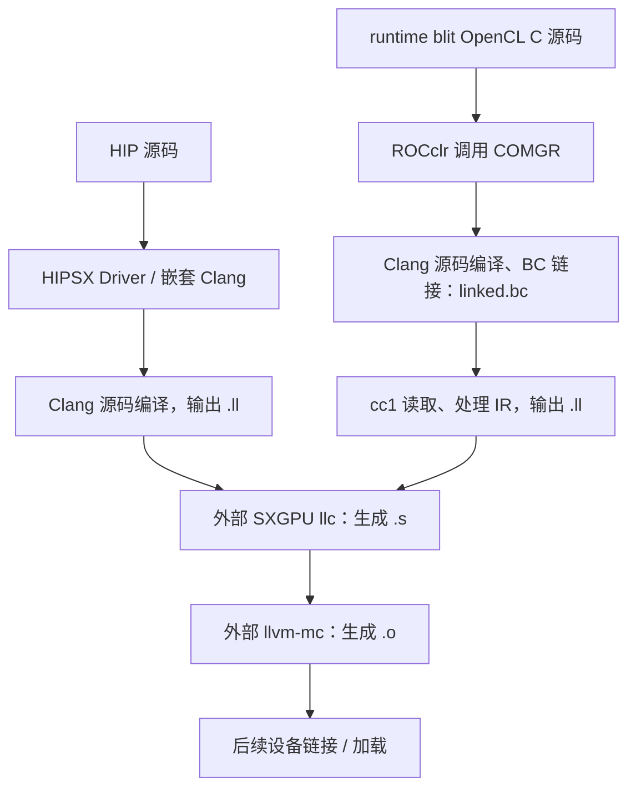

图中的汇合表示两边都可以用 `.ll` 交给 SXGPU 后端，**不表示两边生成的 IR、优化配置、设备库和后续封装完全相同**。

这里也要修正我当时一句过于简略的描述：“blit 源码就是 bitcode”。按当前 ROCclr 代码，`Device::BlitProgram::create()` 先拼接 `BlitLinearSourceCode`、按设备能力加入的 `BlitImageSourceCode` 和额外 kernel，然后创建 `Program::OpenCL_C` 程序并 build、load。

所以，blit 的起点仍然是内嵌的 OpenCL C 源码。**我接手修改的 `CODEGEN_BC_TO_RELOCATABLE` 阶段，其输入才已经是 bitcode。** 把某个阶段的输入误当成整个流程的起点，是这次理解偏差的一个来源。

## 2. 一个 clang 入口，两种职责

这里唯一需要注意的，`-cc1` 作为入口参数，是因为clang同时具备了两种职责后不得不做的区分。类似于条件判断。

### Driver：把一次请求变成一组工作

通常执行 `clang ...` 时，先进入 Driver。它解析用户选项、确定输入类型和目标工具链，构造编译阶段之间的依赖，再把阶段落实成命令。

在当前实现中，可以沿着下面这条主线阅读：

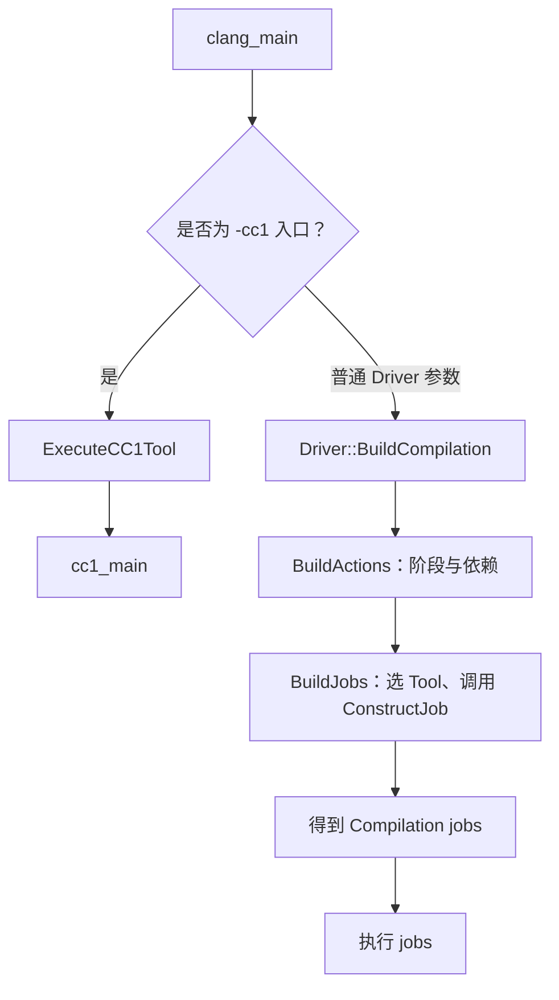

`BuildCompilation()` 构造计划，执行任务是随后的一步。没有 `-cc1` 也不意味着一定创建 `HIPSXToolChain`：工具链取决于目标和 offload 配置。本文这条 HIP 路线在设备目标为 SXGPU 时，才选到定制的 `HIPSXToolChain`。

### cc1：执行一次具体的编译

带上 `-cc1` 后，进入 Clang 内部编译入口。`cc1_main()` 建立编译实例、解析内部参数，再调用 `ExecuteCompilerInvocation()`。

`-cc1` 区分的是入口职责，而不是“必然启动另一个进程”。当前 `driver.cpp` 还支持通过 `Driver::CC1Main` 回调在进程内执行 cc1。看到日志里有 `clang -cc1 ...`，只能先确认这是一个 cc1 job，不能仅凭命令文本判断它的进程边界。

## 3. Driver 的关键数据结构

最容易混淆的是 `Action`、`Tool` 和 `Command`。它们分别回答不同问题：

| 数据结构 | 负责什么 | 本文中的例子 |
| --- | --- | --- |
| `Driver` | 解析选项、组织整个编译请求 | `BuildCompilation()` |
| `Compilation` | 整体编译任务，持有参数、Action、Job 和文件管理信息 | `C->getJobs()`、`C->MakeAction<...>()` |
| `Action` / `JobAction` | 某个动作/任务阶段 | `CompileJobAction`、`BackendJobAction`、`AssembleJobAction` |
| `ToolChain` | 为目标提供工具选择、程序查找和相关策略 | `HIPSXToolChain` |
| `Tool` | 具体的一个阶段工具 | `Clang_IR`、`LLC`、`Assembler` |
| `InputInfo` | 描述某一步的输入或输出，包含类型及文件等信息 | `TY_LLVM_IR` 对应的 `.ll` 输入 |
| `Command` | 构造的一条具体命令 | 一条 `llc -march=sxgpu ...` 命令 |
| `ArgList` / `ArgStringList` | 保存解析后的选项或即将传给工具的参数 | 构造 `CmdArgs` |

这些结构之间的关系可以这样看：

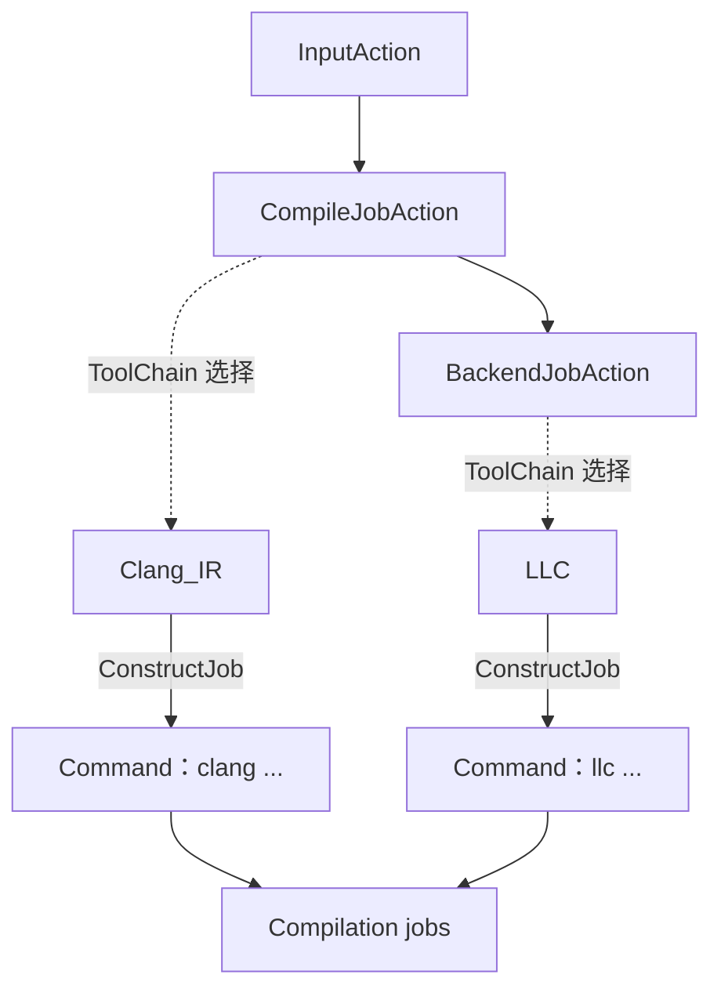

Action 描述阶段，Command 描述执行。两者不能简单地当成一一对应关系：一次 `ConstructJob()` 可以追加多个命令，Driver 也可以把若干阶段合并到一次 Clang 调用中。

### HIPSX::Clang_IR 并没有直接构造 -cc1

**`Clang_IR::ConstructJob()`先构造另一条普通 Clang Driver 命令，再由那层 Driver 构造 cc1 job。**

其主要参数形态是：

```text
clang -x hip -S -emit-llvm --cuda-device-only [options] input.cpp -o output
```

这里没有 `-cc1`。真正添加 `-cc1` 的通用实现位于 `tools::Clang::ConstructJob()`，即 `clang/lib/Driver/ToolChains/Clang.cpp`。

`Clang_IR` 还刻意不转发 `--offload-arch`。源码注释说明，若把 SXGPU offload 配置继续交给子 Clang，子 Driver 可能再次选择 HIPSX，递归回到 `Clang_IR`。这解释了为什么不能只看最外层的目标参数，就认为每一层 Clang 都在同一套工具链配置下运行。

此外，`Clang_IR::ConstructJob()` 还有按 Action 输出类型追加 `llvm-as` 或 `llc` 的分支。本文图例抓住的是“Clang 产出 IR，再交给外部后端”的主线，不把它画成所有选项下唯一不变的命令序列。

## 4. cc1 不只是 C/C++ 到 IR

我最初把 cc1 理解得太窄：输入源码，得到 AST，再从 AST 生成 LLVM IR。这个理解漏掉了两个事实：

1. cc1 可以继续调用 LLVM 后端，直接产出汇编或目标文件。
2. cc1 可以直接以 LLVM IR 为输入，这时根本不需要重新走源码解析和 AST。

### 一次编译的配置与执行对象

| 数据结构 | 作用 |
| --- | --- |
| `CompilerInvocation` | 保存解析后的编译配置，包括 `FrontendOptions`、`CodeGenOptions`、目标和语言选项等 |
| `CompilerInstance` | 持有一次编译的配置及执行设施，如诊断、文件管理、源码管理等 |
| `FrontendAction` | 决定这次编译做什么；`CreateFrontendAction()` 根据 `ProgramAction` 创建它 |
| `CodeGenAction` | 承接生成代码或处理已有 IR 的动作 |
| `BackendConsumer` / `CodeGenerator` | 在源码路径上消费 AST、生成 Module，并衔接后端处理 |
| `llvm::Module` | 内存中的 LLVM IR，包含函数、全局变量、元数据、目标信息等 |
| `BackendAction` | 决定后端最终输出 `.ll`、`.bc`、汇编、目标文件，或不输出文件 |

`ExecuteCompilerInvocation()` 的主干是创建 `FrontendAction`，然后调用 `CompilerInstance::ExecuteAction()`。

到了 `CodeGenAction::ExecuteAction()`，源码与 IR 输入分开处理：

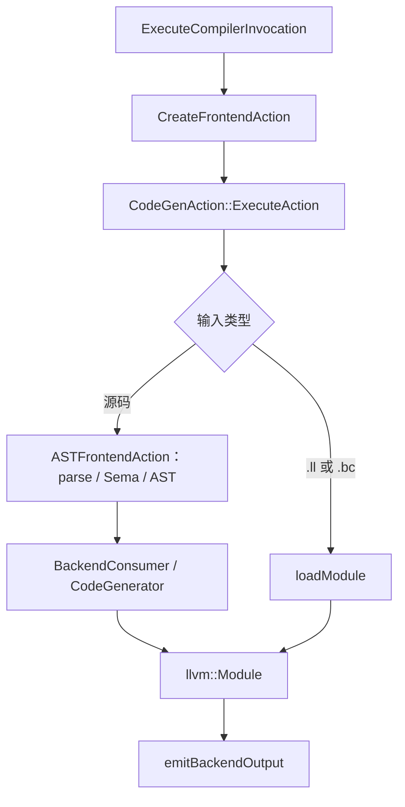

这也是 bitcode 输入不需要我另写一套处理器的原因。`.bc` 是 IR 的二进制表示，`.ll` 是文本表示；读进来以后，后续处理面对的都是 Module。直接读 BC 并不意味着无需后续处理，设备库链接、优化和目标相关调整仍可能发生。

### 四种 Action 不要混在一起

代码里反复出现 “action”，但不全是一个概念：

| 层次 | 类型 | 表达的意思 |
| --- | --- | --- |
| COMGR API | `amd_comgr_action_kind_t` | 对一组输入数据做什么，例如 BC 到 relocatable |
| Clang Driver | `driver::Action` | 编译任务图中的阶段及依赖 |
| Clang 执行层 | `FrontendAction` | 一次 CompilerInstance 执行的具体动作 |
| Clang 后端接口 | `BackendAction` | Module 最终以哪种形式输出 |

它们会逐层传递意图，但不是同一个枚举或同一个对象。尤其 `BackendJobAction` 与 `BackendAction` 名字相近，前者属于 Driver 的任务图，后者属于实际后端输出选择。

同时注意 FrontendAction 执行整个任务，需要后端处理时，用 BackendAction 指定要做哪种处理。

## 5. 改参数为什么能改变编译终点

普通 Driver 选项与 cc1 内部选项也要分层看。在本文涉及的非 LTO 常见路径中：

| 希望得到的输出 | Driver 侧的典型选项 | cc1 侧的动作参数 | BackendAction |
| --- | --- | --- | --- |
| 文本 LLVM IR `.ll` | `-S -emit-llvm` | `-emit-llvm` | `Backend_EmitLL` |
| LLVM bitcode `.bc` | `-c -emit-llvm` | `-emit-llvm-bc` | `Backend_EmitBC` |
| 汇编 `.s` | `-S` | `-S` | `Backend_EmitAssembly` |
| 可重定位目标文件 `.o` | `-c` | `-emit-obj` | `Backend_EmitObj` |


### Backend 里也不只有一条 PM

当前 `BackendUtil.cpp` 的常规路径由 `EmitAssemblyHelper::emitAssembly()` 组织：

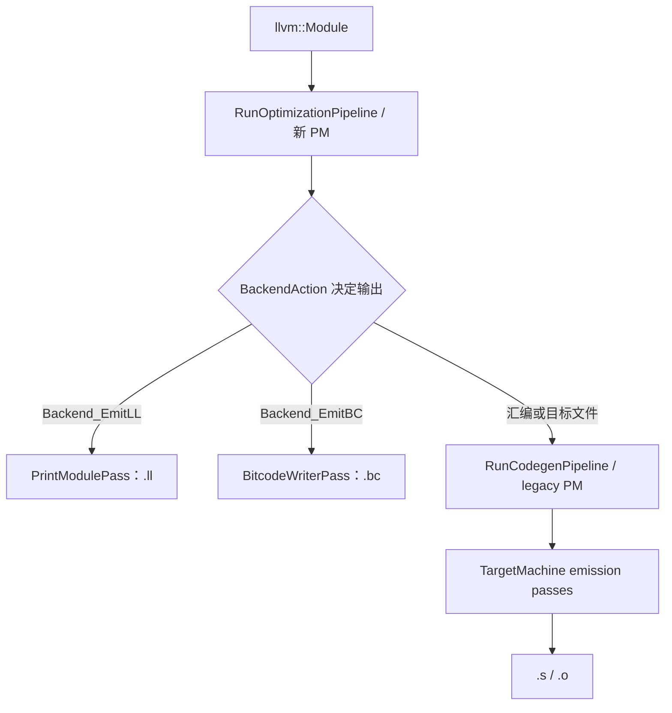

前者运行 IR 优化及相应输出 pass；后者在需要机器代码生成时，加入目标后端的 codegen/emission passes。该分支的机器代码生成仍使用 legacy PM。

**选择 `Backend_EmitLL` 不是完全不进 Backend，而是在完成所配置的 IR 处理后打印 Module，不执行这里的机器代码生成流水线。** 是否优化、执行哪些 pass，仍然由编译配置决定。`-emit-llvm` 本身不等于“关闭优化”，文本输出也不等于原始输入的无变化转写。


## 6. ROCclr 如何把请求交给 COMGR

runtime 这边的公开接口比 Driver **更像一个数据处理 API**：

```cpp
amd_comgr_do_action(kind, action_info, input_set, result_set);
```

ROCclr 的 `amd::Comgr::do_action()` 封装了这个调用。在动态加载配置下，`ComgrEntryPoints` 保存 COMGR 的函数指针，`Comgr::LoadLib()` 负责加载库、查找入口。这里是调用共享库中的函数，不是让 ROCclr 拼一条 shell 命令启动 COMGR 程序。

### COMGR 的关键数据结构

| 外部句柄 / 内部结构 | 关键内容 | 用途 |
| --- | --- | --- |
| `amd_comgr_data_t` / `DataObject` | `DataKind`、`Data`、`Size`、`Name`、引用计数 | 一份源码、BC、目标文件或日志 |
| `amd_comgr_data_set_t` / `DataSet` | `DataObjects` | 一次 action 的输入或输出集合 |
| `amd_comgr_action_info_t` / `DataAction` | `IsaName`、`Language`、选项、`ShouldLinkDeviceLibs`、日志和 VFS 配置 | 描述如何执行；动作种类另由 `kind` 传入 |
| `AMDGPUCompiler` | ActionInfo、输入输出集合、参数、临时目录、文件系统、日志 | 把编译类 action 转换为内部工作 |

这层的 `DataObject` 存的是字节和类型，不是 `llvm::Module`。只有进入 LLVM 的读取或编译过程后，才得到内存中的 Module。

ROCclr 的 `Program::linkLLVMBitcode()` 调用 `LINK_BC_TO_BC`；`Program::compileAndLinkExecutable()` 则把 BC 生成目标文件，再链接成可加载的设备程序。在源码构建的常见路径里，阶段关系如下：

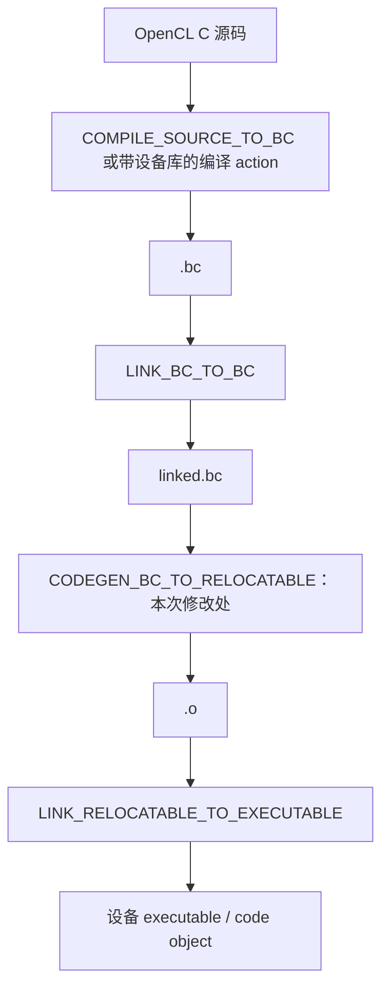

需要汇编转储时，runtime 还可以单独请求 `CODEGEN_BC_TO_ASSEMBLY`。输入已经是后续阶段产物时，也不必重新经过图中的全部步骤。

## 7. COMGR 复用了 Driver，也复用了 cc1 的执行函数

COMGR 内部没有自己重新实现一套 Clang 前端，而是同时借用了任务规划和编译执行两层能力。

对 BC 到目标文件这条路径，可以沿着以下调用链阅读：

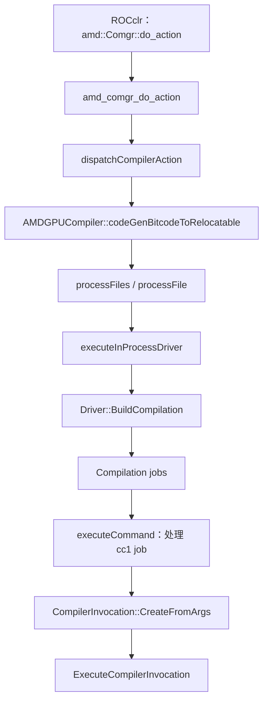

`executeInProcessDriver()` 先建立 `Driver`，调用 `BuildCompilation(Args)`，得到真实的 `Compilation` 和 jobs。接着，`executeCommand()` 检查 job 参数。碰到 `-cc1` 时，它建立自己的 `CompilerInstance`、设置文件系统与诊断，解析 job 参数，直接调用 `ExecuteCompilerInvocation()`。

也就是说，COMGR **没有调用 `cc1_main()`，而是进入了 `cc1_main()` 最终也会调用的执行函数**。

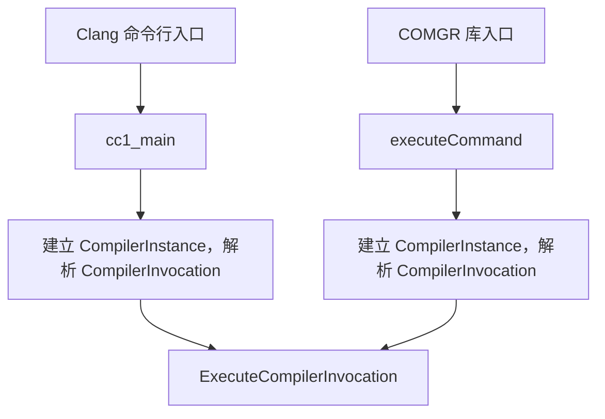

我当时把它称为“构造伪命令再调用函数”。更准确地说，命令和参数确实是 Driver 正常构造出来的，只是 COMGR 用自己的执行器消费这些 job，没有把 cc1 当成外部进程启动。

两条入口也不是每个细节完全相同。COMGR 要接管日志、虚拟文件系统、错误返回和可重复调用时的状态处理。例如 `executeCommand()` 会去掉 `-disable-free`，并清理 LLVM 选项状态。正常 COMGR job 路径还包含 `ClangCommand` 和命令缓存包装。

## 8. 这次改动具体接在了哪里

### 8.1 先保留 runtime 的 ISA 身份

当前 COMGR 使用的 runtime ISA 名是：

```text
amdgcn-amd-amdhsa--sxgpu021
```

`addTargetIdentifierFlags()` 把其中的 `sxgpu021` 映射为传给 AMD 编译路径的 `gfx1030`，同时保留 `ActionInfo->IsaName`。因此，这里存在不同层次的目标身份：

| 所在位置 | 当前路径使用的值 |
| --- | --- |
| runtime / COMGR ActionInfo | `amdgcn-amd-amdhsa--sxgpu021` |
| COMGR 构造的 Clang Driver 参数 | `-target amdgcn-amd-amdhsa -mcpu=gfx1030` |
| 外部 llc | `-march=sxgpu -mtriple=sxgpu-amd-amdhsa` |
| 外部 llvm-mc | `-triple sxgpu-sx-amdhsa --mcpu=sxgpu` |

这解释了“复用 AMD 前端和 IR 处理，再交给 SXGPU 后端”在代码里的具体形态。它不意味着 SXGPU 和 gfx1030 的所有能力、ABI 或 intrinsic 都等价。

`UseHIPSXCodegen` 的开启条件则更具体：目前两个 BC codegen 函数都是对完整 ISA 字符串做精确比较。不能把这项改动描述成自动覆盖全部 SXGPU 型号或任意带 feature 后缀的 ISA 名。

### 8.2 保留最终结果，只改变 cc1 的中间结果

`codeGenBitcodeToRelocatable()` 原本要求 `-c`，并约定最终返回 `AMD_COMGR_DATA_KIND_RELOCATABLE`、文件后缀 `.o`。

启用 HIPSX codegen 后，`processFile()` 的核心逻辑可以概括为：

```cpp
// Simplified from processFile; not a standalone patch.
bool EmitAssembly = llvm::is_contained(Args, StringRef("-S"));
Argv.back() = Saver.save(Twine(OutputFilePath) + ".ll").data();
llvm::erase_if(Argv, [](const char *Arg) {
  return StringRef(Arg) == "-c" || StringRef(Arg) == "-S";
});
Argv.push_back("-S");
Argv.push_back("-emit-llvm");
return executeInProcessDriver(Argv, OutputFilePath, EmitAssembly);
```

这里保存了两件不同的事：原 action 最后要 `.s` 还是 `.o`，以及当前 cc1 必须先输出 `.ll`。如果把它们混成一个输出类型，只改参数就可能让上层收到错误种类的数据。

准确地说，当前实现**修改的是交给 Driver 的参数，由 Driver 生成对应的 cc1 参数**，没有在编译器后端深处硬改 pass pipeline，也没有直接修改已构造好的 cc1 job。

### 8.3 保留已有 cc1 jobs，追加 HIPSX 工具命令

`executeInProcessDriver()` 先记录 `BuildCompilation()` 生成的 job 数，再临时建立 `HIPSXToolChain`，为外部步骤构造 Action 和 `InputInfo`：

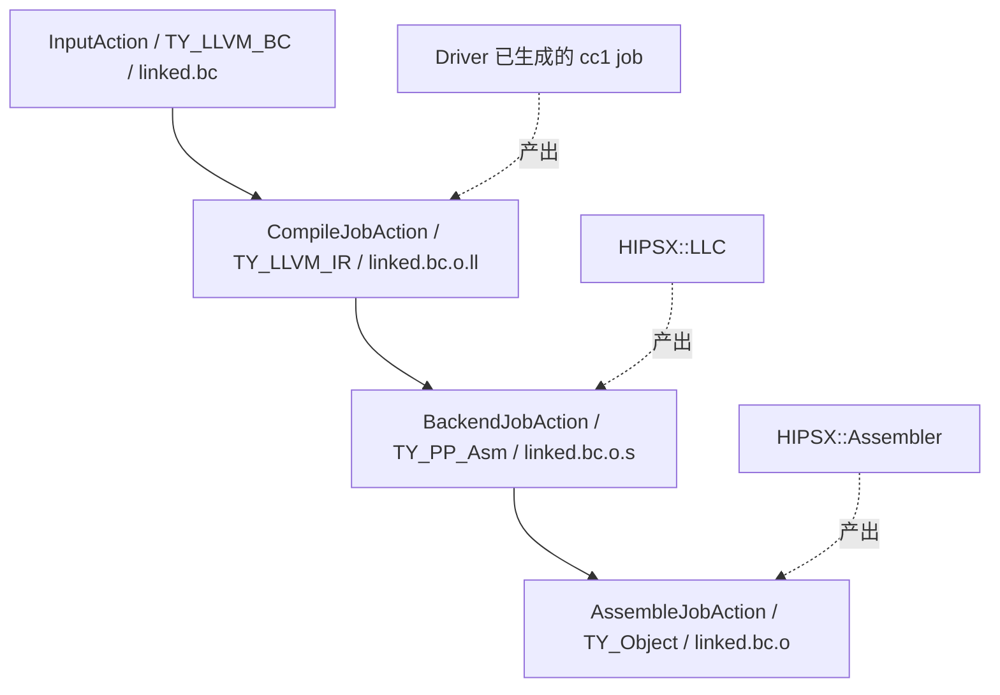

这里新建的 Action 用来描述追加工具命令的输入输出；真正执行 IR 处理的仍是前面 Driver 已经生成的 cc1 job。COMGR 在这里直接复用 `HIPSX::LLC::ConstructJob()` 和 `HIPSX::Assembler::ConstructJob()`，没有再调用 `HIPSX::Clang_IR`。

传给 LLC 的输入类型明确设为 `TY_LLVM_IR`，所以不会进入 HIPSX 针对 BC 输入添加 `llvm-dis` 的分支。这个类型字段比文件名看起来像不像 `.ll` 更能说明走哪条代码路径。

### 8.4 在执行层分开进程内和进程外步骤

既有 cc1 jobs 仍由 `executeCommand()` 在进程内执行；追加的 `llc`、`llvm-mc` jobs 则调用 `Job.Execute()` 启动外部程序。

以目标文件输出为例，数据流最终是：

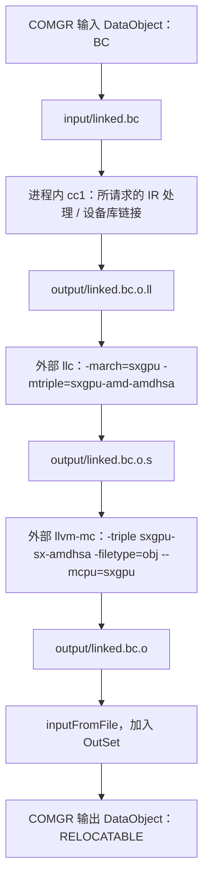

如果原 action 要求汇编，则在 llc 输出 `.s` 后结束，不运行 llvm-mc。后续生成 executable 是另外一个 COMGR action，不是这次 codegen 内部顺便完成的。

所以，“保证 COMGR 吐 LLVM IR”描述的是**内部交接点**。对于仍在请求 relocatable 的 runtime，COMGR 整个 action 最后交回的还是目标文件。

## 9. 回头看，当时到底想通了什么

此前一直盯着“HIP 编译”“OpenCL blit”“COMGR runtime 编译”这些入口名称，感觉每条路都要重新理解一套实现。后来发现，最该追的是数据形态和执行边界：

- 现在拿到的是源码、序列化的 IR，还是内存中的 Module？
- 眼前的 Action 是 COMGR 的请求、Driver 的阶段，还是实际编译动作？
- 这段代码在构造命令，还是已经执行编译？
- 当前输出由哪个选项决定，下一步又由谁消费？

顺着这些问题，才看清楚 HIPSX 和 COMGR 都在复用 Clang，只是入口与任务执行方式不同。我的目标可以落实成一个明确的阶段交接：让现有 cc1 完成 IR 工作，把 `.ll` 交给 SXGPU llc，再按调用方的要求生成 `.s` 或 `.o`。

那句“第一步改参数就行了”的方向没有错。完整的实现还要保留最终输出契约、构造后续 jobs，并处理文件、日志、失败返回和目标语义。理解了这些，改动为什么有效、哪里仍然可能出问题，也就能一起解释清楚了。

## 总结

本文仍然可能存在大量纰漏和偏差，但在经过快一个月对这个问题没啥进展，单纯使用ai也会造成如果对ai的提示词仅仅停留在什么修改参数等不清晰的地方， 并不会有效的让ai解决问题，尽快解决问题的第一优先级仍然是需要个人对关键点的寻找和理解，但ai可以有效加速这个关键点的寻找。

由于本人接触编译时间较短，代码水平也有限，其中错漏之处还请读者谅解，待我日后精进。

## 附：源码定位与审核备注

以下路径以各自仓库为根，行号是写作时的定位点；后续变动时以符号名为准。

| 仓库 | 路径与定位点 | 对应内容 |
| --- | --- | --- |
| llvm-project | `clang/tools/driver/driver.cpp:217`，`ExecuteCC1Tool`、`clang_main` | Driver / cc1 分流与进程内 cc1 回调 |
| llvm-project | `clang/tools/driver/cc1_main.cpp:213`，`cc1_main` | 编译实例初始化与执行入口 |
| llvm-project | `clang/lib/Driver/Driver.cpp:1430`，`BuildCompilation` | Action 与 Job 的构造 |
| llvm-project | `clang/lib/Driver/Driver.cpp:6875` 附近，`getOffloadingDeviceToolChain` | HIPSX 工具链选择 |
| llvm-project | `clang/lib/Driver/ToolChains/HIPSX.cpp:65`，`Clang_IR::ConstructJob`；`:208`，`LLC::ConstructJob` | 嵌套 Clang Driver、llc 和 llvm-mc 命令 |
| llvm-project | `clang/lib/Driver/ToolChains/Clang.cpp:5225`、`:5470` 附近 | 添加 `-cc1`，根据输出类型选择参数 |
| llvm-project | `clang/lib/FrontendTool/ExecuteCompilerInvocation.cpp:222` | FrontendAction 创建和执行 |
| llvm-project | `clang/lib/CodeGen/CodeGenAction.cpp:1171` | 源码与 IR 输入分流 |
| llvm-project | `clang/lib/CodeGen/BackendUtil.cpp:809`、`:1184`、`:1234` | 优化流水线、机器代码生成流水线及组织入口 |
| llvm-project | `amd/comgr/src/comgr.h:94`、`:163`、`:187` | DataObject、DataSet、DataAction |
| llvm-project | `amd/comgr/src/comgr.cpp:174`、`:1412` 附近 | COMGR action 分发 |
| llvm-project | `amd/comgr/src/comgr-compiler.cpp:654`、`:744` | 进程内命令执行与 Driver 调用 |
| llvm-project | `amd/comgr/src/comgr-compiler.cpp:948`、`:1004` | 参数改写、输入落盘、结果回收 |
| llvm-project | `amd/comgr/src/comgr-compiler.cpp:1087`、`:1161`、`:1795`、`:1825` | ISA 映射、设备库和两种 BC codegen action |
| clr | `rocclr/device/device.cpp:619`；`rocclr/device/blitcl.cpp:25`、`:203` | blit 的 OpenCL C 源码起点 |
| clr | `rocclr/device/rocm/rocvirtual.cpp:1712`；`rocclr/device/rocm/rocblit.cpp:804`、`:816` | VirtualGPU 创建 blit manager，按需创建或复用 blit program |
| clr | `rocclr/device/comgrctx.hpp:347`；`rocclr/device/comgrctx.cpp:31` | COMGR 封装及动态入口加载 |
| clr | `rocclr/device/devprogram.cpp:311`、`:459` | BC 链接、生成 relocatable、链接 executable |

写作时的 `llvm-project` HEAD 为 `fb5dda37ac59a1464f530f9ec46a9e803d6b4cbf`，相关 COMGR 改动提交为 `f4c59e0eb9de0f235ac51d588baed668153c1660`；`clr` HEAD 为 `d72f45a6372ac35af284756b18ca47eec29612e7`。结论以实际读取的工作树文件为准。

验证记录来自工作树中的 `amd/comgr/docs/sxgpu-hipsx-ir-codegen.md`、`amd/comgr/docs/sxgpu-intrinsic-audit-2026-09-14.md` 与 `amd/comgr/test/sxgpu_codegen_test.c`。这些材料包含未提交文件，不能仅凭上述 HEAD 在其他机器上复原全部记录。早期交接文档关于旧 `SXGPULLC` 路径仍在工作树中的说明，已经不符合本次读取到的代码，不作为当前实现依据。

作者审核时，建议重点核对当晚记忆中的版本和三个表述：blit 是从源码开始还是从已缓存 BC 恢复；当时看的 `Clang_IR` 是否也是嵌套 Driver 实现；“只改参数”指第一步的发现还是对整个改动的概括。本文按当前可见实现写清了这些差别，叙事顺序与个人感受仍可按回忆调整。
