# 深入理解Nsight System和Nsight Compute

Nsight产品家族和分析流程：

- 首先使用Nsight system从系统层面分析程序，优化不必要的同步和数据传输等
- 根据是Compute程序还是Graphics程序分别使用Nsight Compute或者Nsight Graphics来重新进行分析

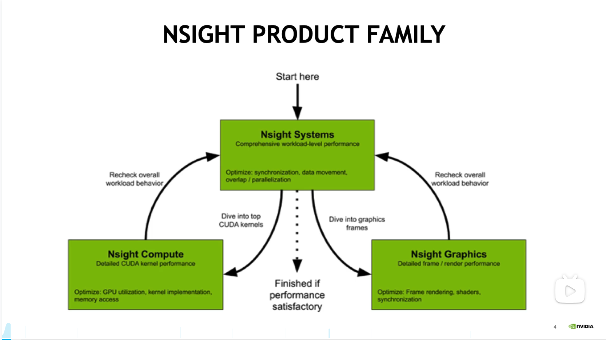

借助Profiling工具的优化流程：

- 对程序或者应用进行profiling，得到profiling结果
- 得到热点，优化性能
- 重复profiling

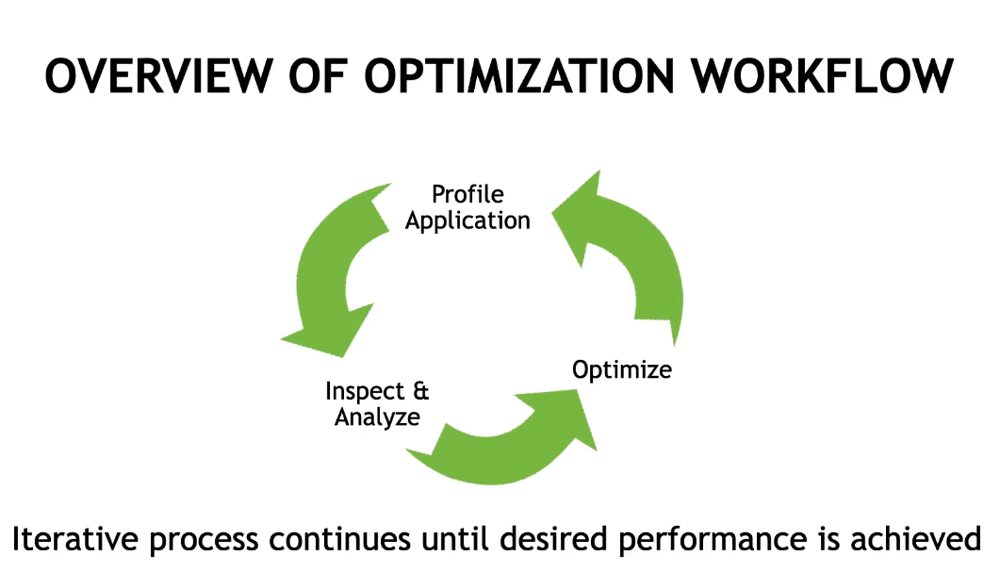

## Nsight system

---
**OverView**

- 是一个系统级别的工具
- 能够捕捉到CPU和GPU上的各种事务和交互
- 快速定位优化机会：比如CPU和GPU上的等待和不必要的同步
- 可以优化负载，任务均匀分布在CPU和GPU之间
- 是个全平台的工具

CPU和GPU上的具体事件：
- Compute部分：
    - CUDA API
    - Kernel启动和执行关联
    - 支持的库有：cuBLAS、cuDNN、TensorRT、OpenACC等
- Graphics部分：
    - Vulkan、OpenGL、DX系列、V-sync
- OS线程状态
- CPU利用率
- pthread
- 文件调用等
- NVTX

---
CPU threads

Nsight system针对CPU threads：
- 拿到一个线程活动的总览
    - 在哪一个core上，利用率多少
    - CPU状态和transition
    - OS runtime libraries usage系统运行库的使用：pthread、文件io调用
    - API的使用：CUDA、cuDNN、cuBLAS、TensorRT

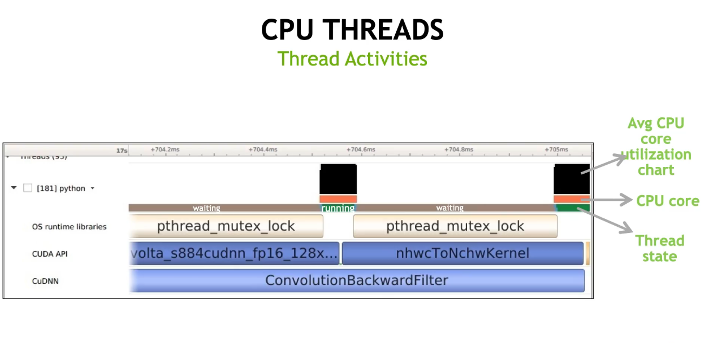
从上至下：

- CPU相关：黑色代表CPU利用率，灰色代表等待，有颜色代表处于活动状态，不同颜色代表不同CPUcore
- cuda api和库的调用的名字
- 甚至有的可以监控栈

---
CUDA API

- kernel何时启动，启动开销
- 包括所有库里、或者用户写的所有kernel
- 获得memory何时启动，启动开销


https://www.bilibili.com/video/BV1x2d5YPE6x/?spm_id_from=333.337.search-card.all.click&vd_source=f3f18edcc0411e7a1406c64c556b798e


https://www.bilibili.com/video/BV13w411o7cu/?spm_id_from=333.1007.top_right_bar_window_default_collection.content.click&vd_source=f3f18edcc0411e7a1406c64c556b798e


# 知乎总结部分

---
nsight system，进行GPU性能优化的关键工具。如果我们在服务器上安装了cuda toolkit，那么`${CUDA_HOME}/bin/nsys`就是nsight system的可执行程序。它可以分为两部分，服务器上的性能测试工具用于生成程序运行报告，以及各种平台都可用的可视化工具用于可视化报告。下面我们假设该工具已经处于PATH上，也就是nsys可以直接调用该工具。

**基本用法：**`nsys profile -o output program args`

此命令会执行 program args，然后将执行过程记录在报告文件`output.nsys-rep`中。值得注意的是，program args可以是任意命令，不需要是二进制可执行程序。

这里可以是任何命令比如：

- 脚本：
    python a.py 或者 bash a.sh 或者 powershell -File script.ps1
- 系统内置命令：
    ls -l
    echo "hello"
    mkdir  new_dir
- 或者一个复杂工具
    ping google.com

原理实际上是，nsys先启动自己，做好记录准备，然后将 `program args` 这一整串内容原封不动的交给操作系统去执行。

生成的`output.nsys-rep`文件下载到本地，打开nsight system加载记录。

**机制：链接器监听机制，劫持链接器的调用，从而为动态链接库中的每个符号（函数）加上计时和函数调用栈检测，这其中当然也包括cuda自己的很多api函数。因此，该工具本质上就是记录动态链接库全部函数及cuda api执行时间线。**

这个数据量必然是非常庞大的，因此我们要学会如何看该工具展示的结果。

> nvvp或者nvprof都已经被废弃了，一定要学会并转向nsys

---
分析程序运行过程中的时间线（并发度）

**时间线的条数代表并发书目，即有多少硬件执行资源**
- CPU
    函数调用形成时间线
- GPU
    计算单元会被切分成流，一个流内部的程序是顺序执行的

---
`nvtx`的使用

全称是NVIDIA tool extension，**主要用法是在nsight system里面输出日志，用于标记感兴趣的时间段。**严格来说是一个标记（tagging）系统，不会修改任何代码逻辑、功能或者计算行为。

在C/C++里，我们可以手动链接`libnvToolsExt.so`并调用里面的函数；

在Python里面，我们可以`pip install nvtx`安装这个工具，其实PyTorch里也直接包含了这个工具，`from torch.cuda import nvtx`即可。两种方式的函数使用稍有不同，考虑到很多人都已经安装了PyTorch，这里以PyTorch内置的nvtx为例进行介绍。

- 记录一个时间点：`nvtx.mark(msg)`，后续分析的时候可以将这个函数调用的时间点标记上消息msg

- 记录一个时间段，`nvtx.range(msg)`，可以作为环境管理器（与with语句一起使用）或者函数装饰器（与@操作符一起使用），记录一段代码的开始和结束，后续分析的时候可以将这段时间标记上消息msg。

也有其他功能，比如标记范围。

**需要对代码做一些改动，然后再执行上面的nsys语句。**

- 问题1：权限问题：如下，但是还没试会影响什么

Unable to collect CPU kernel IP/backtrace samples. perf event paranoid level is 2.
Change the paranoid level to 1 to enable CPU kernel sample collection.
Try
sudo sh -c 'echo 1 >/proc/sys/kernel/perf_event_paranoid'
 to change the paranoid level to 1.

 解决：`sudo sh -c 'echo 1 >/proc/sys/kernel/perf_event_paranoid'`临时先将优先级提高，然后再nsys profile -o

- 问题2：Nsight版本问题，会导致无法

---


https://blog.hedup.cc/?p=611

学习网址：[https://www.cnblogs.com/zhaoweiwei/p/19048895/NsightSystems]

# 新学习部分(后续试着租服务器来学试试，先把基本东西读懂)

这部分在GPU学习部分之后，预计1-2天，12号搞定，开始正经尝试

Nsight System：
    系统级性能分析工具，主要用于优化 GPU 加速应用程序（尤其是基于 CUDA、OpenCL、DirectX、Vulkan 等 API 开发的程序）的性能，帮助开发者**定位和解决计算、内存、通信等环节的瓶颈**。所谓系统层面的分析工具，除了分析GPU的使用，还要分析**CPU的使用，以及CPU和GPU的交互情况，可以捕捉CPU和GPU的各种事件，发现CPU和GPU上的等待以及不必要的同步**，可以通过Nsight systems将任务均匀的分配到CPU和GPU上。

    支持跨平台，支持本地或者远程profiling目标程序，简单来说就是在Linxu和Windows下既支持本地分析有支持远程分析目标程序，mac只支持远程。

一般流程：

- 观察CPU和GPU同步、数据拷贝、处理重叠同步运行等方面
- 优化后再分别用Compute完成Kernel层或者用Graphics完成图像层优化
- 再重头再来一轮这个流程

安装流程：

- windows下装nsight的msi文件
- cuda toolkits也能包含顶多不是新版

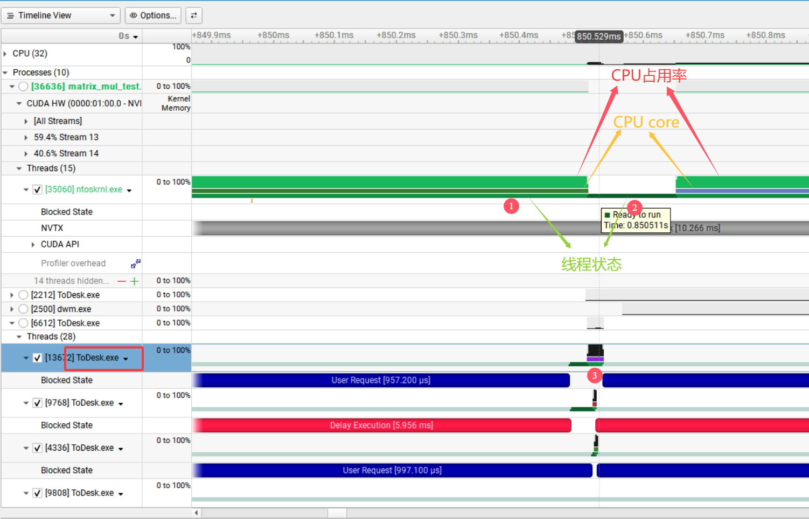

图上的解释：
    重点是去学习如何判断内存管理、设别驱动交互和线程的关系

## Nsight System使用说明

### 图形界面

---
1. **创建工程**
    打开NsightSystems后，工具中默认会创建一个Project 1的工程，可以将该工程进行重命名，如改为HelloNsight，之后需要在右侧指定一个分析目标，工具支持多种方式的目标

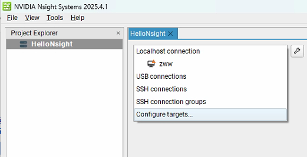

（1）Localhost connection

表示本地主机连接，即对运行 Nsight Systems 的本机进行性能分析、调试。可监测和分析本机上运行的程序，收集其性能数据，像 CPU、GPU 的使用情况，线程活动等。图图中 “zwv” 是已识别我的电脑名称。

（2）USB connections

指通过 USB 连接的调试目标。可用于分析连接到本机 USB 接口的设备上运行的程序性能，比如Jetson和Rive平台等，只要设备支持且正确配置，就能通过该连接进行性能数据采集。

（3）SSH connections

基于 SSH（Secure Shell）协议的远程连接。借助 SSH 安全通道，可连接到远程主机（如另一台服务器、开发机等），对远程主机上运行的程序进行性能分析和调试，方便管理不在本地的设备或集群环境中的程序性能。

（4）SSH connection groups

是 SSH 连接组，可将多个 SSH 连接进行分组管理。比如有多个远程服务器需要调试，可把它们的 SSH 连接归为一组，便于批量操作、统一管理和快速切换不同远程目标，提升对多远程环境调试的效率。

（5）Configure targets：
用于配置调试目标相关参数，比如添加新的调试目标、设置目标连接的认证信息（SSH 连接的用户名密码、密钥等 ）、调整连接超时时间等，对调试目标进行个性化设置和管理，确保能正确连接、识别和调试各类目标设备或程序 。

2. **配置采集项**

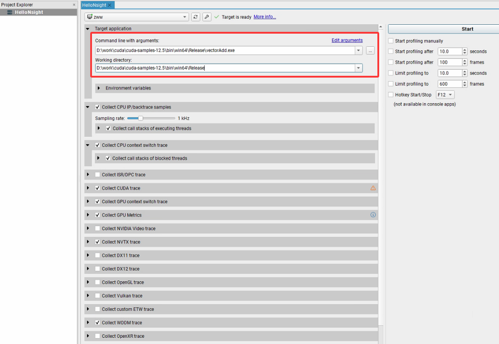

（1）配置待分析的可执行程序，以及设置相应的工作目录是进行分析的必选项，其他选项都是可以定制。

（2）采集项配置（主要分布在6个方面）：

CPU相关采集项、异构计算相关采集项、图形api追踪、其他特殊采集、Python profiling options、右侧采集触发控制

- CPU相关采集项
    - Collect CPU IP/backtrace samples
        - `IP`：指令指针；`backtrace samples`：回溯采样, 以设置的采样率记录 CPU 指令执行位置，结合调用栈，帮你**定位程序耗时**在哪些函数、代码段，分析 CPU 计算瓶颈。
        `sampling rates` : 控制采样频率，但是频率越高采集开销越大，按需平衡精度和性能
        `Collect call stacks of executing threads` : 记录 “活跃线程” 的调用栈，明确 CPU 周期到底用在哪些函数调用里。
    - Collect CPU context switch trace
        - 记录线程在 CPU 核心间切换、阻塞 / 唤醒等事件，分析线程调度效率，**排查因线程频繁切换导致的性能损耗**。
        `collect call stacks of blocked threads` : 记录 “阻塞线程” 的调用栈
- 异构计算相关采集
    - Collect CUDA trace
        - 对应记录CPU调用栈，深度追踪CUDA调用（核函数启动、内存分配）
        - `flush data periodically` 将采集数据定期从内存刷新到磁盘
        - `fulsh cuda trace buffers on cudaprofilerstop()`
        - `skip some api calls` 精简api追踪，专注关键操作
        - `cuda event trace mode` 控制CUDA Event的追踪模式，Off表示关闭，如果开启，可追踪cudaEventRecord/cudaEventSynchronize等事件，分析GPU任务同步、耗时依赖。
        - `cuda graph trace granularity`
        - `collect GPU memory usage`
        - `collect harvare-based trace` 启动硬件级追踪，采集更底层的硬件指标（如SM利用率、warp调度效率、指令吞吐率）
    - Collect GPU context switch trace
        - 追踪 GPU 上下文切换事件（如不同 CUDA 上下文切换）
    - Collect GPU Metrics
        - 硬件指标比如sm利用率、现存带宽，需要GPU支持对应的metrics采集
    - Collect NVTX trace
        - 识别程序中**通过 NVTX（NVIDIA 工具扩展）标记的自定义事件 / 区间**，方便关联业务逻辑（如 “模型推理阶段”“数据预处理”），分析各阶段耗时。
    - Collect WDDM trace（Windows 环境）
- 图形api追踪
    - 针对对应图形api的程序，比如采集api调用、渲染管线事件、分析图形渲染性能、优化画面卡顿、帧率低问题
- 其他特殊采集
- Python profiling options
- 右侧采集触发控制

3. 结果分析

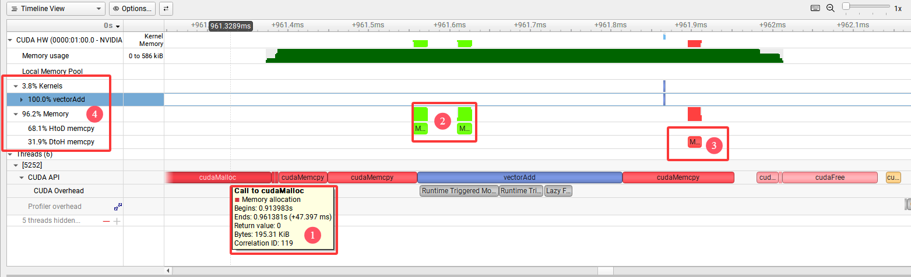

上面的参数直接对着看基本没问题：

其中三个cudaMalloc调用中，第一个调用所花费的时间要远远大于剩余两个图中标记1，这是因为在**第一次调用任何CUDA API（包括cudaMalloc）时，CUDA runtime 会进行：CUDA 上下文创建（Context Creation），驱动和设备初始化，内核模块加载等操作，这部分开销通常是毫秒级，所以第一次cudaMalloc看起来很慢**，图中标记2是HostToDevice内存拷贝，标记3是DeviceToHost内存拷贝，由于程序比较简单可见这两部分内存拷贝占用绝大部分的运行时间，而真正的Kernel函数调用仅仅占用3.8%，见标记4。

Report里有Analysis Summary来解析过程依赖的主要硬件资源，Diagnostics Summary里给出解析过程中的主要事件线索，Files给出了标准错误输出log信息，标准输出log信息，以及配置信息。

切换位置：

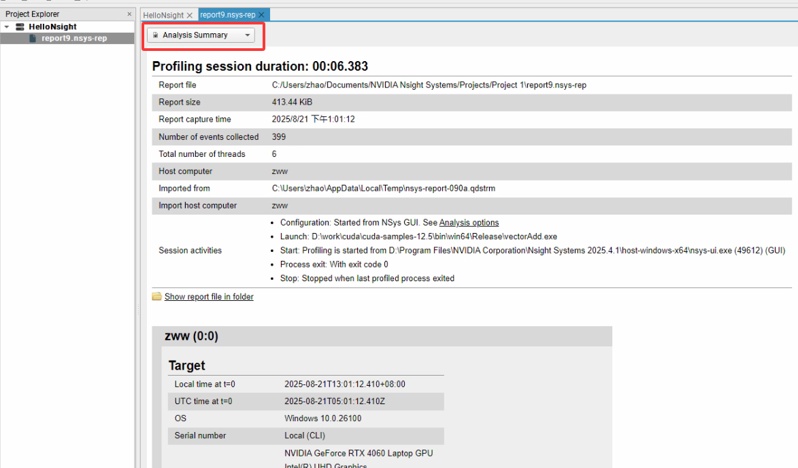

---

### 命令行

--- 

主要用在Linux操作系统下

1. **生成报告**

```bash
nsys profile -o report ./vectorAdd
```

命令执行后会生成`report.nsys-rep`分析文件，后续可以通过命令行获取相关信息或者Nsight Systems GUI工具直接打开该文件进行分析。

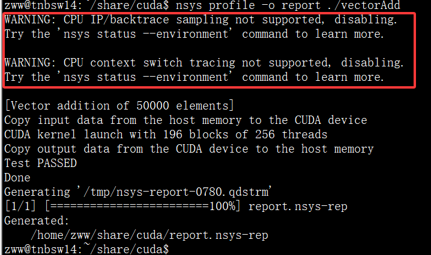

这里面的警告信息，是在说明当前环境下有一些不支持的地方，比如图片里写的IP/backtrace sampling和cpu context switch tracing，因为只是和当前的CPU或者操作系统内核之类的相关，所以出现是正常的，可以用指令查看当前环境对Nsight System各种功能的支持情况。

```bash
nsys status --environment
```

会输出如下信息：
```
Timestamp counter supported: Yes

CPU Profiling Environment Check
Root privilege: disabled
Linux Kernel Paranoid Level = 2
Linux Distribution = Ubuntu
Linux Kernel Version = 6.6.87.2-microsoft-standard-WSL2: OK
Linux perf_event_open syscall available: OK
Sampling trigger event available: OK
Intel(c) Last Branch Record support: Not Available
CPU Profiling Environment (process-tree): OK
CPU Profiling Environment (system-wide): Fail

See the product documentation at https://docs.nvidia.com/nsight-systems for more information,
including information on how to set the Linux Kernel Paranoid Level.
```

- Timestamp counter supported
    - 硬件的时间戳计数器，确保性能测量
- Root privilege
    - 根权限，可能会限制某些系统级的性能收集
- Linux kernel paranoid
    - 内核的 perf_event 安全级别设置为 2。这是一个限制，因为它阻止了非根用户对系统范围的 perf 事件进行分析，但允许对用户自己的进程进行分析
    - perf event是Linux性能工具用来监控、计数和采样测量的基础
- Linux distribution
- Linux kernel version
- Linux perf_event_open syscall available
    - 核心的 Linux 性能事件接口可用
- sampling trigger event available
    - 用于性能采样的触发事件机制可用
- Intel last Branch Record support
    - 缺乏 Intel LBR (最后分支记录) 硬件特性支持，这意味着无法进行精细的硬件级分支分析，比如分支预测或者跳转行为
- CPU Profiling Environment(process-tree)
    - 支持对当前用户启动的 进程及其子进程 进行 CPU 性能分析
- CPU Profiling Environment(system-wide) 
    - 不支持 对整个系统进行 CPU 性能分析。这是由 根权限禁用 和 内核 Paranoid Level=2 导致的限制

2. **命令行分析结果**

```bash
nsys stats report.nsys-rep
```

关键信息输出类似：

```
** CUDA API Summary (cuda_api_sum):

 Time (%)  Total Time (ns)  Num Calls    Avg (ns)    Med (ns)  Min (ns)   Max (ns)   StdDev (ns)         Name
 --------  ---------------  ---------  ------------  --------  --------  ----------  ------------  ----------------
     99.6       86,755,035          3  28,918,345.0   5,369.0     3,688  86,745,978  50,080,199.2  cudaMalloc
      0.3          223,020          3      74,340.0  43,770.0    39,025     140,225      57,107.4  cudaMemcpy
      0.1           92,533          3      30,844.3  21,988.0     4,057      66,488      32,143.9  cudaFree
      0.0           21,241          1      21,241.0  21,241.0    21,241      21,241           0.0  cudaLaunchKernel

Processing [report.sqlite] with [/opt/nvidia/nsight-systems/2023.1.2/host-linux-x64/reports/cuda_gpu_kern_sum.py]...

 ** CUDA GPU Kernel Summary (cuda_gpu_kern_sum):

 Time (%)  Total Time (ns)  Instances  Avg (ns)  Med (ns)  Min (ns)  Max (ns)  StdDev (ns)                          Name
 --------  ---------------  ---------  --------  --------  --------  --------  -----------  -----------------------------------------------------
    100.0            4,128          1   4,128.0   4,128.0     4,128     4,128          0.0  vectorAdd(const float *, const float *, float *, int)

Processing [report.sqlite] with [/opt/nvidia/nsight-systems/2023.1.2/host-linux-x64/reports/cuda_gpu_mem_time_sum.py]...

 ** CUDA GPU MemOps Summary (by Time) (cuda_gpu_mem_time_sum):

 Time (%)  Total Time (ns)  Count  Avg (ns)  Med (ns)  Min (ns)  Max (ns)  StdDev (ns)      Operation
 --------  ---------------  -----  --------  --------  --------  --------  -----------  ------------------
     67.5           33,122      2  16,561.0  16,561.0    16,513    16,609         67.9  [CUDA memcpy HtoD]
     32.5           15,937      1  15,937.0  15,937.0    15,937    15,937          0.0  [CUDA memcpy DtoH]
```

- 输出信息第1~8行是CPU API 调用耗时统计，StdDev为运行时间的标准差。

- 由第8行可知，在Linux平台下整个cudaLaunchKernel调用时间仅有21,241 ns，在整个程序运行时间中的占比基本可以被忽略。

- 输出信息第10~16行是Kernel函数vectorAdd的运行时间为4128ns。

- 输出信息第20~25行是设备和主机内存互拷所用时间，分别是33123ns和15937ns，这三部分时间中，Kernel运行时间只占4128.0/(4128+33122+15937)=0.0776，即7.8%左右。

---

在 Nsight Systems 中使用 `nsys profile` 命令时，加上 `--stats=true` 参数会产生.sqlite文件，参数会使 Nsight Systems 在收集性能数据的过程中，额外收集并整理统计信息， 而.sqlite格式在存储结构化数据和统计信息方面有较好的支持和优势。

开启该参数后，工具为了更方便地存储和组织这些额外的统计数据，会生成.sqlite文件，以充分利用 SQLite 数据库在数据管理和查询上的特性，便于后续对性能统计信息进行分析、检索，可用sqlite工具打开相应文件。


**官方命令行文档**[https://docs.nvidia.com/nsight-systems/UserGuide/index.html]

## Nsight Compute使用

[https://www.cnblogs.com/zhaoweiwei/p/19058528/NsightCompute]

### 初步探索

---

1. **实例分析**

在新建的工程中只指定编译好的可执行文件及其输出report文件，其他部分都保持默认，然后直接点击“Launch”进行分析：

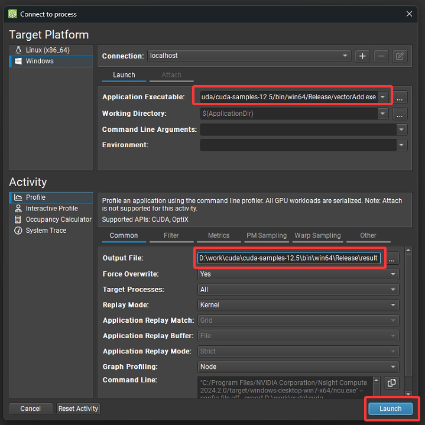

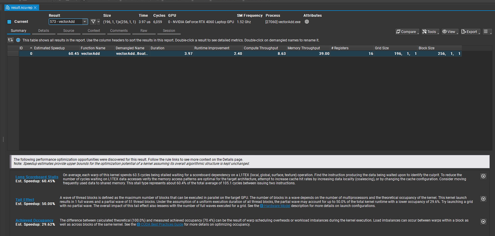

图中要注意的点：

从最顶上一行开始：
- 内核名称：vectorAdd
- 接下来是核函数的执行Size，Grid Size(196, 1, 1)，即网格维度，共196个线程块，Block Size(256, 1, 1)，即块维度
- 再接下来是时间指标Time，内核执行总时间是3.97 us，微秒级；
- Cycles是**GPU核心执行内核函数所消耗的时钟周期数**，这里为6059个周期；
- GPU是运行当前可执行程序的显卡，即NVIDIA GeForce RTX 4060 Laptop GPU（移动版 RTX 4060）；
- SM Frequency是频率，1.52GHz，对应1个周期约为0.65789纳秒，乘于周期数6059，则为3986ns，和之前Time 3.97us基本相等。

性能指标：
底下的选项卡：Summary、Details、Source等等

- Estimated speedup：性能优化潜力（理论加速比），60.45 表示最多可加速 60 倍，表明kernel还有较大改进空间
- Function Name：内核函数名 vectorAdd，对应代码中的 __global__ void vectorAdd(...)
- Demangled Name：符号解析后的名称（编译器相关，一般无需关注）
- Duration：内核执行总时间
- Runtime Improvement：运行时优化空间，2.40 表示可通过优化减少 2.4 倍运行时间
- Compute Throughput：计算吞吐量 8.63（单位：GFLOP/s 或类似），反映计算密集度
- Memory Throughput：内存吞吐量 39.00（单位：GB/s），反映内存访问效率，**越接近GPU理论带宽当然越好**
- Registers：每个线程使用的寄存器数量 16，属于比较低的寄存器占用
- Grid Size: 196,1,1
- Block Size: 256,1,1

底部警告部分（纯图中文字描述）：
大数字都是理论上还能加速多少，越小越接近越快

- Long Scoreboard Stalls
    问题：平均每个 Warp 有 63.5 cycles 在等待 L1TEX（本地、全局、表面、纹理）数据返回，占总周期的 60.4%，即60.4%时间浪费在指令间的等待上。
    **理解为内存访问延时**

优化方法：内存访问模式（合并访问、提高数据局部性），将高频使用的数据移到共享内存（Shared Memroy）。

- Achieved Occupancy（估计可提升 29.62%）
    问题：理论最大 occupancy 为 100%，实际测量值只有 70.4%，低 occupancy 的原因可能是 warp 调度开销或 workload 不均衡。
    occupancy是每个流多处理器（SM）上活跃的Warp数量与最大可支持Warp数量的比值。
    **理解为线程调度问题**，这个和尾部效应也是相关的

优化方法：调整 block size / grid size，提升 SM 利用率；避免线程块间负载不均衡。

- Tail Effect（尾部效应）
    问题：一个 grid 的线程块不能整除 GPU 可并行调度的“波数”，导致最**后一批 thread block 不能充分利用硬件资源**，当前配置造成了 最多 50% 的执行浪费。

优化方法：尝试修改 grid size，使得 block 数量更接近硬件多处理器的倍数，增加 workload（更多线程块），避免出现“半波”执行。

---

2. **以vectorAdd为例的优化**

首先，vectorAdd这个案例本身就是kernel很轻量，很简单。所以瓶颈一开始通常在内存带宽：

- 使用更大数据规模去真正压满GPU内存带宽
- 改用pinned memory + cudaMemcpyAsync pipeline做数据传输 overlap
    异步的数据传输流水线以及分块啥的
- 改写 kernel，让每个线程做 更多计算（算力 bound 而不是带宽 bound），比如循环展开的写法，去复杂算子的结构和计算

第一种改法：
增大数据规模，即增大向量个数，再profile看一下memory throughput

查看GPU理论带宽:`memCLockMHz`,`busWidthBits`,`theoreticalBW`
```cpp
cudaDeviceProp prop;
int device;
cudaGetDevice(&device);
cudaGetDeviceProp(&prop);

printf("GPU: %s\n", prop.name);
printf("Memory Clock: %.0f MHz, Bus Width: %.0f bits\n", memClockMHz, busWidthBits);
printf("Theoretical Memory Bandwidth = %.2f GB/s\n\n", theoreticalBW);  // 理论带宽优化率


//计算真实带宽
double totalBytes = 3.0 * size; // bytes  读A B 写C 共三次
double bandwidthGBs = (totalBytes / (milliseconds / 1000.0)) / 1e9;
printf("VectorAdd size = %d elements\n", N);
printf("Time = %.3f ms\n", milliseconds);
printf("Effective memory bandwidth = %.2f GB/s\n", bandwidthGBs);
```

使用了cuda event计时：
```cpp
cudaEvent_t start, stop;
cudaEventCreate(&start);
cudaEventRecord(start);
vectorAdd<<<blocksPerGrid, ThreadsPerBlock>>>(d_A,d_B,d_C,N)
cudaEventCreate(&stop);
cudaEventRecord(stop);

float miliseconds = 0;
cudaEventElapsedTime(&miliseconds, start, stop);

```

结果和打印如下图：
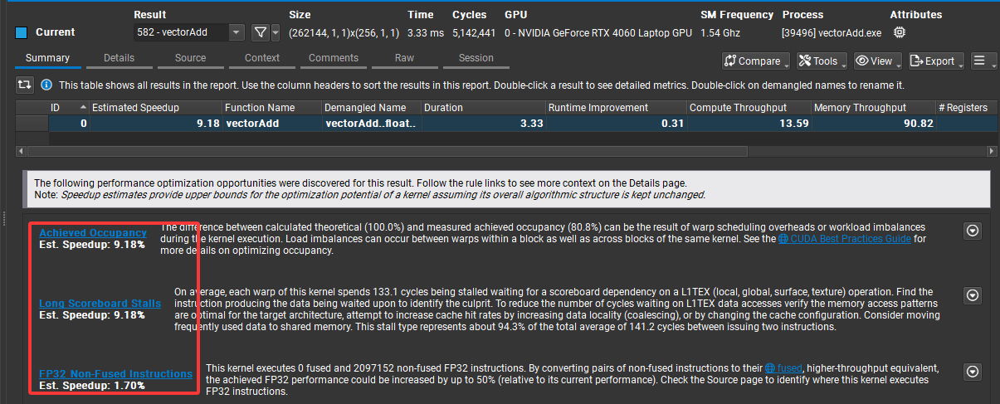

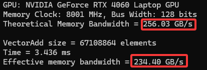

第二种改法，**使用固定内存（pinned memory）**，和分chunk\stream流绑定

默认 malloc 出来的 host 内存是 pageable（可分页）的，GPU 在拷贝时可能需要额外的staging（暂存缓冲区），速度会打折扣。
用 cudaMallocHost() 或 cudaHostAlloc() 分配 页锁定内存，CUDA 就能直接 DMA 到显卡，带宽更高。
另外**cudaMemcpy 是阻塞的，拷贝完成前 CPU 会停在那里**，**cudaMemcpyAsync + stream 可以异步执行，拷贝和 kernel 可以 并行 overlap**。
最后借助Pipeline（流水线）技术，把大数据分成多块 (chunk)，拷贝第 N 块时，GPU 可以同时计算第 N-1 块，实现计算与拷贝重叠，提升吞吐率。

**创建和使用stream**

```cpp
cudaStream_t stream;
cudaStreamCreate(&stream);

//计时部分  略，最后要一个elapsed time再计算一下
//就是改写成循环的chunk加异步的指定流

for (int offset = 0; offset < N; offset += Chunk_Size) {
    //先分块
    int chunkElems = min(Chunk_Size, N-offset);
    int blocks = (chunkElems + ThreadPerBlock - 1) / ThreadPerBlock;

    //异步部分 加指定流

    cudaMemcpyAsync(d_A, h_A + offset, chunkElems * sizeof(float),
                        cudaMemcpyHostToDevice, stream);
    cudaMemcpyAsync(d_B, h_B + offset, chunkElems * sizeof(float),
                        cudaMemcpyHostToDevice, stream);

    vectorAdd<<<blocks, THREADS_PER_BLOCK, 0, stream>>>(d_A, d_B, d_C, chunkElems);

    // 异步拷贝 D2H
    cudaMemcpyAsync(h_C + offset, d_C, chunkElems * sizeof(float),
                        cudaMemcpyDeviceToHost, stream);
    
}

```

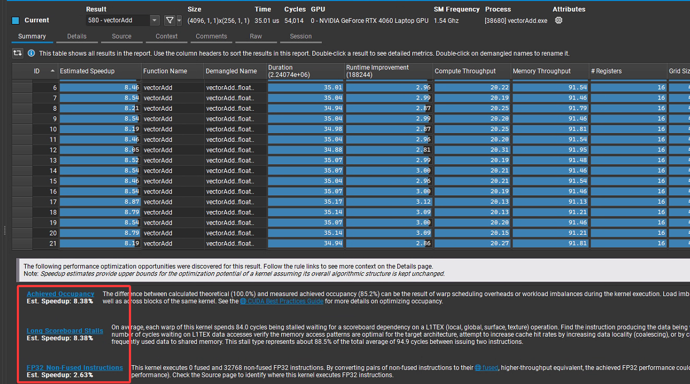

---
第三种方法，提高kernel计算复杂度，循环展开

```cpp
__global__ void vectorAdd_computeHeavy(const float* A, const float* B, float* C, int n, int iters) {
    int idx = blockIdx.x * blockDim.x + threadIdx.x;

    if(idx >= n) return;

    float a = A[i];
    float b = B[i];   //从全局内存里取的操作没变

    float acc = 0.0f;

    #pragma unroll 4  // 让编译器展开一部分循环提高指令吞吐
    for (int k = 0; k < iters; ++k) {
        // 3 次 FMA；每次 FMA 记作 2 FLOPs
        acc = fmaf(a, b, acc);             // acc += a*b
        acc = fmaf(acc, 1.000001f, 1e-7f); // 轻微扰动，避免常量折叠
        b   = fmaf(b, 0.9999993f, -1e-7f); // 变化寄存器值，避免被优化
    }

    // 写回一次
    C[i] = acc;
}

```

yysy，没看懂在干嘛（只知道循环展开，fmaf为啥这么用不知道）

---

### 界面详解

**Launch界面下半部分**


#### Activity

支持四种分析模式：

- **Profile**：常规的性能分析模式，使用命令行分析器（command line profiler ），按顺序分析 GPU 上的任务，便于精准采集每个 Kernel 等的性能数据
    “Attach is not supported for this activity” 表示该模式不支持 Attach 方式，只能通过 Launch 启动程序分析；
    “Supported APIs: CUDA, OptiX” 说明支持分析基于 CUDA（NVIDIA 通用并行计算架构）和 OptiX（光线追踪引擎）开发的程序。

- **Interactive Profile**：交互式分析模式，相比常规 Profile ，允许在分析过程中更灵活地探索数据，比如交互式查看不同 Kernel、不同指标的性能表现，进行实时的筛选、对比等操作

- **Occupancy Calculator**：专注于计算 GPU 内核（Kernel）的占用率相关指标，像活跃线程块数量、 warp 调度情况等，帮助你分析硬件资源利用是否充分，了解 Kernel 启动配置（如线程块大小等）对资源占用的影响

- **System Trace**：系统级追踪模式，不仅关注 CUDA 程序本身，还会采集系统层面的事件，比如 CPU 线程调度、GPU 与 CPU 之间的数据传输时序等，用于分析程序在整个系统环境中与其他进程、硬件交互的性能瓶颈

**最常用的Profile模式下的具体配置**

- **Output File**：设置性能分析结果文件的输出路径和命名规则,`D:\work\cuda\cuda-samples-12.5\bin\win64\Release\result%i`，`%i`占位符可在生成分析结果时对report文件自动添加递增的标号，防止覆盖上一次的分析结果文件

- **Force Overwrite**：设置**是否强制覆盖已存在的输出文件**

- **Target Processes**：选择要分析的目标进程范围
    - All 分析所有与指定应用程序相关联的进程，不仅包括主打的 CUDA 应用程序进程本身，还可能涵盖一些辅助进程，例如在应用程序运行期间启动的子进程等；
    - Application Only，Nsight Compute只会聚焦于指定的应用程序**可执行文件所对应的主进程**，会忽略掉在应用程序运行过程中启动的其他辅助进程，仅仅针对主应用程序的 GPU 活动、CPU - GPU 交互等进行性能分析。

- **Replay Mode**：重放模式，4种选项：
    - *Application*（应用程序）
        重放范围：该模式会**对整个应用程序的执行过程进行重放**。它涵盖了从应用程序启动，到运行过程中执行的所有 CUDA 内核（Kernel）、CPU 与 GPU 之间的数据传输以及其他相关的计算和交互操作 。
        适用场景：当你想要**全面了解应用程序的完整执行流程和性能表现**，排查可能影响整体性能的因素时适用。例如，分析一个复杂的深度学习训练应用程序，通过 “Application” 重放模式，可以观察到整个训练过程中数据加载、模型训练、参数更新等各个环节的性能情况，帮助发现诸如数据传输瓶颈、内核启动延迟等影响训练效率的问题 。
    - *Application+Range*（应用程序 + 范围）
        重放范围：在对整个应用程序执行重放的基础上，允许用户**指定一个特定的范围进行更深入的分析**。这个范围可以是应用程序执行过程中的某一段时间区间，或者是某些特定操作的集合 。用户可以先通过完整的应用程序重放，**定位到性能问题可能出现的大致阶段**，然后利用 “Application+Range” 模式，聚焦到这个特定范围进行详细分析。
        适用场景：假设你在运行一个模拟应用程序时发现，在某个特定的计算阶段性能突然下降。这时可以先使用 “Application” 模式了解整体运行情况，确定问题出现的大致时间点或操作步骤，然后使用 “Application+Range” 模式，设置只重放出现问题的那个阶段，深入分析该阶段内内核的执行效率、资源使用情况等，更精准地定位性能瓶颈 。
    - *Kernel*（内核）
        重放范围：此模式专注于对**单个 CUDA 内核的执行进行重放和分析**。它会详细记录和重现每个内核的启动参数、线程执行情况、寄存器使用、内存访问等信息，而不关注应用程序中其他内核或非内核部分的执行情况 。
        适用场景：当你需要对某个特定的内核进行调优时，“Kernel” 重放模式非常有用。比如，在开发一个 CUDA 并行计算程序时，发现某个特定的内核运行时间较长，通过 “Kernel” 重放模式，可以深入研究该内核的线程块（block）和线程（thread）的执行细节，分析寄存器溢出、内存访问冲突等问题，进而针对性地优化内核代码 。
    - *Range*（范围）
        重放范围：只**对用户指定的某个特定范围进行重放**。这个范围可以是应用程序执行过程中的一个时间片段，或者是一系列连续的内核执行操作 。与 “Application+Range” 不同的是，它不包含对整个应用程序的全面重放，只是单纯聚焦于用户划定的特定范围 。
        适用场景：如果已知应用程序中某一段连续的计算操作存在性能问题，或者想要对比某几个内核在不同参数设置下的执行性能时，“Range” 模式就很合适。例如，在一个图像处理应用程序中，连续的几个图像滤波内核执行效率不高，使用 “Range” 模式，指定这几个内核执行的范围进行重放，能够快速对比不同滤波算法内核的性能差异，评估优化效果 
        
- **Application Replay Match**：应用程序重放匹配方式
    Grid 以线程网格（Grid，CUDA 中 Kernel 启动时的线程组织顶层结构 ）为单位进行重放匹配，用于关联重放数据和原始程序的网格执行逻辑 。

- **Application Replay Buffer**：应用程序重放缓冲区设置，File表示将重放相关的数据暂存到文件中，也可选择其他存储方式（如内存等，不同选项适配不同场景和性能需求 ），影响重放过程中数据的存储和读取效率 。

- **Application Replay Mode**：应用程序重放模式，Strict 表示严格按照程序原始执行顺序、参数等进行重放，尽可能还原真实运行场景来分析性能，保证分析数据的准确性对应原始执行逻辑 。

- Graph Profiling：图形分析配置，**Node 以节点（可理解为 Kernel 或相关计算单元在性能分析图中的节点表示 ）为单位进行图形化性能分析**，用于构建、展示程序性能的拓扑结构，辅助**识别性能关键路径**。

- **Command Line**：显示最终执行性能分析的命令行内容，工具会根据你前面配置的各项参数，拼接成完整的命令行指令，用于调用底层的分析器（如 ncu.exe 等 NVIDIA 性能分析命令行工具 ）执行分析。

#### Result界面

1. **Summary界面**  上面

2. **Details界面**


（1）`GPU Speed of Light Throughput`，也被称为`SOL`分析
    - 实际计算性能 / 理论最大计算性能，值越大利用率越高，值越低越需要优化
    - 提供SM和内存利用率的概览，快速识别主要瓶颈。
    - **性能分析的起点，判断是计算还是内存受限**

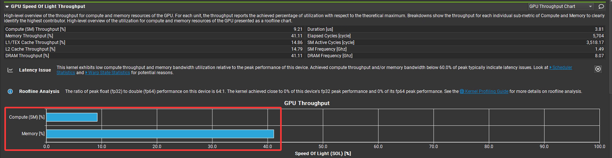

比如这里这幅图说明计算逻辑简单，GPU计算能力没有跑满，线程并行度不够，SM上的CUDA Core没有被充分利用，导致计算吞吐量上不去。

所以导出我们需要增加kernel函数中的计算复杂度，和增加规模
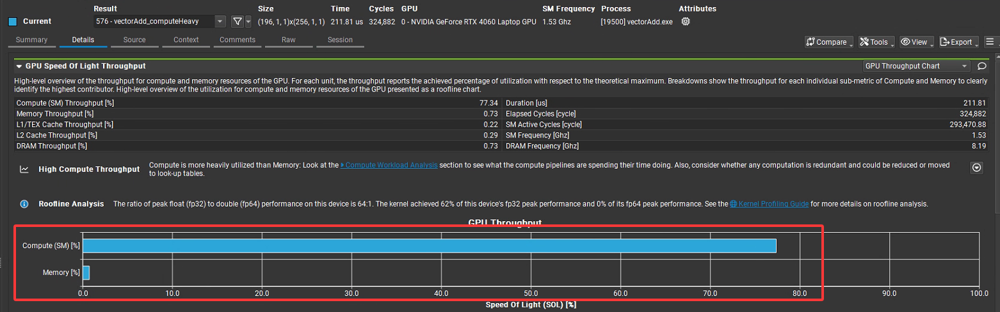

（2）`Performance Monitoring` `PM Sampling`性能监控采样
    - 通过性能监控 (Performance Monitoring) 采样，收集硬件计数器数据
    - 提供实时性能数据，分析硬件级行为

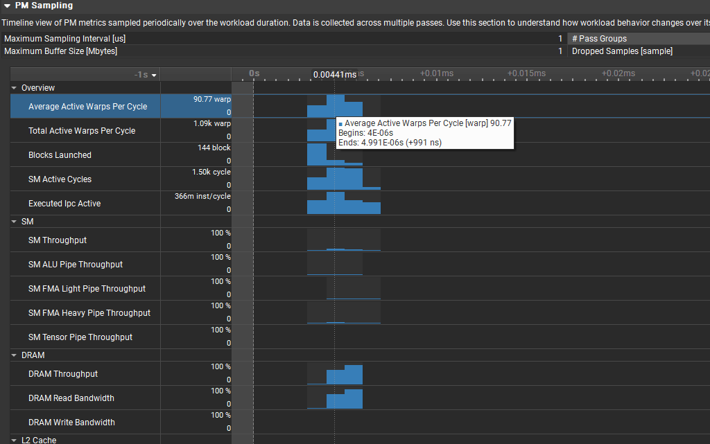

`Average Active Warps Per Cycle`指标为例，第2列中90.77 warp表示，在某个Cycle内平均活跃Warps达到kernel运行期间的最高水平90.77个，0表示纵轴最小值为0，从图中还可看出在kernel运行的不到4us内各个时刻的平均活跃Warp数是不同的，大体上成正态分布（两头少，中间多）

`Total Active Warps Per Cycle`是统计整个GPU范围内的活跃warp数，1.09k，理论上RTX 4060中SM数是24，所以总的活跃warp数为24*48=1152，这里的值已经非常接近理论值，说明在warp调度层面已经达到较高的GPU利用率。

`Blocks Launched = 144`，是在采样周期内启动的block数，从图中可以看出block集中在早期启动，block启动后持续执行，不需要频繁启动新block。

`SM Active Cycles = 1.55k cycle`，是对**所有 SM 处于活跃状态的时钟周期进行统计和累加**。在 GPU 运行内核（Kernel）时，每个 SM 都有独立的调度器，负责管理线程束（warp）的执行。
    当 SM 内有可执行的 warp（比如 warp 没有因为等待内存数据、资源冲突等原因被阻塞 ），并且调度器给这些 warp 分配指令，让它们在计算单元（如 CUDA Core、FMA 单元等）上执行时， 这个 SM 就处于活跃状态，此时会记录一个活跃时钟周期，1.55k cycle是一个采样周期1us内活跃时钟cycle数。

`Executed IPC Active = 366m inst/cycle`，这里的 “m” 代表 “milli”（千分之一），所以366m = 0.366，**在流多处理器（SM）处于活跃状态的每个周期内，平均执行了 0.366 条指令**，这和Ada Lovelace 架构的理论 IPC（每周期指令数）约 4 - 5 左右相差甚远，所以说明从指令执行层面来说还有巨大优化空间。
    `Executed instructions per cicle`

**和SM相关指标**：
    - SM Throughput（流多处理器吞吐量）
    - SM ALU Pipe Throughput（SM整数和逻辑运算流水线吞吐量）
    - SM FMA Light Pipe Throughput（SM轻量浮点乘加流水线吞吐量，FP32）
    - SM FMA Heavy Pipe Throughput（SM重量浮点乘加流水线吞吐量，FP64）、
    - SM Tensor Pipe Throughput（SM 张量核心流水线吞吐量）
这里值都很低，如SM Throughput（SM 吞吐量）的实际数值最高仅约为 9.14%，远未达到左侧显示的 100%，这表明SM的大量计算资源处于闲置状态，没有被利用起来

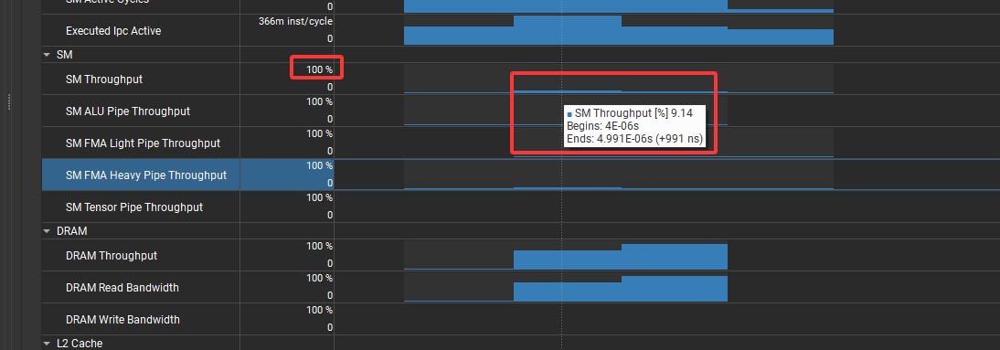

**DRAM相关的指标**：

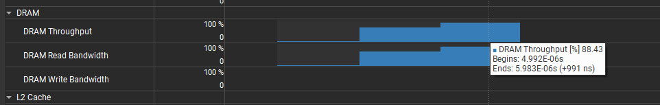

这里观察得到DRAM利用率已经相对较为充分。

（3）`Compute Workload Analysis` 计算工作负载分析
    - 分析 SM 的计算工作负载，包括指令吞吐量、浮点运算效率等
    - 评估 GPU 计算资源的利用率，识别计算瓶颈

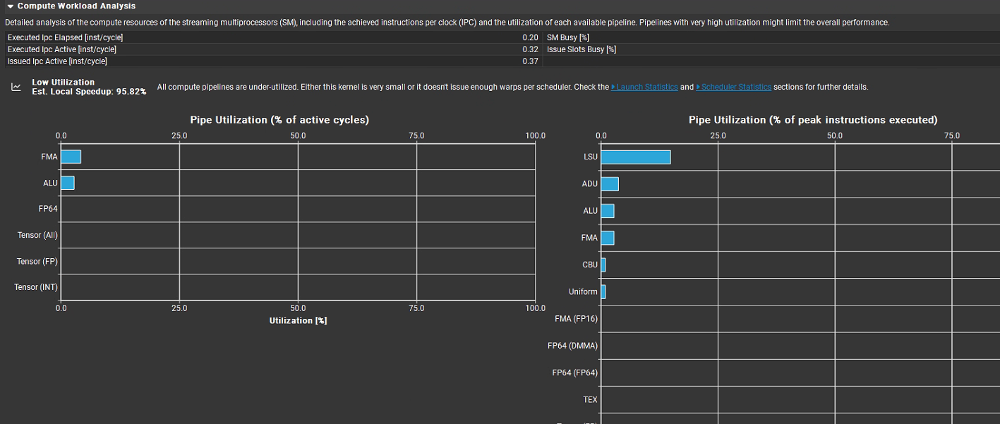

图中：

`Executed IPC Elapsed = 0.20 inst/cycle`：在整个内核运行期间（包含空闲周期），平均每周期仅执行 0.2 条指令。Elapsed通常有整个的含义。

`Executed IPC Active = 0.32 inst/cycle`：在活跃周期内，每周期执行 0.32 条指令。对比 Ada Lovelace 架构理论峰值 ~8，这个利用率非常低。

`Issued IPC Active = 0.37 inst/cycle`：活跃周期内每周期发射（issue）的指令数是 0.37。和上面的 0.32 很接近，说明 pipeline 本身没有严重瓶颈，问题主要在并行度/指令密度不足。一个是执行，一个是取，对比就知道有哪些产生了阻塞。

`SM Busy [%] = 0.20`：SM 在总运行时间中只有 20% 的时间在忙碌，其余 80% 在空闲。

`Issue Slots Busy [%] = 0.32：warp scheduler `的 issue 槽位利用率约 32%。**调度器资源**大部分时间闲置。

“所有计算管道都未充分利用（All compute pipelines are under-utilized）”

（5）`Memory Workload Analysis`，有计算负载分析同样也有内存负载分析
    - 分析内存工作负载，涵盖全局、共享、纹理和本地内存访问
    - 识别内存瓶颈
    - 当涉及内存硬件单元（Mem Busy）已经完全使用，各单元之间的最大通信宽带（Max Bandwidth）已经完全耗尽或者发射内存指令的管道（Mem Pipes Busy）已经达到最大吞吐量时，内存可能会成为整体kernel性能的限制因素。

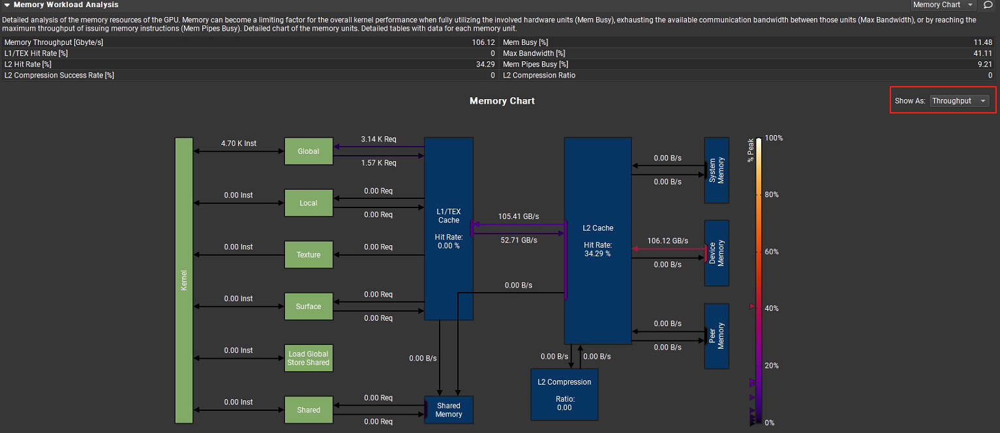

- `Mem Throughput`
- `L1/TEX Hit Rate`
- `L2 Hit Rate`
- `Mem Busy`
- `Max Bandwidth`
- `Mem Pipes Busy`
- `L2 Compression Success Rate`
- `L2 Compression Ratio`

（5）`Scheduler Statistics`，调度器统计
    - 统计 warp 调度器行为，分析调度效率和暂停原因
    - 优化 warp 调度，减少分支发散或者资源竞争
    - 每个周期调度器会检查池中已分配 warp 的状态（Active Warps），未停滞的活跃 warp（Eligible Warps）可发射下一条指令，调度器从符合条件的 warp 中选择一个来发射一条或多条指令（Issued Warp）。若周期内无符合条件的 warp，发射槽会被跳过，无指令发射，大量跳过发射槽意味着延迟隐藏效果差

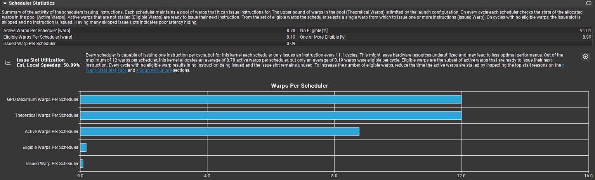

`Active Warps Per Scheduler = 8.78`：每个调度器平均有 8.78 个活跃 warp 在池子里，理论上限是 12 warp per scheduler，所以活跃 warp 数量还算可观（~73% 满载）。

`No Eligible` = 91.01：有91.01%的周期内没有符合条件的warp。

`Eligible Warps Per Scheduler = 0.19`：在这 8.78 个活跃 warp 里，平均只有 0.19 个 warp 处于“可立即发射指令”状态，换句话说，大多数 warp 虽然活跃，但被 stall（等待数据/资源） 卡住了。

`One or More Eligible = 8.99`：仅有 8.99% 的周期内有一个或多个符合条件的 warp。

`Issued Warp Per Scheduler = 0.09`：每个调度器每周期平均发射 0.09 个 warp，相当于 11.1 个周期才发射一次指令，调度效率非常低。

**Issue Slot Utilization**，发射槽利用率
    每个调度器每周期能发射一条指令，但当前内核每个调度器每 11.1 个周期才发射一条指令，这导致硬件资源未充分利用，性能不是最优。
    每个调度器最多可处理 12 个 warp，当前内核每个调度器平均分配 8.78 个活跃 warp，但每周期平均只有 0.19 个符合条件的 warp。没有符合条件的 warp 时，发射槽闲置。预估本地加速比（Est. Local Speedup）为 58.89%，说明有较大性能（59%）提升空间。Nsight Compute建议通过查看 “Warp State Statistics” 和 “Source Counters” 部分，减少活跃 warp 的停滞时间，以增加符合条件的 warp 数量。

**Warps Per Scheduler**，调度器图表解读
    GPU Maximum Warps Per Scheduler = 12：硬件上限，每个调度器最多可管理 12 个 warp。
    Theoretical Warps Per Scheduler = 12：根据 kernel 配置（block 数、线程数），理论上最多能达到 12。
    Active Warps Per Scheduler ≈ 8.78：实际运行中有 约9 个 warp 活跃。
    Eligible Warps Per Scheduler ≈ 0.19：活跃 warp 里，几乎都在等待（数据依赖、访存、同步等），只有不到 1 个 warp 真正 ready。
    Issued Warp Per Scheduler ≈ 0.09：平均每 10+ 个周期才发射一次 warp，调度利用率极低。

综合分析，**Warp并行度足够（8.78/12），说明block/warp数量是够的，但是几乎所有warp都在等待，从现象上看像是访存受限（memory-bound）**，实际上是因为**kernel计算量太小，使得每次执行过程中好像时间都花费在等内存就位。**

（6）`Warp State Statistics` 详细统计warp状态，分析线程执行效率定位warp级瓶颈

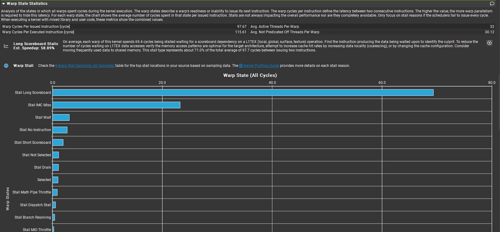

核心指标：
- Warp Cycles Per Issued Instruction ：
    每条已发射指令对应的 warp 周期数，该值越高，说明指令间延迟越大，需要更多并行 warp 来隐藏延迟。
- Warp Cycles Per Executed Instruction ：
    每条已执行指令对应的 warp 周期数，反映指令执行的整体延迟情况。
- Active Threads Per Warp：
    每个 warp 中平均活跃线程数，为 32，说明 warp 内线程基本都处于活跃状态。
- Not Predicated Off Threads Per Warp：
    每个 warp 中平均未被谓词关闭的线程数，为 30.12，表明大部分线程未因谓词判断而不执行。

主要停滞类型：
- Stall Long Scoreboard：
    **Long Scoreboard 表示 warp 在等长延迟内存操作（L1TEX：global/local/texture/surface）的数据依赖**，也就是发起过 load/store 之后，结果没回来，scoreboard 把后续依赖指令卡住而停滞 69.4 个周期，这类停滞占总发射指令平均周期（97.7 周期）的约 71.0%。
- Stall IMC Miss：
    因 IMC（内存控制器）未命中导致的停滞，有一定占比，需优化内存访问以**提升缓存命中率**。
- Stall Wait、Stall No Instruction、Stall Short Scoreboard 等：
    这些停滞类型占比较小，对整体性能影响相对有限，但也可结合具体场景优化（如检查指令调度、减少不必要的等待等）。

（7）`Instruction Statistics`，统计 SASS（底层 Shader Assembly）指令的分布和执行情况。

指令：
- IMAD 整数乘加类指令
- S2R 特殊寄存器读取指令
- MOV 数据移动指令，寄存器间
- LDG 全局内存加载指令
- FADD 单精度浮点加法指令
- EXIT 线程退出指令
- ULDS\STG\ISETP 分别涉及常量内存加载、全局内存存储、整数比较等操作

核心指标：
- Executed instructions
- Issued Instructions
- Executed Instructions Per Scheduler
- Issued Instructions Per Scheduler

（8）`NVLink Topology` 跟多GPU的网络拓扑有关

（9）`NVLink Tables`

（10）`NUMA Affinity`  NUMA（非均匀内存访问）亲和性，评估内存分配与 GPU/CPU 亲和性
    - 用途：在多 GPU 或 CPU-GPU 系统中，优化内存分配以降低访问延迟。

（11）`Launch Statistics`，分析GPU内核启动配置的相关信息

具体：
- Grid Size
- Register Per Thread
- Block Size
- Threads Per Block
- Waves Per SM ,波 指 SM 上可并行执行的块的最大数量，该值反映 SM 的并行度利用情况
- Uses Green Context 
- SMs

- Function Cache Configuration：
    函数缓存配置，为 CachePreferNone，表示函数缓存策略为 “不偏好特定缓存”（可根据需求调整为偏好 L1 / 纹理缓存等）。
- Static Shared Memory Per Block (byte/block)：
    每个块的静态共享内存大小，为 0，静态共享内存是编译时确定的块内共享内存。
- Dynamic Shared Memory Per Block (byte/block)：
    每个块的动态共享内存大小，为 0，动态共享内存是运行时分配的块内共享内存。
- Driver Shared Memory Per Block (byte/block)：
    驱动层为每个块分配的共享内存大小，为 1.02 字节（通常由驱动自动管理）。
- Shared Memory Configuration (Kbyte)：
    共享内存总配置大小，为 16.38 KB，反映块可使用的共享内存总容量。

（12）`Occupancy`，评估 SM 的占用率，即活跃 warp 数与最大 warp 数的比例

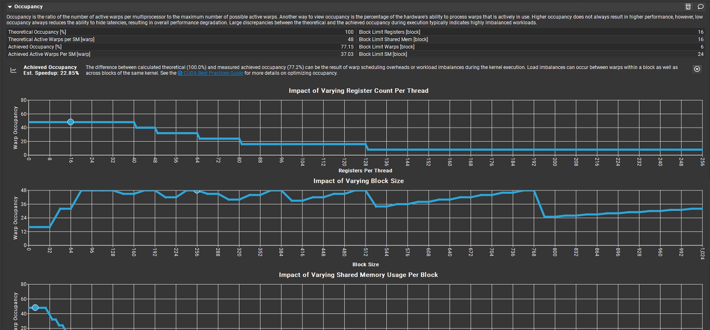

核心指标：
- Theoretical Occupancy
- Theoretical Active Warps Per SM
- Achieved Occupancy 实际占用率
- Achieved Active Warps per SM

理论占用率（100%）与实际占用率（77.15%）的差异，可能源于线程束调度开销或内核执行时的负载不均衡（Block 内或 Block 间的负载差异）。

资源限制说明：
- Block Limit Registers：
    寄存器限制下，每个 Block 最多支持 16 个线程束。
- Block Limit Shared Mem：
    共享内存限制下，每个 Block 最多支持 16 个线程束。
- Block Limit Warps：
    综合限制下，每个 Block 最多支持 6 个线程束。
- Block Limit SM：
    SM 资源限制下，每个 SM 最多支持 24 个 Block。

参数影响图表：
界面包含三张图表，展示不同参数对占用率的影响：
- Impact of Varying Register Count Per Thread：
    横轴为 “每个线程的寄存器数量”，纵轴为 “线程束占用率”。随着寄存器数增加，占用率在某一阈值后骤降（如寄存器数 > 40 时，占用率从约 50% 快速下降），说明**寄存器过度使用会严重限制线程束并行度**。
- Impact of Varying Block Size：
    横轴为 “Block 大小”，纵轴为 “线程束占用率”。Block 大小在 96–768 范围内时，占用率维持在较高水平（约 40–50%）；当 Block 过大（如 > 768），占用率骤降，**说明 Block 大小需合理选择以平衡并行度与资源消耗**。
- Impact of Varying Shared Memory Usage Per Block：
    横轴为 “每个 Block 的共享内存使用量”，纵轴为 “线程束占用率”。共享内存使用量增加时，占用率快速下降（如从 0 增加到一定值时，占用率从约 50% 降至接近 0），说明**共享内存过度使用会极大限制线程束并行度**。

（13）`GPU and  Memory Workload Distribution`，工作负载在 SM 间的分布，评估负载均衡性，确保所有 SM 均匀分配工作，最大化 GPU 利用率

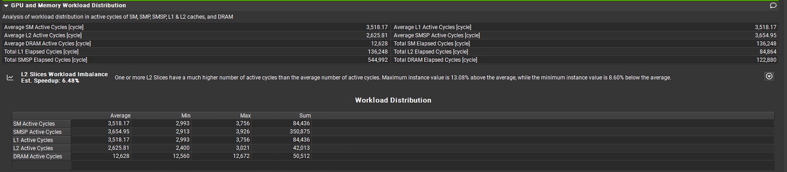

核心指标：
- Average SM Active Cycles：
    每个流式多处理器（SM）的平均活跃周期，为 3,518.17 周期，SM 是 GPU 的核心计算单元。
- Average L1 Active Cycles ：
    L1 缓存的平均活跃周期，为 3,518.81 周期，L1 是核心专用或SM专用。每个GPU SM都有自己私有的L1缓存。
- Average L2 Active Cycles ：
    L2 缓存的平均活跃周期，为 2,625.81 周期，L2 是共享缓存，所有GPU SM共享一个统一的L2缓存，L1访问速度快于L2快于DRAM。
- Average SMSP Active Cycles ：
    流式多处理器子系统（SMSP，包含 SM 及周边控制单元）的平均活跃周期，为 3,654.95 周期。
- Average DRAM Active Cycles ：
    DRAM（显存）的平均活跃周期，为 12,628 周期，DRAM 是 GPU 的大容量内存。
- Total SM Elapsed Cycles：
    SM总用时12,628 cycles (这是基准时间)
- Total L1 Elapsed Cycles：L1总用时136,248 cycles。
- Total L2 Elapsed Cycles：84,864 cycles。
- Total SMSP Elapsed Cycles：544,992 cycles。
- Total DRAM Elapsed Cycles：122,880 cycles。

#### Source

该页面主要展示内核代码的原始视图，并将性能数据与代码行进行关联。

#### Context

提供当前内核分析的上下文信息，帮助理解内核执行的环境和条件。

- 展示运行内核的硬件平台信息，如 GPU 型号、SM 数量、显存容量等，以及操作系统和 CUDA 版本等

- 显示内核启动时的配置，例如网格（grid）和线程块（block）的大小、共享内存的使用量等。

- 提供一些基础的性能指标参考值或历史数据对比

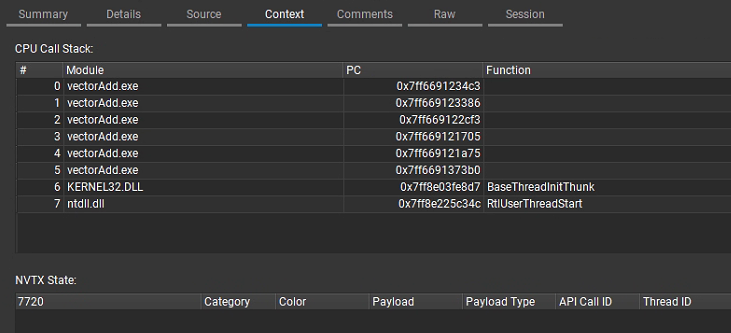

#### Comments

用于添加和查看关于当前性能分析报告的注释信息，记录用

#### Raw

原始的性能数据，最基础，未经多处理和汇总

#### Session

略

### 命令行使用

```bash
ncu [options] <application> [application arguments]
```

比如：`ncu ./vectorAdd`，然后会实时给出简单的解析信息

- `ncu -o profile_result .\vectorAdd.exe`  输出文件
- `ncu --print-details all .\vectorAdd.exe`  详细报告
- `ncu --kernel-name vectorAdd .\vectorAdd.exe`  指定内核
- `ncu --metrics gpu__time_duration.sum .\vectorAdd.exe`  性能指标
- `ncu --section MemoryWorkloadAnalysis .\vectorAdd.exe`  内存带宽分析
- `--help`
