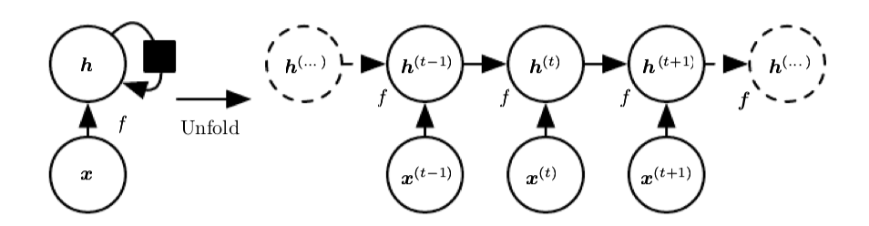
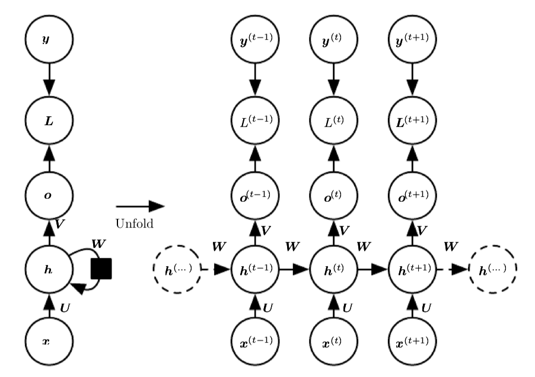
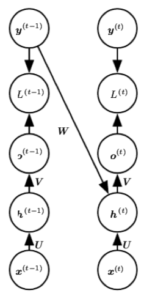
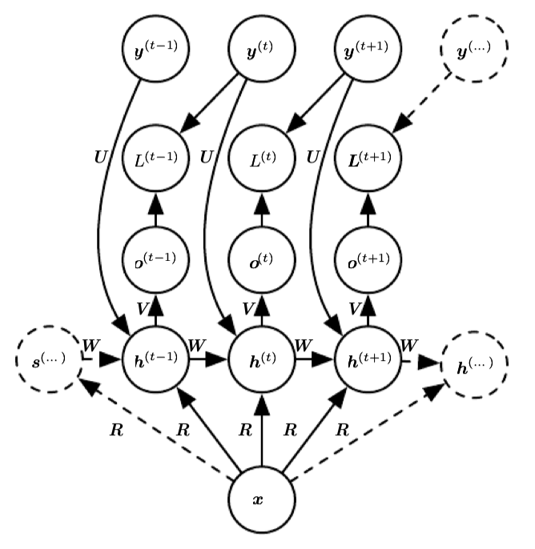
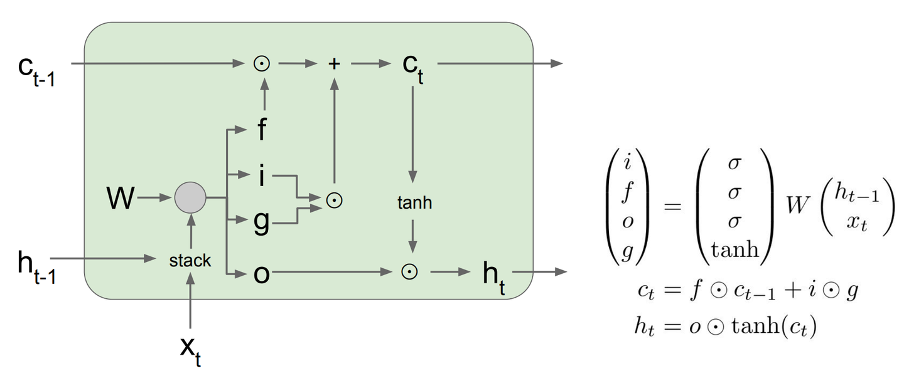

# 解决一些LLM上的一些问题

## 基本深度学习网络

### RNN

特点：
- 主要用来处理序列数据
- 不同时间点的特征共享参数，易训练，泛化好
- 每一点的输出还依赖于之前的结果，也受外部信号驱动
- 常用状态机模拟，对于一个动态系统都可以用状态机表示某一时刻的状态

$ h_t = f(h_{t-1}, x_t;\theta) $ 
其中记 $ h_t $ 是T时刻的向量序列 $ (x_1,x_2,...,x_t) $ 的一种有损共享特征整体表示（特征共享参数），称为hidden states，再由hidden units来输出值。

由于由于该结构hidden units间有循环链接，计算时我们需要顺序计算，而不能进行并行计算，所以训练过程较为缓慢。而且该模型需要输入与输出序列长度相同。

`teacher forcing`方法：损失一点模型普适性，去掉hidden units之间的循环链接，而是建立前一时间点真实目标值与当前hidden unit的链接，则当前点hidden unit并不依赖于前一点hidden unit计算结束，可以有效地将训练过程并行化，因为真实的输出并不一定像假设的一个状态机一样包含所有的信息。

可以将整个向量作为一个输入，然后输出一个小于向量的序列，夹断一下从某个地方开始输出和teacherforce训练。比如说给图像生成描述性文字，可以先让图像生成一个特征向量，再将特征向量作为输入，得到输出的文字序列。

上面使用一个中间向量过渡的方法产生了encoder-decoder的思路。

**这里我看这个博客每写清楚为什么维度可以不一样，我只晓得可以用自回归**？？？

由于f的权重矩阵一直在重复使用，所以引入了新的LSTM方法

添加了新的一个c层，来保留长期的有效信息
- f代表forget gate，经过sigmoid函数，其大小在(0,1]之间，代表了我们会保留之前的cell state的多少信息。
- i代表input gate，同样的经过sigmoid函数大小在(0,1]之间，代表对于这个cell，有哪些值需要更新。
- g经过tanh函数，其大小在(-1,1)之间，代表了这些需要更新的值得具体的大小，与input gate做元素积则可求出cell state需要update的值
- o代表output gate，需要将哪些c的值输出到hidden state 
